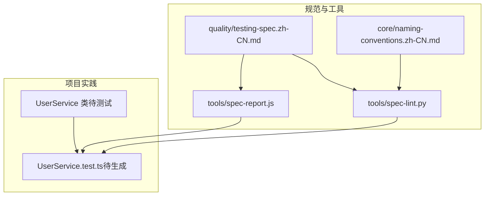
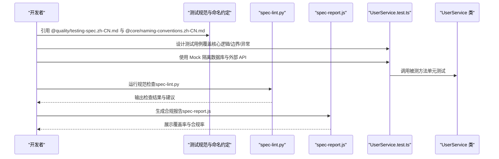
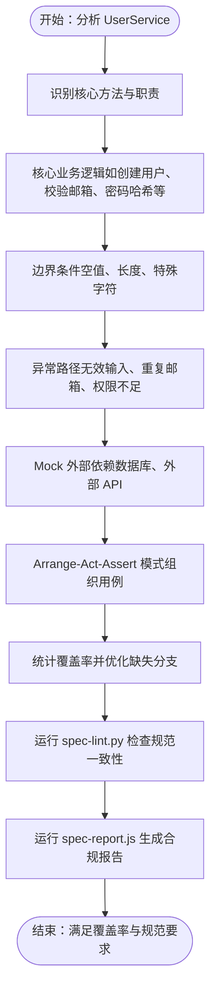
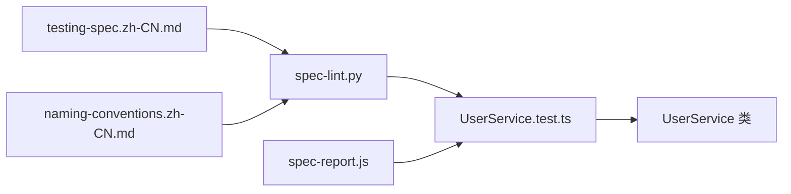

# 为现有功能添加单元测试

<cite>
**本文引用的文件**
- [README.md](file://README.md)
- [testing-spec.zh-CN.md](file://quality/testing-spec.zh-CN.md)
- [naming-conventions.zh-CN.md](file://core/naming-conventions.zh-CN.md)
- [spec-lint.py](file://tools/spec-lint.py)
- [spec-report.js](file://tools/spec-report.js)
</cite>

## 目录
1. [简介](#简介)
2. [项目结构](#项目结构)
3. [核心组件](#核心组件)
4. [架构总览](#架构总览)
5. [详细组件分析](#详细组件分析)
6. [依赖关系分析](#依赖关系分析)
7. [性能考量](#性能考量)
8. [故障排查指南](#故障排查指南)
9. [结论](#结论)
10. [附录](#附录)

## 简介
本操作指南面向为现有功能（以 UserService 类为例）添加符合测试规范的单元测试。文档基于仓库内的测试规范与命名约定，结合工具链（spec-lint.py、spec-report.js），提供覆盖核心业务逻辑、边界条件与异常路径的测试策略，使用 Mock 技术隔离数据库与外部 API 依赖，确保覆盖率目标（库/SDK 类项目不低于 85%）达成，并通过命名约定统一测试文件与方法命名（如 UserService.test.ts）。同时，文档提供“添加测试前后”的对比思路，帮助评估代码健壮性的提升。

## 项目结构
该仓库提供了测试规范、命名约定以及配套工具，便于在本地或 CI 中执行规范检查与合规报告生成。下图展示了与“为 UserService 添加单元测试”相关的文件与工具关系。

图表来源
- [testing-spec.zh-CN.md](file://quality/testing-spec.zh-CN.md#L1-L67)
- [naming-conventions.zh-CN.md](file://core/naming-conventions.zh-CN.md#L362-L425)
- [spec-lint.py](file://tools/spec-lint.py#L1-L120)
- [spec-report.js](file://tools/spec-report.js#L1-L120)

章节来源
- [README.md](file://README.md#L1-L120)
- [README.md](file://README.md#L148-L180)

## 核心组件
- 测试规范（testing-spec.zh-CN.md）：定义测试完整性、覆盖率目标、测试分层、Mock 使用、命名约定、测试数据管理、边界与异常测试、隔离性与性能要求等规则。
- 命名约定（naming-conventions.zh-CN.md）：明确测试文件与测试用例命名方式，确保测试文件与源文件同名并采用 .test 或 .spec 后缀。
- 规范检查工具（spec-lint.py）：扫描目标目录，依据启用的规范文件（含 testing-spec、naming-conventions 等）进行检查，输出问题清单。
- 合规报告工具（spec-report.js）：汇总规范启用情况、代码统计与测试覆盖率（若存在 coverage-summary.json），输出项目级合规率。

章节来源
- [testing-spec.zh-CN.md](file://quality/testing-spec.zh-CN.md#L1-L67)
- [testing-spec.zh-CN.md](file://quality/testing-spec.zh-CN.md#L59-L87)
- [testing-spec.zh-CN.md](file://quality/testing-spec.zh-CN.md#L109-L140)
- [testing-spec.zh-CN.md](file://quality/testing-spec.zh-CN.md#L160-L198)
- [testing-spec.zh-CN.md](file://quality/testing-spec.zh-CN.md#L190-L218)
- [testing-spec.zh-CN.md](file://quality/testing-spec.zh-CN.md#L220-L247)
- [naming-conventions.zh-CN.md](file://core/naming-conventions.zh-CN.md#L362-L425)
- [spec-lint.py](file://tools/spec-lint.py#L1-L120)
- [spec-report.js](file://tools/spec-report.js#L1-L120)

## 架构总览
下图展示了“为 UserService 添加单元测试”的整体流程：从规范引用与命名约定出发，到测试用例设计、Mock 隔离、覆盖率收集与工具验证，最终形成项目级合规报告。

图表来源
- [testing-spec.zh-CN.md](file://quality/testing-spec.zh-CN.md#L109-L140)
- [naming-conventions.zh-CN.md](file://core/naming-conventions.zh-CN.md#L362-L425)
- [spec-lint.py](file://tools/spec-lint.py#L180-L269)
- [spec-report.js](file://tools/spec-report.js#L106-L185)

## 详细组件分析

### 为 UserService 添加单元测试的步骤与要点
- 引用规范与约定
  - 在 AI 对话或本地开发中引用测试规范与命名约定，确保测试设计与命名符合仓库规范。
  - 参考路径：[测试规范](file://quality/testing-spec.zh-CN.md#L1-L67)、[命名约定](file://core/naming-conventions.zh-CN.md#L362-L425)

- 测试文件命名与组织
  - 测试文件与源文件同名并以 .test 或 .spec 后缀命名，测试套件使用 describe('UserService')，测试用例使用 it('should ...') 的形式。
  - 参考路径：[命名约定](file://core/naming-conventions.zh-CN.md#L362-L425)

- 测试金字塔与分层策略
  - 单元测试为主（70%），重点覆盖 UserService 的核心业务逻辑与边界条件；集成测试（20%）用于验证模块间交互；E2E（10%）用于关键业务流程。
  - 参考路径：[测试分层](file://quality/testing-spec.zh-CN.md#L90-L107)

- Mock 与外部依赖隔离
  - 外部依赖（数据库、外部 API）必须 Mock；不要 Mock 被测试的核心逻辑本身。
  - 参考路径：[Mock 使用规范](file://quality/testing-spec.zh-CN.md#L109-L140)

- 测试数据管理与隔离
  - 使用工厂函数或 Fixture 生成测试数据；每个测试独立准备数据，避免共享状态；测试后清理数据。
  - 参考路径：[测试数据管理](file://quality/testing-spec.zh-CN.md#L160-L198)

- 边界条件与异常路径
  - 覆盖空值、null、undefined、边界值（0、负数、最大/最小）、异常输入与错误处理路径；必要时考虑并发与竞态条件。
  - 参考路径：[边界与异常测试](file://quality/testing-spec.zh-CN.md#L190-L218)

- 测试隔离性与性能
  - 每个测试独立运行，不依赖执行顺序；使用 beforeEach/afterEach 清理状态；避免修改全局变量或单例；整体测试套件应快速执行。
  - 参考路径：[测试隔离性](file://quality/testing-spec.zh-CN.md#L220-L231)、[测试性能要求](file://quality/testing-spec.zh-CN.md#L233-L247)

- 覆盖率目标与达标策略
  - 库/SDK 类项目覆盖率目标不低于 85% 行覆盖率；新增代码覆盖率不得低于现有基线。
  - 参考路径：[覆盖率目标](file://quality/testing-spec.zh-CN.md#L59-L87)

- 运行工具验证与合规报告
  - 使用 spec-lint.py 检查命名与规范一致性；使用 spec-report.js 生成合规报告与覆盖率信息（若存在 coverage-summary.json）。
  - 参考路径：[工具使用](file://README.md#L148-L180)

- “添加测试前后”的对比思路
  - 前：仅实现 UserService 类，未提供单元测试；覆盖率不足，边界与异常路径未覆盖。
  - 后：补充 UserService.test.ts，覆盖核心逻辑、边界与异常；使用 Mock 隔离外部依赖；覆盖率达标；通过工具检查与报告验证。
  - 参考路径：[测试完整性](file://quality/testing-spec.zh-CN.md#L20-L35)、[覆盖率目标](file://quality/testing-spec.zh-CN.md#L59-L87)

章节来源
- [testing-spec.zh-CN.md](file://quality/testing-spec.zh-CN.md#L59-L87)
- [testing-spec.zh-CN.md](file://quality/testing-spec.zh-CN.md#L90-L140)
- [testing-spec.zh-CN.md](file://quality/testing-spec.zh-CN.md#L160-L218)
- [testing-spec.zh-CN.md](file://quality/testing-spec.zh-CN.md#L220-L247)
- [naming-conventions.zh-CN.md](file://core/naming-conventions.zh-CN.md#L362-L425)
- [README.md](file://README.md#L148-L180)

### 测试用例设计流程（以 UserService 为例）

图表来源
- [testing-spec.zh-CN.md](file://quality/testing-spec.zh-CN.md#L109-L140)
- [testing-spec.zh-CN.md](file://quality/testing-spec.zh-CN.md#L160-L218)
- [testing-spec.zh-CN.md](file://quality/testing-spec.zh-CN.md#L220-L247)
- [spec-lint.py](file://tools/spec-lint.py#L180-L269)
- [spec-report.js](file://tools/spec-report.js#L106-L185)

## 依赖关系分析
- 规范与工具的耦合
  - spec-lint.py 会读取启用的规范文件（含 testing-spec、naming-conventions 等），据此检查命名与完整性。
  - spec-report.js 会解析规范文件并扫描目标目录，统计覆盖率（若存在 coverage-summary.json）。
- 与 UserService 的关系
  - 测试文件 UserService.test.ts 与源文件同名，遵循命名约定；测试用例覆盖核心逻辑、边界与异常；通过工具验证与报告生成，确保覆盖率与规范达标。

图表来源
- [testing-spec.zh-CN.md](file://quality/testing-spec.zh-CN.md#L1-L67)
- [naming-conventions.zh-CN.md](file://core/naming-conventions.zh-CN.md#L362-L425)
- [spec-lint.py](file://tools/spec-lint.py#L1-L120)
- [spec-report.js](file://tools/spec-report.js#L1-L120)

章节来源
- [spec-lint.py](file://tools/spec-lint.py#L1-L120)
- [spec-report.js](file://tools/spec-report.js#L1-L120)

## 性能考量
- 单元测试应快速执行（每个 < 100ms），整体套件 < 5 分钟；慢测试应异步化或并行化。
- 使用 Mock 隔离外部依赖，避免数据库与外部 API 的同步调用，从而降低测试耗时。
- 参考路径：[测试性能要求](file://quality/testing-spec.zh-CN.md#L233-L247)

## 故障排查指南
- 规范检查失败
  - 使用 spec-lint.py 检查命名与完整性问题，按提示修复后再次运行。
  - 参考路径：[工具使用](file://README.md#L148-L180)、[spec-lint.py](file://tools/spec-lint.py#L180-L269)
- 覆盖率不足
  - 通过增加用例覆盖未命中分支，确保新增代码覆盖率不低于现有基线；关注库/SDK 类项目 85% 行覆盖率目标。
  - 参考路径：[覆盖率目标](file://quality/testing-spec.zh-CN.md#L59-L87)
- 合规报告未显示覆盖率
  - 确认项目已生成 coverage-summary.json；若未生成，需在测试运行配置中开启覆盖率统计。
  - 参考路径：[spec-report.js](file://tools/spec-report.js#L106-L185)

章节来源
- [spec-lint.py](file://tools/spec-lint.py#L180-L269)
- [spec-report.js](file://tools/spec-report.js#L106-L185)
- [testing-spec.zh-CN.md](file://quality/testing-spec.zh-CN.md#L59-L87)

## 结论
通过引用测试规范与命名约定、采用测试金字塔策略、合理使用 Mock 隔离外部依赖、覆盖核心逻辑与边界条件、并借助 spec-lint.py 与 spec-report.js 进行规范检查与合规报告，可以高效地为 UserService 类添加高质量的单元测试，确保覆盖率目标（≥85%）达成，并持续提升代码健壮性与可维护性。

## 附录
- 快速参考
  - 测试文件命名：UserService.test.ts
  - 测试套件与用例命名：describe('UserService') / it('should ...')
  - 覆盖率目标：库/SDK ≥85%
  - 工具命令：python tools/spec-lint.py；node tools/spec-report.js
- 参考路径
  - [测试规范](file://quality/testing-spec.zh-CN.md#L1-L67)
  - [命名约定](file://core/naming-conventions.zh-CN.md#L362-L425)
  - [工具使用](file://README.md#L148-L180)