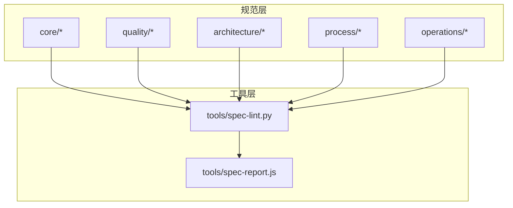
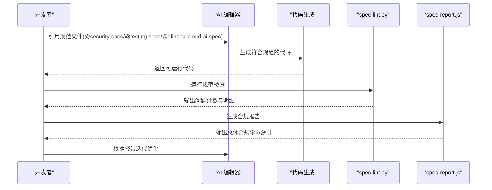
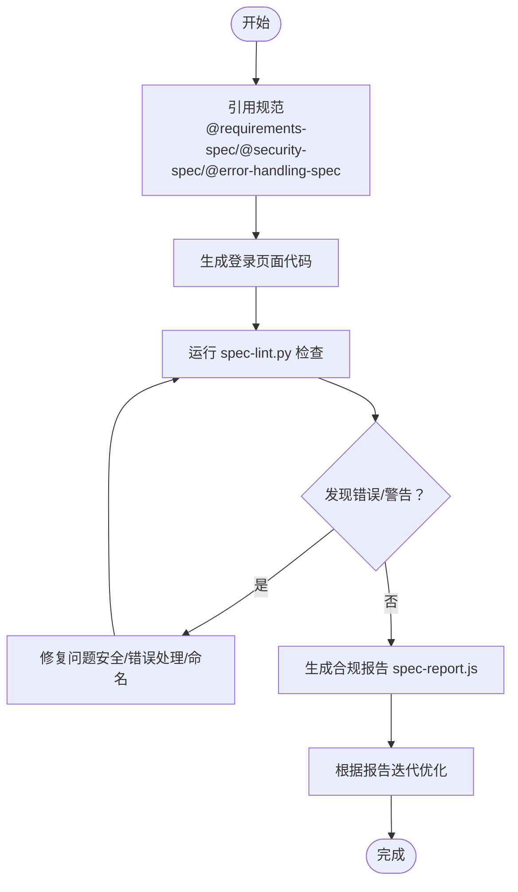
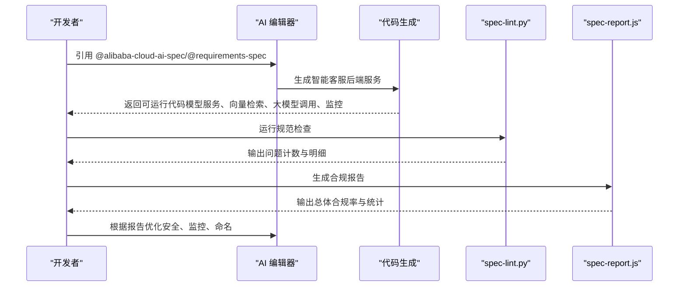
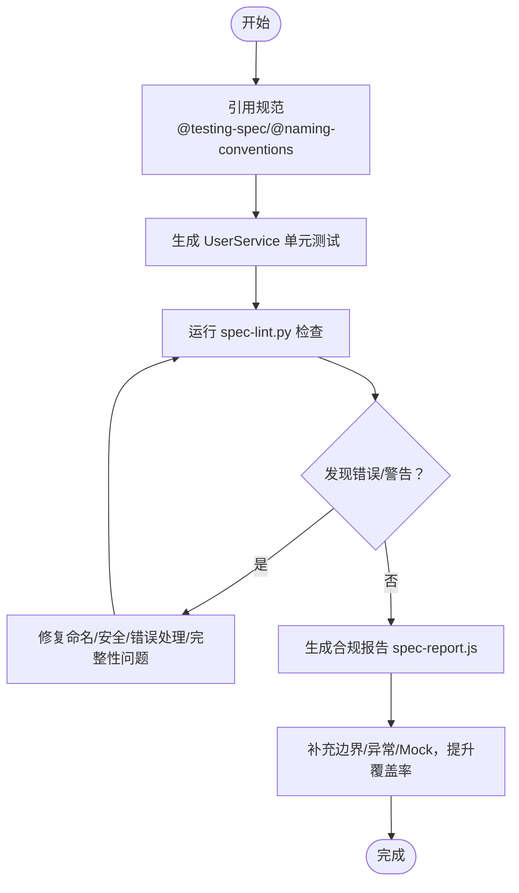
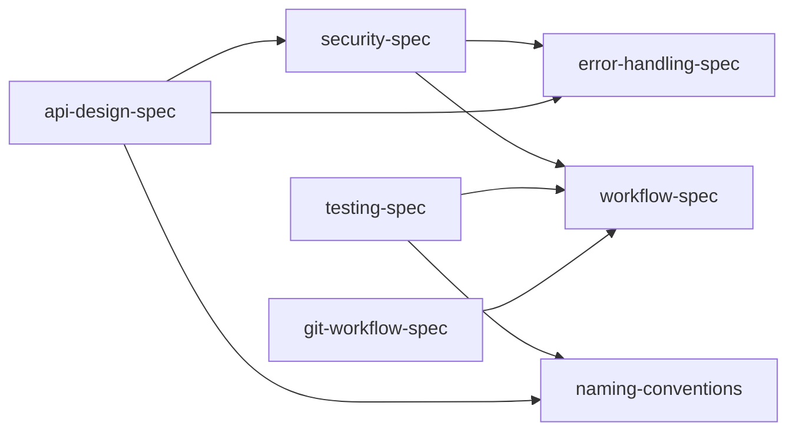

# 使用示例

<cite>
**本文引用的文件**
- [README.md](file://README.md)
- [spec-lint.py](file://tools/spec-lint.py)
- [spec-report.js](file://tools/spec-report.js)
- [security-spec.zh-CN.md](file://quality/security-spec.zh-CN.md)
- [testing-spec.zh-CN.md](file://quality/testing-spec.zh-CN.md)
- [error-handling-spec.zh-CN.md](file://quality/error-handling-spec.zh-CN.md)
- [requirements-spec.zh-CN.md](file://core/requirements-spec.zh-CN.md)
- [naming-conventions.zh-CN.md](file://core/naming-conventions.zh-CN.md)
- [alibaba-cloud-ai-spec.zh-CN.md](file://architecture/alibaba-cloud-ai-spec.zh-CN.md)
- [api-design-spec.zh-CN.md](file://architecture/api-design-spec.zh-CN.md)
- [git-workflow-spec.zh-CN.md](file://process/git-workflow-spec.zh-CN.md)
</cite>

## 目录
1. [简介](#简介)
2. [项目结构](#项目结构)
3. [核心组件](#核心组件)
4. [架构总览](#架构总览)
5. [详细组件分析](#详细组件分析)
6. [依赖分析](#依赖分析)
7. [性能考虑](#性能考虑)
8. [故障排除指南](#故障排除指南)
9. [结论](#结论)
10. [附录](#附录)

## 简介
本文件面向真实开发场景，系统化展示如何使用 qoder-rules-main 的规范与工具，完成以下三类典型示例：
- 生成符合安全规范的用户登录页面（表单验证、密码加密、错误提示）
- 基于阿里云 AI 架构规范构建智能客服机器人后端服务（模型服务化、向量检索、大模型调用、监控日志）
- 为现有函数添加符合测试规范的单元测试用例（覆盖率目标、测试分层、Mock 规范）

每个示例均提供完整操作流程：在 AI 对话中引用相关规范、生成代码、运行 spec-lint 检查、查看报告并迭代优化；并通过前后对比突出遵循规范带来的代码质量提升。示例覆盖 Web 应用、CLI 工具和库/SDK 等不同项目类型，体现规范系统的通用性。

## 项目结构
qoder-rules 采用“规范 + 工具”的组织方式：
- core：核心规范（需求、工作流、命名约定）
- quality：质量保证规范（测试、安全、错误处理）
- architecture：架构设计规范（阿里云 AI、API 设计）
- process：流程规范（Git 工作流）
- operations：运维规范（部署）
- tools：规范验证工具（spec-lint.py、spec-report.js）

图表来源
- [README.md](file://README.md#L1-L120)
- [spec-lint.py](file://tools/spec-lint.py#L1-L120)
- [spec-report.js](file://tools/spec-report.js#L1-L120)

章节来源
- [README.md](file://README.md#L1-L120)

## 核心组件
- 规范文件：按“规则/约定”组织，支持在 AI 对话中以 @ 触发引用，AI 仅遵循 ENABLED 的规则。
- 工具链：
  - spec-lint.py：扫描目标目录，基于启用规则进行静态检查，输出错误/警告计数与逐文件明细。
  - spec-report.js：汇总规范启用情况、代码统计、测试覆盖率（若存在），并生成 JSON 报告。

章节来源
- [README.md](file://README.md#L148-L190)
- [spec-lint.py](file://tools/spec-lint.py#L1-L120)
- [spec-report.js](file://tools/spec-report.js#L1-L120)

## 架构总览
下图展示了“规范引用 → 代码生成 → 规范检查 → 报告生成”的闭环流程，以及各规范之间的依赖关系。

图表来源
- [README.md](file://README.md#L148-L190)
- [spec-lint.py](file://tools/spec-lint.py#L231-L269)
- [spec-report.js](file://tools/spec-report.js#L238-L278)

## 详细组件分析

### 示例一：生成符合安全规范的用户登录页面
目标：生成一个包含表单验证、密码加密、错误处理与安全提示的登录页面。

- 在 AI 对话中引用：
  - @core/requirements-spec.zh-CN.md（确保完整可运行、API 存在、编译通过、真实库）
  - @quality/security-spec.zh-CN.md（输入验证、认证授权、敏感数据保护、OWASP 防护、日志安全、API 安全、会话管理、文件上传安全、错误处理安全）
  - @quality/error-handling-spec.zh-CN.md（错误分类、自定义错误类、用户友好提示、全局错误处理）

- 生成代码要点（依据规范）：
  - 表单验证：白名单校验、HTML/SQL/命令注入清理、类型/长度/格式/范围验证
  - 密码处理：bcrypt/Argon2 单向哈希、加盐、不记录明文密码
  - 认证授权：服务端权限检查、最小权限原则、MFA（敏感操作）
  - API 安全：速率限制、CORS、安全 Cookie 属性、CSRF 防护
  - 会话管理：HttpOnly/Secure/SameSite、超时与销毁
  - 错误处理：区分业务/系统/第三方错误、生产环境不暴露内部信息、统一错误中间件

- 运行 spec-lint 检查：
  - 检查硬编码密钥、空 catch 块、TODO/FIXME 等不合规项
  - 输出错误/警告数量与逐文件明细

- 生成合规报告：
  - 统计启用规则数、总体合规率、代码文件/行数、测试覆盖率（若存在）

- 迭代优化：
  - 修复安全问题（如硬编码密钥、空 catch 块）
  - 补充错误处理与日志记录
  - 优化命名与结构，遵循命名约定

图表来源
- [README.md](file://README.md#L148-L190)
- [security-spec.zh-CN.md](file://quality/security-spec.zh-CN.md#L1-L120)
- [error-handling-spec.zh-CN.md](file://quality/error-handling-spec.zh-CN.md#L1-L120)
- [requirements-spec.zh-CN.md](file://core/requirements-spec.zh-CN.md#L1-L120)
- [spec-lint.py](file://tools/spec-lint.py#L120-L220)
- [spec-report.js](file://tools/spec-report.js#L120-L220)

章节来源
- [README.md](file://README.md#L212-L252)
- [security-spec.zh-CN.md](file://quality/security-spec.zh-CN.md#L1-L200)
- [error-handling-spec.zh-CN.md](file://quality/error-handling-spec.zh-CN.md#L1-L200)
- [requirements-spec.zh-CN.md](file://core/requirements-spec.zh-CN.md#L1-L120)
- [spec-lint.py](file://tools/spec-lint.py#L120-L220)
- [spec-report.js](file://tools/spec-report.js#L120-L220)

### 示例二：基于阿里云 AI 架构规范构建智能客服机器人后端服务
目标：参考 MBTI 项目实现，使用通义千问构建智能问答系统，遵循阿里云 AI 架构规范。

- 在 AI 对话中引用：
  - @architecture/alibaba-cloud-ai-spec.zh-CN.md（模型服务化、向量检索与存储、大模型调用与管理、数据湖与特征工程、模型训练与优化、实时推理服务、监控与可观测性、数据安全与合规）
  - @core/requirements-spec.zh-CN.md（完整可运行、API 存在、编译通过、真实库）

- 生成代码要点（依据规范）：
  - 模型服务化：PAI 部署模型，独立于业务逻辑，支持版本管理与灰度发布
  - 向量检索：DashVector 集成，Hologres/AnalyticDB 存储，混合检索（向量+关键词）
  - 大模型调用：通义千问集成，Prompt 工程、流式输出、Function Calling、Token 监控
  - 实时推理：PAI-EAS 部署，自动扩缩容、批处理、延迟/吞吐监控
  - 监控日志：SLS 日志、ARMS 指标、分布式追踪、告警规则
  - 数据安全：KMS 加密、数据脱敏、合规（GDPR/PIPL）、访问控制

- 运行 spec-lint 检查：
  - 检查命名约定（Python 驼峰 vs snake_case）、安全问题（硬编码密钥）、错误处理（空 catch 块）、代码完整性（TODO/FIXME）

- 生成合规报告：
  - 统计启用规则数、总体合规率、代码统计、测试覆盖率（若存在）

- 迭代优化：
  - 修复命名与安全问题
  - 补充监控与告警
  - 优化模型调用与批处理策略

图表来源
- [README.md](file://README.md#L148-L190)
- [alibaba-cloud-ai-spec.zh-CN.md](file://architecture/alibaba-cloud-ai-spec.zh-CN.md#L1-L120)
- [requirements-spec.zh-CN.md](file://core/requirements-spec.zh-CN.md#L1-L120)
- [spec-lint.py](file://tools/spec-lint.py#L120-L220)
- [spec-report.js](file://tools/spec-report.js#L120-L220)

章节来源
- [README.md](file://README.md#L228-L241)
- [alibaba-cloud-ai-spec.zh-CN.md](file://architecture/alibaba-cloud-ai-spec.zh-CN.md#L1-L200)
- [requirements-spec.zh-CN.md](file://core/requirements-spec.zh-CN.md#L1-L120)
- [spec-lint.py](file://tools/spec-lint.py#L120-L220)
- [spec-report.js](file://tools/spec-report.js#L120-L220)

### 示例三：为现有函数添加符合测试规范的单元测试用例
目标：为 UserService 类生成单元测试，确保覆盖率 > 85%，包含边界条件测试与 Mock 外部依赖。

- 在 AI 对话中引用：
  - @quality/testing-spec.zh-CN.md（测试完整性、覆盖率目标、测试分层、Mock 规范、测试命名、测试数据管理、边界条件与异常测试、测试隔离性、测试性能要求）
  - @core/naming-conventions.zh-CN.md（测试命名约定）

- 生成测试要点（依据规范）：
  - 测试完整性：新功能必须包含对应单元测试；Bug 修复必须包含回归测试
  - 覆盖率目标：Web 70%+、CLI 80%+、库/SDK 85%+；新增代码覆盖率不得低于现有基线
  - 测试分层：单元测试 70%、集成 20%、E2E 10%
  - Mock 规范：外部依赖（API、数据库、文件系统）必须 Mock；不要 Mock 被测试的核心逻辑
  - 测试命名：describe('被测试单元名称')、it('should + 预期行为')
  - 测试数据：工厂函数/Fixture、独立可重复、测试后清理
  - 边界条件：空值、null、undefined、边界值、异常输入与错误路径
  - 隔离性：每个测试独立运行、避免共享状态、并行运行不失败
  - 性能：单测 < 100ms、集成 < 1s、E2E < 10s、整体 < 5 分钟

- 运行 spec-lint 检查：
  - 检查命名约定（测试文件/用例命名）、安全问题（硬编码密钥）、错误处理（空 catch 块）、代码完整性（TODO/FIXME）

- 生成合规报告：
  - 统计启用规则数、总体合规率、代码统计、测试覆盖率（若存在）

- 迭代优化：
  - 补充边界与异常测试
  - 优化 Mock 与隔离性
  - 提升覆盖率至目标阈值

图表来源
- [README.md](file://README.md#L148-L190)
- [testing-spec.zh-CN.md](file://quality/testing-spec.zh-CN.md#L1-L120)
- [naming-conventions.zh-CN.md](file://core/naming-conventions.zh-CN.md#L1-L120)
- [spec-lint.py](file://tools/spec-lint.py#L120-L220)
- [spec-report.js](file://tools/spec-report.js#L120-L220)

章节来源
- [README.md](file://README.md#L241-L252)
- [testing-spec.zh-CN.md](file://quality/testing-spec.zh-CN.md#L1-L200)
- [naming-conventions.zh-CN.md](file://core/naming-conventions.zh-CN.md#L1-L200)
- [spec-lint.py](file://tools/spec-lint.py#L120-L220)
- [spec-report.js](file://tools/spec-report.js#L120-L220)

## 依赖分析
- 规范间的依赖关系：
  - security-spec 与 error-handling-spec：安全错误处理遵循错误处理规范
  - security-spec 与 workflow-spec：依赖安全审计对齐依赖更新策略
  - testing-spec 与 naming-conventions：测试命名遵循命名约定
  - testing-spec 与 workflow-spec：测试覆盖率要求对齐工作流规范
  - api-design-spec 与 security-spec：API 认证授权遵循安全规范
  - api-design-spec 与 error-handling-spec：API 错误响应遵循错误处理规范
  - api-design-spec 与 naming-conventions：API 端点命名遵循命名约定
  - git-workflow-spec 与 workflow-spec：提交消息与标签管理对齐变更/版本管理规范

图表来源
- [security-spec.zh-CN.md](file://quality/security-spec.zh-CN.md#L390-L420)
- [testing-spec.zh-CN.md](file://quality/testing-spec.zh-CN.md#L330-L340)
- [api-design-spec.zh-CN.md](file://architecture/api-design-spec.zh-CN.md#L560-L575)
- [git-workflow-spec.zh-CN.md](file://process/git-workflow-spec.zh-CN.md#L500-L512)

章节来源
- [security-spec.zh-CN.md](file://quality/security-spec.zh-CN.md#L390-L420)
- [testing-spec.zh-CN.md](file://quality/testing-spec.zh-CN.md#L330-L340)
- [api-design-spec.zh-CN.md](file://architecture/api-design-spec.zh-CN.md#L560-L575)
- [git-workflow-spec.zh-CN.md](file://process/git-workflow-spec.zh-CN.md#L500-L512)

## 性能考虑
- 测试性能：单测 < 100ms、集成 < 1s、E2E < 10s、整体 < 5 分钟；慢测试应异步化或并行化
- API 性能：ETag/Caching、字段过滤、分页、压缩、批量端点
- AI 推理性能：PAI-EAS 自动扩缩容、批处理、推理加速（TensorRT/ONNX）

章节来源
- [testing-spec.zh-CN.md](file://quality/testing-spec.zh-CN.md#L233-L247)
- [api-design-spec.zh-CN.md](file://architecture/api-design-spec.zh-CN.md#L501-L539)
- [alibaba-cloud-ai-spec.zh-CN.md](file://architecture/alibaba-cloud-ai-spec.zh-CN.md#L517-L619)

## 故障排除指南
- spec-lint.py 常见问题：
  - 规范目录或目标目录不存在：检查路径
  - 发现错误：优先修复硬编码密钥、空 catch 块、TODO/FIXME
  - 输出按文件分组，逐条定位修复

- spec-report.js 常见问题：
  - coverage-summary.json 不存在：确保测试执行并生成覆盖率
  - 报告未保存：检查 --output 参数路径

- 规范启用情况核对：
  - 确认各规范文件中 ENABLED 的规则数量与标题
  - 对照项目类型配置（Web/CLI/Library）启用相应规则

章节来源
- [spec-lint.py](file://tools/spec-lint.py#L231-L269)
- [spec-report.js](file://tools/spec-report.js#L238-L278)
- [README.md](file://README.md#L115-L147)

## 结论
通过在 AI 对话中引用 qoder-rules 的核心规范与工具，开发者可以在真实项目中快速生成高质量、可运行、可测试、可维护的代码。结合 spec-lint 与 spec-report，形成“生成 → 检查 → 报告 → 迭代”的闭环，显著提升代码质量与安全性，适用于 Web 应用、CLI 工具与库/SDK 等多种项目类型。

## 附录
- 工具使用：
  - spec-lint.py：检查当前目录或指定目录，输出问题计数与明细
  - spec-report.js：生成合规报告并可保存为 JSON

章节来源
- [README.md](file://README.md#L148-L190)
- [spec-lint.py](file://tools/spec-lint.py#L231-L269)
- [spec-report.js](file://tools/spec-report.js#L238-L278)