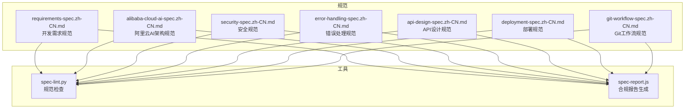
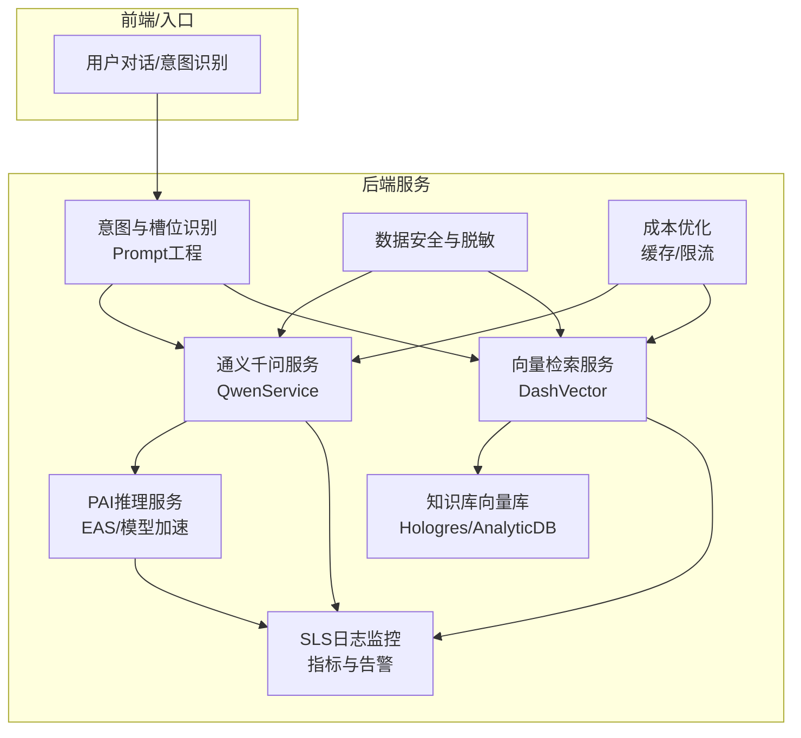
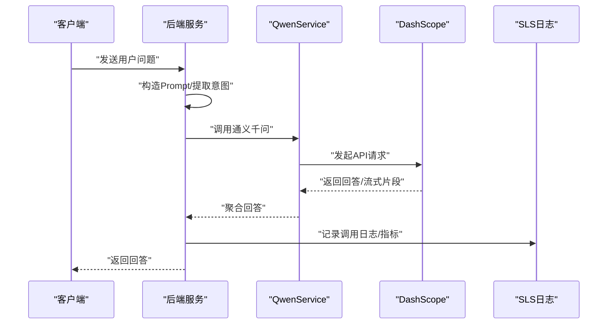
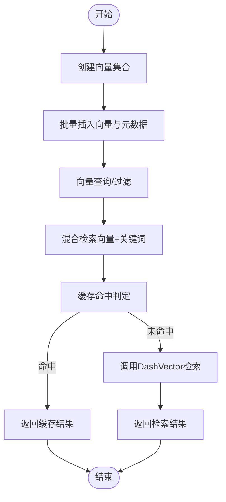
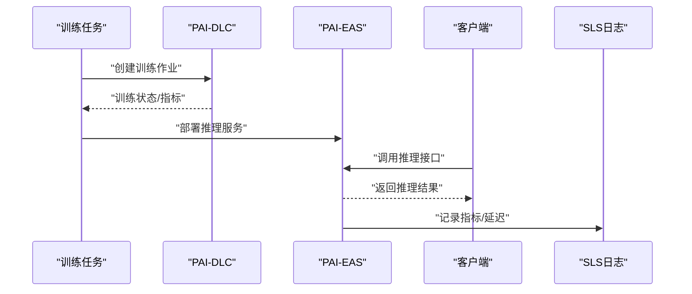
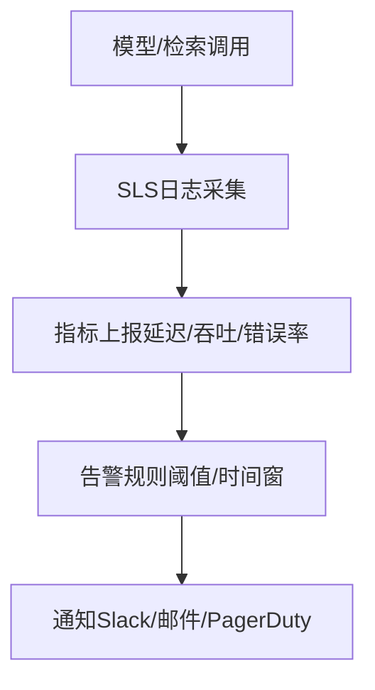
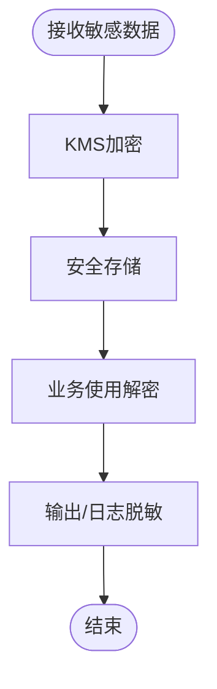
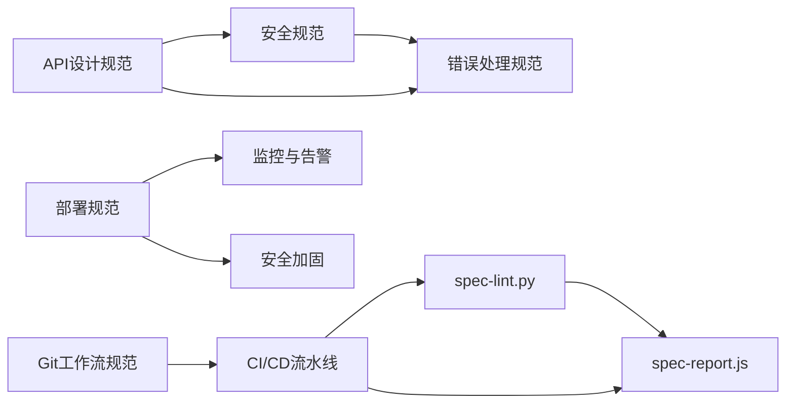

# 基于阿里云AI架构构建智能应用

<cite>
**本文引用的文件**
- [README.md](file://README.md)
- [alibaba-cloud-ai-spec.zh-CN.md](file://architecture/alibaba-cloud-ai-spec.zh-CN.md)
- [requirements-spec.zh-CN.md](file://core/requirements-spec.zh-CN.md)
- [security-spec.zh-CN.md](file://quality/security-spec.zh-CN.md)
- [error-handling-spec.zh-CN.md](file://quality/error-handling-spec.zh-CN.md)
- [api-design-spec.zh-CN.md](file://architecture/api-design-spec.zh-CN.md)
- [deployment-spec.zh-CN.md](file://operations/deployment-spec.zh-CN.md)
- [git-workflow-spec.zh-CN.md](file://process/git-workflow-spec.zh-CN.md)
- [spec-lint.py](file://tools/spec-lint.py)
- [spec-report.js](file://tools/spec-report.js)
</cite>

## 目录
1. [简介](#简介)
2. [项目结构](#项目结构)
3. [核心组件](#核心组件)
4. [架构总览](#架构总览)
5. [详细组件分析](#详细组件分析)
6. [依赖分析](#依赖分析)
7. [性能考虑](#性能考虑)
8. [故障排查指南](#故障排查指南)
9. [结论](#结论)
10. [附录](#附录)

## 简介
本指南面向在阿里云平台上构建智能客服机器人后端服务的工程团队，围绕“阿里云AI架构规范”和“开发需求规范”，系统阐述如何在工程实践中落地以下关键能力：
- 在AI提示词中引用规范文件，确保生成代码严格遵循规则
- 集成通义千问进行自然语言理解与对话生成
- 利用DashVector实现向量检索与知识库召回
- 配置PAI模型部署路径与SLS日志监控
- 实施成本优化策略（缓存机制与请求节流）
- 确保代码满足 RULE 3（大模型调用）、RULE 7（监控日志）、RULE 8（数据脱敏）、RULE 9（成本优化）
- 通过Git Hooks自动触发规范检查，并在CI/CD流水线中生成合规报告，形成端到端工程化闭环

## 项目结构
本仓库提供了规范与工具，支撑从需求到交付的全流程质量保障。下图展示了与本实践密切相关的规范与工具之间的关系。

图表来源
- [requirements-spec.zh-CN.md](file://core/requirements-spec.zh-CN.md#L1-L267)
- [alibaba-cloud-ai-spec.zh-CN.md](file://architecture/alibaba-cloud-ai-spec.zh-CN.md#L1-L1419)
- [security-spec.zh-CN.md](file://quality/security-spec.zh-CN.md#L1-L421)
- [error-handling-spec.zh-CN.md](file://quality/error-handling-spec.zh-CN.md#L1-L576)
- [api-design-spec.zh-CN.md](file://architecture/api-design-spec.zh-CN.md#L1-L596)
- [deployment-spec.zh-CN.md](file://operations/deployment-spec.zh-CN.md#L1-L808)
- [git-workflow-spec.zh-CN.md](file://process/git-workflow-spec.zh-CN.md#L1-L533)
- [spec-lint.py](file://tools/spec-lint.py#L1-L269)
- [spec-report.js](file://tools/spec-report.js#L1-L278)

章节来源
- [README.md](file://README.md#L1-L357)

## 核心组件
- 阿里云AI架构规范：定义模型服务化、向量检索与存储、大模型调用与管理、实时推理服务、监控与可观测性、数据安全与合规等关键规则，直接指导智能客服机器人的后端架构与实现。
- 开发需求规范：确保生成代码完整可运行、最小化新增依赖、API存在性验证、编译通过、使用真实存在的库等，为AI生成代码提供基础约束。
- 安全规范：输入验证与清理、认证与授权、敏感数据保护、依赖安全管理、OWASP Top 10防护、日志安全、API安全、配置管理、会话管理、文件上传安全、错误处理安全等，保障系统安全与合规。
- 错误处理规范：错误分类、自定义错误类、错误日志记录、用户友好提示、Try-Catch最佳实践、错误恢复策略、全局错误处理器、前端错误边界、错误监控与告警、错误码标准化、超时与限流处理、错误文档化等，确保系统健壮性。
- API设计规范：RESTful设计原则、API版本控制、请求与响应格式、HTTP状态码使用、查询参数规范、认证与授权、错误处理标准、API文档化、幂等性设计、CORS配置、性能优化等，指导后端服务接口设计。
- 部署规范：环境分离、CI/CD流水线、容器化部署、配置管理、健康检查、日志聚合、蓝绿/金丝雀发布、回滚机制、数据库迁移管理、监控与告警、安全加固、部署前检查清单等，保障生产级交付质量。
- Git工作流规范：分支命名、提交消息、提交频率、Pull Request规范、分支策略、代码审查、合并策略、禁止操作、标签管理、冲突解决、.gitignore管理、Commit Hooks等，规范团队协作与版本治理。
- 规范检查与报告工具：spec-lint.py与spec-report.js，分别用于在本地与CI中进行规范检查与合规报告生成，形成持续质量保障闭环。

章节来源
- [alibaba-cloud-ai-spec.zh-CN.md](file://architecture/alibaba-cloud-ai-spec.zh-CN.md#L1-L1419)
- [requirements-spec.zh-CN.md](file://core/requirements-spec.zh-CN.md#L1-L267)
- [security-spec.zh-CN.md](file://quality/security-spec.zh-CN.md#L1-L421)
- [error-handling-spec.zh-CN.md](file://quality/error-handling-spec.zh-CN.md#L1-L576)
- [api-design-spec.zh-CN.md](file://architecture/api-design-spec.zh-CN.md#L1-L596)
- [deployment-spec.zh-CN.md](file://operations/deployment-spec.zh-CN.md#L1-L808)
- [git-workflow-spec.zh-CN.md](file://process/git-workflow-spec.zh-CN.md#L1-L533)
- [spec-lint.py](file://tools/spec-lint.py#L1-L269)
- [spec-report.js](file://tools/spec-report.js#L1-L278)

## 架构总览
下图展示了智能客服机器人后端服务的整体架构，涵盖提示词工程、通义千问调用、向量检索、PAI推理服务、SLS日志监控与成本优化策略。

图表来源
- [alibaba-cloud-ai-spec.zh-CN.md](file://architecture/alibaba-cloud-ai-spec.zh-CN.md#L215-L342)
- [alibaba-cloud-ai-spec.zh-CN.md](file://architecture/alibaba-cloud-ai-spec.zh-CN.md#L115-L214)
- [alibaba-cloud-ai-spec.zh-CN.md](file://architecture/alibaba-cloud-ai-spec.zh-CN.md#L517-L619)
- [alibaba-cloud-ai-spec.zh-CN.md](file://architecture/alibaba-cloud-ai-spec.zh-CN.md#L621-L734)
- [alibaba-cloud-ai-spec.zh-CN.md](file://architecture/alibaba-cloud-ai-spec.zh-CN.md#L736-L808)

## 详细组件分析

### 组件A：通义千问集成（大模型调用与管理）
- 能力要点
  - 使用DashScope调用通义千问，支持普通对话、流式输出、Function Calling、Token使用监控与成本控制。
  - 实施Prompt工程最佳实践，结合业务场景设计高质量提示词。
  - 实施流控与成本控制，避免Token滥用导致的成本失控。
- 关键实现位置
  - 通义千问集成示例与流式处理、Function Calling、Token监控等实现位于“大模型调用与管理”规则中。
- 与规范的对应
  - RULE 3（大模型调用）：确保大模型调用的正确性与成本控制。
  - RULE 7（监控日志）：记录模型调用日志与指标，便于观测与告警。
  - RULE 9（成本优化）：通过流控、缓存与批量处理降低Token消耗。

图表来源
- [alibaba-cloud-ai-spec.zh-CN.md](file://architecture/alibaba-cloud-ai-spec.zh-CN.md#L215-L342)
- [alibaba-cloud-ai-spec.zh-CN.md](file://architecture/alibaba-cloud-ai-spec.zh-CN.md#L621-L734)

章节来源
- [alibaba-cloud-ai-spec.zh-CN.md](file://architecture/alibaba-cloud-ai-spec.zh-CN.md#L215-L342)
- [requirements-spec.zh-CN.md](file://core/requirements-spec.zh-CN.md#L19-L267)
- [security-spec.zh-CN.md](file://quality/security-spec.zh-CN.md#L1-L421)
- [error-handling-spec.zh-CN.md](file://quality/error-handling-spec.zh-CN.md#L1-L576)

### 组件B：向量检索与知识库（DashVector）
- 能力要点
  - 使用DashVector进行向量检索，支持创建集合、批量插入向量、向量查询与过滤。
  - 结合Hologres/AnalyticDB进行向量存储与备份恢复。
  - 实施向量索引优化（HNSW、IVF）与混合检索（向量+关键词）。
- 关键实现位置
  - DashVector集成示例与向量检索实现位于“向量检索与存储”规则中。
- 与规范的对应
  - RULE 7（监控日志）：记录检索调用与性能指标。
  - RULE 9（成本优化）：通过缓存与批量处理降低检索成本。

图表来源
- [alibaba-cloud-ai-spec.zh-CN.md](file://architecture/alibaba-cloud-ai-spec.zh-CN.md#L115-L214)

章节来源
- [alibaba-cloud-ai-spec.zh-CN.md](file://architecture/alibaba-cloud-ai-spec.zh-CN.md#L115-L214)
- [requirements-spec.zh-CN.md](file://core/requirements-spec.zh-CN.md#L19-L267)
- [security-spec.zh-CN.md](file://quality/security-spec.zh-CN.md#L1-L421)
- [error-handling-spec.zh-CN.md](file://quality/error-handling-spec.zh-CN.md#L1-L576)

### 组件C：PAI模型部署与实时推理
- 能力要点
  - 使用PAI-EAS部署推理服务，支持自动扩缩容、模型推理加速（TensorRT/ONNX）、请求批处理（Batching）与延迟/吞吐监控。
  - 通过PAI-DLC进行分布式训练与自动超参数调优、模型压缩与量化、GPU/NPU加速。
- 关键实现位置
  - PAI-EAS部署与推理调用示例位于“实时推理服务”规则中。
  - PAI-DLC训练任务示例位于“模型训练与优化”规则中。
- 与规范的对应
  - RULE 7（监控日志）：记录推理延迟、吞吐量与错误率。
  - RULE 9（成本优化）：通过弹性伸缩与批处理降低推理成本。

图表来源
- [alibaba-cloud-ai-spec.zh-CN.md](file://architecture/alibaba-cloud-ai-spec.zh-CN.md#L517-L619)
- [alibaba-cloud-ai-spec.zh-CN.md](file://architecture/alibaba-cloud-ai-spec.zh-CN.md#L424-L516)
- [alibaba-cloud-ai-spec.zh-CN.md](file://architecture/alibaba-cloud-ai-spec.zh-CN.md#L621-L734)

章节来源
- [alibaba-cloud-ai-spec.zh-CN.md](file://architecture/alibaba-cloud-ai-spec.zh-CN.md#L424-L619)
- [requirements-spec.zh-CN.md](file://core/requirements-spec.zh-CN.md#L19-L267)
- [security-spec.zh-CN.md](file://quality/security-spec.zh-CN.md#L1-L421)
- [error-handling-spec.zh-CN.md](file://quality/error-handling-spec.zh-CN.md#L1-L576)

### 组件D：SLS日志监控与告警
- 能力要点
  - 使用SLS采集日志，记录模型预测日志与模型指标，配置告警规则（如延迟阈值）。
  - 结合ARMS/指标系统进行全链路监控与分布式追踪。
- 关键实现位置
  - SLS集成示例与告警规则配置位于“监控与可观测性”规则中。
- 与规范的对应
  - RULE 7（监控日志）：确保日志采集、指标上报与告警配置到位。

图表来源
- [alibaba-cloud-ai-spec.zh-CN.md](file://architecture/alibaba-cloud-ai-spec.zh-CN.md#L621-L734)

章节来源
- [alibaba-cloud-ai-spec.zh-CN.md](file://architecture/alibaba-cloud-ai-spec.zh-CN.md#L621-L734)
- [deployment-spec.zh-CN.md](file://operations/deployment-spec.zh-CN.md#L561-L800)

### 组件E：数据安全与脱敏
- 能力要点
  - 使用KMS进行敏感数据加密与解密；对手机号、邮箱等敏感信息进行脱敏处理。
  - 遵循PIPL/GDPR等合规要求，实施访问控制与审计日志。
- 关键实现位置
  - 数据加密与脱敏示例位于“数据安全与合规”规则中。
- 与规范的对应
  - RULE 8（数据脱敏）：确保日志与输出中不泄露敏感信息。

图表来源
- [alibaba-cloud-ai-spec.zh-CN.md](file://architecture/alibaba-cloud-ai-spec.zh-CN.md#L736-L808)

章节来源
- [alibaba-cloud-ai-spec.zh-CN.md](file://architecture/alibaba-cloud-ai-spec.zh-CN.md#L736-L808)
- [security-spec.zh-CN.md](file://quality/security-spec.zh-CN.md#L1-L421)

### 组件F：成本优化（缓存与请求节流）
- 能力要点
  - 通过缓存热点问题与检索结果，降低重复调用与Token消耗。
  - 实施请求限流与熔断，避免突发流量导致成本飙升与系统过载。
- 关键实现位置
  - 缓存与限流策略与实现建议位于“成本优化”相关规则中。
- 与规范的对应
  - RULE 9（成本优化）：通过缓存与限流控制成本。

章节来源
- [alibaba-cloud-ai-spec.zh-CN.md](file://architecture/alibaba-cloud-ai-spec.zh-CN.md#L1-L1419)
- [deployment-spec.zh-CN.md](file://operations/deployment-spec.zh-CN.md#L561-L800)

## 依赖分析
- 规范间的依赖关系
  - 安全规范与错误处理规范相互补充，前者强调输入验证、敏感数据保护、日志安全等，后者强调错误分类、日志记录、全局错误处理与监控告警。
  - API设计规范与安全规范、错误处理规范共同保障接口层面的安全与稳定性。
  - 部署规范与监控规范协同，确保生产环境的健康检查、日志聚合、监控告警与安全加固。
  - Git工作流规范与CI/CD流水线配合，确保代码质量与合规性在提交与合并阶段即得到保障。
- 工具与规范的联动
  - 规范检查工具（spec-lint.py）与合规报告工具（spec-report.js）读取规范文件，自动扫描目标代码，输出问题与合规率，支撑本地与CI的持续质量保障。

图表来源
- [security-spec.zh-CN.md](file://quality/security-spec.zh-CN.md#L1-L421)
- [error-handling-spec.zh-CN.md](file://quality/error-handling-spec.zh-CN.md#L1-L576)
- [api-design-spec.zh-CN.md](file://architecture/api-design-spec.zh-CN.md#L1-L596)
- [deployment-spec.zh-CN.md](file://operations/deployment-spec.zh-CN.md#L561-L800)
- [git-workflow-spec.zh-CN.md](file://process/git-workflow-spec.zh-CN.md#L1-L533)
- [spec-lint.py](file://tools/spec-lint.py#L1-L269)
- [spec-report.js](file://tools/spec-report.js#L1-L278)

章节来源
- [security-spec.zh-CN.md](file://quality/security-spec.zh-CN.md#L1-L421)
- [error-handling-spec.zh-CN.md](file://quality/error-handling-spec.zh-CN.md#L1-L576)
- [api-design-spec.zh-CN.md](file://architecture/api-design-spec.zh-CN.md#L1-L596)
- [deployment-spec.zh-CN.md](file://operations/deployment-spec.zh-CN.md#L1-L808)
- [git-workflow-spec.zh-CN.md](file://process/git-workflow-spec.zh-CN.md#L1-L533)
- [spec-lint.py](file://tools/spec-lint.py#L1-L269)
- [spec-report.js](file://tools/spec-report.js#L1-L278)

## 性能考虑
- 向量检索性能
  - 采用HNSW/IVF等高效索引算法，结合混合检索（向量+关键词）提升召回质量与速度。
  - 对高频查询结果进行缓存，减少重复向量计算与网络往返。
- 大模型调用性能
  - 使用流式输出与批量处理，降低首字延迟与整体响应时间。
  - 实施Token使用监控与成本控制，避免不必要的长上下文与重复生成。
- 推理服务性能
  - 通过PAI-EAS自动扩缩容与批处理（Batching），提升吞吐并降低单位成本。
  - 使用模型推理加速（TensorRT/ONNX）与GPU/NPU加速，缩短推理时延。
- 日志与监控
  - 使用SLS集中化日志与指标上报，结合告警规则，及时发现性能瓶颈与异常。

[本节为通用性能讨论，不直接分析具体文件]

## 故障排查指南
- 规范检查失败
  - 使用规范检查工具定位问题：命名约定、安全硬编码、空catch块、TODO/FIXME等。
  - 参考错误处理规范进行统一错误分类与日志记录，避免静默失败。
- 监控与告警
  - 检查SLS日志与指标，确认延迟、错误率与吞吐量是否异常。
  - 结合全局错误处理器与前端错误边界，定位异常传播路径。
- 安全与合规
  - 检查敏感数据是否加密存储与传输，日志中是否包含敏感信息。
  - 确认API认证与授权策略、速率限制与CORS配置是否正确。
- 部署与回滚
  - 检查健康检查与就绪探针，确认依赖服务可用。
  - 如遇问题，按回滚机制快速回退至上一个稳定版本，并记录回滚原因。

章节来源
- [spec-lint.py](file://tools/spec-lint.py#L1-L269)
- [error-handling-spec.zh-CN.md](file://quality/error-handling-spec.zh-CN.md#L1-L576)
- [alibaba-cloud-ai-spec.zh-CN.md](file://architecture/alibaba-cloud-ai-spec.zh-CN.md#L621-L734)
- [security-spec.zh-CN.md](file://quality/security-spec.zh-CN.md#L1-L421)
- [deployment-spec.zh-CN.md](file://operations/deployment-spec.zh-CN.md#L233-L472)

## 结论
通过将“阿里云AI架构规范”与“开发需求规范”相结合，并借助安全、错误处理、API设计、部署与Git工作流等规范，以及spec-lint与spec-report工具，智能客服机器人后端服务可以在以下方面实现工程化落地：
- 以通义千问为核心的大模型调用与管理，结合Prompt工程与流式输出，提升对话质量与响应效率。
- 以DashVector为核心的向量检索与知识库召回，结合缓存与混合检索，降低Token消耗与延迟。
- 以PAI为载体的模型训练与推理服务，结合弹性伸缩与批处理，实现低成本高吞吐的在线推理。
- 以SLS为核心的监控与可观测性，结合告警规则与全局错误处理，保障系统稳定性与可维护性。
- 以安全与脱敏为核心的合规建设，确保数据安全与隐私保护。
- 以Git Hooks与CI/CD为核心的持续质量保障，形成端到端的工程化闭环。

[本节为总结性内容，不直接分析具体文件]

## 附录
- 在AI提示词中引用规范
  - 在与AI助手对话时，显式引用以下规范文件，确保生成代码严格遵循：
    - @architecture/alibaba-cloud-ai-spec.zh-CN.md
    - @core/requirements-spec.zh-CN.md
    - @quality/security-spec.zh-CN.md
    - @quality/error-handling-spec.zh-CN.md
    - @architecture/api-design-spec.zh-CN.md
    - @operations/deployment-spec.zh-CN.md
    - @process/git-workflow-spec.zh-CN.md
- Git Hooks与CI/CD
  - 在本地提交前通过Git Hooks触发规范检查，确保每次提交均符合规范。
  - 在CI/CD流水线中运行规范检查与合规报告生成，输出JSON报告并归档，形成持续质量保障闭环。

章节来源
- [README.md](file://README.md#L253-L294)
- [spec-lint.py](file://tools/spec-lint.py#L1-L269)
- [spec-report.js](file://tools/spec-report.js#L1-L278)