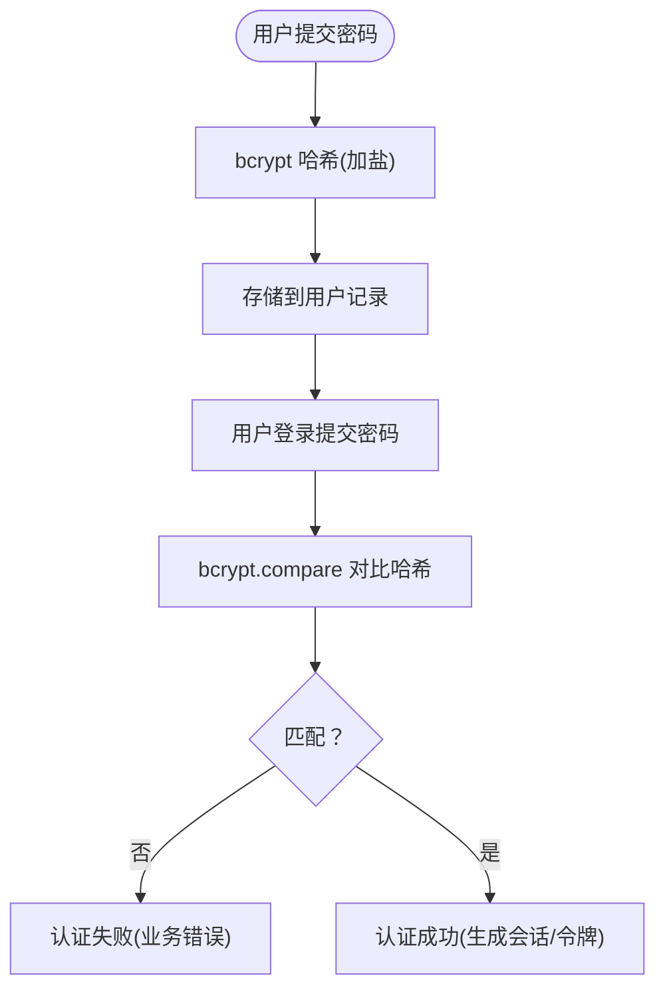

# 生成符合规范的登录页面

<cite>
**本文引用的文件**
- [README.md](file://README.md)
- [security-spec.zh-CN.md](file://quality/security-spec.zh-CN.md)
- [error-handling-spec.zh-CN.md](file://quality/error-handling-spec.zh-CN.md)
- [requirements-spec.zh-CN.md](file://core/requirements-spec.zh-CN.md)
- [workflow-spec.zh-CN.md](file://core/workflow-spec.zh-CN.md)
- [spec-lint.py](file://tools/spec-lint.py)
- [spec-report.js](file://tools/spec-report.js)
</cite>

## 目录
1. [简介](#简介)
2. [项目结构](#项目结构)
3. [核心组件](#核心组件)
4. [架构总览](#架构总览)
5. [详细组件分析](#详细组件分析)
6. [依赖关系分析](#依赖关系分析)
7. [性能考量](#性能考量)
8. [故障排查指南](#故障排查指南)
9. [结论](#结论)
10. [附录](#附录)

## 简介
本文件面向“生成符合安全与错误处理规范的用户登录页面”的目标，系统化梳理从需求提出到代码落地与部署的完整闭环。文档严格依据仓库内的规范文件，重点围绕以下方面展开：
- 在AI对话中引用规范：@quality/security-spec.zh-CN.md 与 @quality/error-handling-spec.zh-CN.md
- 表单验证：前端输入过滤与后端校验
- 安全存储：密码采用加密存储（如 bcrypt）
- 错误提示：用户友好且不泄露敏感信息
- 全局错误处理器：拦截异常，统一处理
- 规范检查与质量报告：使用 spec-lint.py 与 spec-report.js
- 前后对比：突出遵循规范后在安全性、可维护性与用户体验方面的提升
- 结合 README.md 示例流程，说明从需求到部署的闭环

## 项目结构
该仓库提供规范与工具，支撑在 AI 辅助开发中生成高质量、可合规的登录页面。关键组成如下：
- quality/：安全与错误处理规范
- core/：需求、命名约定、工作流等基础规范
- tools/：规范检查与质量报告工具
- README.md：使用示例、工具使用说明与工作流集成

图表来源
- [README.md](file://README.md#L148-L179)
- [security-spec.zh-CN.md](file://quality/security-spec.zh-CN.md#L1-L60)
- [error-handling-spec.zh-CN.md](file://quality/error-handling-spec.zh-CN.md#L1-L40)
- [requirements-spec.zh-CN.md](file://core/requirements-spec.zh-CN.md#L1-L40)
- [workflow-spec.zh-CN.md](file://core/workflow-spec.zh-CN.md#L1-L40)
- [spec-lint.py](file://tools/spec-lint.py#L1-L40)
- [spec-report.js](file://tools/spec-report.js#L1-L40)

章节来源
- [README.md](file://README.md#L1-L120)

## 核心组件
- 安全规范（security-spec.zh-CN.md）：输入验证与清理、认证与授权、敏感数据保护、API 安全、会话管理安全、错误处理安全等关键规则，为登录页面提供安全基线。
- 错误处理规范（error-handling-spec.zh-CN.md）：错误分类、自定义错误类、用户友好提示、全局错误处理器、前端错误边界、错误监控与告警、错误码标准化等，保障登录失败与异常场景的一致处理。
- 需求规范（requirements-spec.zh-CN.md）：生成完整可运行代码、复用现有 API、最小化新增依赖、验证 API 存在、确保代码可编译运行等，确保登录页面实现满足可运行性与一致性要求。
- 工作流规范（workflow-spec.zh-CN.md）：变更日志管理、版本号管理、文档同步、破坏性变更协议、依赖更新策略、错误处理标准等，贯穿登录页面从开发到上线的生命周期。

章节来源
- [security-spec.zh-CN.md](file://quality/security-spec.zh-CN.md#L1-L120)
- [error-handling-spec.zh-CN.md](file://quality/error-handling-spec.zh-CN.md#L1-L120)
- [requirements-spec.zh-CN.md](file://core/requirements-spec.zh-CN.md#L1-L120)
- [workflow-spec.zh-CN.md](file://core/workflow-spec.zh-CN.md#L1-L120)

## 架构总览
登录页面的端到端流程由“前端表单 + 后端校验 + 安全存储 + 统一错误处理”构成，并通过工具链进行合规性与质量评估。

图表来源
- [security-spec.zh-CN.md](file://quality/security-spec.zh-CN.md#L90-L120)
- [error-handling-spec.zh-CN.md](file://quality/error-handling-spec.zh-CN.md#L278-L340)
- [spec-lint.py](file://tools/spec-lint.py#L180-L229)
- [spec-report.js](file://tools/spec-report.js#L131-L186)

## 详细组件分析

### 组件A：表单验证与输入过滤
- 前端输入过滤：对邮箱格式、密码长度与强度进行即时校验，避免无效请求进入后端。
- 后端校验：对所有外部输入（邮箱、密码）进行白名单验证、长度与格式校验，清理潜在注入风险字符。
- 与安全规范的对应：
  - 输入验证与清理（规则1）：验证邮箱格式、密码强度、清理潜在风险字符。
  - OWASP Top 10 防护（规则5）：启用 CSP、CORS、安全 Cookie 属性，防止 XSS、CSRF 等。
- 与错误处理规范的对应：
  - 用户友好提示（规则4）：对格式错误提供可操作的提示，避免技术术语。
  - 全局错误处理器（规则7）：对验证失败进行统一拦截与响应。

图表来源
- [security-spec.zh-CN.md](file://quality/security-spec.zh-CN.md#L20-L51)
- [error-handling-spec.zh-CN.md](file://quality/error-handling-spec.zh-CN.md#L160-L187)
- [error-handling-spec.zh-CN.md](file://quality/error-handling-spec.zh-CN.md#L278-L340)

章节来源
- [security-spec.zh-CN.md](file://quality/security-spec.zh-CN.md#L20-L51)
- [error-handling-spec.zh-CN.md](file://quality/error-handling-spec.zh-CN.md#L160-L187)
- [error-handling-spec.zh-CN.md](file://quality/error-handling-spec.zh-CN.md#L278-L340)

### 组件B：密码加密存储与验证
- 存储：密码使用 bcrypt 等单向哈希加盐存储，不保存明文。
- 验证：登录时使用 bcrypt.compare 对比哈希值。
- 与安全规范的对应：
  - 敏感数据保护（规则3）：密码哈希、HTTPS 传输、不记录敏感信息。
  - 会话管理安全（规则9）：登录后重新生成会话 ID，设置安全 Cookie 属性。
- 与错误处理规范的对应：
  - 错误分类（规则1）：认证失败属于业务错误，不应暴露内部实现细节。
  - 用户友好提示（规则4）：对认证失败提供清晰、可操作的提示。

图表来源
- [security-spec.zh-CN.md](file://quality/security-spec.zh-CN.md#L90-L120)
- [security-spec.zh-CN.md](file://quality/security-spec.zh-CN.md#L263-L288)
- [error-handling-spec.zh-CN.md](file://quality/error-handling-spec.zh-CN.md#L20-L69)

章节来源
- [security-spec.zh-CN.md](file://quality/security-spec.zh-CN.md#L90-L120)
- [security-spec.zh-CN.md](file://quality/security-spec.zh-CN.md#L263-L288)
- [error-handling-spec.zh-CN.md](file://quality/error-handling-spec.zh-CN.md#L20-L69)

### 组件C：全局错误处理器与用户友好提示
- 全局错误处理器：区分业务错误、系统错误、第三方错误，统一返回用户可理解的消息，生产环境不暴露堆栈与内部路径。
- 前端错误边界：React/Vue 错误边界捕获渲染错误，上报监控并显示友好提示。
- 与错误处理规范的对应：
  - 自定义错误类（规则2）：为认证失败、验证失败等创建领域特定错误类。
  - 全局错误处理器（规则7）：Express 全局中间件、Promise/uncaught 异常处理。
  - 错误码标准化（规则10）：统一错误码，便于前端识别与处理。

图表来源
- [error-handling-spec.zh-CN.md](file://quality/error-handling-spec.zh-CN.md#L278-L340)
- [error-handling-spec.zh-CN.md](file://quality/error-handling-spec.zh-CN.md#L437-L479)

章节来源
- [error-handling-spec.zh-CN.md](file://quality/error-handling-spec.zh-CN.md#L278-L340)
- [error-handling-spec.zh-CN.md](file://quality/error-handling-spec.zh-CN.md#L437-L479)

### 组件D：API 安全与速率限制
- 速率限制：对登录端点实施速率限制，防暴力破解。
- CORS/安全头：设置安全的 Cookie 属性与 CSP，限制跨域访问。
- 与安全规范的对应：
  - API 安全（规则7）：速率限制、CORS、Content-Type 验证、请求大小限制。
  - OWASP Top 10 防护（规则5）：X-Frame-Options、CSP、SameSite 等。

图表来源
- [security-spec.zh-CN.md](file://quality/security-spec.zh-CN.md#L205-L228)
- [security-spec.zh-CN.md](file://quality/security-spec.zh-CN.md#L158-L181)

章节来源
- [security-spec.zh-CN.md](file://quality/security-spec.zh-CN.md#L205-L228)
- [security-spec.zh-CN.md](file://quality/security-spec.zh-CN.md#L158-L181)

### 组件E：规范检查与质量报告
- 规范检查（spec-lint.py）：扫描目标目录，检查命名约定、安全硬编码、空 catch 块、代码完整性等问题，输出错误/警告。
- 质量报告（spec-report.js）：统计规范启用情况、代码文件与行数、测试覆盖率（若存在），计算总体合规率。

图表来源
- [spec-lint.py](file://tools/spec-lint.py#L180-L229)
- [spec-report.js](file://tools/spec-report.js#L131-L186)

章节来源
- [spec-lint.py](file://tools/spec-lint.py#L1-L120)
- [spec-report.js](file://tools/spec-report.js#L1-L120)

## 依赖关系分析
- 规范之间的耦合与协同：
  - 安全规范与错误处理规范：安全错误处理遵循错误处理规范（日志记录、全局处理、不暴露内部信息）。
  - 安全规范与工作流规范：依赖安全审计与更新策略对齐工作流中的依赖更新。
- 工具与规范的映射：
  - spec-lint.py 读取启用规则，对目标代码进行静态检查。
  - spec-report.js 生成合规报告，辅助持续改进。

图表来源
- [security-spec.zh-CN.md](file://quality/security-spec.zh-CN.md#L392-L397)
- [error-handling-spec.zh-CN.md](file://quality/error-handling-spec.zh-CN.md#L547-L552)
- [spec-lint.py](file://tools/spec-lint.py#L40-L81)
- [spec-report.js](file://tools/spec-report.js#L131-L186)

章节来源
- [security-spec.zh-CN.md](file://quality/security-spec.zh-CN.md#L392-L397)
- [error-handling-spec.zh-CN.md](file://quality/error-handling-spec.zh-CN.md#L547-L552)
- [spec-lint.py](file://tools/spec-lint.py#L40-L81)
- [spec-report.js](file://tools/spec-report.js#L131-L186)

## 性能考量
- 前端性能：表单校验尽量本地化，减少无效请求；对输入进行节流/防抖，避免频繁触发后端校验。
- 后端性能：bcrypt 加盐哈希成本较高，建议合理设置轮数；对登录失败进行速率限制，避免资源消耗。
- 监控与告警：集成错误监控服务，对认证失败、系统错误进行告警，及时发现异常峰值。

## 故障排查指南
- 常见问题与定位：
  - 空 catch 块：spec-lint.py 会检测并标记为错误，应记录日志或重新抛出。
  - 硬编码密钥：安全规则检测硬编码 API 密钥/密码/令牌，应迁移到环境变量。
  - TODO/FIXME：需求规范要求生成完整可运行代码，应清理占位符。
- 全局错误处理：
  - 业务错误：返回用户友好提示，记录日志但不泄露内部信息。
  - 系统错误：记录详细堆栈与上下文，返回通用错误消息。
  - 第三方错误：降级处理或重试，避免阻塞主流程。
- 规范检查与报告：
  - 使用 spec-lint.py 定位问题，修复后再次检查。
  - 使用 spec-report.js 生成合规报告，持续跟踪改进。

章节来源
- [spec-lint.py](file://tools/spec-lint.py#L139-L160)
- [spec-lint.py](file://tools/spec-lint.py#L161-L180)
- [error-handling-spec.zh-CN.md](file://quality/error-handling-spec.zh-CN.md#L278-L340)
- [spec-report.js](file://tools/spec-report.js#L131-L186)

## 结论
通过严格遵循安全与错误处理规范，并结合规范检查与质量报告工具，登录页面在安全性、可维护性与用户体验方面得到显著提升：
- 安全性：输入验证、密码哈希、速率限制、安全头与会话管理形成闭环。
- 可维护性：统一错误分类与错误码、全局错误处理器、规范检查与报告，降低维护成本。
- 用户体验：用户友好提示、错误边界与监控告警，提升问题感知与恢复能力。

## 附录
- 从需求到部署的闭环流程（参考 README.md 示例）：
  - 在 AI 对话中引用规范文件，生成登录页面。
  - 运行规范检查与质量报告，修复问题并提升合规率。
  - 集成全局错误处理器与安全中间件，完善日志与监控。
  - 通过 CI/CD 集成规范检查与报告，形成持续改进闭环。

章节来源
- [README.md](file://README.md#L212-L252)
- [README.md](file://README.md#L253-L294)
- [README.md](file://README.md#L148-L179)