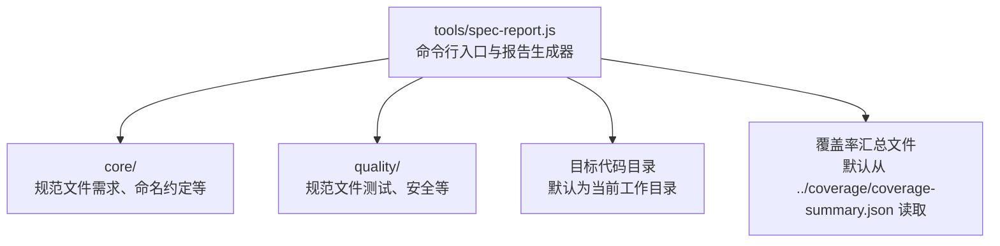
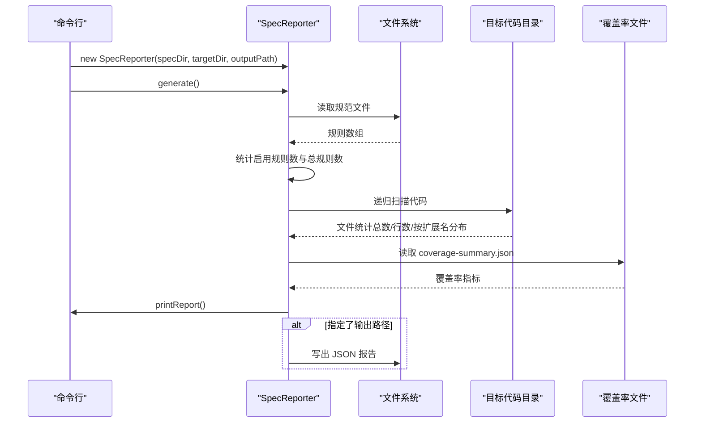
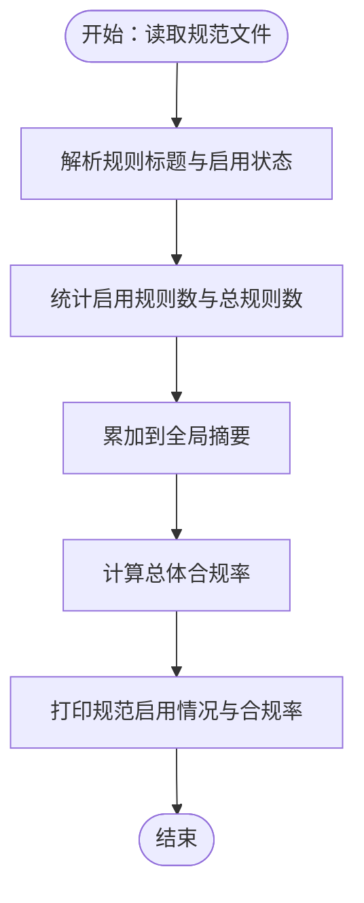
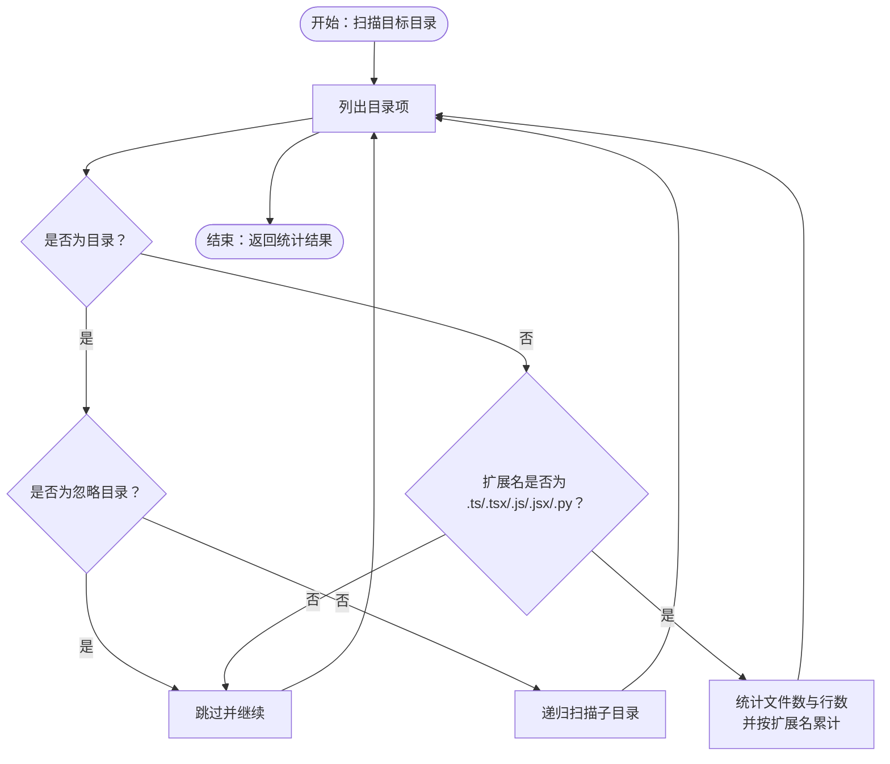
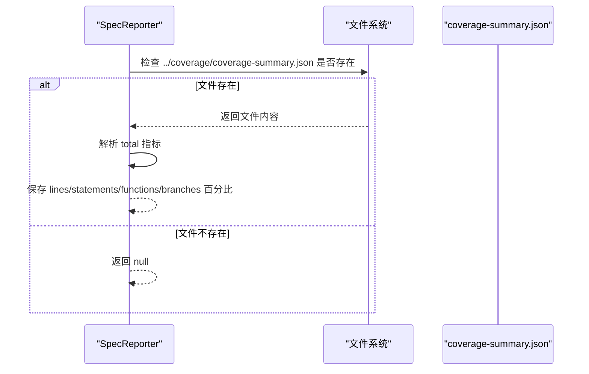
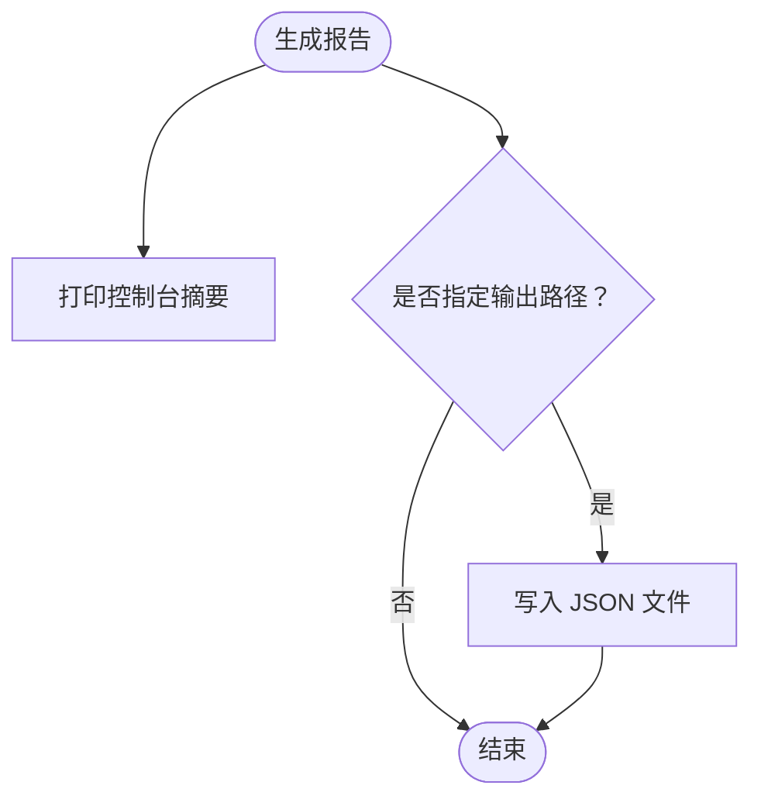
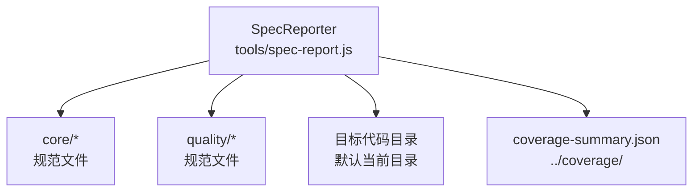

# 合规报告生成器（spec-report.js）

<cite>
**本文引用的文件**
- [tools/spec-report.js](file://tools/spec-report.js)
- [README.md](file://README.md)
- [core/requirements-spec.zh-CN.md](file://core/requirements-spec.zh-CN.md)
- [core/naming-conventions.zh-CN.md](file://core/naming-conventions.zh-CN.md)
- [quality/testing-spec.zh-CN.md](file://quality/testing-spec.zh-CN.md)
- [quality/security-spec.zh-CN.md](file://quality/security-spec.zh-CN.md)
</cite>

## 目录
1. [简介](#简介)
2. [项目结构](#项目结构)
3. [核心组件](#核心组件)
4. [架构总览](#架构总览)
5. [详细组件分析](#详细组件分析)
6. [依赖关系分析](#依赖关系分析)
7. [性能考量](#性能考量)
8. [故障排除指南](#故障排除指南)
9. [结论](#结论)
10. [附录](#附录)

## 简介
合规报告生成器（spec-report.js）是一个面向规范审计与可视化的命令行工具，旨在帮助团队量化评估项目对规范体系的遵守程度。它通过解析规范目录中的规范文件，提取每项规则的启用状态（[ENABLED]/[DISABLED]），统计总体合规率；同时扫描目标代码目录，统计文件类型分布与代码行数；并可自动读取覆盖率汇总文件（coverage-summary.json）展示关键指标（行、语句、函数、分支覆盖率）。最终在控制台输出结构化摘要，并可选择将报告以JSON格式持久化，便于CI/CD流水线集成与归档。

## 项目结构
本工具位于 tools 目录下，配合 README 中的“工具使用”章节，提供命令行入口与参数配置说明。规范文件分布在 core 与 quality 等子目录中，工具默认从 core 目录读取规范文件，扫描当前工作目录为目标代码目录，覆盖率文件默认从目标目录上层的 coverage 目录读取。

图表来源
- [tools/spec-report.js](file://tools/spec-report.js#L131-L193)
- [README.md](file://README.md#L166-L179)

章节来源
- [README.md](file://README.md#L1-L60)
- [README.md](file://README.md#L166-L179)

## 核心组件
- 规范解析与统计：从指定规范目录读取规范文件，解析规则标题与启用状态，统计每份规范的启用规则数与总规则数，并累加到整体摘要。
- 代码扫描与统计：递归遍历目标目录，过滤常见非代码目录，识别 .ts/.tsx/.js/.jsx/.py 等扩展名，统计文件总数与总行数，并按扩展名分类统计。
- 覆盖率集成：自动定位并读取覆盖率汇总文件，提取行、语句、函数、分支覆盖率百分比。
- 报告输出：在控制台打印结构化摘要（时间戳、目录信息、启用规则列表、覆盖率、总体合规率），并可选将完整报告写入JSON文件。

章节来源
- [tools/spec-report.js](file://tools/spec-report.js#L14-L31)
- [tools/spec-report.js](file://tools/spec-report.js#L33-L54)
- [tools/spec-report.js](file://tools/spec-report.js#L56-L104)
- [tools/spec-report.js](file://tools/spec-report.js#L106-L129)
- [tools/spec-report.js](file://tools/spec-report.js#L131-L193)
- [tools/spec-report.js](file://tools/spec-report.js#L190-L236)

## 架构总览
工具采用单文件模块化设计，导出 SpecReporter 类与 CLI 主函数。控制流如下：
- CLI 解析参数（规范目录、目标目录、输出路径）
- 初始化 SpecReporter
- 生成报告（解析规范、扫描代码、检查覆盖率、打印与持久化）

图表来源
- [tools/spec-report.js](file://tools/spec-report.js#L131-L193)
- [tools/spec-report.js](file://tools/spec-report.js#L190-L236)

## 详细组件分析

### 规范解析与合规率计算
- 解析策略：正则匹配规范文件中的规则标题与启用状态，生成规则对象数组。
- 统计维度：每份规范的启用规则数与总规则数；全局汇总的启用规则数与总规则数；基于启用规则数与总规则数计算总体合规率（百分比）。
- 输出内容：打印每份规范的启用率与启用规则清单，便于快速定位未启用的关键规则。

图表来源
- [tools/spec-report.js](file://tools/spec-report.js#L33-L54)
- [tools/spec-report.js](file://tools/spec-report.js#L146-L193)
- [tools/spec-report.js](file://tools/spec-report.js#L190-L236)

章节来源
- [tools/spec-report.js](file://tools/spec-report.js#L33-L54)
- [tools/spec-report.js](file://tools/spec-report.js#L146-L193)
- [tools/spec-report.js](file://tools/spec-report.js#L190-L236)

### 代码扫描与文件分布分析
- 扫描范围：递归遍历目标目录，跳过 node_modules、dist、build、__pycache__、.venv、.git 等常见非代码目录。
- 文件类型识别：仅统计 .ts/.tsx/.js/.jsx/.py 扩展名。
- 统计指标：总文件数、总行数、按扩展名分类的文件数与行数分布。
- 输出内容：在控制台打印代码统计摘要，辅助评估项目规模与技术栈分布。

图表来源
- [tools/spec-report.js](file://tools/spec-report.js#L56-L104)

章节来源
- [tools/spec-report.js](file://tools/spec-report.js#L56-L104)

### 覆盖率集成与关键指标展示
- 路径定位：默认从目标目录上层的 coverage 目录读取 coverage-summary.json。
- 数据读取：解析 JSON，提取 total.lines.pct、total.statements.pct、total.functions.pct、total.branches.pct。
- 输出内容：在控制台打印行、语句、函数、分支覆盖率百分比，便于与规范中的覆盖率目标对齐。

图表来源
- [tools/spec-report.js](file://tools/spec-report.js#L106-L129)

章节来源
- [tools/spec-report.js](file://tools/spec-report.js#L106-L129)

### 报告输出与持久化
- 控制台输出：结构化摘要包含时间戳、目标目录、代码统计、覆盖率、各规范启用情况与总体合规率。
- JSON 持久化：若提供了输出路径，则将完整报告对象写入 JSON 文件，便于CI/CD归档与二次分析。

图表来源
- [tools/spec-report.js](file://tools/spec-report.js#L170-L193)
- [tools/spec-report.js](file://tools/spec-report.js#L190-L236)

章节来源
- [tools/spec-report.js](file://tools/spec-report.js#L170-L193)
- [tools/spec-report.js](file://tools/spec-report.js#L190-L236)

## 依赖关系分析
- 规范来源：工具默认从 core 目录读取规范文件，对应 README 中“工具使用”的示例与说明。
- 覆盖率来源：工具默认从 ../coverage/coverage-summary.json 读取覆盖率数据，需确保覆盖率工具（如 Jest）已生成该文件。
- 目标目录：默认为当前工作目录，可通过命令行参数覆盖。

图表来源
- [tools/spec-report.js](file://tools/spec-report.js#L131-L193)
- [README.md](file://README.md#L166-L179)

章节来源
- [tools/spec-report.js](file://tools/spec-report.js#L131-L193)
- [README.md](file://README.md#L166-L179)

## 性能考量
- 文件扫描复杂度：深度优先遍历目标目录，时间复杂度近似 O(N)，N 为文件与目录总数。忽略常见非代码目录可显著减少 IO。
- 行数统计：逐文件读取并按行分割统计，空间复杂度与文件大小线性相关。建议在大型仓库中合理划分目标目录，避免扫描无关目录。
- 覆盖率读取：仅在文件存在时解析一次 JSON，开销极低。
- 输出与持久化：控制台输出为同步 I/O，JSON 写入为一次性磁盘写入，通常不会成为瓶颈。

[本节为通用性能讨论，无需引用具体文件]

## 故障排除指南
- Node.js 运行时依赖问题
  - 现象：命令无法执行或报错找不到模块。
  - 处理：确认已安装 Node.js 并在 PATH 中可用；在项目根目录执行命令。
  - 参考：README 中的工具使用示例与 CI/CD 集成步骤。
  - 章节来源
    - [README.md](file://README.md#L166-L179)

- 覆盖率文件路径错误
  - 现象：覆盖率指标为空或未显示。
  - 处理：确认覆盖率工具已在项目根目录生成 coverage-summary.json；若项目结构不同，请调整目标目录参数，使工具能定位到 ../coverage/coverage-summary.json。
  - 章节来源
    - [tools/spec-report.js](file://tools/spec-report.js#L106-L129)

- 权限不足
  - 现象：无法读取规范文件或目标目录，或无法写入输出文件。
  - 处理：检查当前用户对规范目录、目标目录与输出路径的读写权限；在 CI 环境中确保工作目录与覆盖率目录具备相应权限。
  - 章节来源
    - [tools/spec-report.js](file://tools/spec-report.js#L131-L193)

- 规范文件未找到
  - 现象：某些规范未计入统计。
  - 处理：确认规范文件存在于 core/quality 目录中，且文件名与工具默认读取的名称一致；如自定义目录，请通过命令行参数指定规范目录。
  - 章节来源
    - [tools/spec-report.js](file://tools/spec-report.js#L146-L162)

## 结论
spec-report.js 为规范审计与可视化提供了简洁高效的工具链：通过解析规范启用状态、统计代码规模与覆盖率，形成可量化的合规报告。结合 README 中的命令行示例与 CI/CD 集成建议，可在本地与流水线中持续监控项目规范执行情况，提升代码质量与一致性。

[本节为总结性内容，无需引用具体文件]

## 附录

### 命令行使用示例
- 生成报告（默认参数）
  - node tools/spec-report.js
- 保存为 JSON
  - node tools/spec-report.js --output report.json
- 指定规范目录与目标目录
  - node tools/spec-report.js --spec-dir ../spec-presets/core --target-dir ./src --output report.json

章节来源
- [README.md](file://README.md#L166-L179)
- [tools/spec-report.js](file://tools/spec-report.js#L238-L271)

### 报告输出格式说明
- 控制台摘要字段
  - 时间戳、目标目录、代码统计（总文件数、总行数、按扩展名分布）、覆盖率（行/语句/函数/分支）、各规范启用情况与启用率、总体合规率。
- JSON 报告字段
  - timestamp、specDir、targetDir、specs（每份规范的规则列表与统计）、summary（总规则数、启用规则数、合规率、问题列表）、codeStats（文件统计）、testCoverage（覆盖率指标）。

章节来源
- [tools/spec-report.js](file://tools/spec-report.js#L14-L31)
- [tools/spec-report.js](file://tools/spec-report.js#L190-L236)

### 开发流程应用场景
- 项目健康度评估：通过总体合规率与覆盖率指标，快速识别规范执行薄弱环节。
- 合规性审计：在代码评审与发布前，生成报告作为合规依据。
- 团队规范执行监控：在 CI/CD 中定期生成报告并归档，追踪团队规范执行趋势。

章节来源
- [README.md](file://README.md#L270-L293)