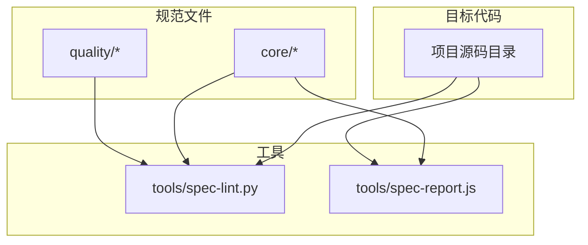
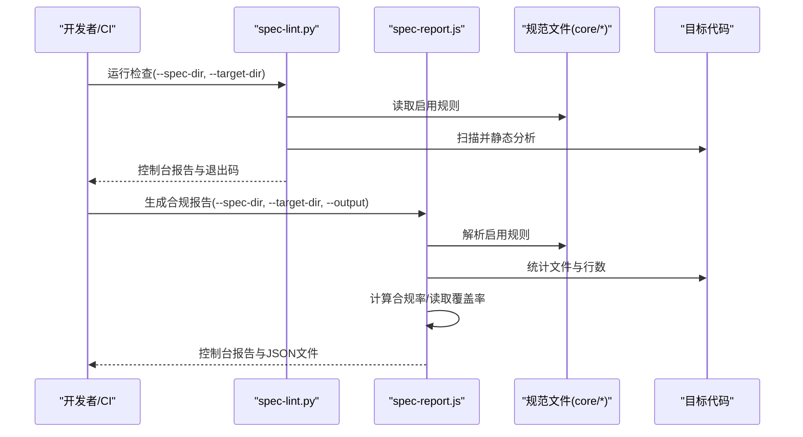
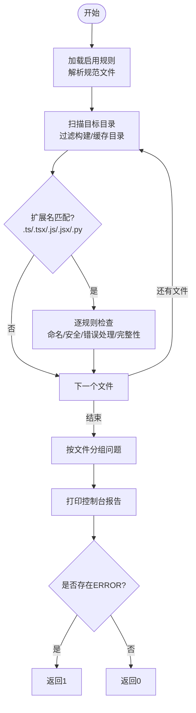
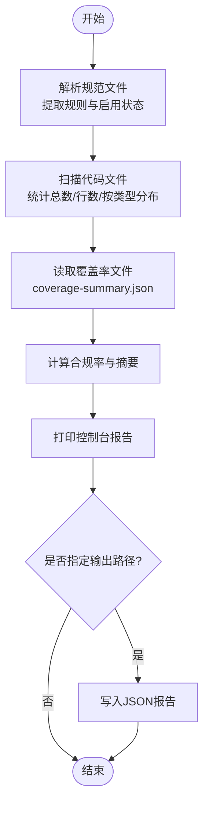
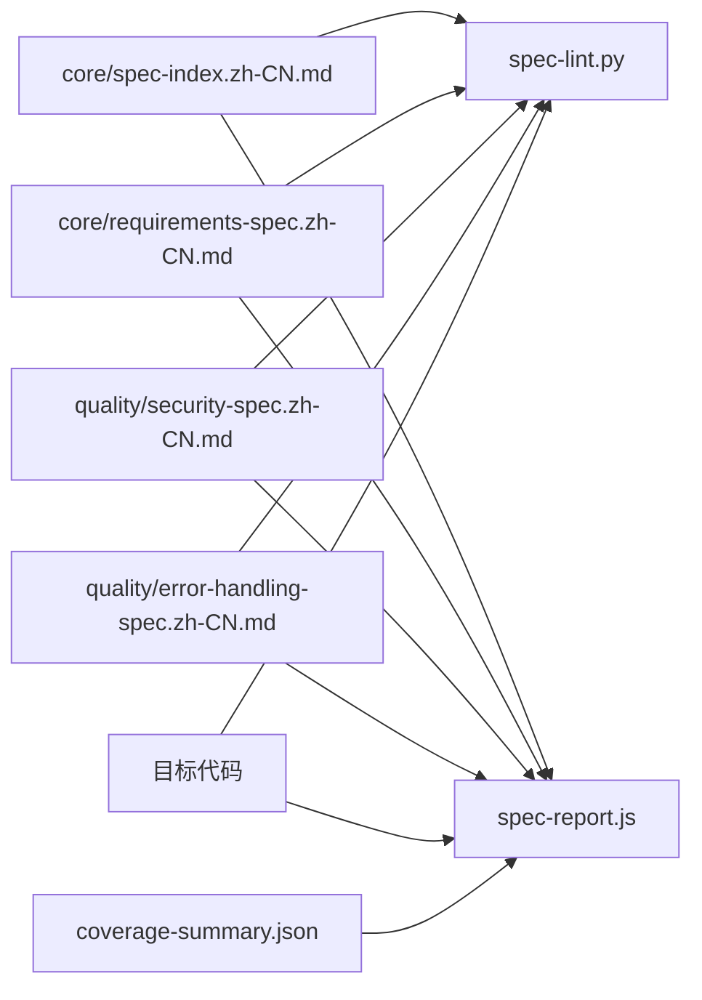

# 工具生态系统

<cite>
**本文引用的文件**
- [README.md](file://README.md)
- [tools/spec-lint.py](file://tools/spec-lint.py)
- [tools/spec-report.js](file://tools/spec-report.js)
- [core/spec-index.zh-CN.md](file://core/spec-index.zh-CN.md)
- [core/requirements-spec.zh-CN.md](file://core/requirements-spec.zh-CN.md)
- [quality/security-spec.zh-CN.md](file://quality/security-spec.zh-CN.md)
- [quality/error-handling-spec.zh-CN.md](file://quality/error-handling-spec.zh-CN.md)
</cite>

## 目录
1. [简介](#简介)
2. [项目结构](#项目结构)
3. [核心组件](#核心组件)
4. [架构总览](#架构总览)
5. [详细组件分析](#详细组件分析)
6. [依赖关系分析](#依赖关系分析)
7. [性能考量](#性能考量)
8. [故障排查指南](#故障排查指南)
9. [结论](#结论)
10. [附录](#附录)

## 简介
本文件面向工具生态系统，聚焦两个关键工具：规范检查器（spec-lint.py）与合规报告生成器（spec-report.js）。前者负责解析规范文件与目标代码，执行静态分析以识别违规项并输出可读性报告；后者负责收集规范启用情况、代码统计与测试覆盖率等信息，生成结构化的合规报告（控制台与JSON），用于审计与持续集成反馈。文档同时提供命令行使用示例、参数配置、规则启用/禁用方式、工作流集成（pre-commit与CI）、性能优化建议与常见问题排查。

## 项目结构
该仓库采用“规范文件 + 工具”的组织方式：
- 规范文件位于 core 与 quality 等目录，提供规则与约定的权威来源；
- tools 目录包含两个工具：spec-lint.py（Python）与 spec-report.js（Node.js）；
- README.md 提供快速开始、工具使用、IDE与CI集成示例。

图表来源
- [README.md](file://README.md#L1-L60)
- [tools/spec-lint.py](file://tools/spec-lint.py#L1-L40)
- [tools/spec-report.js](file://tools/spec-report.js#L1-L40)

章节来源
- [README.md](file://README.md#L1-L60)

## 核心组件
- 规范检查器（spec-lint.py）
  - 作用：扫描目标代码，基于启用的规范规则进行静态分析，输出问题列表与退出码。
  - 关键能力：解析规范启用状态、按文件类型过滤、逐规则检查（命名约定、安全、错误处理、完整性等）。
- 合规报告生成器（spec-report.js）
  - 作用：汇总规范启用情况、统计代码文件与行数、读取测试覆盖率、生成控制台报告与JSON文件。
  - 关键能力：解析规范文件、递归扫描代码、计算合规率、输出结构化报告。

章节来源
- [tools/spec-lint.py](file://tools/spec-lint.py#L37-L120)
- [tools/spec-report.js](file://tools/spec-report.js#L1-L120)

## 架构总览
工具之间的交互流程如下：
- spec-lint.py 读取规范目录与目标目录，对代码进行静态检查，输出问题与退出码。
- spec-report.js 读取规范目录与目标目录，统计代码与覆盖率，生成控制台报告与JSON文件。
- 两者均可通过命令行参数指定规范目录与目标目录，便于在本地与CI中统一使用。

图表来源
- [tools/spec-lint.py](file://tools/spec-lint.py#L231-L268)
- [tools/spec-report.js](file://tools/spec-report.js#L238-L277)

## 详细组件分析

### 规范检查器（spec-lint.py）
- 功能要点
  - 解析规范启用状态：从指定规范目录读取若干文本文件，匹配“规则/约定 + [ENABLED]”标记，生成启用规则集合。
  - 目标扫描：遍历目标目录，过滤常见构建/缓存目录，按扩展名筛选（.ts/.tsx/.js/.jsx/.py）。
  - 规则检查：
    - 命名约定：根据语言区分（Python使用snake_case，JS/TS使用camelCase），检测不符合约定的变量命名。
    - 安全：检测硬编码密钥（如API_KEY、SECRET、PASSWORD、TOKEN），排除process.env/os.getenv等环境变量场景。
    - 错误处理：检测空catch块，提示记录日志或重新抛出。
    - 完整性：检测TODO/FIXME等占位符，提醒在提交前完成。
  - 报告输出：按严重程度分组，按文件聚合输出，返回退出码（存在ERROR时为非零）。

图表来源
- [tools/spec-lint.py](file://tools/spec-lint.py#L46-L120)
- [tools/spec-lint.py](file://tools/spec-lint.py#L181-L229)

章节来源
- [tools/spec-lint.py](file://tools/spec-lint.py#L37-L120)
- [tools/spec-lint.py](file://tools/spec-lint.py#L121-L229)
- [tools/spec-lint.py](file://tools/spec-lint.py#L231-L268)

### 合规报告生成器（spec-report.js）
- 功能要点
  - 规范解析：读取规范文件，提取规则编号、标题与启用状态，统计每个规范的启用规则数与总规则数。
  - 代码统计：递归扫描目标目录，统计文件总数、总行数与按扩展名的分布。
  - 测试覆盖率：尝试读取coverage-summary.json，提取行/语句/函数/分支覆盖率。
  - 报告生成：计算总体合规率（启用规则/总规则），打印控制台报告，并可选保存为JSON文件。

图表来源
- [tools/spec-report.js](file://tools/spec-report.js#L1-L120)
- [tools/spec-report.js](file://tools/spec-report.js#L121-L212)
- [tools/spec-report.js](file://tools/spec-report.js#L214-L277)

章节来源
- [tools/spec-report.js](file://tools/spec-report.js#L1-L120)
- [tools/spec-report.js](file://tools/spec-report.js#L121-L212)
- [tools/spec-report.js](file://tools/spec-report.js#L214-L277)

### 规范文件与规则启用/禁用
- 规范文件格式
  - 规范文件采用Markdown格式，其中包含规则标题与启用状态标记（例如“[ENABLED]”）。
  - 工具通过正则匹配规则标题与启用状态，决定是否启用某条规则。
- 规则启用/禁用方式
  - 在规范文件中将对应规则的标记从“[ENABLED]”更改为“[DISABLED]”，即可禁用该规则。
  - 通过spec-index.zh-CN.md可集中管理全局开关、模块状态、项目类型配置与覆盖项，便于在不直接编辑模块文件的前提下调整启用状态。

章节来源
- [core/spec-index.zh-CN.md](file://core/spec-index.zh-CN.md#L1-L120)
- [core/requirements-spec.zh-CN.md](file://core/requirements-spec.zh-CN.md#L1-L60)
- [quality/security-spec.zh-CN.md](file://quality/security-spec.zh-CN.md#L1-L40)
- [quality/error-handling-spec.zh-CN.md](file://quality/error-handling-spec.zh-CN.md#L1-L40)

## 依赖关系分析
- 工具与规范文件
  - spec-lint.py 与 spec-report.js 均依赖规范文件中的启用状态与规则描述，用于判断检查范围与合规率计算。
- 工具与目标代码
  - 两者均扫描目标代码目录，统计文件与行数，但spec-lint.py还对代码进行静态规则检查，spec-report.js侧重统计与覆盖率读取。
- 工具与外部产物
  - spec-report.js 读取覆盖率文件（coverage-summary.json），若存在则纳入报告；否则忽略。

图表来源
- [tools/spec-lint.py](file://tools/spec-lint.py#L46-L120)
- [tools/spec-report.js](file://tools/spec-report.js#L121-L212)
- [core/spec-index.zh-CN.md](file://core/spec-index.zh-CN.md#L1-L120)

章节来源
- [tools/spec-lint.py](file://tools/spec-lint.py#L46-L120)
- [tools/spec-report.js](file://tools/spec-report.js#L121-L212)
- [core/spec-index.zh-CN.md](file://core/spec-index.zh-CN.md#L1-L120)

## 性能考量
- 目标目录扫描
  - 两工具均会遍历目标目录，建议在大型项目中：
    - 明确指定 --target-dir，避免扫描无关目录；
    - 在CI中使用缓存与增量扫描策略（如仅扫描变更文件）以缩短耗时。
- 文件过滤
  - 仅扫描常见代码扩展名（.ts/.tsx/.js/.jsx/.py），减少无关文件处理开销。
- 规范解析
  - 规范文件通常较小，解析成本低；建议将规范文件置于本地或CI缓存中，避免重复下载。
- 覆盖率读取
  - 仅当覆盖率文件存在时才读取，避免不必要的IO等待。

[本节为通用性能建议，无需列出章节来源]

## 故障排查指南
- 依赖缺失
  - Python工具：确保已安装Python运行时与标准库（正则、argparse、pathlib等）。
  - Node工具：确保已安装Node.js运行时。
- 规范目录不存在
  - 当 --spec-dir 指定的目录不存在时，工具会输出错误并返回非零退出码。请检查路径是否正确。
- 目标目录不存在
  - 当 --target-dir 指定的目录不存在时，工具会输出错误并返回非零退出码。请检查路径是否正确。
- 覆盖率文件缺失
  - spec-report.js 会在覆盖率文件不存在时忽略覆盖率统计。若需要覆盖率，请在本地或CI中生成coverage-summary.json。
- 规则启用/禁用未生效
  - 确认规范文件中的规则标记为“[ENABLED]”或“[DISABLED]”，并确保工具指向了正确的规范目录。
- CI集成失败
  - 在CI中，建议先运行spec-lint.py，再运行spec-report.js生成报告并上传Artifacts，确保步骤顺序与退出码处理正确。

章节来源
- [tools/spec-lint.py](file://tools/spec-lint.py#L250-L268)
- [tools/spec-report.js](file://tools/spec-report.js#L238-L277)
- [README.md](file://README.md#L269-L294)

## 结论
spec-lint.py与spec-report.js共同构成规范检查与合规报告的核心工具链。前者专注于静态规则检查与问题输出，后者专注于规范启用情况与代码统计的结构化报告生成。通过规范文件的启用/禁用机制与命令行参数，两者可在本地开发与CI流水线中无缝集成，帮助团队持续提升代码质量与规范遵循度。

[本节为总结性内容，无需列出章节来源]

## 附录

### 命令行使用示例
- 规范检查（spec-lint.py）
  - 检查当前目录：python tools/spec-lint.py
  - 指定规范目录与目标目录：python tools/spec-lint.py --spec-dir ./core --target-dir ./src
- 合规报告（spec-report.js）
  - 生成报告：node tools/spec-report.js
  - 保存为JSON：node tools/spec-report.js --output report.json
  - 指定规范目录与目标目录：node tools/spec-report.js --spec-dir ./core --target-dir ./src

章节来源
- [README.md](file://README.md#L148-L182)

### 规则启用/禁用与输出格式
- 规则启用/禁用
  - 在规范文件中将规则标记从“[ENABLED]”更改为“[DISABLED]”即可禁用；反之启用。
- 输出格式
  - spec-lint.py：控制台可读性报告，返回退出码（0表示无ERROR，1表示存在ERROR）。
  - spec-report.js：控制台报告与JSON文件（可通过--output指定输出路径）。

章节来源
- [tools/spec-lint.py](file://tools/spec-lint.py#L200-L229)
- [tools/spec-report.js](file://tools/spec-report.js#L170-L185)

### 工作流集成（pre-commit与CI）
- pre-commit钩子
  - 在 .git/hooks/pre-commit 中添加：运行python tools/spec-lint.py，若返回非零则阻止提交。
- CI/CD流水线
  - 在GitHub Actions/GitLab CI中添加步骤：先运行spec-lint.py，再运行spec-report.js生成JSON报告并上传Artifacts。

章节来源
- [README.md](file://README.md#L253-L294)