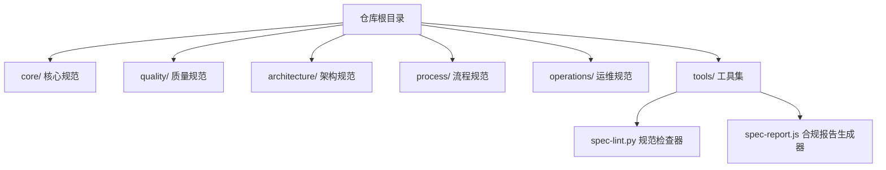
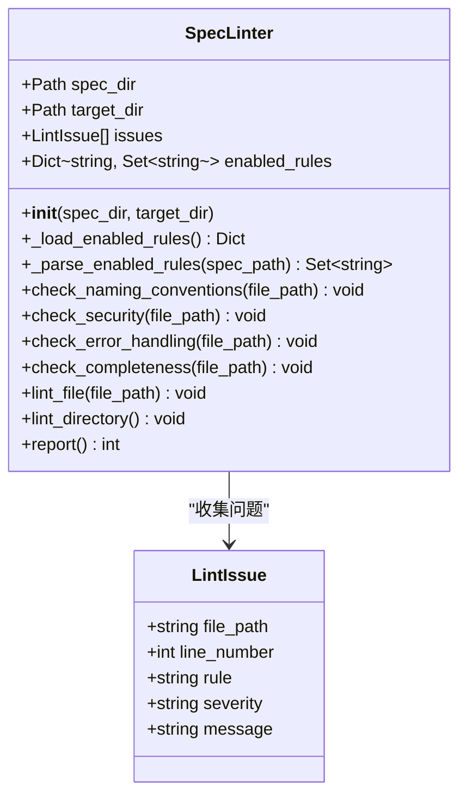
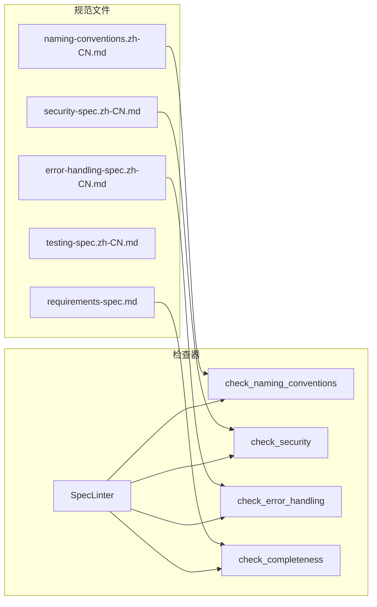

# 规范检查器 (spec-lint.py)

<cite>
**本文引用的文件**
- [tools/spec-lint.py](file://tools/spec-lint.py)
- [README.md](file://README.md)
- [core/naming-conventions.md](file://core/naming-conventions.md)
- [core/naming-conventions.zh-CN.md](file://core/naming-conventions.zh-CN.md)
- [quality/security-spec.zh-CN.md](file://quality/security-spec.zh-CN.md)
- [quality/error-handling-spec.zh-CN.md](file://quality/error-handling-spec.zh-CN.md)
- [quality/testing-spec.zh-CN.md](file://quality/testing-spec.zh-CN.md)
- [core/requirements-spec.md](file://core/requirements-spec.md)
</cite>

## 目录
1. [简介](#简介)
2. [项目结构](#项目结构)
3. [核心组件](#核心组件)
4. [架构总览](#架构总览)
5. [详细组件分析](#详细组件分析)
6. [依赖关系分析](#依赖关系分析)
7. [性能考虑](#性能考虑)
8. [故障排查指南](#故障排查指南)
9. [结论](#结论)
10. [附录](#附录)

## 简介
本文件面向规范检查器（spec-lint.py）的技术文档，聚焦其静态分析机制与违规检测流程。该工具通过加载核心规范文件（如命名约定、安全规范、错误处理、测试规范、需求规范等），解析其中标记为“启用”的规则，对目标代码库执行多维度检查。支持的检查类型包括：
- 命名规范：变量/函数/类/常量/文件命名风格（snake_case/camelCase 等）
- 安全风险：硬编码密钥、敏感配置、空 catch 块等
- 错误处理：空 catch 块、TODO/FIXME 标记等
- 代码完整性：TODO/FIXME 等未完成标记

命令行接口支持两个关键参数：
- --spec-dir：规范文件目录，默认指向 core 目录
- --target-dir：目标检查目录，默认为当前工作目录

工具会在控制台输出分级报告（ERROR/WARNING），并根据是否存在错误决定退出码，便于在 Git Hooks 与 CI/CD 中作为质量门禁使用。

## 项目结构
仓库采用按主题分层的组织方式，核心规范与质量规范分别位于 core 与 quality 目录；工具位于 tools 目录。README 提供了整体使用说明、工作流集成与示例。

图表来源
- [README.md](file://README.md#L1-L60)

章节来源
- [README.md](file://README.md#L1-L60)

## 核心组件
- LintIssue 数据结构：封装单条检查问题，包含文件路径、行号、规则标识、严重程度（ERROR/WARNING/INFO）与消息文本。
- SpecLinter 类：负责加载启用规则、遍历目标目录、逐文件检查并汇总问题，最终输出分级报告。

章节来源
- [tools/spec-lint.py](file://tools/spec-lint.py#L27-L36)
- [tools/spec-lint.py](file://tools/spec-lint.py#L37-L200)

## 架构总览
下面的类图展示了工具的核心类与数据结构之间的关系。

图表来源
- [tools/spec-lint.py](file://tools/spec-lint.py#L27-L200)

## 详细组件分析

### LintIssue 数据结构
- 字段说明
  - file_path：违规所在文件的相对路径
  - line_number：违规所在行号（若不适用，可能为 0）
  - rule：规则标识（如命名约定、安全规则、错误处理规则等）
  - severity：严重程度（ERROR/WARNING/INFO）
  - message：人类可读的问题描述
- 作用：作为检查结果的统一载体，便于后续排序、分组与输出。

章节来源
- [tools/spec-lint.py](file://tools/spec-lint.py#L27-L36)

### 规范加载与规则解析
- 规则来源：工具会扫描指定的规范文件集合，当前包含以下文件名（对应 zh-CN 版本）：
  - requirements-spec.zh-CN.txt
  - naming-conventions.zh-CN.txt
  - error-handling-spec.zh-CN.txt
  - testing-spec.zh-CN.txt
  - security-spec.zh-CN.txt
- 解析逻辑：读取文件内容，使用正则匹配形如“[约定 N]/[规则 N]”且包含“[ENABLED]”的行，提取编号并转换为 RULE_N 的键，加入启用规则集合。
- 重要注意：工具当前以固定文件名列表进行加载，而非动态扫描目录。因此，若规范文件命名或位置发生变化，需要同步更新加载逻辑。

章节来源
- [tools/spec-lint.py](file://tools/spec-lint.py#L46-L81)

### 命名规范检查（check_naming_conventions）
- 适用语言：.ts/.tsx/.js/.jsx/.py
- 检查要点：
  - Python：变量命名应使用 snake_case；若检测到驼峰命名变量，给出 WARNING。
  - JS/TS：变量命名应使用 camelCase；若检测到 snake_case 变量，给出 WARNING。
- 说明：该实现基于正则表达式对变量赋值语句进行简单匹配，属于启发式检查，不涉及 AST 解析。

章节来源
- [tools/spec-lint.py](file://tools/spec-lint.py#L82-L107)
- [core/naming-conventions.md](file://core/naming-conventions.md#L19-L51)
- [core/naming-conventions.zh-CN.md](file://core/naming-conventions.zh-CN.md#L19-L51)

### 安全风险检查（check_security）
- 适用语言：.ts/.tsx/.js/.jsx/.py
- 检查要点：
  - 检测可能硬编码的密钥、密码、令牌等（如 API_KEY、SECRET、PASSWORD、TOKEN 等键名）。
  - 若行中出现上述键名且值为字面量字符串，且不包含 process.env/os.getenv 等环境变量读取，则视为潜在风险，给出 ERROR。
- 说明：该实现基于正则匹配与简单的环境变量排除逻辑，属于启发式扫描。

章节来源
- [tools/spec-lint.py](file://tools/spec-lint.py#L108-L138)
- [quality/security-spec.zh-CN.md](file://quality/security-spec.zh-CN.md#L230-L261)

### 错误处理检查（check_error_handling）
- 适用语言：.ts/.tsx/.js/.jsx/.py
- 检查要点：
  - 检测空 catch 块（catch (...) {}），若命中则给出 ERROR。
- 说明：该实现基于正则匹配，不深入分析 catch 内容，属于启发式检查。

章节来源
- [tools/spec-lint.py](file://tools/spec-lint.py#L139-L159)
- [quality/error-handling-spec.zh-CN.md](file://quality/error-handling-spec.zh-CN.md#L188-L228)

### 代码完整性检查（check_completeness）
- 适用语言：.ts/.tsx/.js/.jsx/.py
- 检查要点：
  - 检测 TODO/FIXME/XXX/HACK 等标记，若命中则给出 WARNING。
- 说明：该实现基于正则匹配，不区分大小写，属于启发式检查。

章节来源
- [tools/spec-lint.py](file://tools/spec-lint.py#L161-L179)
- [core/requirements-spec.md](file://core/requirements-spec.md#L19-L31)

### 文件遍历与过滤策略（lint_directory）
- 扫描范围：递归遍历目标目录下的所有文件
- 语言过滤：仅对 .ts/.tsx/.js/.jsx/.py 文件执行检查
- 目录过滤：跳过 node_modules、dist、build、__pycache__、.venv 等目录
- 逐文件检查：对每个匹配文件依次调用命名、安全、错误处理、完整性检查

章节来源
- [tools/spec-lint.py](file://tools/spec-lint.py#L188-L199)

### 报告与退出码（report）
- 输出内容：
  - 若无问题：打印“所有检查通过”
  - 若有问题：按严重程度分组统计（ERROR/WARNING），并按文件分组输出每条问题
- 退出码：
  - 0：无 ERROR
  - 1：存在 ERROR

章节来源
- [tools/spec-lint.py](file://tools/spec-lint.py#L200-L229)

### 命令行接口（main）
- 参数
  - --spec-dir：规范文件目录，默认为 ../core
  - --target-dir：目标检查目录，默认为当前目录
- 行为
  - 校验目录存在性
  - 初始化 SpecLinter 并执行 lint_directory
  - 输出报告并返回退出码

章节来源
- [tools/spec-lint.py](file://tools/spec-lint.py#L231-L269)
- [README.md](file://README.md#L148-L179)

## 依赖关系分析
- 规范文件与检查规则的映射
  - 命名规范：CONVENTION 1（变量命名）与 RULE_1（TODO/FIXME）等
  - 安全规范：RULE 8（安全配置管理，不硬编码密钥）
  - 错误处理规范：RULE 5（Try-Catch 最佳实践，空 catch 块）
  - 测试规范：与检查无关，但可作为项目规范的一部分
  - 需求规范：RULE 1（生成完整可运行代码，无 TODO）

图表来源
- [tools/spec-lint.py](file://tools/spec-lint.py#L82-L179)
- [core/naming-conventions.md](file://core/naming-conventions.md#L19-L51)
- [quality/security-spec.zh-CN.md](file://quality/security-spec.zh-CN.md#L230-L261)
- [quality/error-handling-spec.zh-CN.md](file://quality/error-handling-spec.zh-CN.md#L188-L228)
- [core/requirements-spec.md](file://core/requirements-spec.md#L19-L31)

## 性能考虑
- 文件扫描策略
  - 当前实现对目标目录进行递归扫描，且对每个文件都执行多次正则匹配与行级遍历。对于大型仓库，建议：
    - 使用更精确的目录过滤（如仅检查 src、lib 等关键目录）
    - 在 CI 中结合增量检查策略（仅检查最近改动的文件）
- 正则匹配复杂度
  - 命名与完整性检查使用行级正则，复杂度近似 O(N)，N 为文件行数。建议：
    - 对大文件进行分块处理或限制最大文件大小
    - 避免过于复杂的正则，必要时拆分为多个简单规则
- I/O 与编码
  - 工具以 UTF-8 打开文件，若目标代码库存在非 UTF-8 编码文件，可能导致读取异常。建议：
    - 统一项目编码为 UTF-8
    - 在 CI 中预检查编码一致性

[本节为通用性能建议，不直接分析具体文件，故无章节来源]

## 故障排查指南
- Python 环境依赖缺失
  - 现状：工具仅使用标准库（argparse、pathlib、re、sys、os、typing、dataclasses），无需额外依赖
  - 建议：确认 Python 版本满足工具要求（Python 3.x）
- 规范文件路径错误
  - 现状：工具以固定文件名列表加载规范，若规范文件不在 --spec-dir 下或命名不匹配，将不会被加载
  - 建议：确保规范文件位于 core 目录下，且文件名为 requirements-spec.zh-CN.txt、naming-conventions.zh-CN.txt、error-handling-spec.zh-CN.txt、testing-spec.zh-CN.txt、security-spec.zh-CN.txt
- 编码问题
  - 现状：工具以 UTF-8 打开文件
  - 建议：确保规范文件与目标代码库均为 UTF-8 编码
- 目标目录不存在
  - 现象：工具会输出错误并返回非零退出码
  - 建议：确认 --target-dir 指向有效目录
- Git Hooks 集成失败
  - 现象：pre-commit 钩子返回非零退出码导致提交被阻止
  - 建议：在本地修复问题后再提交，或在 CI 中查看报告定位问题

章节来源
- [tools/spec-lint.py](file://tools/spec-lint.py#L231-L269)
- [README.md](file://README.md#L253-L294)

## 结论
spec-lint.py 通过“启用规则解析 + 启发式静态检查”的方式，为项目提供了轻量、可集成的质量门禁能力。其优势在于：
- 与规范文件强绑定，便于团队统一标准
- 命令行简单、易于在 Git Hooks 与 CI/CD 中使用
- 报告分级明确，便于快速定位问题

局限与改进建议：
- 规则加载为固定文件名列表，不够灵活；建议支持动态扫描或配置文件
- 检查多为正则启发式，准确性有限；建议引入 AST 解析以提升精度
- 增量检查与缓存机制尚未实现；建议在 CI 中结合文件变更集进行增量扫描

[本节为总结性内容，不直接分析具体文件，故无章节来源]

## 附录

### 命令行使用示例
- 检查当前目录
  - python tools/spec-lint.py
- 指定规范目录与目标目录
  - python tools/spec-lint.py --spec-dir ./core --target-dir ./src

章节来源
- [README.md](file://README.md#L148-L165)

### Git Hooks 与 CI/CD 集成
- Git Hooks（pre-commit）
  - 在 .git/hooks/pre-commit 中添加：python tools/spec-lint.py；若返回非零退出码则阻止提交
- CI/CD（GitHub Actions）
  - 在工作流中添加步骤运行 python tools/spec-lint.py，并可选生成合规报告

章节来源
- [README.md](file://README.md#L253-L294)

### 检查类型与规则映射
- 命名规范
  - 变量命名：CONVENTION 1（Python snake_case；JS/TS camelCase）
- 安全规范
  - 不硬编码密钥：RULE 8（安全配置管理）
- 错误处理
  - 空 catch 块：RULE 5（Try-Catch 最佳实践）
- 代码完整性
  - TODO/FIXME：RULE 1（生成完整可运行代码）

章节来源
- [core/naming-conventions.md](file://core/naming-conventions.md#L19-L51)
- [quality/security-spec.zh-CN.md](file://quality/security-spec.zh-CN.md#L230-L261)
- [quality/error-handling-spec.zh-CN.md](file://quality/error-handling-spec.zh-CN.md#L188-L228)
- [core/requirements-spec.md](file://core/requirements-spec.md#L19-L31)