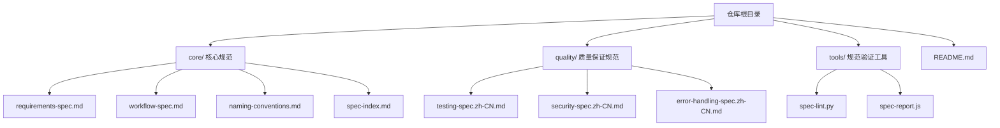
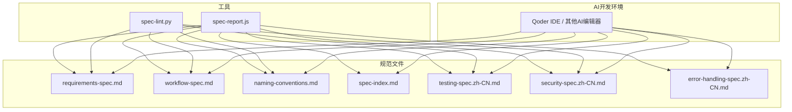
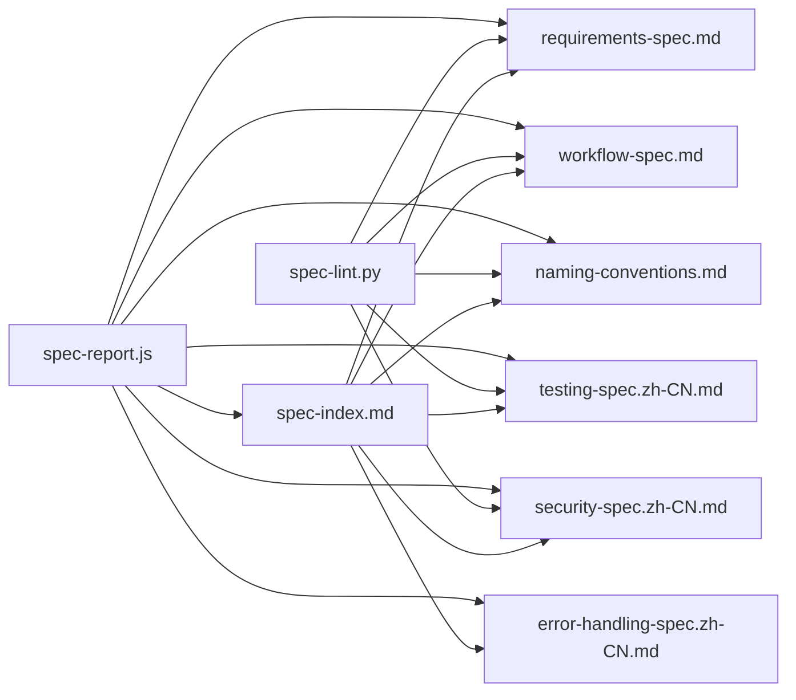

# 快速开始

<cite>
**本文引用的文件**
- [README.md](file://README.md)
- [spec-lint.py](file://tools/spec-lint.py)
- [spec-report.js](file://tools/spec-report.js)
- [requirements-spec.md](file://core/requirements-spec.md)
- [workflow-spec.md](file://core/workflow-spec.md)
- [naming-conventions.md](file://core/naming-conventions.md)
- [testing-spec.zh-CN.md](file://quality/testing-spec.zh-CN.md)
- [security-spec.zh-CN.md](file://quality/security-spec.zh-CN.md)
- [error-handling-spec.zh-CN.md](file://quality/error-handling-spec.zh-CN.md)
- [spec-index.md](file://core/spec-index.md)
</cite>

## 目录
1. [简介](#简介)
2. [项目结构](#项目结构)
3. [核心组件](#核心组件)
4. [架构总览](#架构总览)
5. [详细组件分析](#详细组件分析)
6. [依赖关系分析](#依赖关系分析)
7. [性能与使用建议](#性能与使用建议)
8. [故障排查指南](#故障排查指南)
9. [结论](#结论)
10. [附录](#附录)

## 简介
本指南面向新手开发者，帮助你在5分钟内完成从克隆仓库到在AI开发环境中应用qoder-rules-main规范系统的全流程。你将学会：
- 如何下载规范文件（单个或全部）
- 如何把规范集成到本地项目中
- 如何在Qoder IDE或其他AI编辑器中正确引用规范（使用@符号）
- 如何基于规范生成符合命名约定的变量或遵循工作流规范的函数结构
- 如何运行工具进行初步检查（例如执行spec-lint.py验证代码合规性）
- 环境准备要求（Python与Node.js）

## 项目结构
qoder-rules-main采用“按主题分层”的组织方式，核心规范位于core目录，质量保证规范位于quality目录，工具位于tools目录，README提供快速开始与使用示例。

图表来源
- [README.md](file://README.md#L1-L40)
- [requirements-spec.md](file://core/requirements-spec.md#L1-L20)
- [workflow-spec.md](file://core/workflow-spec.md#L1-L20)
- [naming-conventions.md](file://core/naming-conventions.md#L1-L20)
- [testing-spec.zh-CN.md](file://quality/testing-spec.zh-CN.md#L1-L20)
- [security-spec.zh-CN.md](file://quality/security-spec.zh-CN.md#L1-L20)
- [error-handling-spec.zh-CN.md](file://quality/error-handling-spec.zh-CN.md#L1-L20)
- [spec-index.md](file://core/spec-index.md#L1-L20)
- [spec-lint.py](file://tools/spec-lint.py#L1-L20)
- [spec-report.js](file://tools/spec-report.js#L1-L20)

章节来源
- [README.md](file://README.md#L1-L40)

## 核心组件
- 核心规范（必需）
  - 开发需求规范：确保代码完整、可运行、API存在、编译通过、使用真实库等关键规则
  - 工作流规范：变更日志、版本号管理、文档同步、破坏性变更协议、依赖更新策略、错误处理标准
  - 命名约定：变量、函数、类、常量、文件、环境变量等命名风格
  - 中央索引：集中管理模块开关、全局配置、项目类型配置与依赖关系
- 质量保证规范（推荐）
  - 测试规范：测试完整性、覆盖率目标、测试分层、Mock规范、命名约定、数据管理、边界条件、隔离性、性能要求
  - 安全规范：输入验证与清理、认证与授权、敏感数据保护、依赖安全管理、OWASP Top 10防护、日志安全、API安全、配置管理、会话安全、文件上传安全、错误处理安全
  - 错误处理规范：错误分类、自定义错误类、日志记录、用户友好提示、Try-Catch最佳实践、恢复策略、全局错误处理器、前端错误边界、监控告警、错误码标准化、超时与限流、错误文档化
- 工具
  - 规范检查工具：扫描代码并输出问题清单
  - 合规报告生成器：统计启用规则、覆盖率、代码统计并输出报告

章节来源
- [README.md](file://README.md#L75-L115)
- [requirements-spec.md](file://core/requirements-spec.md#L1-L40)
- [workflow-spec.md](file://core/workflow-spec.md#L1-L40)
- [naming-conventions.md](file://core/naming-conventions.md#L1-L40)
- [testing-spec.zh-CN.md](file://quality/testing-spec.zh-CN.md#L1-L40)
- [security-spec.zh-CN.md](file://quality/security-spec.zh-CN.md#L1-L40)
- [error-handling-spec.zh-CN.md](file://quality/error-handling-spec.zh-CN.md#L1-L40)
- [spec-index.md](file://core/spec-index.md#L1-L40)
- [spec-lint.py](file://tools/spec-lint.py#L1-L40)
- [spec-report.js](file://tools/spec-report.js#L1-L40)

## 架构总览
下图展示了规范文件与工具之间的关系，以及在AI开发环境中的引用方式。

图表来源
- [requirements-spec.md](file://core/requirements-spec.md#L1-L20)
- [workflow-spec.md](file://core/workflow-spec.md#L1-L20)
- [naming-conventions.md](file://core/naming-conventions.md#L1-L20)
- [spec-index.md](file://core/spec-index.md#L1-L20)
- [testing-spec.zh-CN.md](file://quality/testing-spec.zh-CN.md#L1-L20)
- [security-spec.zh-CN.md](file://quality/security-spec.zh-CN.md#L1-L20)
- [error-handling-spec.zh-CN.md](file://quality/error-handling-spec.zh-CN.md#L1-L20)
- [spec-lint.py](file://tools/spec-lint.py#L1-L20)
- [spec-report.js](file://tools/spec-report.js#L1-L20)

## 详细组件分析

### 快速开始：从克隆到首次应用
- 步骤1：克隆仓库并进入目录
  - 参考：[README.md](file://README.md#L41-L51)
- 步骤2：在Qoder IDE中使用规范
  - 将核心规范复制到项目的.qoder/rules目录
  - 参考：[README.md](file://README.md#L52-L63)
- 步骤3：在AI对话中引用规范
  - 使用@符号引用规范文件，例如@core/requirements-spec.zh-CN.md
  - 参考：[README.md](file://README.md#L63-L74)

章节来源
- [README.md](file://README.md#L41-L74)

### 命名约定：生成符合规范的变量与函数
- 变量命名：根据语言选择camelCase或snake_case，并保持描述性
  - 参考：[naming-conventions.md](file://core/naming-conventions.md#L19-L51)
- 函数命名：使用动词或动词短语，布尔函数以is/has/can/should开头
  - 参考：[naming-conventions.md](file://core/naming-conventions.md#L53-L87)
- 常量命名：使用UPPER_SNAKE_CASE
  - 参考：[naming-conventions.md](file://core/naming-conventions.md#L117-L151)
- 文件命名：kebab-case（JS/TS）或snake_case（Python），测试文件使用.test或.spec后缀
  - 参考：[naming-conventions.md](file://core/naming-conventions.md#L153-L187)
- 环境变量命名：UPPER_SNAKE_CASE，带明确前缀
  - 参考：[naming-conventions.md](file://core/naming-conventions.md#L276-L301)

章节来源
- [naming-conventions.md](file://core/naming-conventions.md#L19-L187)
- [naming-conventions.md](file://core/naming-conventions.md#L276-L301)

### 工作流规范：遵循发布与协作流程
- 变更日志管理：在CHANGELOG中记录重大变更
  - 参考：[workflow-spec.md](file://core/workflow-spec.md#L19-L41)
- 版本号管理：遵循语义化版本（MAJOR.MINOR.PATCH）
  - 参考：[workflow-spec.md](file://core/workflow-spec.md#L49-L67)
- 文档同步：代码变更后及时更新相关文档
  - 参考：[workflow-spec.md](file://core/workflow-spec.md#L140-L163)
- 破坏性变更协议：清晰记录并提供迁移指南
  - 参考：[workflow-spec.md](file://core/workflow-spec.md#L202-L225)
- 依赖更新策略：定期审计、固定版本、安全优先
  - 参考：[workflow-spec.md](file://core/workflow-spec.md#L228-L251)
- 错误处理标准：一致的错误处理与日志记录
  - 参考：[workflow-spec.md](file://core/workflow-spec.md#L278-L311)

章节来源
- [workflow-spec.md](file://core/workflow-spec.md#L19-L67)
- [workflow-spec.md](file://core/workflow-spec.md#L140-L163)
- [workflow-spec.md](file://core/workflow-spec.md#L202-L251)
- [workflow-spec.md](file://core/workflow-spec.md#L278-L311)

### 开发需求规范：确保代码完整与可运行
- 生成完整可运行代码：无TODO、无占位符
  - 参考：[requirements-spec.md](file://core/requirements-spec.md#L19-L31)
- 复用现有接口与API：不重复造轮子
  - 参考：[requirements-spec.md](file://core/requirements-spec.md#L47-L67)
- 最小化新增依赖：优先使用现有依赖
  - 参考：[requirements-spec.md](file://core/requirements-spec.md#L68-L86)
- 验证所有API存在：使用确认可用的API
  - 参考：[requirements-spec.md](file://core/requirements-spec.md#L117-L136)
- 确保代码成功编译：交付前必须可编译运行
  - 参考：[requirements-spec.md](file://core/requirements-spec.md#L170-L181)
- 使用真实存在的库：仅导入实际存在的库
  - 参考：[requirements-spec.md](file://core/requirements-spec.md#L198-L216)

章节来源
- [requirements-spec.md](file://core/requirements-spec.md#L19-L31)
- [requirements-spec.md](file://core/requirements-spec.md#L47-L67)
- [requirements-spec.md](file://core/requirements-spec.md#L68-L86)
- [requirements-spec.md](file://core/requirements-spec.md#L117-L136)
- [requirements-spec.md](file://core/requirements-spec.md#L170-L181)
- [requirements-spec.md](file://core/requirements-spec.md#L198-L216)

### 质量保证规范：测试、安全与错误处理
- 测试规范
  - 测试完整性、覆盖率目标、测试分层、Mock规范、命名约定、数据管理、边界条件、隔离性、性能要求
  - 参考：[testing-spec.zh-CN.md](file://quality/testing-spec.zh-CN.md#L19-L120)
- 安全规范
  - 输入验证与清理、认证与授权、敏感数据保护、依赖安全管理、OWASP Top 10防护、日志安全、API安全、配置管理、会话安全、文件上传安全、错误处理安全
  - 参考：[security-spec.zh-CN.md](file://quality/security-spec.zh-CN.md#L19-L120)
- 错误处理规范
  - 错误分类、自定义错误类、日志记录、用户友好提示、Try-Catch最佳实践、恢复策略、全局错误处理器、前端错误边界、监控告警、错误码标准化、超时与限流、错误文档化
  - 参考：[error-handling-spec.zh-CN.md](file://quality/error-handling-spec.zh-CN.md#L19-L120)

章节来源
- [testing-spec.zh-CN.md](file://quality/testing-spec.zh-CN.md#L19-L120)
- [security-spec.zh-CN.md](file://quality/security-spec.zh-CN.md#L19-L120)
- [error-handling-spec.zh-CN.md](file://quality/error-handling-spec.zh-CN.md#L19-L120)

### 工具使用：初步检查与合规报告
- 规范检查（spec-lint.py）
  - 检查当前目录或指定目录，输出问题清单（错误/警告）
  - 参考：[README.md](file://README.md#L150-L179)，[spec-lint.py](file://tools/spec-lint.py#L231-L269)
- 合规报告（spec-report.js）
  - 生成项目遵守规范的详细报告，包含启用规则、覆盖率、代码统计等
  - 参考：[README.md](file://README.md#L166-L194)，[spec-report.js](file://tools/spec-report.js#L1-L64)

章节来源
- [README.md](file://README.md#L150-L194)
- [spec-lint.py](file://tools/spec-lint.py#L231-L269)
- [spec-report.js](file://tools/spec-report.js#L1-L64)

### 在AI编辑器中引用规范
- 在Qoder IDE或其他AI编辑器中，使用@符号引用规范文件
  - 示例：@core/requirements-spec.zh-CN.md、@quality/testing-spec.zh-CN.md、@architecture/alibaba-cloud-ai-spec.zh-CN.md
  - 参考：[README.md](file://README.md#L63-L74)

章节来源
- [README.md](file://README.md#L63-L74)

### 基础使用示例
- 生成符合规范的登录页面
  - 引用：@core/requirements-spec.zh-CN.md、@quality/security-spec.zh-CN.md、@quality/error-handling-spec.zh-CN.md
  - 参考：[README.md](file://README.md#L212-L227)
- 基于阿里云AI构建应用
  - 引用：@architecture/alibaba-cloud-ai-spec.zh-CN.md、@core/requirements-spec.zh-CN.md
  - 参考：[README.md](file://README.md#L228-L239)
- 为UserService类生成单元测试
  - 引用：@quality/testing-spec.zh-CN.md、@core/naming-conventions.zh-CN.md
  - 参考：[README.md](file://README.md#L241-L252)

章节来源
- [README.md](file://README.md#L212-L252)

## 依赖关系分析
- 中央索引（spec-index.md）集中管理模块开关、全局配置与项目类型配置，便于在AI对话中统一引用多个规范
- 工具（spec-lint.py、spec-report.js）依赖核心规范文件，扫描代码并生成报告
- 质量保证规范相互关联：测试规范与命名约定、安全规范与错误处理规范、安全规范与工作流规范等

图表来源
- [spec-index.md](file://core/spec-index.md#L1-L40)
- [requirements-spec.md](file://core/requirements-spec.md#L1-L20)
- [workflow-spec.md](file://core/workflow-spec.md#L1-L20)
- [naming-conventions.md](file://core/naming-conventions.md#L1-L20)
- [testing-spec.zh-CN.md](file://quality/testing-spec.zh-CN.md#L1-L20)
- [security-spec.zh-CN.md](file://quality/security-spec.zh-CN.md#L1-L20)
- [error-handling-spec.zh-CN.md](file://quality/error-handling-spec.zh-CN.md#L1-L20)
- [spec-lint.py](file://tools/spec-lint.py#L1-L20)
- [spec-report.js](file://tools/spec-report.js#L1-L20)

章节来源
- [spec-index.md](file://core/spec-index.md#L1-L40)
- [spec-lint.py](file://tools/spec-lint.py#L1-L20)
- [spec-report.js](file://tools/spec-report.js#L1-L20)

## 性能与使用建议
- 使用工具进行初步检查，有助于在早期发现命名、安全、错误处理等问题，避免后期返工
- 在CI/CD中集成规范检查与合规报告，形成持续治理闭环
- 逐步启用质量保证规范，优先关注测试完整性、覆盖率与安全防护

[本节为通用建议，无需列出章节来源]

## 故障排查指南
- 规范检查失败
  - 确认目标目录存在且可读
  - 检查规范目录是否正确（默认core）
  - 参考：[spec-lint.py](file://tools/spec-lint.py#L231-L269)
- 合规报告输出为空或不完整
  - 确认目标目录包含代码文件（.ts/.tsx/.js/.jsx/.py）
  - 确认覆盖率报告路径是否存在（coverage-summary.json）
  - 参考：[spec-report.js](file://tools/spec-report.js#L1-L64)

章节来源
- [spec-lint.py](file://tools/spec-lint.py#L231-L269)
- [spec-report.js](file://tools/spec-report.js#L1-L64)

## 结论
通过本指南，你可以在5分钟内完成qoder-rules-main规范系统的首次应用体验：克隆仓库、复制核心规范到项目、在AI编辑器中引用规范、生成符合命名约定的变量与函数结构，并使用工具进行初步检查与合规报告生成。建议逐步启用质量保证规范，结合CI/CD持续改进代码质量与安全性。

[本节为总结，无需列出章节来源]

## 附录

### 环境准备
- Python：用于运行规范检查工具
  - 参考：[README.md](file://README.md#L150-L179)，[spec-lint.py](file://tools/spec-lint.py#L1-L20)
- Node.js：用于运行合规报告生成器
  - 参考：[README.md](file://README.md#L166-L194)，[spec-report.js](file://tools/spec-report.js#L1-L20)

### 下载与集成要点
- 下载规范文件
  - 克隆仓库后，将核心规范复制到项目.qoder/rules目录
  - 参考：[README.md](file://README.md#L41-L63)
- 在AI编辑器中引用
  - 使用@符号引用规范文件
  - 参考：[README.md](file://README.md#L63-L74)

章节来源
- [README.md](file://README.md#L41-L74)
- [spec-lint.py](file://tools/spec-lint.py#L1-L20)
- [spec-report.js](file://tools/spec-report.js#L1-L20)