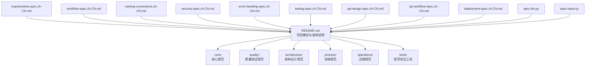
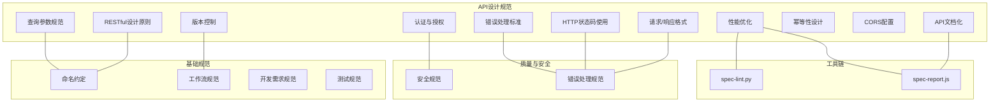
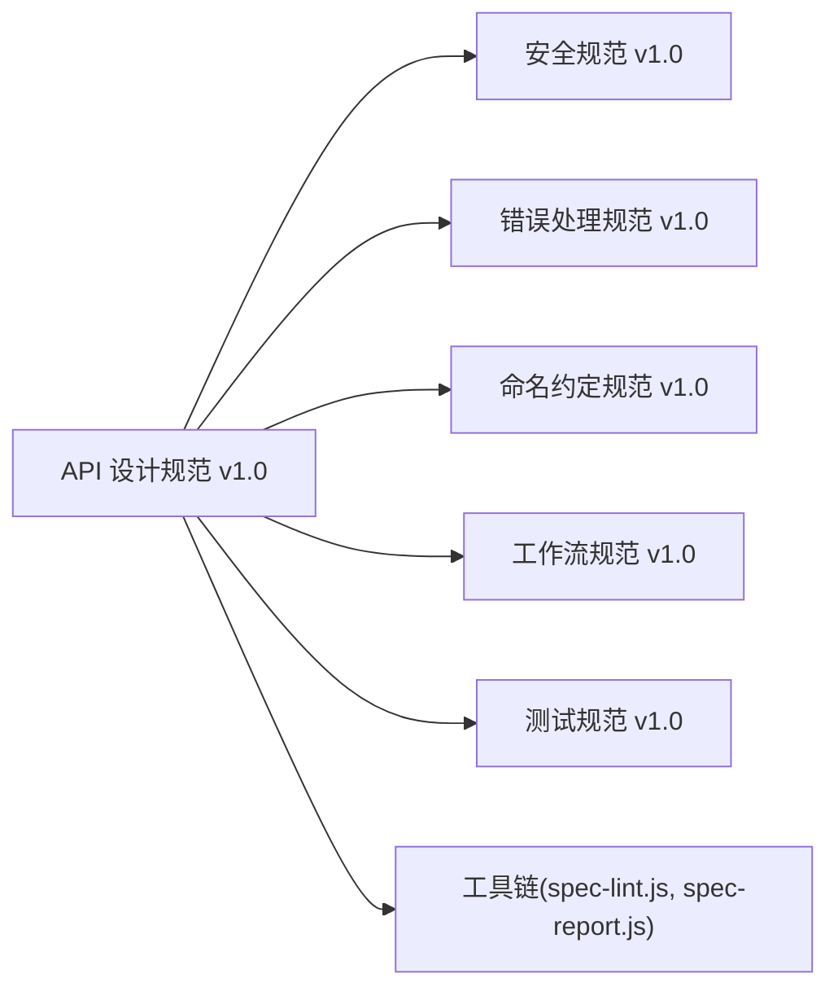

# API设计规范

<cite>
**本文引用的文件**
- [README.md](file://README.md)
- [API 设计规范 v1.0](file://architecture/api-design-spec.zh-CN.md)
- [安全规范 v1.0](file://quality/security-spec.zh-CN.md)
- [错误处理规范 v1.0](file://quality/error-handling-spec.zh-CN.md)
- [命名约定规范 v1.0](file://core/naming-conventions.zh-CN.md)
- [开发需求规范 v1.1](file://core/requirements-spec.zh-CN.md)
- [工作流规范 v1.0](file://core/workflow-spec.zh-CN.md)
- [测试规范 v1.0](file://quality/testing-spec.zh-CN.md)
- [spec-lint.py](file://tools/spec-lint.py)
- [spec-report.js](file://tools/spec-report.js)
</cite>

## 目录
1. [简介](#简介)
2. [项目结构](#项目结构)
3. [核心组件](#核心组件)
4. [架构总览](#架构总览)
5. [详细组件分析](#详细组件分析)
6. [依赖分析](#依赖分析)
7. [性能考虑](#性能考虑)
8. [故障排查指南](#故障排查指南)
9. [结论](#结论)
10. [附录](#附录)

## 简介
本规范文档系统化阐述RESTful设计原则、版本控制、请求响应格式、HTTP状态码使用、查询参数规范、认证授权机制、错误处理标准、API文档化、幂等性设计、CORS配置和性能优化等关键实践。结合仓库中的API设计规范、安全规范、错误处理规范、命名约定、工作流与测试规范，形成一套可落地、可审计、可扩展的API设计与实施指南。文档同时给出面向Web应用、微服务和公共API的不同配置策略，并提供与规范工具链的集成方法。

## 项目结构
仓库采用“规范分层”的组织方式，核心规范（requirements、workflow、naming-conventions）与质量规范（security、error-handling、testing）、架构规范（api-design）和运维/流程/工具等模块协同工作，形成“需求—流程—质量—架构—工具”的闭环。

图表来源
- [README.md](file://README.md#L1-L120)

章节来源
- [README.md](file://README.md#L1-L120)

## 核心组件
- RESTful设计原则：统一资源抽象、HTTP方法语义化、URL层次化、资源命名与集合复数化。
- 版本控制：URL中显式版本号（整数），主版本变更时升级，保持向后兼容与废弃通知。
- 请求与响应格式：统一JSON结构（data/error/meta），时间ISO 8601，分页参数page/limit/offset。
- HTTP状态码使用：2xx/4xx/5xx分类与典型场景映射。
- 查询参数规范：分页、排序、过滤、搜索、字段选择、关联展开等统一命名。
- 认证与授权：JWT/OAuth、API密钥、HTTPS、速率限制、敏感操作二次验证。
- 错误处理标准：标准化错误码、用户友好消息、错误详情与建议、生产环境不暴露堆栈。
- API文档化：OpenAPI/Swagger，包含端点、参数、响应、示例与交互测试。
- 幂等性设计：GET/PUT/DELETE幂等、POST幂等键、乐观锁、操作去重。
- CORS配置：白名单域名、允许方法、允许头、凭证支持、预检缓存。
- 性能优化：ETag/Cache-Control、字段过滤、分页、压缩、批量端点。

章节来源
- [API 设计规范 v1.0](file://architecture/api-design-spec.zh-CN.md#L20-L120)
- [API 设计规范 v1.0](file://architecture/api-design-spec.zh-CN.md#L149-L203)
- [API 设计规范 v1.0](file://architecture/api-design-spec.zh-CN.md#L205-L227)
- [API 设计规范 v1.0](file://architecture/api-design-spec.zh-CN.md#L229-L274)
- [API 设计规范 v1.0](file://architecture/api-design-spec.zh-CN.md#L276-L324)
- [API 设计规范 v1.0](file://architecture/api-design-spec.zh-CN.md#L326-L374)
- [API 设计规范 v1.0](file://architecture/api-design-spec.zh-CN.md#L375-L427)
- [API 设计规范 v1.0](file://architecture/api-design-spec.zh-CN.md#L472-L499)
- [API 设计规范 v1.0](file://architecture/api-design-spec.zh-CN.md#L501-L539)

## 架构总览
下图展示API设计规范与安全、错误处理、命名约定、工作流、测试等规范的集成关系，以及与工具链的联动。

图表来源
- [API 设计规范 v1.0](file://architecture/api-design-spec.zh-CN.md#L565-L573)
- [安全规范 v1.0](file://quality/security-spec.zh-CN.md#L392-L398)
- [错误处理规范 v1.0](file://quality/error-handling-spec.zh-CN.md#L547-L553)
- [命名约定规范 v1.0](file://core/naming-conventions.zh-CN.md#L246-L275)
- [工作流规范 v1.0](file://core/workflow-spec.zh-CN.md#L140-L163)
- [开发需求规范 v1.1](file://core/requirements-spec.zh-CN.md#L1-L60)
- [测试规范 v1.0](file://quality/testing-spec.zh-CN.md#L1-L40)
- [spec-lint.py](file://tools/spec-lint.py#L1-L120)
- [spec-report.js](file://tools/spec-report.js#L1-L120)

## 详细组件分析

### RESTful设计原则
- 资源命名：使用名词、集合复数化、层次化URL反映资源关系。
- HTTP方法：GET/POST/PUT/PATCH/DELETE分别对应读取、创建、完整更新、部分更新、删除。
- 状态码：按2xx/4xx/5xx分类，典型场景明确映射。

章节来源
- [API 设计规范 v1.0](file://architecture/api-design-spec.zh-CN.md#L20-L49)

### 版本控制
- URL中包含整数版本号（/v1/、/v2/），主要版本变更时升级。
- 保持旧版本向后兼容一段时间，并提前通知废弃计划。

章节来源
- [API 设计规范 v1.0](file://architecture/api-design-spec.zh-CN.md#L51-L88)
- [工作流规范 v1.0](file://core/workflow-spec.zh-CN.md#L19-L41)

### 请求与响应格式
- 统一JSON结构：data、error、meta三段式。
- 时间使用ISO 8601，分页参数page/limit/offset。
- 错误响应包含code/message/field/details/suggestion等字段。

章节来源
- [API 设计规范 v1.0](file://architecture/api-design-spec.zh-CN.md#L90-L147)
- [错误处理规范 v1.0](file://quality/error-handling-spec.zh-CN.md#L438-L480)

### HTTP状态码使用
- 2xx：200/201/204等。
- 4xx：400/401/403/404/409/422等。
- 5xx：500/503等。

章节来源
- [API 设计规范 v1.0](file://architecture/api-design-spec.zh-CN.md#L149-L203)

### 查询参数规范
- 分页：page、limit、offset。
- 排序：sort（field:asc/desc）。
- 过滤：字段直传。
- 搜索：q或search。
- 字段选择：fields（逗号分隔）。
- 关联资源：include或expand。
- 日期范围：createdAt[gte]/[lte]等。

章节来源
- [API 设计规范 v1.0](file://architecture/api-design-spec.zh-CN.md#L205-L227)
- [命名约定规范 v1.0](file://core/naming-conventions.zh-CN.md#L246-L275)

### 认证与授权
- 使用JWT或OAuth 2.0认证，API密钥用于服务间调用。
- HTTPS传输，实施速率限制，敏感操作需二次验证（MFA）。
- 速率限制示例与JWT中间件示例。

章节来源
- [API 设计规范 v1.0](file://architecture/api-design-spec.zh-CN.md#L229-L274)
- [安全规范 v1.0](file://quality/security-spec.zh-CN.md#L206-L228)

### 错误处理标准
- 标准化错误码、用户友好提示、错误详情与建议。
- 生产环境不暴露堆栈，记录错误日志。
- 全局错误处理中间件示例。

章节来源
- [API 设计规范 v1.0](file://architecture/api-design-spec.zh-CN.md#L276-L324)
- [错误处理规范 v1.0](file://quality/error-handling-spec.zh-CN.md#L1-L69)

### API文档化
- 使用OpenAPI/Swagger规范，包含端点、参数、响应、示例。
- 文档与代码同步更新，提供交互式测试界面。

章节来源
- [API 设计规范 v1.0](file://architecture/api-design-spec.zh-CN.md#L326-L374)
- [工作流规范 v1.0](file://core/workflow-spec.zh-CN.md#L140-L163)

### 幂等性设计
- GET/PUT/DELETE幂等；POST使用幂等键避免重复创建。
- 乐观锁处理并发更新；提供操作去重机制。

章节来源
- [API 设计规范 v1.0](file://architecture/api-design-spec.zh-CN.md#L375-L427)

### CORS配置
- 配置允许的域名白名单、允许的方法、允许的请求头、凭证支持、预检缓存时间。
- 示例展示生产与开发环境差异。

章节来源
- [API 设计规范 v1.0](file://architecture/api-design-spec.zh-CN.md#L472-L499)

### 性能优化
- 响应缓存：ETag、Cache-Control。
- 字段过滤减少传输数据。
- 分页避免大数据集。
- 压缩（gzip）。
- 批量端点减少请求次数。

章节来源
- [API 设计规范 v1.0](file://architecture/api-design-spec.zh-CN.md#L501-L539)

### 项目类型配置策略
- Web应用（后端API）：启用RESTful、版本控制、认证授权、错误处理、CORS、性能优化；可选批量操作与文档化。
- 微服务API：启用版本控制、幂等性、性能优化；可选查询参数、文档化、批量与CORS。
- 公共API/SDK：启用RESTful、版本控制、认证授权、错误处理、CORS、性能优化；可选批量与文档化。

章节来源
- [API 设计规范 v1.0](file://architecture/api-design-spec.zh-CN.md#L541-L560)

## 依赖分析
API设计规范与安全、错误处理、命名约定、工作流、测试等规范存在明确的依赖关系与集成点：
- API认证授权遵循安全规范。
- API错误响应遵循错误处理规范。
- API端点命名遵循命名约定。
- API文档与工作流规范保持同步。
- 规范工具链（lint/report）保障落地执行。

图表来源
- [API 设计规范 v1.0](file://architecture/api-design-spec.zh-CN.md#L565-L573)
- [安全规范 v1.0](file://quality/security-spec.zh-CN.md#L392-L398)
- [错误处理规范 v1.0](file://quality/error-handling-spec.zh-CN.md#L547-L553)
- [命名约定规范 v1.0](file://core/naming-conventions.zh-CN.md#L246-L275)
- [工作流规范 v1.0](file://core/workflow-spec.zh-CN.md#L140-L163)
- [测试规范 v1.0](file://quality/testing-spec.zh-CN.md#L333-L339)
- [spec-lint.py](file://tools/spec-lint.py#L1-L120)
- [spec-report.js](file://tools/spec-report.js#L1-L120)

章节来源
- [API 设计规范 v1.0](file://architecture/api-design-spec.zh-CN.md#L565-L573)
- [安全规范 v1.0](file://quality/security-spec.zh-CN.md#L392-L398)
- [错误处理规范 v1.0](file://quality/error-handling-spec.zh-CN.md#L547-L553)
- [命名约定规范 v1.0](file://core/naming-conventions.zh-CN.md#L246-L275)
- [工作流规范 v1.0](file://core/workflow-spec.zh-CN.md#L140-L163)
- [测试规范 v1.0](file://quality/testing-spec.zh-CN.md#L333-L339)
- [spec-lint.py](file://tools/spec-lint.py#L1-L120)
- [spec-report.js](file://tools/spec-report.js#L1-L120)

## 性能考虑
- 缓存策略：ETag与Cache-Control配合，304响应减少带宽。
- 压缩：开启gzip压缩，降低传输体积。
- 字段过滤：按需返回字段，避免冗余数据。
- 分页：page/limit/offset控制数据规模。
- 批量端点：减少往返次数，提升吞吐。
- 速率限制：防止滥用与DoS，保护后端资源。

章节来源
- [API 设计规范 v1.0](file://architecture/api-design-spec.zh-CN.md#L501-L539)
- [安全规范 v1.0](file://quality/security-spec.zh-CN.md#L206-L228)

## 故障排查指南
- 错误分类：业务/系统/第三方/客户端/服务端错误，便于差异化处理。
- 自定义错误类：继承标准Error，包含错误码、元数据与原始错误。
- 全局错误处理：Express中间件、Promise未处理拒绝、进程未捕获异常。
- 错误监控与告警：集成Sentry等监控服务，上报关键错误与上下文。
- 超时与限流：对外部调用设置超时，API实施速率限制。
- 日志记录：区分业务/系统/关键错误日志级别，避免敏感信息泄露。

章节来源
- [错误处理规范 v1.0](file://quality/error-handling-spec.zh-CN.md#L1-L113)
- [错误处理规范 v1.0](file://quality/error-handling-spec.zh-CN.md#L278-L339)
- [错误处理规范 v1.0](file://quality/error-handling-spec.zh-CN.md#L402-L435)
- [错误处理规范 v1.0](file://quality/error-handling-spec.zh-CN.md#L481-L512)
- [安全规范 v1.0](file://quality/security-spec.zh-CN.md#L182-L204)

## 结论
本规范以API设计为核心，融合安全、错误处理、命名约定、工作流与测试等规范，形成统一的API设计与实施标准。通过工具链保障落地执行，面向Web应用、微服务与公共API提供差异化配置策略，既保证API的可预测性与可维护性，又兼顾安全性、可观测性与性能优化。

## 附录

### 规范工具链
- 规范检查工具：spec-lint.py，支持指定目录与目标目录检查。
- 合规报告生成：spec-report.js，支持输出JSON报告。

章节来源
- [README.md](file://README.md#L149-L179)
- [spec-lint.py](file://tools/spec-lint.py#L1-L120)
- [spec-report.js](file://tools/spec-report.js#L1-L120)

### 代码示例路径指引（不展示具体代码内容）
- Express路由与版本控制示例：参见API设计规范中的版本控制章节。
- 全局错误处理中间件示例：参见API设计规范的错误处理标准章节。
- 速率限制与JWT认证示例：参见API设计规范的认证与授权章节。
- CORS配置示例：参见API设计规范的CORS配置章节。
- ETag缓存与字段过滤示例：参见API设计规范的性能优化章节。
- OpenAPI/Swagger文档示例：参见API设计规范的API文档化章节。
- 幂等键与乐观锁示例：参见API设计规范的幂等性设计章节。

章节来源
- [API 设计规范 v1.0](file://architecture/api-design-spec.zh-CN.md#L78-L88)
- [API 设计规范 v1.0](file://architecture/api-design-spec.zh-CN.md#L276-L324)
- [API 设计规范 v1.0](file://architecture/api-design-spec.zh-CN.md#L229-L274)
- [API 设计规范 v1.0](file://architecture/api-design-spec.zh-CN.md#L472-L499)
- [API 设计规范 v1.0](file://architecture/api-design-spec.zh-CN.md#L501-L539)
- [API 设计规范 v1.0](file://architecture/api-design-spec.zh-CN.md#L326-L374)
- [API 设计规范 v1.0](file://architecture/api-design-spec.zh-CN.md#L375-L427)