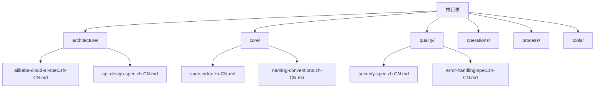
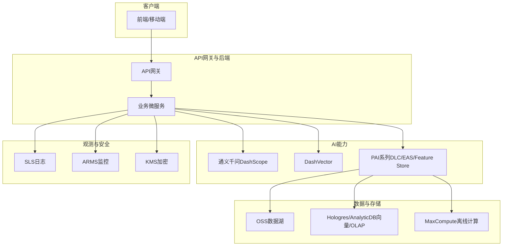
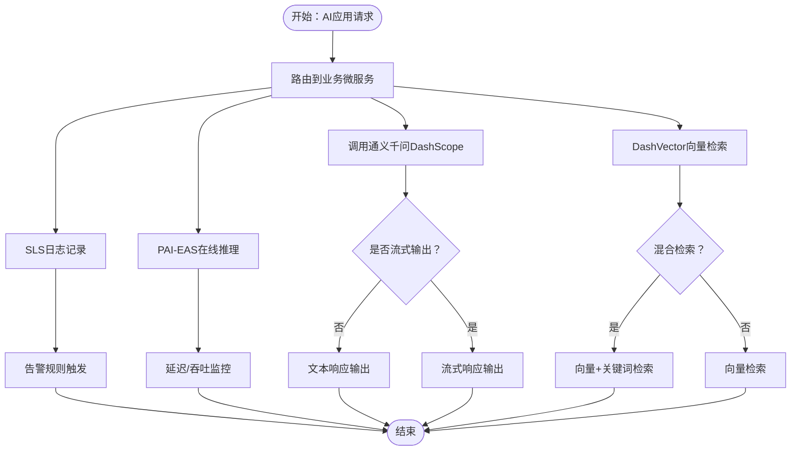
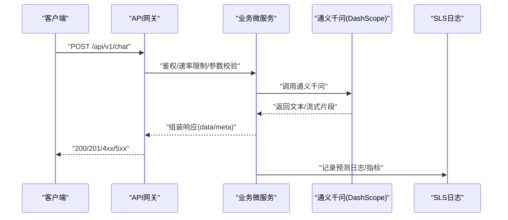
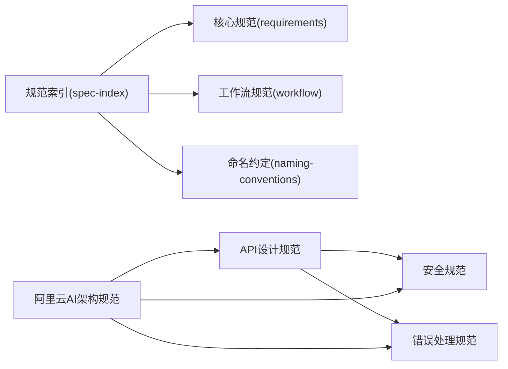

# 架构设计规范

<cite>
**本文引用的文件**
- [README.md](file://README.md)
- [alibaba-cloud-ai-spec.zh-CN.md](file://architecture/alibaba-cloud-ai-spec.zh-CN.md)
- [api-design-spec.zh-CN.md](file://architecture/api-design-spec.zh-CN.md)
- [spec-index.zh-CN.md](file://core/spec-index.zh-CN.md)
- [naming-conventions.zh-CN.md](file://core/naming-conventions.zh-CN.md)
- [security-spec.zh-CN.md](file://quality/security-spec.zh-CN.md)
- [error-handling-spec.zh-CN.md](file://quality/error-handling-spec.zh-CN.md)
</cite>

## 目录
1. [简介](#简介)
2. [项目结构](#项目结构)
3. [核心组件](#核心组件)
4. [架构总览](#架构总览)
5. [详细组件分析](#详细组件分析)
6. [依赖分析](#依赖分析)
7. [性能考虑](#性能考虑)
8. [故障排查指南](#故障排查指南)
9. [结论](#结论)
10. [附录](#附录)

## 简介
本文件面向构建云原生、可扩展、高性能的AI驱动应用，系统性阐述两大高级指导原则：
- 阿里云AI架构规范：涵盖模型服务化、向量检索与存储、大模型调用与管理、数据湖与特征工程、模型训练与优化、实时推理服务、监控与可观测性、数据安全与合规等八个方面，配套与通义千问等模型的集成方式与最佳实践。
- API设计规范：基于RESTful风格，明确资源命名、版本控制、状态码使用、请求响应格式标准化、查询参数规范、认证与授权、错误处理、文档化、幂等性设计、CORS配置与性能优化等十二项规则。

上述规范相互协同，既保证从架构到实现的一致性，也确保与底层编码规范（命名约定、安全、错误处理）无缝衔接，支撑AI应用在阿里云平台上的稳定交付与持续演进。

## 项目结构
仓库采用模块化组织，核心规范位于core与quality目录，架构与API设计规范位于architecture目录，便于在AI辅助开发场景下按需引用与组合。

图表来源
- [README.md](file://README.md#L1-L60)

章节来源
- [README.md](file://README.md#L1-L60)

## 核心组件
围绕两大指导原则，核心组件如下：
- 阿里云AI架构组件
  - 模型服务化与部署：PAI平台、容器化部署、版本管理与灰度发布、A/B测试
  - 向量检索与存储：DashVector、Hologres/AnalyticDB、向量索引优化与混合检索
  - 大模型调用与管理：通义千问（百炼）、Prompt工程、流式输出、Function Calling、Token监控与成本控制
  - 数据湖与特征工程：OSS数据湖、MaxCompute、PAI-Feature Store、离线/在线一致性
  - 模型训练与优化：PAI-DLC分布式训练、自动超参、混合精度、模型压缩与量化、GPU/NPU加速
  - 实时推理服务：PAI-EAS在线推理、自动扩缩容、推理加速、请求批处理、延迟与吞吐监控
  - 监控与可观测性：SLS日志、ARMS应用监控、分布式追踪、告警规则
  - 数据安全与合规：KMS加密、数据脱敏、PIPL/GDPR合规、RAM访问控制、审计日志
- API设计组件
  - RESTful设计原则、资源命名、版本控制、HTTP状态码使用
  - 请求与响应格式标准化、查询参数规范、认证与授权（JWT/OAuth、API Key、HTTPS、速率限制）
  - 错误处理标准、API文档化（OpenAPI/Swagger）、幂等性设计、CORS配置、性能优化（缓存、压缩、字段过滤、分页）

章节来源
- [alibaba-cloud-ai-spec.zh-CN.md](file://architecture/alibaba-cloud-ai-spec.zh-CN.md#L21-L800)
- [api-design-spec.zh-CN.md](file://architecture/api-design-spec.zh-CN.md#L20-L596)

## 架构总览
下图展示了AI应用在阿里云平台上的典型架构：前端/移动端通过API网关接入，后端微服务负责业务编排与调用，AI能力通过DashScope（通义千问）、DashVector、PAI系列服务提供，数据层采用OSS、Hologres/AnalyticDB、MaxCompute等，观测与安全贯穿全链路。

图表来源
- [alibaba-cloud-ai-spec.zh-CN.md](file://architecture/alibaba-cloud-ai-spec.zh-CN.md#L215-L342)
- [alibaba-cloud-ai-spec.zh-CN.md](file://architecture/alibaba-cloud-ai-spec.zh-CN.md#L517-L733)
- [alibaba-cloud-ai-spec.zh-CN.md](file://architecture/alibaba-cloud-ai-spec.zh-CN.md#L115-L214)
- [alibaba-cloud-ai-spec.zh-CN.md](file://architecture/alibaba-cloud-ai-spec.zh-CN.md#L344-L423)
- [alibaba-cloud-ai-spec.zh-CN.md](file://architecture/alibaba-cloud-ai-spec.zh-CN.md#L424-L516)
- [alibaba-cloud-ai-spec.zh-CN.md](file://architecture/alibaba-cloud-ai-spec.zh-CN.md#L621-L733)

## 详细组件分析

### 组件A：阿里云AI架构规范
- 模型服务化架构
  - 通过PAI平台部署模型，独立于业务逻辑，支持版本管理、灰度与A/B测试，容器化部署（ECI/ACK）。
  - 示例参考：模型服务健康检查与预测接口、从OSS加载模型、错误处理与日志。
- 向量检索与存储
  - 使用DashVector进行高性能向量检索，结合Hologres/AnalyticDB存储，实施向量索引优化（HNSW/IVF）、混合检索（向量+关键词）、备份与恢复。
  - 示例参考：集合创建、批量向量插入、检索查询与结果封装。
- 大模型调用与管理
  - 通过DashScope调用通义千问，实施Prompt工程、流式输出、Function Calling、Token监控与成本控制。
  - 示例参考：对话生成、流式响应处理、函数调用、Token用量监控。
- 数据湖与特征工程
  - OSS作为数据湖，MaxCompute进行大规模数据处理，PAI-Feature Store管理特征，离线/在线一致性保障。
  - 示例参考：特征视图创建、在线特征获取、离线写入与在线发布。
- 模型训练与优化
  - 使用PAI-DLC进行分布式训练，自动超参、混合精度、模型压缩与量化、GPU/NPU加速。
  - 示例参考：训练作业创建、监控训练状态。
- 实时推理服务
  - 使用PAI-EAS部署推理服务，自动扩缩容、推理加速（TensorRT/ONNX）、请求批处理、延迟与吞吐监控。
  - 示例参考：服务部署、推理调用与错误处理。
- 监控与可观测性
  - SLS日志采集、ARMS应用监控、分布式追踪、告警规则配置。
  - 示例参考：预测日志记录、模型指标上报、告警规则创建。
- 数据安全与合规
  - KMS加密敏感数据、数据脱敏与匿名化、PIPL/GDPR合规、RAM访问控制、审计日志。
  - 示例参考：数据加解密、敏感信息脱敏。

图表来源
- [alibaba-cloud-ai-spec.zh-CN.md](file://architecture/alibaba-cloud-ai-spec.zh-CN.md#L215-L342)
- [alibaba-cloud-ai-spec.zh-CN.md](file://architecture/alibaba-cloud-ai-spec.zh-CN.md#L115-L214)
- [alibaba-cloud-ai-spec.zh-CN.md](file://architecture/alibaba-cloud-ai-spec.zh-CN.md#L517-L733)
- [alibaba-cloud-ai-spec.zh-CN.md](file://architecture/alibaba-cloud-ai-spec.zh-CN.md#L621-L733)

章节来源
- [alibaba-cloud-ai-spec.zh-CN.md](file://architecture/alibaba-cloud-ai-spec.zh-CN.md#L21-L800)

### 组件B：API设计规范
- RESTful设计原则
  - 使用HTTP方法表达操作，资源使用名词与复数形式，URL层次化反映资源关系，使用HTTP状态码表达结果。
- API版本控制
  - URL中包含整数版本号（/v1/、/v2/），主要版本变更时增加版本号，保持旧版本向后兼容并提前通知废弃计划。
- 请求与响应格式
  - 默认JSON格式，请求Content-Type为application/json，响应统一结构包含data、error、meta，时间使用ISO 8601，分页使用统一参数（page、limit、offset）。
- HTTP状态码使用
  - 2xx成功（200/201/204），4xx客户端错误（400/401/403/404/409/422），5xx服务器错误（500/503）。
- 查询参数规范
  - 分页：page、limit、offset；排序：sort（field:asc/desc）；过滤：字段直传；搜索：q或search；字段选择：fields；关联资源：include或expand。
- 认证与授权
  - JWT或OAuth 2.0认证，API密钥用于服务间调用，敏感操作MFA，HTTPS传输，速率限制。
- 错误处理标准
  - 标准化错误码、清晰错误消息、错误详情与建议、生产环境不暴露堆栈、记录错误日志。
- API文档化
  - OpenAPI/Swagger规范，包含端点、参数、响应、请求与响应示例、交互式测试界面、文档与代码同步更新。
- 幂等性设计
  - GET/PUT/DELETE幂等，POST使用幂等键避免重复创建，乐观锁处理并发更新，提供操作去重机制。
- CORS配置
  - 允许域名白名单、允许HTTP方法、允许请求头、凭证支持与预检缓存。
- 性能优化
  - ETag/Cache-Control缓存、字段过滤减少传输、分页避免大数据集、gzip压缩、批量端点减少请求次数。

图表来源
- [api-design-spec.zh-CN.md](file://architecture/api-design-spec.zh-CN.md#L20-L203)
- [alibaba-cloud-ai-spec.zh-CN.md](file://architecture/alibaba-cloud-ai-spec.zh-CN.md#L215-L342)
- [alibaba-cloud-ai-spec.zh-CN.md](file://architecture/alibaba-cloud-ai-spec.zh-CN.md#L621-L733)

章节来源
- [api-design-spec.zh-CN.md](file://architecture/api-design-spec.zh-CN.md#L20-L596)

## 依赖分析
- 规范间的依赖与协同
  - API设计规范与安全规范：认证授权遵循安全规范（规则2），错误响应遵循错误处理规范（规则1）。
  - API设计规范与命名约定：端点命名遵循命名约定（约定8）。
  - 规范索引：集中管理模块、全局开关、规则依赖、冲突与项目类型配置，确保生成输出优先于流程合规，命名在不影响正确性时适用。
- 与阿里云AI架构的集成
  - API设计规范为AI应用提供统一的对外接口契约，确保与DashScope、DashVector、PAI系列服务的对接具备一致的版本控制、错误处理与可观测性。
  - 安全与错误处理规范贯穿AI服务调用链，保障认证、授权、日志与告警的合规与稳健。

图表来源
- [spec-index.zh-CN.md](file://core/spec-index.zh-CN.md#L69-L110)
- [api-design-spec.zh-CN.md](file://architecture/api-design-spec.zh-CN.md#L565-L573)
- [security-spec.zh-CN.md](file://quality/security-spec.zh-CN.md#L392-L398)
- [error-handling-spec.zh-CN.md](file://quality/error-handling-spec.zh-CN.md#L547-L553)

章节来源
- [spec-index.zh-CN.md](file://core/spec-index.zh-CN.md#L69-L110)
- [api-design-spec.zh-CN.md](file://architecture/api-design-spec.zh-CN.md#L565-L573)
- [security-spec.zh-CN.md](file://quality/security-spec.zh-CN.md#L392-L398)
- [error-handling-spec.zh-CN.md](file://quality/error-handling-spec.zh-CN.md#L547-L553)

## 性能考虑
- 模型推理性能
  - 使用PAI-EAS自动扩缩容、推理加速（TensorRT/ONNX）、请求批处理，监控延迟与吞吐量。
- API性能优化
  - ETag/Cache-Control缓存、字段过滤、分页、gzip压缩、批量端点减少请求次数。
- 向量检索性能
  - DashVector索引优化（HNSW/IVF）、混合检索（向量+关键词）。
- 训练与特征工程
  - PAI-DLC分布式训练、自动超参、混合精度、模型压缩与量化、GPU/NPU加速；PAI-Feature Store离线/在线一致性。

章节来源
- [alibaba-cloud-ai-spec.zh-CN.md](file://architecture/alibaba-cloud-ai-spec.zh-CN.md#L517-L733)
- [api-design-spec.zh-CN.md](file://architecture/api-design-spec.zh-CN.md#L500-L596)

## 故障排查指南
- API错误处理
  - 统一错误响应格式（error、meta），区分业务/系统/第三方错误，生产环境不暴露堆栈，记录错误日志并配置全局错误处理器。
- 安全与合规
  - 输入验证与清理、认证与授权、敏感数据保护、OWASP Top 10防护、日志安全、API安全、会话管理安全、文件上传安全。
- 监控与告警
  - SLS日志记录预测与指标，ARMS应用监控，分布式追踪，配置告警规则，结合错误处理与安全规范快速定位问题。

章节来源
- [error-handling-spec.zh-CN.md](file://quality/error-handling-spec.zh-CN.md#L20-L120)
- [security-spec.zh-CN.md](file://quality/security-spec.zh-CN.md#L1-L200)
- [alibaba-cloud-ai-spec.zh-CN.md](file://architecture/alibaba-cloud-ai-spec.zh-CN.md#L621-L733)

## 结论
通过将阿里云AI架构规范与API设计规范协同落地，可有效提升AI应用的可扩展性、性能与云原生水平。前者确保模型与数据能力的稳定交付，后者保证对外接口的一致性与安全性。配合命名约定、安全与错误处理规范，形成从架构到实现的闭环，支撑AI应用在阿里云平台上的高质量演进。

## 附录
- 项目类型配置建议
  - Web应用：启用API设计规范中的RESTful、版本控制、认证授权、错误处理、文档化、幂等性、CORS与性能优化。
  - 微服务API：启用版本控制、幂等性、性能优化，按需启用查询参数、文档化、批量操作与CORS。
  - 公共API/SDK：启用完整文档、版本控制、向后兼容，按需启用批量操作与CORS。

章节来源
- [api-design-spec.zh-CN.md](file://architecture/api-design-spec.zh-CN.md#L545-L560)