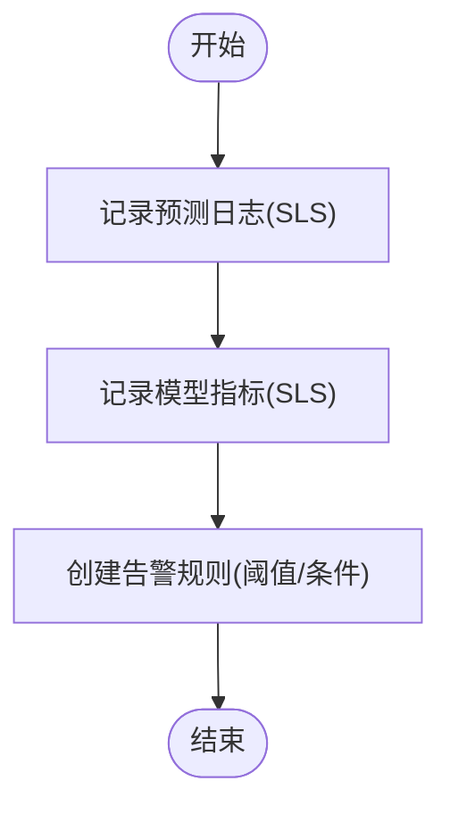

# 阿里云AI架构规范

<cite>
**本文引用的文件**
- [architecture/alibaba-cloud-ai-spec.zh-CN.md](file://architecture/alibaba-cloud-ai-spec.zh-CN.md)
- [README.md](file://README.md)
- [core/spec-index.zh-CN.md](file://core/spec-index.zh-CN.md)
- [core/requirements-spec.zh-CN.md](file://core/requirements-spec.zh-CN.md)
- [quality/security-spec.zh-CN.md](file://quality/security-spec.zh-CN.md)
- [operations/deployment-spec.zh-CN.md](file://operations/deployment-spec.zh-CN.md)
- [quality/testing-spec.zh-CN.md](file://quality/testing-spec.zh-CN.md)
- [quality/error-handling-spec.zh-CN.md](file://quality/error-handling-spec.zh-CN.md)
- [process/git-workflow-spec.zh-CN.md](file://process/git-workflow-spec.zh-CN.md)
</cite>

## 目录
1. [简介](#简介)
2. [项目结构](#项目结构)
3. [核心组件](#核心组件)
4. [架构总览](#架构总览)
5. [详细组件分析](#详细组件分析)
6. [依赖关系分析](#依赖关系分析)
7. [性能与成本优化](#性能与成本优化)
8. [故障排查指南](#故障排查指南)
9. [结论](#结论)
10. [附录](#附录)

## 简介
本规范面向在阿里云平台上构建端到端AI应用的工程团队，围绕“模型服务化、向量检索、大模型调用、特征工程、模型训练、实时推理、监控与安全”七大核心能力，给出可落地的架构原则与实施建议。文档以阿里云PAI、DashVector、Hologres、OSS、SLS、ARMS等服务为技术基座，结合仓库中的质量、安全、部署、测试与工作流规范，形成从模型加载、向量存储、大模型交互到监控告警的完整闭环。

## 项目结构
该仓库采用“模块化规范”的组织方式，将AI架构规范与其他质量、安全、部署、测试、工作流规范并列管理，便于在AI辅助开发场景下统一引用与组合使用。

图表来源
- [README.md](file://README.md#L1-L60)

章节来源
- [README.md](file://README.md#L1-L60)

## 核心组件
本节从架构视角提炼AI应用的关键构件与职责边界，强调“服务解耦、数据贯通、可观测与安全可控”。

- 模型服务化与推理
  - 通过PAI-EAS部署推理服务，支持自动扩缩容与批处理，保障低延迟与高吞吐。
  - 模型版本管理与灰度发布，配合A/B测试能力，降低上线风险。
- 向量检索与存储
  - DashVector提供高性能向量检索；Hologres/AnalyticDB承载向量与元数据存储，支持混合检索与索引优化。
- 大模型调用
  - 百炼平台（DashScope）对接通义千问，实施Prompt工程、流式输出、Function Calling与Token用量监控。
- 特征工程与数据湖
  - OSS作为数据湖，MaxCompute进行离线处理，PAI-Feature Store统一管理离线/在线特征，确保一致性。
- 模型训练
  - PAI-DLC分布式训练，结合混合精度、GPU/NPU加速与自动超参调优，缩短训练周期。
- 监控与安全
  - SLS日志与ARMS指标，结合告警规则与KMS加密、数据脱敏、访问控制等安全措施，实现全链路可观测与合规。

章节来源
- [architecture/alibaba-cloud-ai-spec.zh-CN.md](file://architecture/alibaba-cloud-ai-spec.zh-CN.md#L21-L113)
- [architecture/alibaba-cloud-ai-spec.zh-CN.md](file://architecture/alibaba-cloud-ai-spec.zh-CN.md#L115-L214)
- [architecture/alibaba-cloud-ai-spec.zh-CN.md](file://architecture/alibaba-cloud-ai-spec.zh-CN.md#L215-L342)
- [architecture/alibaba-cloud-ai-spec.zh-CN.md](file://architecture/alibaba-cloud-ai-spec.zh-CN.md#L344-L422)
- [architecture/alibaba-cloud-ai-spec.zh-CN.md](file://architecture/alibaba-cloud-ai-spec.zh-CN.md#L424-L515)
- [architecture/alibaba-cloud-ai-spec.zh-CN.md](file://architecture/alibaba-cloud-ai-spec.zh-CN.md#L517-L619)
- [architecture/alibaba-cloud-ai-spec.zh-CN.md](file://architecture/alibaba-cloud-ai-spec.zh-CN.md#L621-L734)
- [architecture/alibaba-cloud-ai-spec.zh-CN.md](file://architecture/alibaba-cloud-ai-spec.zh-CN.md#L736-L808)

## 架构总览
下图展示了从“数据与特征”到“模型训练/服务化”，再到“向量检索与大模型调用”的端到端架构，以及监控与安全贯穿始终。

图表来源
- [architecture/alibaba-cloud-ai-spec.zh-CN.md](file://architecture/alibaba-cloud-ai-spec.zh-CN.md#L115-L214)
- [architecture/alibaba-cloud-ai-spec.zh-CN.md](file://architecture/alibaba-cloud-ai-spec.zh-CN.md#L215-L342)
- [architecture/alibaba-cloud-ai-spec.zh-CN.md](file://architecture/alibaba-cloud-ai-spec.zh-CN.md#L344-L422)
- [architecture/alibaba-cloud-ai-spec.zh-CN.md](file://architecture/alibaba-cloud-ai-spec.zh-CN.md#L424-L515)
- [architecture/alibaba-cloud-ai-spec.zh-CN.md](file://architecture/alibaba-cloud-ai-spec.zh-CN.md#L517-L619)
- [architecture/alibaba-cloud-ai-spec.zh-CN.md](file://architecture/alibaba-cloud-ai-spec.zh-CN.md#L621-L734)
- [architecture/alibaba-cloud-ai-spec.zh-CN.md](file://architecture/alibaba-cloud-ai-spec.zh-CN.md#L736-L808)

## 详细组件分析

### 模型服务化与推理（PAI-EAS）
- 能力要点
  - 独立部署模型服务，支持版本管理与灰度发布。
  - 自动扩缩容与批处理，保障低延迟与高吞吐。
  - 与SLS/ARMS联动，记录推理日志与指标。
- 关键流程
  - 模型加载：从OSS下载并加载模型，健康检查接口对外暴露。
  - 推理调用：接收请求，调用模型预测，返回结果与模型版本。
  - 监控：记录请求耗时、成功率、吞吐量等指标。

图表来源
- [architecture/alibaba-cloud-ai-spec.zh-CN.md](file://architecture/alibaba-cloud-ai-spec.zh-CN.md#L517-L619)
- [architecture/alibaba-cloud-ai-spec.zh-CN.md](file://architecture/alibaba-cloud-ai-spec.zh-CN.md#L621-L734)

章节来源
- [architecture/alibaba-cloud-ai-spec.zh-CN.md](file://architecture/alibaba-cloud-ai-spec.zh-CN.md#L517-L619)
- [architecture/alibaba-cloud-ai-spec.zh-CN.md](file://architecture/alibaba-cloud-ai-spec.zh-CN.md#L621-L734)

### 向量检索与存储（DashVector + Hologres）
- 能力要点
  - DashVector提供高性能向量检索，支持余弦相似度、过滤与混合检索。
  - Hologres/AnalyticDB承载向量与元数据，支持索引优化与备份恢复。
- 关键流程
  - 创建集合、批量插入向量、检索与过滤、结果解析。

图表来源
- [architecture/alibaba-cloud-ai-spec.zh-CN.md](file://architecture/alibaba-cloud-ai-spec.zh-CN.md#L115-L214)

章节来源
- [architecture/alibaba-cloud-ai-spec.zh-CN.md](file://architecture/alibaba-cloud-ai-spec.zh-CN.md#L115-L214)

### 大模型调用与管理（通义千问）
- 能力要点
  - 百炼平台调用通义千问，支持流式输出、Function Calling与Token用量监控。
  - Prompt工程最佳实践，结合系统/用户消息结构化。
- 关键流程
  - 普通对话、流式对话、Function Calling、Token用量统计。

图表来源
- [architecture/alibaba-cloud-ai-spec.zh-CN.md](file://architecture/alibaba-cloud-ai-spec.zh-CN.md#L215-L342)
- [architecture/alibaba-cloud-ai-spec.zh-CN.md](file://architecture/alibaba-cloud-ai-spec.zh-CN.md#L621-L734)

章节来源
- [architecture/alibaba-cloud-ai-spec.zh-CN.md](file://architecture/alibaba-cloud-ai-spec.zh-CN.md#L215-L342)
- [architecture/alibaba-cloud-ai-spec.zh-CN.md](file://architecture/alibaba-cloud-ai-spec.zh-CN.md#L621-L734)

### 特征工程与数据湖（PAI-Feature Store + OSS）
- 能力要点
  - OSS作为数据湖，MaxCompute进行离线处理，PAI-Feature Store统一管理离线/在线特征。
  - 数据版本管理与离线/在线一致性保障。
- 关键流程
  - 创建特征视图、写入离线特征、发布到在线存储、获取在线特征。

图表来源
- [architecture/alibaba-cloud-ai-spec.zh-CN.md](file://architecture/alibaba-cloud-ai-spec.zh-CN.md#L344-L422)

章节来源
- [architecture/alibaba-cloud-ai-spec.zh-CN.md](file://architecture/alibaba-cloud-ai-spec.zh-CN.md#L344-L422)

### 模型训练（PAI-DLC）
- 能力要点
  - 分布式训练、自动超参调优、混合精度、GPU/NPU加速。
  - 代码与数据源来自OSS，命令行入口统一。
- 关键流程
  - 创建训练作业、监控状态与指标、产出模型。

图表来源
- [architecture/alibaba-cloud-ai-spec.zh-CN.md](file://architecture/alibaba-cloud-ai-spec.zh-CN.md#L424-L515)
- [architecture/alibaba-cloud-ai-spec.zh-CN.md](file://architecture/alibaba-cloud-ai-spec.zh-CN.md#L621-L734)

章节来源
- [architecture/alibaba-cloud-ai-spec.zh-CN.md](file://architecture/alibaba-cloud-ai-spec.zh-CN.md#L424-L515)
- [architecture/alibaba-cloud-ai-spec.zh-CN.md](file://architecture/alibaba-cloud-ai-spec.zh-CN.md#L621-L734)

### 监控与可观测性（SLS + ARMS）
- 能力要点
  - SLS采集日志，ARMS采集指标，统一告警。
  - 模型性能、推理延迟、吞吐量、Token用量等关键指标。
- 关键流程
  - 记录预测日志、记录模型指标、创建告警规则。

图表来源
- [architecture/alibaba-cloud-ai-spec.zh-CN.md](file://architecture/alibaba-cloud-ai-spec.zh-CN.md#L621-L734)

章节来源
- [architecture/alibaba-cloud-ai-spec.zh-CN.md](file://architecture/alibaba-cloud-ai-spec.zh-CN.md#L621-L734)

### 数据安全与合规（KMS + 脱敏）
- 能力要点
  - KMS加密敏感数据，数据脱敏与匿名化，访问控制与审计。
- 关键流程
  - 加密/解密、敏感字段脱敏、访问控制策略。

图表来源
- [architecture/alibaba-cloud-ai-spec.zh-CN.md](file://architecture/alibaba-cloud-ai-spec.zh-CN.md#L736-L808)

章节来源
- [architecture/alibaba-cloud-ai-spec.zh-CN.md](file://architecture/alibaba-cloud-ai-spec.zh-CN.md#L736-L808)

## 依赖关系分析
本节梳理AI架构规范与质量、安全、部署、测试、工作流等规范之间的依赖与协同关系，确保整体工程的一致性与可落地性。

图表来源
- [README.md](file://README.md#L1-L60)
- [core/requirements-spec.zh-CN.md](file://core/requirements-spec.zh-CN.md#L1-L60)
- [quality/security-spec.zh-CN.md](file://quality/security-spec.zh-CN.md#L1-L40)
- [operations/deployment-spec.zh-CN.md](file://operations/deployment-spec.zh-CN.md#L1-L40)
- [quality/testing-spec.zh-CN.md](file://quality/testing-spec.zh-CN.md#L1-L40)
- [quality/error-handling-spec.zh-CN.md](file://quality/error-handling-spec.zh-CN.md#L1-L40)
- [process/git-workflow-spec.zh-CN.md](file://process/git-workflow-spec.zh-CN.md#L1-L40)

章节来源
- [README.md](file://README.md#L1-L60)
- [core/requirements-spec.zh-CN.md](file://core/requirements-spec.zh-CN.md#L1-L60)
- [quality/security-spec.zh-CN.md](file://quality/security-spec.zh-CN.md#L1-L40)
- [operations/deployment-spec.zh-CN.md](file://operations/deployment-spec.zh-CN.md#L1-L40)
- [quality/testing-spec.zh-CN.md](file://quality/testing-spec.zh-CN.md#L1-L40)
- [quality/error-handling-spec.zh-CN.md](file://quality/error-handling-spec.zh-CN.md#L1-L40)
- [process/git-workflow-spec.zh-CN.md](file://process/git-workflow-spec.zh-CN.md#L1-L40)

## 性能与成本优化
- 推理性能
  - 使用PAI-EAS自动扩缩容与批处理，结合推理加速（TensorRT/ONNX），降低延迟与成本。
- 训练效率
  - PAI-DLC混合精度、GPU/NPU加速与自动超参调优，缩短训练周期。
- 向量检索
  - DashVector索引优化（HNSW/IVF）、混合检索与备份恢复，提升召回质量与稳定性。
- 成本控制
  - 通义千问Token用量监控与流控策略，避免成本失控。

章节来源
- [architecture/alibaba-cloud-ai-spec.zh-CN.md](file://architecture/alibaba-cloud-ai-spec.zh-CN.md#L517-L619)
- [architecture/alibaba-cloud-ai-spec.zh-CN.md](file://architecture/alibaba-cloud-ai-spec.zh-CN.md#L424-L515)
- [architecture/alibaba-cloud-ai-spec.zh-CN.md](file://architecture/alibaba-cloud-ai-spec.zh-CN.md#L115-L214)
- [architecture/alibaba-cloud-ai-spec.zh-CN.md](file://architecture/alibaba-cloud-ai-spec.zh-CN.md#L215-L342)

## 故障排查指南
- 健康检查与回滚
  - 健康/就绪探针、一键回滚、回滚历史与数据库迁移回滚策略。
- 错误分类与处理
  - 业务/系统/第三方错误分类，统一错误类与日志记录，全局错误处理器与前端错误边界。
- 安全与合规
  - 输入验证、敏感数据保护、依赖安全审计、会话与API安全、日志安全与错误安全。

章节来源
- [operations/deployment-spec.zh-CN.md](file://operations/deployment-spec.zh-CN.md#L233-L313)
- [operations/deployment-spec.zh-CN.md](file://operations/deployment-spec.zh-CN.md#L442-L559)
- [quality/error-handling-spec.zh-CN.md](file://quality/error-handling-spec.zh-CN.md#L1-L120)
- [quality/error-handling-spec.zh-CN.md](file://quality/error-handling-spec.zh-CN.md#L278-L360)
- [quality/security-spec.zh-CN.md](file://quality/security-spec.zh-CN.md#L1-L120)
- [quality/security-spec.zh-CN.md](file://quality/security-spec.zh-CN.md#L182-L260)

## 结论
本规范以阿里云平台为核心，围绕模型服务化、向量检索、大模型调用、特征工程、训练与推理、监控与安全，给出了可执行的架构原则与实施路径。通过与开发需求、安全、部署、测试与Git工作流规范的协同，确保从研发到生产的全生命周期质量与合规。

## 附录
- 项目类型配置建议
  - Web应用：强调可运行性、API准确性、最小依赖与编译/运行保证，结合测试覆盖率与命名约定。
  - CLI工具：强调稳定性、最小依赖与跨环境运行，结合错误码标准化与超时限流。
  - 库/SDK：强调API正确性、版本纪律与高质量错误处理，尽量减少依赖。
- 规范启用与覆盖
  - 通过规范索引集中管理模块开关、规则依赖与冲突化解，按项目类型推荐启用集合。

章节来源
- [core/requirements-spec.zh-CN.md](file://core/requirements-spec.zh-CN.md#L246-L267)
- [core/spec-index.zh-CN.md](file://core/spec-index.zh-CN.md#L110-L173)