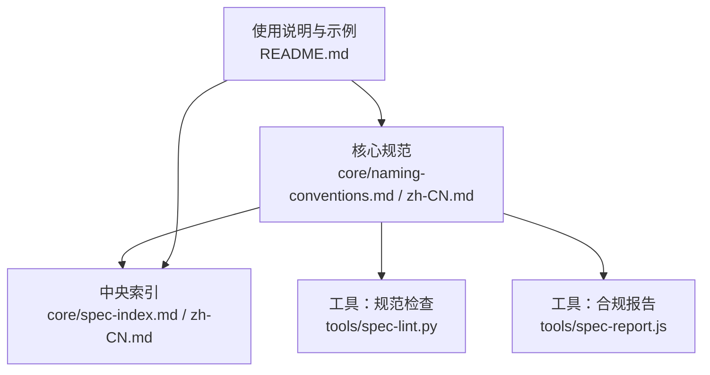
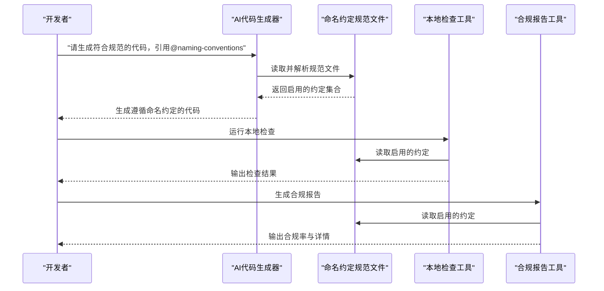
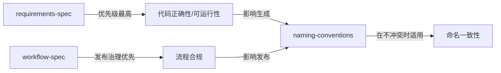

# 命名约定

<cite>
**本文引用的文件**
- [naming-conventions.md](file://core/naming-conventions.md)
- [naming-conventions.zh-CN.md](file://core/naming-conventions.zh-CN.md)
- [README.md](file://README.md)
- [spec-index.md](file://core/spec-index.md)
- [spec-index.zh-CN.md](file://core/spec-index.zh-CN.md)
- [spec-lint.py](file://tools/spec-lint.py)
- [spec-report.js](file://tools/spec-report.js)
</cite>

## 目录
1. [简介](#简介)
2. [项目结构](#项目结构)
3. [核心组件](#核心组件)
4. [架构总览](#架构总览)
5. [详细组件分析](#详细组件分析)
6. [依赖关系分析](#依赖关系分析)
7. [性能与可维护性考量](#性能与可维护性考量)
8. [故障排查指南](#故障排查指南)
9. [结论](#结论)
10. [附录](#附录)

## 简介
本文件系统性阐述代码标识符的命名规则，涵盖类、方法、变量、常量、文件、环境变量等元素的命名标准，包括大小写规则、前缀后缀使用、缩写规范等。文档同时解释这些约定如何被AI代码生成器识别与应用，以及开发者在提示词中引用@naming-conventions时的具体效果。此外，对比中英文文档版本的一致性维护机制，列出常见违规模式及其改进方案，帮助开发者快速掌握正确用法。

## 项目结构
命名约定规范位于核心目录，配套提供中英双语版本，并通过中央索引文件进行模块化管理与项目类型配置。工具链提供本地检查与合规报告能力，便于在CI/CD中集成。

图表来源
- [naming-conventions.md](file://core/naming-conventions.md#L1-L120)
- [naming-conventions.zh-CN.md](file://core/naming-conventions.zh-CN.md#L1-L120)
- [spec-index.md](file://core/spec-index.md#L1-L120)
- [spec-index.zh-CN.md](file://core/spec-index.zh-CN.md#L1-L120)
- [README.md](file://README.md#L60-L120)

章节来源
- [README.md](file://README.md#L60-L120)
- [core/spec-index.md](file://core/spec-index.md#L1-L120)
- [core/spec-index.zh-CN.md](file://core/spec-index.zh-CN.md#L1-L120)

## 核心组件
- 变量命名：描述性、避免单字母（迭代器除外）、名词、布尔变量以is/has/can/should开头、避免不广为人知的缩写。
- 函数/方法命名：动词或动词短语、描述函数作用、布尔返回函数以is/has/can/should开头、事件处理器以handle/on开头、异步函数可含async或体现异步的动词。
- 类命名：PascalCase（大驼峰）、名词或名词短语、接口可选以I开头、抽象类可选以Abstract/Base开头、避免通用名称如Manager/Helper/Util。
- 常量命名：真正常量使用UPPER_SNAKE_CASE、相关常量分组在对象/枚举中、名称描述用途。
- 文件命名：JavaScript/TypeScript使用kebab-case；Python使用snake_case；测试文件以.test/.spec结尾；配置文件以.config结尾；主出入口与主要导出匹配文件名。
- 环境变量命名：UPPER_SNAKE_CASE、加应用/服务前缀、相关变量用公共前缀分组、明确用途。
- 其他约定（当前禁用）：组件命名（前端）、数据库表/列命名、API端点命名、类型/接口命名、事件命名、测试命名。

章节来源
- [naming-conventions.md](file://core/naming-conventions.md#L19-L310)
- [naming-conventions.zh-CN.md](file://core/naming-conventions.zh-CN.md#L19-L310)

## 架构总览
AI在生成代码时会根据引用的规范文件自动筛选“启用”的约定，并据此约束生成结果。开发者可在提示词中引用@naming-conventions（或其中文版本），AI将仅遵循该文件中处于ENABLED状态的约定。

图表来源
- [README.md](file://README.md#L60-L120)
- [naming-conventions.md](file://core/naming-conventions.md#L1-L40)
- [spec-lint.py](file://tools/spec-lint.py#L46-L81)
- [spec-report.js](file://tools/spec-report.js#L36-L54)

## 详细组件分析

### 变量命名
- 规则要点
  - 描述性强、避免单字母（迭代器i/j/k除外）、使用名词。
  - 布尔变量以is/has/can/should开头。
  - 避免不广为人知的缩写。
  - JavaScript/TypeScript使用camelCase；Python使用snake_case。
- 语言差异
  - JavaScript/TypeScript：camelCase风格示例见规范文件中的正确/错误示例。
  - Python：snake_case风格示例见规范文件中的正确/错误示例。
- AI应用
  - 当@naming-conventions被引用且CONVENTION 1处于ENABLED时，AI将强制变量名满足上述规则与大小写约定。
- 常见违规与改进
  - 使用单字母变量（如x/y/z）替代描述性名称。
  - 使用不常见缩写（un/auth等）。
  - Python中使用camelCase而非snake_case。
  - 改进：替换为完整描述性名称；统一大小写风格；避免缩写。

章节来源
- [naming-conventions.md](file://core/naming-conventions.md#L19-L51)
- [naming-conventions.zh-CN.md](file://core/naming-conventions.zh-CN.md#L19-L51)

### 函数/方法命名
- 规则要点
  - 使用动词或动词短语，名称描述函数作用。
  - 返回布尔值的函数以is/has/can/should开头。
  - 事件处理器以handle/on开头。
  - 异步函数可包含async或使用暗示异步的动词。
  - JavaScript/TypeScript与Python均使用对应语言的命名风格。
- AI应用
  - 当@naming-conventions被引用且CONVENTION 2处于ENABLED时，AI将强制函数名满足动词性、布尔前缀与事件前缀等规则。
- 常见违规与改进
  - 使用无意义名称（如total/user/email）。
  - 事件处理器使用click/login等不规范前缀。
  - 改进：使用动词短语；为布尔函数添加is/has/can/should；事件处理器使用handle/on。

章节来源
- [naming-conventions.md](file://core/naming-conventions.md#L53-L87)
- [naming-conventions.zh-CN.md](file://core/naming-conventions.zh-CN.md#L53-L87)

### 类命名
- 规则要点
  - 使用PascalCase（大驼峰）。
  - 使用名词或名词短语。
  - 接口可选以I开头；抽象类可选以Abstract/Base开头。
  - 避免通用名称如Manager/Helper/Util。
- AI应用
  - 当@naming-conventions被引用且CONVENTION 3处于ENABLED时，AI将强制类名满足PascalCase与避免通用名称的要求。
- 常见违规与改进
  - 使用userAccount等小驼峰命名。
  - 使用validator/Manager/Helper等通用名称。
  - 改进：统一使用PascalCase；使用更具描述性的名词；避免通用后缀。

章节来源
- [naming-conventions.md](file://core/naming-conventions.md#L89-L116)
- [naming-conventions.zh-CN.md](file://core/naming-conventions.zh-CN.md#L89-L116)

### 常量命名
- 规则要点
  - 真正常量使用UPPER_SNAKE_CASE；相关常量分组在对象/枚举中。
  - 名称描述用途。
- AI应用
  - 当@naming-conventions被引用且CONVENTION 4处于ENABLED时，AI将强制常量名满足UPPER_SNAKE_CASE与分组要求。
- 常见违规与改进
  - 使用小写或混合大小写常量名。
  - 常量未分组，导致分散。
  - 改进：统一UPPER_SNAKE_CASE；使用枚举或对象分组相关常量。

章节来源
- [naming-conventions.md](file://core/naming-conventions.md#L117-L151)
- [naming-conventions.zh-CN.md](file://core/naming-conventions.zh-CN.md#L117-L151)

### 文件命名
- 规则要点
  - JavaScript/TypeScript：kebab-case（小写连字符）。
  - Python：snake_case（下划线）。
  - 测试文件：.test或.spec后缀。
  - 配置文件：.config后缀。
  - 主文件名与主要导出匹配。
- AI应用
  - 当@naming-conventions被引用且CONVENTION 5处于ENABLED时，AI将强制文件名满足对应语言的命名风格与后缀规范。
- 常见违规与改进
  - JavaScript/TypeScript使用PascalCase或snake_case。
  - Python使用kebab-case或下划线不规范。
  - 改进：统一kebab-case（JS/TS）或snake_case（Python）；按规范添加.test/.spec/.config后缀。

章节来源
- [naming-conventions.md](file://core/naming-conventions.md#L153-L187)
- [naming-conventions.zh-CN.md](file://core/naming-conventions.zh-CN.md#L153-L187)

### 环境变量命名
- 规则要点
  - 使用UPPER_SNAKE_CASE。
  - 加应用/服务前缀以增强清晰度。
  - 相关变量使用公共前缀分组。
  - 明确变量用途。
- AI应用
  - 当@naming-conventions被引用且CONVENTION 9处于ENABLED时，AI将强制环境变量名满足UPPER_SNAKE_CASE与前缀分组要求。
- 常见违规与改进
  - 使用dbUrl/apiKey等小写或混写。
  - 未加前缀或分组不一致。
  - 改进：统一UPPER_SNAKE_CASE；添加应用/服务前缀；按功能分组。

章节来源
- [naming-conventions.md](file://core/naming-conventions.md#L276-L301)
- [naming-conventions.zh-CN.md](file://core/naming-conventions.zh-CN.md#L276-L301)

### 其他约定（当前禁用）
- 组件命名（前端）：PascalCase、描述性名称、可选类型前缀、容器组件以Container结尾、HOC以前缀with开头。
- 数据库表/列命名：snake_case、表名复数、列名单数、外键加前缀、避免保留字、统一时间戳命名。
- API端点命名：URL使用kebab-case、资源用名词（非动词）、集合用复数、HTTP方法表达动作、嵌套资源反映层次、版本前缀。
- 类型/接口命名：TypeScript中PascalCase、接口可选I前缀、Props/State接口命名约定、泛型参数命名。
- 事件命名：事件处理器handle/on、自定义事件用现在时动词、事件数据以Event/EventData结尾。
- 测试命名：测试文件与源文件匹配、测试套件describe、测试用例it/test、清晰描述预期行为。

说明：以上约定在当前文件中处于DISABLED状态，若需启用，请在相应位置将STATUS改为ENABLED并更新摘要与语言特定摘要。

章节来源
- [naming-conventions.md](file://core/naming-conventions.md#L189-L391)
- [naming-conventions.zh-CN.md](file://core/naming-conventions.zh-CN.md#L189-L391)

## 依赖关系分析
命名约定与其他规范模块存在依赖与优先级关系：
- requirements-spec优先保障代码正确性与可运行性，其次考虑流程合规与命名约定。
- workflow-spec在发布治理层面具有优先级。
- naming-conventions在不影响代码正确性时适用。

图表来源
- [spec-index.md](file://core/spec-index.md#L104-L108)
- [spec-index.zh-CN.md](file://core/spec-index.zh-CN.md#L104-L108)

章节来源
- [spec-index.md](file://core/spec-index.md#L104-L108)
- [spec-index.zh-CN.md](file://core/spec-index.zh-CN.md#L104-L108)

## 性能与可维护性考量
- 可读性与一致性：统一的命名风格显著降低认知负担，提升代码可读性与协作效率。
- 生成器适配：AI在生成阶段即遵循启用的约定，减少后期修正成本。
- 工具链辅助：本地检查与合规报告有助于持续维护命名一致性，降低技术债积累。

[本节为一般性指导，无需引用具体文件]

## 故障排查指南
- 本地检查
  - 工具会解析规范文件，提取处于ENABLED状态的约定，并对目标代码进行扫描与告警。
  - 对Python变量命名的检查示例：当启用CONVENTION 1时，若检测到驼峰命名变量，将给出WARNING级别的提示。
- 合规报告
  - 工具会统计各规范文件的启用规则数量、总规则数量与总体合规率，并输出详细报告。
- 常见问题定位
  - 变量命名不符合语言风格（如Python使用camelCase）。
  - 文件命名未遵循kebab-case/snake_case或缺少.test/.spec/.config后缀。
  - 常量未使用UPPER_SNAKE_CASE或未分组。
  - 环境变量未使用UPPER_SNAKE_CASE或缺少前缀分组。

章节来源
- [spec-lint.py](file://tools/spec-lint.py#L46-L81)
- [spec-lint.py](file://tools/spec-lint.py#L82-L110)
- [spec-report.js](file://tools/spec-report.js#L36-L54)
- [spec-report.js](file://tools/spec-report.js#L131-L186)

## 结论
命名约定是提升代码可读性与一致性的重要基础。通过在提示词中引用@naming-conventions（或其中文版本），AI将仅遵循启用的约定，从而在生成阶段就保证命名风格的一致性。结合本地检查与合规报告工具，可在项目生命周期内持续维护高质量的命名实践。建议根据项目类型（Web、CLI、Library）在中央索引中合理启用相关约定，并在CI/CD中集成工具链以自动化保障。

[本节为总结性内容，无需引用具体文件]

## 附录

### 中英文文档版本一致性维护机制
- 中文版本提供人类可读的镜像文件，便于不同团队使用。
- 中央索引文件支持双向语言对齐，可通过开关控制镜像生成与语言对齐。
- 项目类型配置在索引中集中管理，确保不同项目场景下的约定启用策略一致。

章节来源
- [README.md](file://README.md#L320-L345)
- [spec-index.md](file://core/spec-index.md#L20-L31)
- [spec-index.zh-CN.md](file://core/spec-index.zh-CN.md#L20-L31)

### 多语言示例（概念性说明）
- JavaScript/TypeScript
  - 变量：camelCase（如userName）
  - 函数：camelCase（如calculateTotal）
  - 类：PascalCase（如UserAccount）
  - 常量：UPPER_SNAKE_CASE（如MAX_RETRY_COUNT）
  - 文件：kebab-case（如user-account.ts）
- Python
  - 变量：snake_case（如user_name）
  - 函数：snake_case（如calculate_total）
  - 类：PascalCase（如UserAccount）
  - 常量：UPPER_SNAKE_CASE（如MAX_RETRY_COUNT）
  - 文件：snake_case（如user_account.py）

说明：以上示例为概念性描述，具体示例请参阅规范文件中的正确/错误示例路径。

章节来源
- [naming-conventions.md](file://core/naming-conventions.md#L31-L187)
- [naming-conventions.zh-CN.md](file://core/naming-conventions.zh-CN.md#L31-L187)