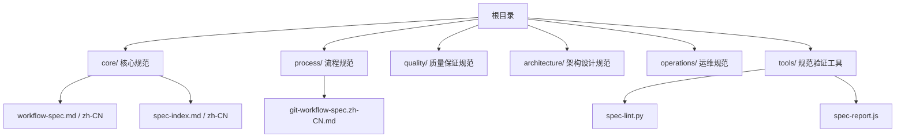
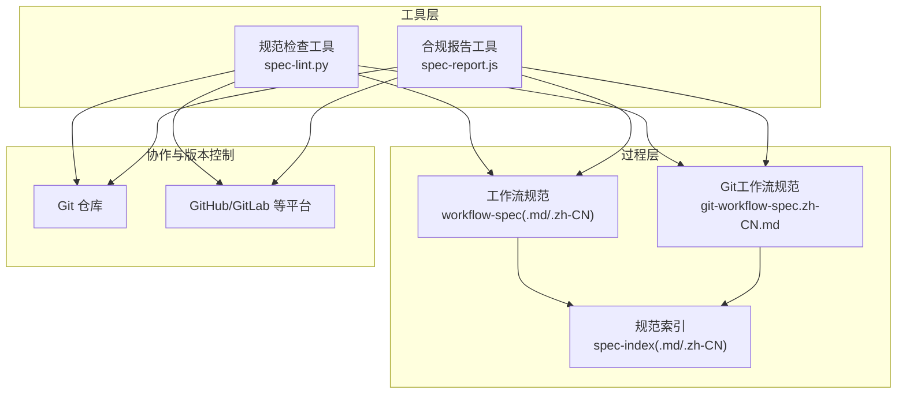
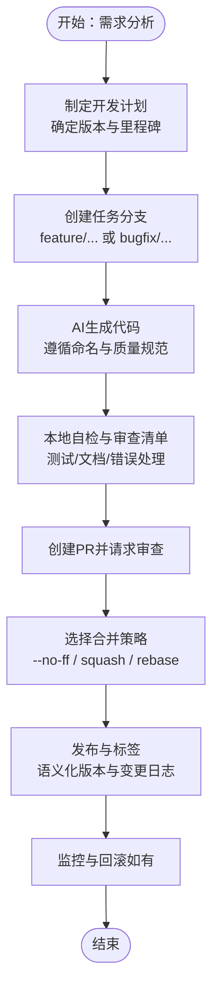
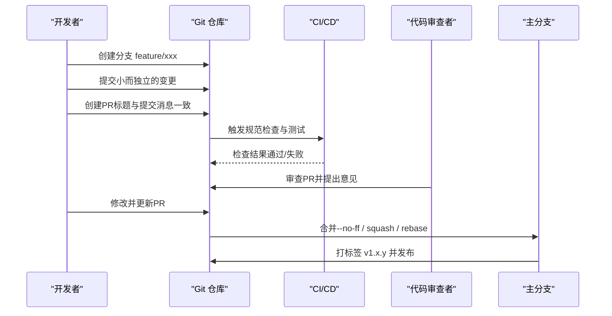
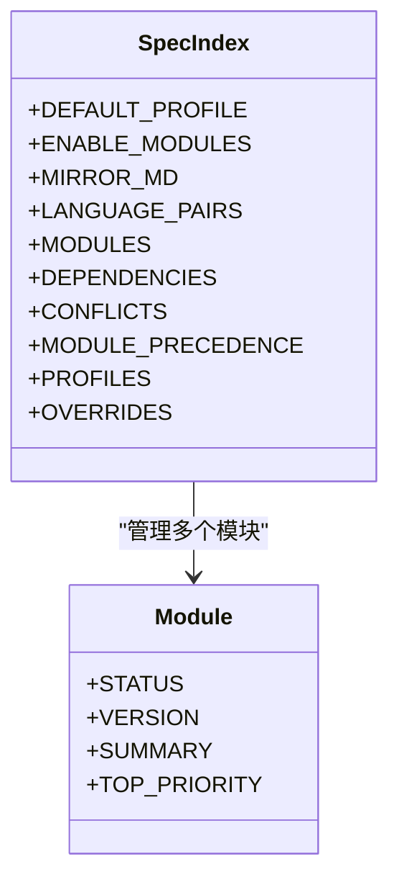
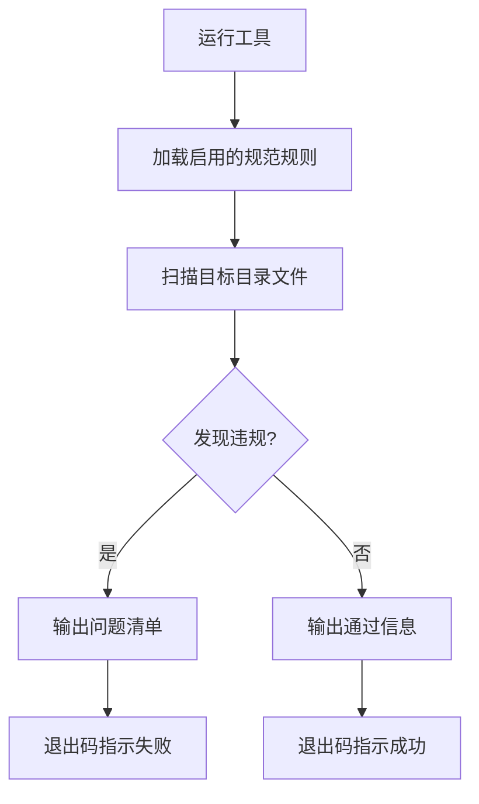
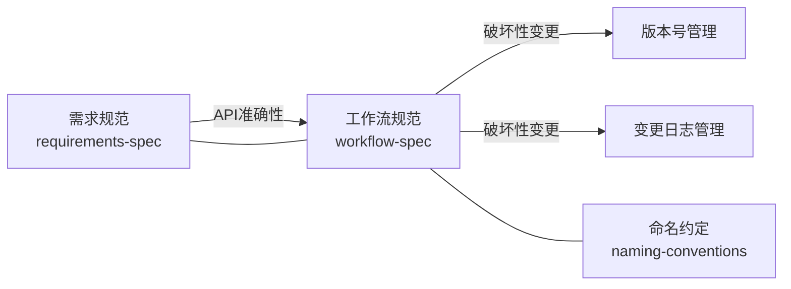

# 工作流规范

<cite>
**本文引用的文件**
- [workflow-spec.md](file://core/workflow-spec.md)
- [workflow-spec.zh-CN.md](file://core/workflow-spec.zh-CN.md)
- [git-workflow-spec.zh-CN.md](file://process/git-workflow-spec.zh-CN.md)
- [README.md](file://README.md)
- [spec-index.md](file://core/spec-index.md)
- [spec-index.zh-CN.md](file://core/spec-index.zh-CN.md)
- [spec-lint.py](file://tools/spec-lint.py)
- [spec-report.js](file://tools/spec-report.js)
</cite>

## 目录
1. [简介](#简介)
2. [项目结构](#项目结构)
3. [核心组件](#核心组件)
4. [架构总览](#架构总览)
5. [详细组件分析](#详细组件分析)
6. [依赖分析](#依赖分析)
7. [性能考虑](#性能考虑)
8. [故障排查指南](#故障排查指南)
9. [结论](#结论)
10. [附录](#附录)

## 简介
本文件面向AI辅助开发环境，系统化阐述“工作流规范”，涵盖从需求分析到代码提交的完整阶段划分，包括任务分支创建、AI生成代码的审查流程、本地验证步骤与合并策略。文档强调与Git版本控制系统的深度集成，支持高效协作与可追溯性；并通过流程图与实际场景说明各环节的操作要点。同时，文档解释中英文版本文件的对应关系及在多语言团队中的使用方式，并讨论与CI/CD流水线、Git Hooks的潜在集成点与最佳实践，以避免常见流程中断问题。

## 项目结构
该仓库将“工作流规范”置于核心目录下，并配套“Git工作流规范”、“规范索引”以及“工具集”。整体结构如下：

图表来源
- [README.md](file://README.md#L1-L60)

章节来源
- [README.md](file://README.md#L1-L60)

## 核心组件
- 工作流规范（workflow-spec）：定义12条规则，聚焦变更日志、版本号、文档同步、破坏性变更、依赖更新与错误处理等关键治理点。当前项目默认启用的规则包括变更日志管理、版本号管理、文档同步、破坏性变更协议、依赖更新策略与错误处理标准。
- Git工作流规范（git-workflow-spec）：定义12条规则，覆盖分支命名、提交消息、提交频率、PR规范、分支策略、代码审查、合并策略、禁止操作、标签管理、冲突解决、.gitignore与可选的Commit Hooks等，强调与工作流规范的协同。
- 规范索引（spec-index）：集中控制模块开关、规则依赖、冲突化解与项目类型配置，支持按Web/CLI/Library三类推荐启用规则组合。
- 规范工具（tools）：提供Python脚本与Node脚本，分别用于规范检查与合规报告生成，支撑本地与CI集成。

章节来源
- [workflow-spec.md](file://core/workflow-spec.md#L314-L359)
- [workflow-spec.zh-CN.md](file://core/workflow-spec.zh-CN.md#L314-L359)
- [git-workflow-spec.zh-CN.md](file://process/git-workflow-spec.zh-CN.md#L500-L533)
- [spec-index.md](file://core/spec-index.md#L1-L173)
- [spec-index.zh-CN.md](file://core/spec-index.zh-CN.md#L1-L173)
- [README.md](file://README.md#L253-L303)

## 架构总览
工作流规范与Git工作流规范共同构成AI辅助开发的“过程层”与“工具层”闭环：前者提供治理规则，后者提供Git层面的执行约束与协作流程。两者通过规范索引进行模块化管理与依赖协调，并由工具链在本地与CI中落地。

图表来源
- [workflow-spec.md](file://core/workflow-spec.md#L314-L359)
- [git-workflow-spec.zh-CN.md](file://process/git-workflow-spec.zh-CN.md#L500-L533)
- [spec-index.md](file://core/spec-index.md#L1-L173)
- [spec-lint.py](file://tools/spec-lint.py#L1-L269)
- [spec-report.js](file://tools/spec-report.js#L1-L278)

## 详细组件分析

### 工作流规范（Workflow Specification）
- 规则概览与启用状态：当前启用的规则包括变更日志管理、版本号管理、文档同步、破坏性变更协议、依赖更新策略与错误处理标准。这些规则共同保障发布质量、可追溯性与安全性。
- 项目类型配置：针对Web应用、CLI工具与库/SDK三类项目，提供推荐启用规则组合，便于快速落地。
- 与规范索引的关系：规范索引对工作流规范的规则启用状态进行集中管理，并在模块依赖与冲突化解中体现其优先级与联动关系。

图表来源
- [workflow-spec.md](file://core/workflow-spec.md#L314-L359)
- [git-workflow-spec.zh-CN.md](file://process/git-workflow-spec.zh-CN.md#L166-L211)

章节来源
- [workflow-spec.md](file://core/workflow-spec.md#L19-L118)
- [workflow-spec.md](file://core/workflow-spec.md#L140-L201)
- [workflow-spec.md](file://core/workflow-spec.md#L228-L289)
- [workflow-spec.zh-CN.md](file://core/workflow-spec.zh-CN.md#L19-L119)
- [workflow-spec.zh-CN.md](file://core/workflow-spec.zh-CN.md#L140-L201)
- [workflow-spec.zh-CN.md](file://core/workflow-spec.zh-CN.md#L228-L289)
- [spec-index.md](file://core/spec-index.md#L110-L144)
- [spec-index.zh-CN.md](file://core/spec-index.zh-CN.md#L110-L144)

### Git工作流规范（Git Workflow Specification）
- 分支命名与策略：统一主分支、开发分支、功能/修复/热修复/发布分支命名；支持Git Flow与GitHub Flow两种策略。
- 提交消息与频率：采用Conventional Commits格式；鼓励小而频繁的提交，每个提交聚焦单一逻辑单元。
- PR规范与审查：PR标题与提交消息一致；提供审查清单与标签；至少一位审查者批准。
- 合并策略：根据分支类型与规模选择Merge Commit、Squash and Merge或Rebase and Merge。
- 禁止操作与标签管理：严禁直接推送到主分支与强制推送；使用语义化版本标签并附带发布说明。
- 冲突解决与忽略文件：定期从主分支同步；冲突解决后充分测试；维护合理的.gitignore。

图表来源
- [git-workflow-spec.zh-CN.md](file://process/git-workflow-spec.zh-CN.md#L20-L49)
- [git-workflow-spec.zh-CN.md](file://process/git-workflow-spec.zh-CN.md#L53-L95)
- [git-workflow-spec.zh-CN.md](file://process/git-workflow-spec.zh-CN.md#L117-L164)
- [git-workflow-spec.zh-CN.md](file://process/git-workflow-spec.zh-CN.md#L166-L211)
- [git-workflow-spec.zh-CN.md](file://process/git-workflow-spec.zh-CN.md#L243-L277)
- [git-workflow-spec.zh-CN.md](file://process/git-workflow-spec.zh-CN.md#L279-L355)

章节来源
- [git-workflow-spec.zh-CN.md](file://process/git-workflow-spec.zh-CN.md#L20-L49)
- [git-workflow-spec.zh-CN.md](file://process/git-workflow-spec.zh-CN.md#L53-L95)
- [git-workflow-spec.zh-CN.md](file://process/git-workflow-spec.zh-CN.md#L117-L164)
- [git-workflow-spec.zh-CN.md](file://process/git-workflow-spec.zh-CN.md#L166-L211)
- [git-workflow-spec.zh-CN.md](file://process/git-workflow-spec.zh-CN.md#L243-L277)
- [git-workflow-spec.zh-CN.md](file://process/git-workflow-spec.zh-CN.md#L279-L355)

### 规范索引（Spec Index）
- 全局配置：默认项目类型、启用模块、镜像开关与语言对。
- 模块与规则：列出各模块的启用状态、版本与优先规则。
- 依赖与冲突：工作流规范内部规则之间的依赖关系；与需求规范在API准确性与版本管理上的联动；命名约定按项目类型生效。
- 项目类型配置：Web/CLI/Library三类推荐启用规则组合，便于快速落地。
- 覆盖项：允许在不修改模块文件的前提下按项目覆盖启用/禁用规则。

图表来源
- [spec-index.md](file://core/spec-index.md#L20-L108)
- [spec-index.md](file://core/spec-index.md#L110-L144)
- [spec-index.zh-CN.md](file://core/spec-index.zh-CN.md#L20-L108)
- [spec-index.zh-CN.md](file://core/spec-index.zh-CN.md#L110-L144)

章节来源
- [spec-index.md](file://core/spec-index.md#L1-L173)
- [spec-index.zh-CN.md](file://core/spec-index.zh-CN.md#L1-L173)

### 规范工具（Tools）
- 规范检查工具（spec-lint.py）：扫描目标目录，依据启用的规范规则（命名约定、安全、错误处理、需求完整性等）输出问题清单，支持在本地与CI中作为前置检查。
- 合规报告工具（spec-report.js）：统计规范启用情况、代码文件与行数、测试覆盖率（若存在），并生成JSON报告，便于CI归档与可视化。

图表来源
- [spec-lint.py](file://tools/spec-lint.py#L1-L269)
- [spec-report.js](file://tools/spec-report.js#L1-L278)

章节来源
- [spec-lint.py](file://tools/spec-lint.py#L1-L269)
- [spec-report.js](file://tools/spec-report.js#L1-L278)

## 依赖分析
- 模块依赖与优先级：
  - 需求规范（requirements-spec）与工作流规范（workflow-spec）在API准确性与版本管理上存在依赖联动。
  - 工作流规范内部规则之间也存在依赖：破坏性变更协议与版本号管理、变更日志管理紧密关联。
- 冲突化解：
  - 文档同步与最小化变更原则可能存在冲突，需按风险等级与影响面决定是否强制更新文档。
  - 依赖更新与最小依赖偏好在安全补丁与关键修复场景下优先级更高。
- 项目类型配置：
  - Web/CLI/Library三类项目在需求、工作流与命名约定上的启用组合不同，便于按场景定制。

图表来源
- [spec-index.md](file://core/spec-index.md#L71-L87)
- [spec-index.zh-CN.md](file://core/spec-index.zh-CN.md#L71-L87)

章节来源
- [spec-index.md](file://core/spec-index.md#L71-L108)
- [spec-index.zh-CN.md](file://core/spec-index.zh-CN.md#L71-L108)

## 性能考虑
- 规范检查与报告工具的扫描范围与过滤策略：
  - 工具默认跳过常见非代码目录（如node_modules、dist、build、__pycache__、.venv），降低扫描开销。
  - 仅对受支持的语言文件（JS/TS/Py）进行检查，避免不必要的IO。
- CI集成建议：
  - 将规范检查与测试并行化，缩短流水线时长。
  - 对大型仓库可按模块或目录分批检查，减少单次任务负载。
- 报告生成：
  - 合规报告在CI中生成JSON并上传为制品，便于长期留存与趋势分析。

章节来源
- [spec-lint.py](file://tools/spec-lint.py#L188-L209)
- [spec-report.js](file://tools/spec-report.js#L66-L104)

## 故障排查指南
- 常见问题与定位：
  - 提交被拒绝或PR无法合并：检查是否遵循PR规范、审查清单是否满足、是否通过CI检查。
  - 合并冲突：按照冲突解决流程定期从主分支同步、解决冲突后运行测试并推送更新。
  - 标签与版本不一致：确认标签管理规则与版本号管理规则一致，避免语义化版本与发布说明不匹配。
  - 规范检查失败：使用工具在本地复现问题，逐项修正命名、安全、错误处理与完整性问题。
- 工具使用建议：
  - 在本地预提交阶段运行规范检查工具，尽早发现并修复问题。
  - 在CI中将工具作为必经步骤，失败时阻断合并，确保主干质量。

章节来源
- [git-workflow-spec.zh-CN.md](file://process/git-workflow-spec.zh-CN.md#L279-L355)
- [git-workflow-spec.zh-CN.md](file://process/git-workflow-spec.zh-CN.md#L358-L386)
- [README.md](file://README.md#L253-L303)
- [spec-lint.py](file://tools/spec-lint.py#L188-L209)

## 结论
工作流规范与Git工作流规范共同为AI辅助开发提供了从过程到工具的完整支撑体系。通过规范索引集中管理模块与规则，借助工具链在本地与CI中落地执行，能够有效提升协作效率、发布质量与可追溯性。建议团队结合自身项目类型选择合适的规则组合，并在CI/CD与Git Hooks中固化关键流程，以避免常见流程中断问题。

## 附录

### 中英文版本文件的对应关系与多语言团队使用方式
- 对应关系：工作流规范与Git工作流规范均提供英文与中文版本，文件名后缀分别为.md与.zh-CN.md，内容一一对应，便于多语言团队协作。
- 使用方式：
  - 在AI对话中通过@符号引用相应文件，AI将仅遵循启用的规则。
  - 团队可选择使用中文版本以提升可读性，同时保留英文版本便于跨团队共享。
  - 规范索引支持语言对（LANGUAGE_PAIRS），可在需要时为人阅读使用中文版本。

章节来源
- [workflow-spec.md](file://core/workflow-spec.md#L1-L18)
- [workflow-spec.zh-CN.md](file://core/workflow-spec.zh-CN.md#L1-L18)
- [git-workflow-spec.zh-CN.md](file://process/git-workflow-spec.zh-CN.md#L1-L18)
- [README.md](file://README.md#L341-L344)

### 与CI/CD流水线、Git Hooks的集成点与最佳实践
- CI/CD集成：
  - 在流水线中加入规范检查与合规报告生成步骤，失败时阻断发布。
  - 将工具输出的报告作为制品上传，便于审计与回溯。
- Git Hooks集成：
  - 在pre-commit钩子中运行规范检查，防止不符合规范的提交进入仓库。
  - 可选启用commit-msg与pre-push钩子，进一步强化提交质量与推送前验证。
- 最佳实践：
  - 将“小而频繁的提交”与“PR审查”作为默认流程，减少合并冲突与审查负担。
  - 对破坏性变更与依赖更新建立明确的沟通与审批流程，确保文档同步与迁移指南到位。
  - 在主分支启用保护规则，限制直接推送与强制推送，保障发布安全。

章节来源
- [README.md](file://README.md#L253-L303)
- [git-workflow-spec.zh-CN.md](file://process/git-workflow-spec.zh-CN.md#L279-L355)
- [git-workflow-spec.zh-CN.md](file://process/git-workflow-spec.zh-CN.md#L441-L478)