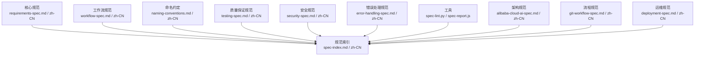
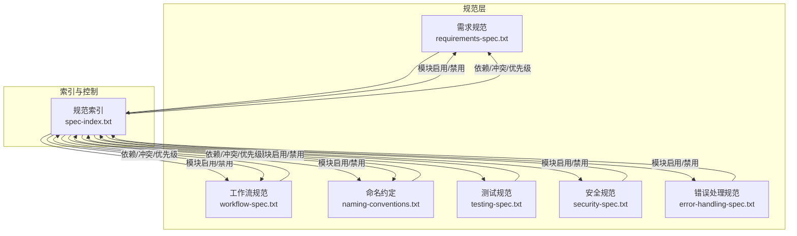
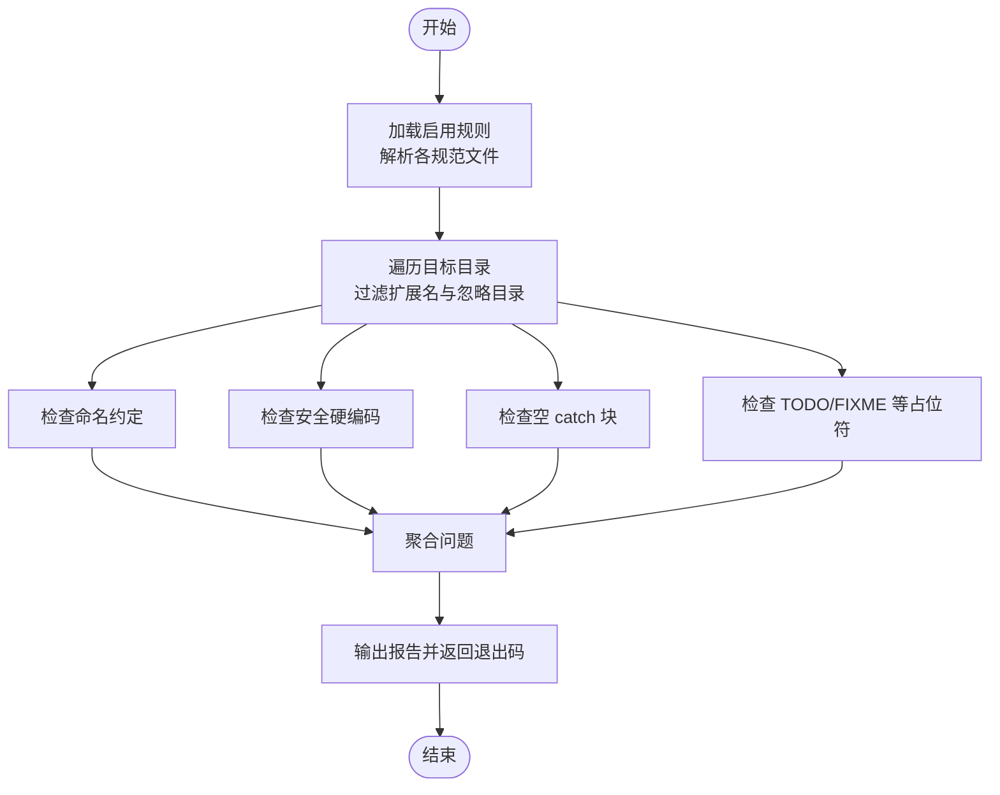

# 开发需求规范

<cite>
**本文引用的文件**
- [requirements-spec.md](file://core/requirements-spec.md)
- [requirements-spec.zh-CN.md](file://core/requirements-spec.zh-CN.md)
- [spec-index.md](file://core/spec-index.md)
- [spec-index.zh-CN.md](file://core/spec-index.zh-CN.md)
- [README.md](file://README.md)
- [spec-lint.py](file://tools/spec-lint.py)
</cite>

## 目录
1. [简介](#简介)
2. [项目结构](#项目结构)
3. [核心组件](#核心组件)
4. [架构总览](#架构总览)
5. [详细组件分析](#详细组件分析)
6. [依赖分析](#依赖分析)
7. [性能考虑](#性能考虑)
8. [故障排查指南](#故障排查指南)
9. [结论](#结论)
10. [附录](#附录)

## 简介
本文件围绕“开发需求规范”展开，系统阐述如何定义与实现符合AI辅助开发标准的功能需求。规范明确了需求描述的结构化格式、功能边界、输入输出约定，以及与后续实现阶段的衔接方式。结合requirements-spec.md的具体内容，本文进一步说明需求文档应包含的关键要素（如用户故事、验收标准、依赖项声明），并通过实际示例展示如何在AI提示中引用规范以生成符合预期的代码。同时，本文对比中英文版本文件的一致性与维护策略，指导团队同步更新；并说明该规范与其他核心规范（命名约定、工作流）的协同关系，列举常见错误及修正建议。

## 项目结构
本仓库以“规范为中心”的组织方式，将核心规范、质量保证规范、架构与流程规范分层管理，并提供工具链保障落地与持续合规。

- 核心规范（必需）：开发需求规范、工作流规范、命名约定
- 质量保证规范（推荐）：测试规范、安全规范、错误处理规范
- 架构与流程规范（可选）：阿里云AI架构规范、Git工作流规范、部署规范
- 工具：规范检查工具、合规报告生成器

图表来源
- [README.md](file://README.md#L1-L120)
- [spec-index.md](file://core/spec-index.md#L1-L173)
- [spec-index.zh-CN.md](file://core/spec-index.zh-CN.md#L1-L173)

章节来源
- [README.md](file://README.md#L1-L120)

## 核心组件
- 开发需求规范（requirements-spec）：定义AI辅助开发的13条通用规则，涵盖完整性、可运行性、API正确性、依赖最小化、错误修复一次性、注释一致性、功能优先、编译通过、示例一致性、命名约定尊重、真实库使用、项目类型配置与优先级等。
- 规范索引（spec-index）：集中控制模块启用状态、全局开关、规则依赖与冲突、项目类型配置、优先级与覆盖项，确保多规范协同工作。
- 工具链：spec-lint.py用于静态检查，辅助在CI/本地校验代码是否满足启用的规范。

章节来源
- [requirements-spec.md](file://core/requirements-spec.md#L1-L267)
- [requirements-spec.zh-CN.md](file://core/requirements-spec.zh-CN.md#L1-L267)
- [spec-index.md](file://core/spec-index.md#L1-L173)
- [spec-index.zh-CN.md](file://core/spec-index.zh-CN.md#L1-L173)
- [spec-lint.py](file://tools/spec-lint.py#L1-L269)

## 架构总览
规范之间的协同关系如下：需求规范优先保证代码正确性与可运行性；工作流规范负责发布治理与流程合规；命名约定在不影响代码正确性时适用；当出现冲突时，通过优先级与冲突化解机制决定取舍。

图表来源
- [spec-index.md](file://core/spec-index.md#L1-L173)
- [spec-index.zh-CN.md](file://core/spec-index.zh-CN.md#L1-L173)

## 详细组件分析

### 开发需求规范（13条规则）
- 规则1：生成完整可运行代码（无占位符、无TODO）
- 规则2：复用现有代码与API，不重复发明轮子
- 规则3：最小化新增依赖，优先使用现有依赖
- 规则4：从历史错误中学习，避免重复犯错
- 规则5：仅修改明确请求的内容，不擅自重构
- 规则6：验证所有API存在，不使用不存在的方法
- 规则7：第一次就完全修复错误，解决根因
- 规则8：注释与实现保持一致
- 规则9：功能优先于完美，先让代码跑起来
- 规则10：确保代码能编译/运行
- 规则11：严格遵循提供的示例
- 规则12：尊重项目命名约定
- 规则13：只使用真实存在的库

项目类型配置（推荐启用的规则集）：
- Web应用：启用规则1/2/3/5/6/7/10/11/12/13，可选规则8/9
- CLI工具：启用规则1/2/3/5/6/7/10/12/13，可选规则8/9/11
- 库/SDK：启用规则1/2/3/6/7/10/12/13，可选规则5/8/9/11

章节来源
- [requirements-spec.md](file://core/requirements-spec.md#L1-L267)
- [requirements-spec.zh-CN.md](file://core/requirements-spec.zh-CN.md#L1-L267)

### 规范索引（spec-index）
- 全局开关：默认配置、模块启用列表、镜像与语言对策略
- 模块管理：各模块状态、版本、摘要与优先规则
- 依赖与冲突：规则间的依赖关系与冲突化解策略
- 项目类型配置：Web/CLI/Library的推荐启用规则
- 优先级：代码正确性优先于流程合规，命名在不影响正确性时适用
- 覆盖项：允许在不编辑模块文件的前提下按项目覆盖规则

章节来源
- [spec-index.md](file://core/spec-index.md#L1-L173)
- [spec-index.zh-CN.md](file://core/spec-index.zh-CN.md#L1-L173)

### 工具链：规范检查（spec-lint.py）
- 功能：扫描目标目录，检查命名约定、安全硬编码、错误处理（空catch）、代码完整性（TODO/FIXME）等
- 依据：读取核心规范启用状态，按启用规则进行检查
- 输出：按文件聚合问题，区分严重程度，返回退出码

图表来源
- [spec-lint.py](file://tools/spec-lint.py#L1-L269)

章节来源
- [spec-lint.py](file://tools/spec-lint.py#L1-L269)

## 依赖分析
- 规则依赖与冲突
  - 需求规范内部：规则1与规则10存在依赖关系（完整性依赖于编译通过）
  - 需求规范与工作流：规则6（API正确性）与工作流规则2（版本管理）关联
  - 冲突化解：文档同步与最小变更策略的冲突，按优先级与影响范围决定取舍
- 优先级
  - 代码正确性与可运行性优先于流程合规
  - 命名在不影响代码正确性时适用
- 项目类型配置
  - Web/CLI/Library分别给出推荐启用的规则组合，便于快速落地

章节来源
- [spec-index.md](file://core/spec-index.md#L60-L110)
- [spec-index.zh-CN.md](file://core/spec-index.zh-CN.md#L68-L110)

## 性能考虑
- 规则层面：规则9强调“功能优先”，避免过度优化导致交付延迟
- 工具层面：spec-lint.py仅检查关键模式，避免对大型工程造成显著开销
- CI/CD集成：建议在pre-commit与CI中运行，尽早发现问题，减少返工成本

[本节为一般性指导，无需特定文件来源]

## 故障排查指南
- 常见问题与修正
  - 占位符与未完成代码：按规则1要求补齐实现，移除占位符与TODO
  - 未验证API与方法：按规则6核对API存在性与签名，确保兼容性
  - 未编译/运行：按规则10检查语法与依赖，确保构建通过
  - 未使用真实库：按规则13核对依赖来源与版本
  - 未复用现有接口：按规则2优先复用现有API，避免重复发明
  - 依赖膨胀：按规则3最小化新增依赖，优先使用内置能力
  - 未遵循示例：按规则11严格匹配示例风格与结构
  - 命名不一致：按规则12尊重项目命名约定
  - 注释与实现不一致：按规则8更新注释，确保与实现一致
  - 未修复根因：按规则7一次性修复，避免症状性处理
- 工具辅助
  - 使用spec-lint.py在本地或CI中快速定位问题
  - 结合规范索引的覆盖项与优先级，调整项目配置以平衡效率与合规

章节来源
- [requirements-spec.md](file://core/requirements-spec.md#L1-L267)
- [requirements-spec.zh-CN.md](file://core/requirements-spec.zh-CN.md#L1-L267)
- [spec-lint.py](file://tools/spec-lint.py#L1-L269)

## 结论
开发需求规范为AI辅助开发提供了明确、可执行的行为准则，确保生成代码的完整性、可运行性与一致性。通过规范索引的集中控制与工具链的自动化检查，团队可在项目生命周期中高效落地规范，降低返工与维护成本。建议在需求阶段即明确用户故事、验收标准与依赖项声明，并在实现阶段严格遵循规范，以获得高质量、可维护的交付成果。

[本节为总结性内容，无需特定文件来源]

## 附录

### 需求文档关键要素与示例
- 用户故事
  - 明确角色、目标与价值
  - 示例：用户希望登录系统，以便访问受保护资源
- 验收标准
  - 可验证的行为与结果
  - 示例：登录成功返回令牌；失败返回明确错误信息
- 依赖项声明
  - 明确使用的API、库与版本
  - 示例：使用真实存在的库与已确认可用的API
- 输入输出约定
  - 明确输入格式、约束与输出结构
  - 示例：用户名必填、密码长度≥8；返回{token, user}
- 与实现阶段衔接
  - 以规则1/6/10/13为基准，确保实现可运行、API存在、可编译、使用真实库
  - 以规则2/3最小化新增依赖，优先复用现有接口
  - 以规则5/8/11/12/18维持一致性与可维护性

章节来源
- [requirements-spec.md](file://core/requirements-spec.md#L1-L267)
- [requirements-spec.zh-CN.md](file://core/requirements-spec.zh-CN.md#L1-L267)

### 中英文版本一致性与维护策略
- 一致性
  - 两套版本均包含13条规则、项目类型配置与使用说明
  - 规则优先级、摘要与要点保持一致
- 维护策略
  - 通过规范索引的语言对策略，按需切换语言版本
  - 建议在更新时同步修订中英文版本，确保术语与表述一致
  - 使用工具链在CI中校验规范一致性，避免遗漏

章节来源
- [requirements-spec.md](file://core/requirements-spec.md#L1-L267)
- [requirements-spec.zh-CN.md](file://core/requirements-spec.zh-CN.md#L1-L267)
- [spec-index.md](file://core/spec-index.md#L1-L40)
- [spec-index.zh-CN.md](file://core/spec-index.zh-CN.md#L1-L40)

### 与其他核心规范的协同关系
- 与命名约定（naming-conventions）：在不影响代码正确性前提下，优先遵循命名约定（规则12）
- 与工作流（workflow）：发布治理优先于生成输出，API准确性与版本管理相互支撑
- 与质量保证（testing/security/error-handling）：测试完整性、安全与错误处理在实现阶段与需求阶段共同推进

章节来源
- [spec-index.md](file://core/spec-index.md#L60-L110)
- [spec-index.zh-CN.md](file://core/spec-index.zh-CN.md#L68-L110)