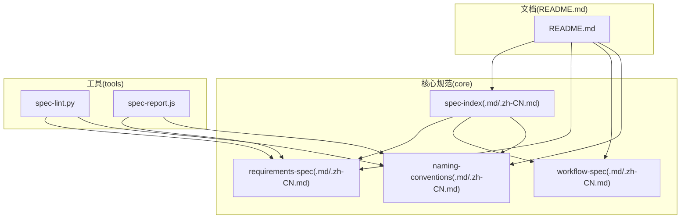
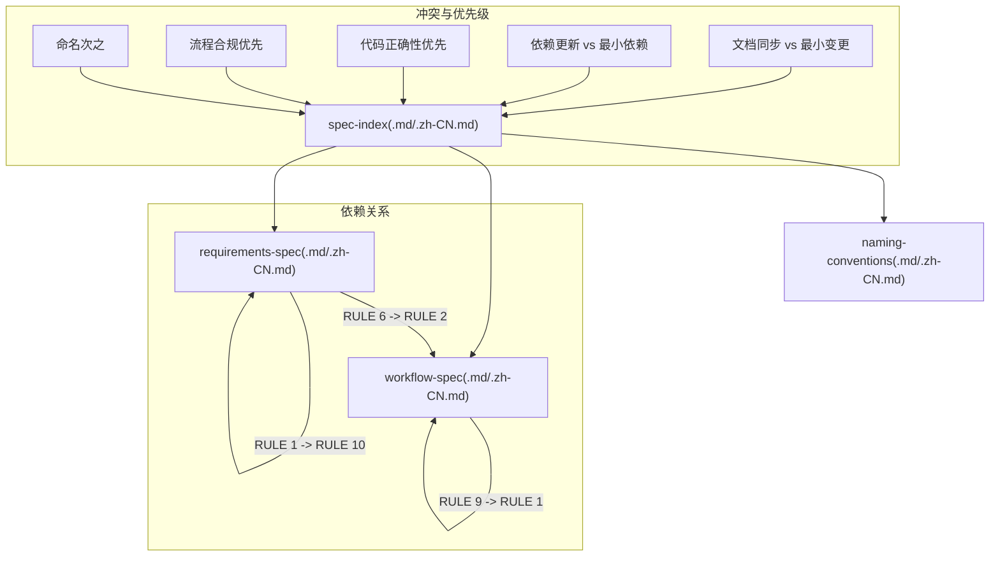
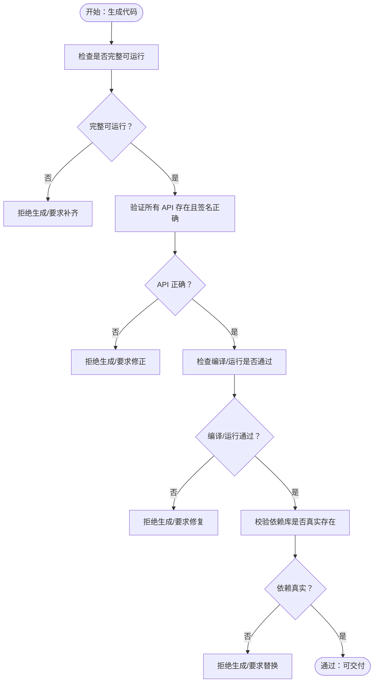
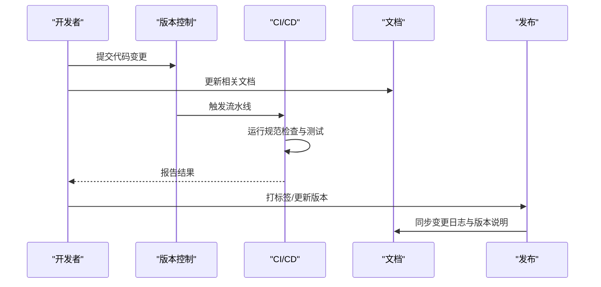
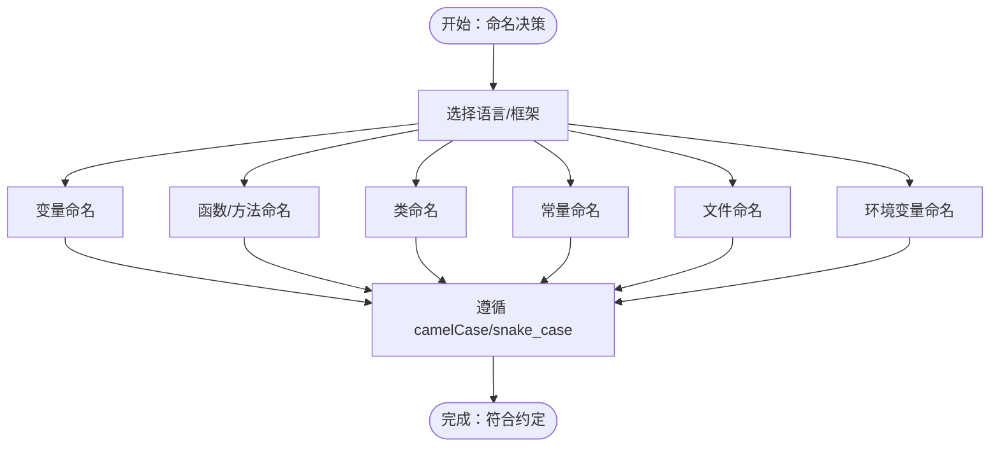
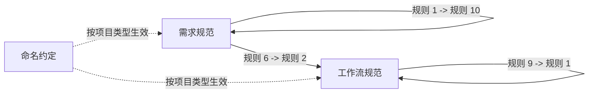

# 核心规范

<cite>
**本文引用的文件**
- [README.md](file://README.md)
- [spec-index.md](file://core/spec-index.md)
- [spec-index.zh-CN.md](file://core/spec-index.zh-CN.md)
- [requirements-spec.md](file://core/requirements-spec.md)
- [requirements-spec.zh-CN.md](file://core/requirements-spec.zh-CN.md)
- [workflow-spec.md](file://core/workflow-spec.md)
- [workflow-spec.zh-CN.md](file://core/workflow-spec.zh-CN.md)
- [naming-conventions.md](file://core/naming-conventions.md)
- [naming-conventions.zh-CN.md](file://core/naming-conventions.zh-CN.md)
- [spec-lint.py](file://tools/spec-lint.py)
- [spec-report.js](file://tools/spec-report.js)
</cite>

## 目录
1. [简介](#简介)
2. [项目结构](#项目结构)
3. [核心组件](#核心组件)
4. [架构总览](#架构总览)
5. [详细组件分析](#详细组件分析)
6. [依赖分析](#依赖分析)
7. [性能考虑](#性能考虑)
8. [故障排查指南](#故障排查指南)
9. [结论](#结论)
10. [附录](#附录)

## 简介
本文件围绕“核心规范模块”展开，系统性阐述三大支柱：开发需求、工作流与命名约定。它们共同构成项目质量与架构的基础，贯穿从代码生成到发布治理的全流程。本文将结合 spec-index.md 的索引结构，说明各规范之间的引用、组织与优先级关系，并提供面向 AI 生成过程的最佳实践建议，帮助团队在统一标准下高效协作。

## 项目结构
核心规范位于 core 目录，配套工具位于 tools 目录，README 提供整体概览与使用示例。核心规范文件包括：
- 开发需求规范：确保生成代码的完整性、可运行性与一致性
- 工作流规范：约束变更日志、版本管理、文档同步、破坏性变更、依赖更新与错误处理等流程
- 命名约定规范：统一变量、函数、类、常量、文件、环境变量等的命名风格

图表来源
- [README.md](file://README.md#L1-L120)
- [spec-index.md](file://core/spec-index.md#L1-L173)
- [requirements-spec.md](file://core/requirements-spec.md#L1-L267)
- [workflow-spec.md](file://core/workflow-spec.md#L1-L359)
- [naming-conventions.md](file://core/naming-conventions.md#L1-L458)
- [spec-lint.py](file://tools/spec-lint.py#L1-L269)
- [spec-report.js](file://tools/spec-report.js#L1-L278)

章节来源
- [README.md](file://README.md#L1-L120)

## 核心组件
- 开发需求规范（requirements-spec）：定义生成代码的最低质量门槛，强调“完整可运行、API 存在、编译通过、真实库、最小变更”等关键规则，优先级最高，直接影响生成输出质量。
- 工作流规范（workflow-spec）：定义发布治理与流程合规要求，强调“变更日志、版本管理、文档同步、破坏性变更、依赖更新、错误处理”等规则，优先级次之，保障发布质量与可追溯性。
- 命名约定规范（naming-conventions）：统一变量、函数、类、常量、文件、环境变量等命名风格，作为辅助约束，当与代码正确性冲突时，以代码正确性优先。

章节来源
- [requirements-spec.md](file://core/requirements-spec.md#L1-L267)
- [requirements-spec.zh-CN.md](file://core/requirements-spec.zh-CN.md#L1-L267)
- [workflow-spec.md](file://core/workflow-spec.md#L1-L359)
- [workflow-spec.zh-CN.md](file://core/workflow-spec.zh-CN.md#L1-L359)
- [naming-conventions.md](file://core/naming-conventions.md#L1-L458)
- [naming-conventions.zh-CN.md](file://core/naming-conventions.zh-CN.md#L1-L458)

## 架构总览
核心规范通过“中心索引”（spec-index）集中管理模块状态、版本、依赖、冲突与项目类型配置。它为 AI 生成与流程治理提供统一入口，确保三类规范协同工作。

图表来源
- [spec-index.md](file://core/spec-index.md#L69-L108)
- [spec-index.zh-CN.md](file://core/spec-index.zh-CN.md#L69-L108)

章节来源
- [spec-index.md](file://core/spec-index.md#L1-L173)
- [spec-index.zh-CN.md](file://core/spec-index.zh-CN.md#L1-L173)

## 详细组件分析

### 开发需求规范（Requirements Spec）
- 目的与范围
  - 确保生成代码“完整、可运行、真实、正确”，覆盖 API 存在性、编译通过、依赖真实性、最小变更等关键点。
  - 适用于所有语言与框架，是 AI 生成输出的首要质量基线。
- 关键规则要点
  - 生成完整可运行代码（无占位符）
  - 复用现有接口/API，避免重复造轮子
  - 最小化新增依赖，优先使用现有库
  - 仅做请求变更，禁止未授权重构
  - 验证所有 API 存在且签名正确
  - 保证代码可编译/运行
  - 使用真实存在的库
- 项目类型配置
  - Web 应用：强调完整性、API 正确性、快速修复与编译/运行保证
  - CLI 工具：强调最小依赖、稳定运行与错误处理
  - 库/SDK：强调 API 正确性、版本纪律与高质量错误处理

图表来源
- [requirements-spec.md](file://core/requirements-spec.md#L19-L216)
- [requirements-spec.zh-CN.md](file://core/requirements-spec.zh-CN.md#L19-L216)

章节来源
- [requirements-spec.md](file://core/requirements-spec.md#L1-L267)
- [requirements-spec.zh-CN.md](file://core/requirements-spec.zh-CN.md#L1-L267)

### 工作流规范（Workflow Spec）
- 目的与范围
  - 规范发布治理流程，确保变更日志、版本管理、文档同步、破坏性变更、依赖更新与错误处理等关键环节受控。
- 关键规则要点
  - 变更日志管理：按“Added/Changed/Deprecated/Removed/Fixed/Security”格式记录
  - 版本号管理：遵循语义化版本（MAJOR.MINOR.PATCH），跨文件同步
  - 文档同步：代码变更时同步更新 README、API 文档、内联注释与架构图
  - 破坏性变更协议：明确记录、提供迁移指南、提升 MAJOR 版本
  - 依赖更新策略：定期审查、安全审计、避免弃用包、生产固定版本
  - 错误处理标准：统一异常捕获、日志记录、用户提示与错误分类
- 项目类型配置
  - Web 应用：强调文档同步、依赖卫生与错误处理
  - CLI 工具：强调最小依赖与版本纪律
  - 库/SDK：强调版本管理、变更日志与依赖策略

图表来源
- [workflow-spec.md](file://core/workflow-spec.md#L19-L359)
- [workflow-spec.zh-CN.md](file://core/workflow-spec.zh-CN.md#L19-L359)

章节来源
- [workflow-spec.md](file://core/workflow-spec.md#L1-L359)
- [workflow-spec.zh-CN.md](file://core/workflow-spec.zh-CN.md#L1-L359)

### 命名约定规范（Naming Conventions）
- 目的与范围
  - 统一变量、函数、类、常量、文件、环境变量等命名风格，提升可读性与一致性。
- 关键约定要点
  - 变量命名：描述性强、避免单字母（迭代器除外）、布尔变量以 is/has/can/should 开头
  - 函数/方法命名：动词或动词短语、描述函数作用、异步函数可含 async 或暗示异步
  - 类命名：PascalCase、名词或名词短语、抽象类可加前缀
  - 常量命名：UPPER_SNAKE_CASE、分组相关常量
  - 文件命名：kebab-case/snake_case、匹配主导出、测试文件 .test/.spec 后缀、配置文件 .config 后缀
  - 环境变量命名：UPPER_SNAKE_CASE、带应用/服务前缀
- 项目类型配置
  - Web 应用：启用组件命名与环境变量命名等
  - CLI 工具：强调变量、函数、常量、文件与环境变量命名
  - 库/SDK：强调类/类型/测试命名

图表来源
- [naming-conventions.md](file://core/naming-conventions.md#L19-L458)
- [naming-conventions.zh-CN.md](file://core/naming-conventions.zh-CN.md#L19-L458)

章节来源
- [naming-conventions.md](file://core/naming-conventions.md#L1-L458)
- [naming-conventions.zh-CN.md](file://core/naming-conventions.zh-CN.md#L1-L458)

## 依赖分析
spec-index 通过“依赖关系”和“冲突与优先级”明确三类规范的联动与权衡：
- 依赖关系
  - 需求规范内部：规则 1（完整可运行）依赖规则 10（编译通过）
  - 需求规范与工作流：规则 6（API 存在）与规则 2（版本管理）关联
  - 工作流内部：破坏性变更（规则 9）同时触发版本号提升（规则 2）与变更日志记录（规则 1）
- 冲突与优先级
  - 文档同步与最小变更：当 API 或用户行为变更影响对外接口时，文档同步为强制；否则优先最小变更
  - 依赖更新与最小依赖：安全补丁与关键修复优先；非关键更新倾向最小化依赖影响
  - 优先级顺序：代码正确性与可运行性优先于发布治理，发布治理优先于命名约束

图表来源
- [spec-index.md](file://core/spec-index.md#L69-L108)
- [spec-index.zh-CN.md](file://core/spec-index.zh-CN.md#L69-L108)

章节来源
- [spec-index.md](file://core/spec-index.md#L69-L108)
- [spec-index.zh-CN.md](file://core/spec-index.zh-CN.md#L69-L108)

## 性能考虑
- 规范检查与报告工具
  - 规范检查工具（spec-lint.py）扫描目标目录，识别命名、安全、错误处理与完整性问题，支持跳过常见非代码目录，便于在大型项目中高效运行。
  - 合规报告工具（spec-report.js）统计代码文件数量与行数、测试覆盖率（若存在），并汇总各规范启用情况与总体合规率，便于持续改进。
- 工具使用建议
  - 在本地与 CI 中集成规范检查，确保每次提交均满足核心规范
  - 将合规报告作为质量门禁的一部分，推动团队持续达标

章节来源
- [spec-lint.py](file://tools/spec-lint.py#L1-L269)
- [spec-report.js](file://tools/spec-report.js#L1-L278)

## 故障排查指南
- 常见问题与定位
  - 生成代码包含占位符或 TODO：检查需求规范规则 1（完整可运行）与规则 11（严格遵循示例）
  - 使用不存在的 API 或方法：检查需求规范规则 6（验证 API 存在）
  - 代码无法编译/运行：检查需求规范规则 10（确保编译成功）
  - 导入虚构或错误版本库：检查需求规范规则 13（使用真实存在的库）
  - 文档与代码不同步：检查工作流规范规则 6（文档同步）
  - 破坏性变更未记录或版本未提升：检查工作流规范规则 9（破坏性变更协议）与规则 2（版本号管理）
  - 命名不一致：检查命名约定规范对应条目（变量、函数、类、常量、文件、环境变量）
- 工具辅助
  - 使用规范检查工具定位问题文件与行号，按严重级别（错误/警告）逐项修复
  - 使用合规报告工具评估整体达标情况，识别薄弱环节

章节来源
- [requirements-spec.md](file://core/requirements-spec.md#L19-L216)
- [workflow-spec.md](file://core/workflow-spec.md#L19-L359)
- [naming-conventions.md](file://core/naming-conventions.md#L19-L458)
- [spec-lint.py](file://tools/spec-lint.py#L1-L269)
- [spec-report.js](file://tools/spec-report.js#L1-L278)

## 结论
核心规范模块以“开发需求、工作流、命名约定”三大支柱为基础，通过中心索引实现模块化管理与协同治理。它们不仅约束代码质量与流程合规，还为 AI 生成提供明确的参考与边界，确保产出既“可用又可管”。建议在项目中：
- 将 spec-index 作为统一入口，明确模块状态与项目类型配置
- 在本地与 CI 中集成规范检查与合规报告工具
- 在 AI 对话中显式引用核心规范文件，确保生成过程受控

## 附录

### 中英文版本文件的对应关系与维护策略
- 对应关系
  - 开发需求规范：requirements-spec.md ↔ requirements-spec.zh-CN.md
  - 工作流规范：workflow-spec.md ↔ workflow-spec.zh-CN.md
  - 命名约定规范：naming-conventions.md ↔ naming-conventions.zh-CN.md
  - 中心索引：spec-index.md ↔ spec-index.zh-CN.md
- 维护策略
  - 以英文版为基准，中文版作为人类可读镜像；通过中心索引的“语言对”开关控制是否启用中文版本
  - 更新时保持标题、段落与规则编号一致，避免内容漂移
  - 使用工具链（如 README 中的示例）在 CI 中自动检查与报告

章节来源
- [README.md](file://README.md#L1-L120)
- [spec-index.md](file://core/spec-index.md#L1-L173)
- [spec-index.zh-CN.md](file://core/spec-index.zh-CN.md#L1-L173)

### AI 生成过程中的最佳实践
- 引用规范
  - 在 AI 对话中显式引用核心规范文件，例如：
    - “@core/requirements-spec.zh-CN.md @core/workflow-spec.zh-CN.md @core/naming-conventions.zh-CN.md”
  - 在 README 中说明项目采用的核心规范，便于 AI 了解上下文
- 生成策略
  - 先满足“完整可运行”与“API 存在”等关键规则，再考虑优化与重构
  - 严格遵循命名约定，避免不必要的重命名
  - 变更时同步更新文档与变更日志，遵循版本管理与破坏性变更协议
- 质量门禁
  - 在本地与 CI 中运行规范检查与合规报告，确保每次提交均达标

章节来源
- [README.md](file://README.md#L120-L210)
- [requirements-spec.md](file://core/requirements-spec.md#L217-L241)
- [workflow-spec.md](file://core/workflow-spec.md#L314-L354)
- [naming-conventions.md](file://core/naming-conventions.md#L426-L453)