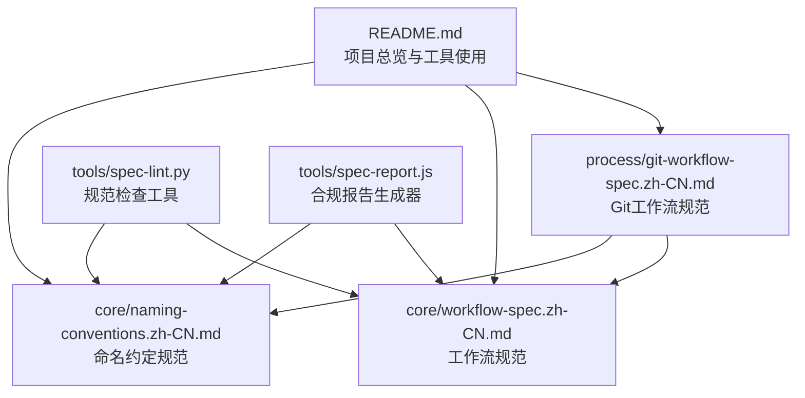
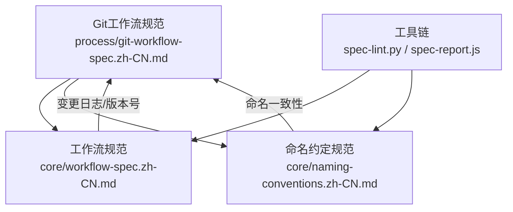
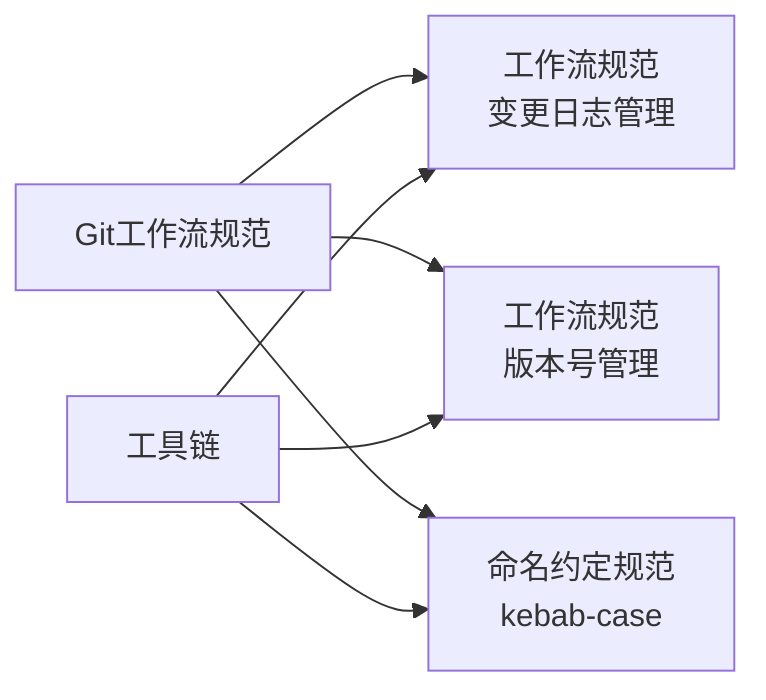

# Git工作流规范

<cite>
**本文引用的文件**
- [process/git-workflow-spec.zh-CN.md](file://process/git-workflow-spec.zh-CN.md)
- [core/workflow-spec.zh-CN.md](file://core/workflow-spec.zh-CN.md)
- [core/naming-conventions.zh-CN.md](file://core/naming-conventions.zh-CN.md)
- [README.md](file://README.md)
- [tools/spec-lint.py](file://tools/spec-lint.py)
- [tools/spec-report.js](file://tools/spec-report.js)
</cite>

## 目录
1. [简介](#简介)
2. [项目结构](#项目结构)
3. [核心组件](#核心组件)
4. [架构总览](#架构总览)
5. [详细组件分析](#详细组件分析)
6. [依赖分析](#依赖分析)
7. [性能考虑](#性能考虑)
8. [故障排查指南](#故障排查指南)
9. [结论](#结论)
10. [附录](#附录)

## 简介
本规范面向团队协作、个人项目与开源项目，系统化定义Git工作流的关键实践，包括分支命名、提交消息格式、代码审查流程、合并策略、标签管理、冲突解决与.gitignore配置等。通过“[ENABLED]/[DISABLED]”开关控制规则启用状态，并明确与workflow-spec及naming-conventions的依赖关系。同时提供针对AI辅助开发的引用方式，确保生成代码符合规范。

## 项目结构
本仓库将Git工作流规范置于process目录，配套核心工作流与命名约定规范位于core目录，README提供整体概览与工具使用说明。

图表来源
- [process/git-workflow-spec.zh-CN.md](file://process/git-workflow-spec.zh-CN.md#L1-L120)
- [core/workflow-spec.zh-CN.md](file://core/workflow-spec.zh-CN.md#L1-L60)
- [core/naming-conventions.zh-CN.md](file://core/naming-conventions.zh-CN.md#L1-L60)
- [README.md](file://README.md#L1-L120)

章节来源
- [README.md](file://README.md#L1-L120)

## 核心组件
- Git工作流规范（process/git-workflow-spec.zh-CN.md）：定义11条启用规则与项目类型配置，明确分支命名、提交消息、PR规范、分支策略、审查要求、合并策略、禁止操作、标签管理、冲突解决与.gitignore管理。
- 工作流规范（core/workflow-spec.zh-CN.md）：提供变更日志、版本号管理、文档同步、破坏性变更协议、依赖更新策略与错误处理等规则，与Git工作流规范形成互补。
- 命名约定规范（core/naming-conventions.zh-CN.md）：提供变量、函数、类、常量、文件、环境变量等命名约定，支撑Git工作流中的提交与PR描述一致性。
- 规范检查与报告工具（tools/spec-lint.py、tools/spec-report.js）：扫描启用规则并生成合规报告，辅助CI集成与本地校验。

章节来源
- [process/git-workflow-spec.zh-CN.md](file://process/git-workflow-spec.zh-CN.md#L1-L120)
- [core/workflow-spec.zh-CN.md](file://core/workflow-spec.zh-CN.md#L1-L120)
- [core/naming-conventions.zh-CN.md](file://core/naming-conventions.zh-CN.md#L1-L120)
- [tools/spec-lint.py](file://tools/spec-lint.py#L1-L120)
- [tools/spec-report.js](file://tools/spec-report.js#L1-L120)

## 架构总览
Git工作流规范与核心规范之间的关系如下：

图表来源
- [process/git-workflow-spec.zh-CN.md](file://process/git-workflow-spec.zh-CN.md#L500-L533)
- [core/workflow-spec.zh-CN.md](file://core/workflow-spec.zh-CN.md#L1-L120)
- [core/naming-conventions.zh-CN.md](file://core/naming-conventions.zh-CN.md#L1-L120)
- [tools/spec-lint.py](file://tools/spec-lint.py#L1-L120)
- [tools/spec-report.js](file://tools/spec-report.js#L1-L120)

## 详细组件分析

### 规则1：分支命名规范（feature/、hotfix/等前缀与kebab-case）
- 规则要点
  - 主分支：main/master
  - 开发分支：develop
  - 功能分支：feature/功能名称
  - 修复分支：bugfix/问题描述 或 fix/问题描述
  - 热修复分支：hotfix/紧急修复
  - 发布分支：release/版本号
  - 使用kebab-case命名
- 依赖关系
  - 与命名约定规范中的“文件命名/kebab-case”保持一致，统一风格
- 项目类型配置
  - 团队协作项目：启用
  - 个人项目：启用
  - 开源项目：启用

章节来源
- [process/git-workflow-spec.zh-CN.md](file://process/git-workflow-spec.zh-CN.md#L20-L51)
- [core/naming-conventions.zh-CN.md](file://core/naming-conventions.zh-CN.md#L153-L187)

### 规则2：提交消息规范（Conventional Commits）
- 规则要点
  - 格式：<type>(<scope>): <subject>
  - type：feat、fix、docs、style、refactor、test、chore
  - scope：可选，影响的模块
  - subject：简短描述（小于50字符）
  - body/footer：可选，Breaking Changes或关闭Issue
- 依赖关系
  - 与工作流规范中的“变更日志管理”对齐，便于自动生成变更日志与版本号判断
- 项目类型配置
  - 团队协作项目：启用
  - 个人项目：启用
  - 开源项目：启用

章节来源
- [process/git-workflow-spec.zh-CN.md](file://process/git-workflow-spec.zh-CN.md#L53-L95)
- [core/workflow-spec.zh-CN.md](file://core/workflow-spec.zh-CN.md#L19-L46)

### 规则3：提交频率（小而频繁的提交）
- 规则要点
  - 每个提交是独立逻辑单元
  - 避免混杂多个不相关修改
  - 提交前确保可编译与运行
  - 一天至少一次工作进度
  - 每个提交只解决一个问题
- 项目类型配置
  - 团队协作项目：启用
  - 个人项目：可选
  - 开源项目：可选

章节来源
- [process/git-workflow-spec.zh-CN.md](file://process/git-workflow-spec.zh-CN.md#L96-L116)

### 规则4：Pull Request规范
- 规则要点
  - PR标题使用与提交消息相同的格式
  - 提供清晰描述与上下文
  - 包含相关Issue链接
  - 添加适当标签（feature、bugfix等）
  - 通过所有CI检查后再请求审查
  - 至少一位审查者批准才能合并
- 项目类型配置
  - 团队协作项目：启用
  - 个人项目：可选
  - 开源项目：启用

章节来源
- [process/git-workflow-spec.zh-CN.md](file://process/git-workflow-spec.zh-CN.md#L117-L164)

### 规则5：分支策略（Git Flow与GitHub Flow）
- 规则要点
  - Git Flow：main（生产）、develop（开发）、feature/*、release/*、hotfix/*
  - GitHub Flow：main始终可部署，feature/*，通过PR合并到main并立即部署
- 项目类型配置
  - 团队协作项目：启用
  - 个人项目：可选
  - 开源项目：启用

章节来源
- [process/git-workflow-spec.zh-CN.md](file://process/git-workflow-spec.zh-CN.md#L166-L211)

### 规则6：代码审查要求（强制代码审查）
- 规则要点
  - 所有代码必须经审查才能合并
  - 审查者检查：代码质量、规范遵循、测试、安全、性能
  - 提供建设性反馈
  - 及时响应审查请求（24小时内）
- 项目类型配置
  - 团队协作项目：启用
  - 个人项目：可选
  - 开源项目：启用

章节来源
- [process/git-workflow-spec.zh-CN.md](file://process/git-workflow-spec.zh-CN.md#L213-L241)

### 规则7：合并策略（Merge Commit、Squash and Merge、Rebase and Merge）
- 规则要点
  - Merge Commit：保留完整历史，适合功能分支
  - Squash and Merge：压缩提交，适合小型功能
  - Rebase and Merge：线性历史，适合保持主分支清晰
  - 选择建议：feature→develop用Merge Commit；develop→main用Merge Commit；hotfix→main用Merge Commit；小型PR用Squash and Merge
- 项目类型配置
  - 团队协作项目：启用
  - 个人项目：可选
  - 开源项目：启用

章节来源
- [process/git-workflow-spec.zh-CN.md](file://process/git-workflow-spec.zh-CN.md#L243-L277)

### 规则8：禁止的操作（避免危险的Git操作）
- 规则要点
  - 禁止直接推送到main/master分支
  - 禁止强制推送到共享分支（git push -f）
  - 禁止修改已推送的公共历史
  - 禁止提交敏感信息（密钥、密码）
  - 禁止提交大文件（>100MB）
- 保护措施
  - 分支保护规则（PR审查、状态检查、限制推送）
  - Git hooks示例（pre-commit：敏感信息与大文件检查）
- 项目类型配置
  - 团队协作项目：启用
  - 个人项目：启用
  - 开源项目：启用

章节来源
- [process/git-workflow-spec.zh-CN.md](file://process/git-workflow-spec.zh-CN.md#L279-L318)

### 规则9：标签管理（语义化版本标签）
- 规则要点
  - 使用语义化版本号：v主版本.次版本.修订版本
  - 主要发布创建带注释的标签
  - 标签消息包含发布说明
  - 标签应指向稳定的提交
- 依赖关系
  - 与工作流规范中的“版本号管理”对齐
- 项目类型配置
  - 团队协作项目：启用
  - 个人项目：启用
  - 开源项目：启用

章节来源
- [process/git-workflow-spec.zh-CN.md](file://process/git-workflow-spec.zh-CN.md#L320-L356)
- [core/workflow-spec.zh-CN.md](file://core/workflow-spec.zh-CN.md#L49-L71)

### 规则10：冲突解决（合并冲突处理流程）
- 规则要点
  - 定期从主分支同步到功能分支
  - 冲突解决后充分测试
  - 保留有意义的修改，删除冗余代码
  - 冲突解决后请原作者审查
- 项目类型配置
  - 团队协作项目：启用
  - 个人项目：可选
  - 开源项目：可选

章节来源
- [process/git-workflow-spec.zh-CN.md](file://process/git-workflow-spec.zh-CN.md#L358-L386)

### 规则11：.gitignore管理（忽略不应提交的文件）
- 规则要点
  - 忽略依赖目录（node_modules、venv）
  - 忽略构建输出（dist、build）
  - 忽略IDE配置（.vscode、.idea）
  - 忽略环境变量文件（.env）
  - 忽略日志文件（*.log）
  - 忽略临时文件
- 项目类型配置
  - 团队协作项目：启用
  - 个人项目：启用
  - 开源项目：启用

章节来源
- [process/git-workflow-spec.zh-CN.md](file://process/git-workflow-spec.zh-CN.md#L388-L439)

### 规则12：Commit Hooks（可选）
- 规则要点
  - pre-commit：代码格式化、lint检查
  - commit-msg：提交消息格式验证
  - pre-push：运行测试
  - 使用husky等工具
- 项目类型配置
  - 团队协作项目：可选
  - 个人项目：可选
  - 开源项目：可选

章节来源
- [process/git-workflow-spec.zh-CN.md](file://process/git-workflow-spec.zh-CN.md#L441-L478)

### 项目类型配置建议
- 团队协作项目：启用规则1~11，可选规则12
- 个人项目：启用规则1、2、3、8、9、11，可选规则4、5、6、7、10、12
- 开源项目：启用规则1、2、3、4、5、6、7、8、9、11，可选规则10、12

章节来源
- [process/git-workflow-spec.zh-CN.md](file://process/git-workflow-spec.zh-CN.md#L484-L498)

## 依赖分析
- 与工作流规范的依赖
  - 提交消息对齐变更日志管理（规则2→规则1）
  - 标签管理对齐版本号管理（规则9→规则2）
- 与命名约定规范的依赖
  - 分支命名与文件命名均采用kebab-case，保持一致性
- 工具链依赖
  - 规范检查与报告工具扫描启用规则，辅助CI集成与本地校验

图表来源
- [process/git-workflow-spec.zh-CN.md](file://process/git-workflow-spec.zh-CN.md#L504-L510)
- [core/workflow-spec.zh-CN.md](file://core/workflow-spec.zh-CN.md#L19-L71)
- [core/naming-conventions.zh-CN.md](file://core/naming-conventions.zh-CN.md#L153-L187)
- [tools/spec-lint.py](file://tools/spec-lint.py#L1-L120)
- [tools/spec-report.js](file://tools/spec-report.js#L1-L120)

章节来源
- [process/git-workflow-spec.zh-CN.md](file://process/git-workflow-spec.zh-CN.md#L504-L510)
- [core/workflow-spec.zh-CN.md](file://core/workflow-spec.zh-CN.md#L19-L71)
- [core/naming-conventions.zh-CN.md](file://core/naming-conventions.zh-CN.md#L153-L187)
- [tools/spec-lint.py](file://tools/spec-lint.py#L1-L120)
- [tools/spec-report.js](file://tools/spec-report.js#L1-L120)

## 性能考虑
- 提交频率与体积
  - 小而频繁的提交有助于快速定位问题与减少冲突
  - 控制提交体量，避免大文件与二进制文件进入仓库
- 合并策略选择
  - 功能分支使用Merge Commit保留历史
  - 小型PR使用Squash and Merge减少历史碎片
  - Rebase and Merge保持主分支线性历史，便于回溯
- CI与Hook
  - 在CI中执行规范检查与测试，避免无效推送
  - 使用pre-commit钩子拦截问题，降低失败成本

## 故障排查指南
- 提交被拒绝（分支保护）
  - 检查分支保护规则是否要求PR审查与状态检查
  - 确认已满足审查与CI要求
- 提交消息不规范
  - 使用Conventional Commits格式，subject长度与类型符合要求
- 冲突频繁
  - 定期从主分支同步到功能分支，冲突解决后充分测试
- 敏感信息泄露
  - 使用分支保护与pre-commit钩子阻止敏感信息提交
  - 删除历史中的敏感信息并重写推送（仅限未共享分支）
- 标签缺失或不规范
  - 为主要发布创建带注释的标签，包含发布说明
  - 标签指向稳定提交

章节来源
- [process/git-workflow-spec.zh-CN.md](file://process/git-workflow-spec.zh-CN.md#L279-L356)
- [tools/spec-lint.py](file://tools/spec-lint.py#L108-L160)
- [tools/spec-report.js](file://tools/spec-report.js#L106-L130)

## 结论
Git工作流规范通过统一的分支命名、提交消息、PR流程、审查与合并策略，显著提升协作效率与代码质量。配合工作流规范与命名约定规范，形成从提交到发布的闭环。通过工具链与Hook实现自动化检查，进一步降低人为失误风险。团队可根据项目类型灵活启用规则，确保规范落地与持续改进。

## 附录

### AI辅助开发中的引用方式
- 在AI对话中引用规范文件，确保生成代码符合启用的规则
- 引用示例（按需组合）
  - @process/git-workflow-spec.zh-CN.md
  - @core/workflow-spec.zh-CN.md
  - @core/naming-conventions.zh-CN.md

章节来源
- [README.md](file://README.md#L63-L90)
- [process/git-workflow-spec.zh-CN.md](file://process/git-workflow-spec.zh-CN.md#L1-L18)
- [core/workflow-spec.zh-CN.md](file://core/workflow-spec.zh-CN.md#L1-L18)
- [core/naming-conventions.zh-CN.md](file://core/naming-conventions.zh-CN.md#L1-L18)

### 工具链使用
- 规范检查（spec-lint.py）
  - 功能：扫描目标目录，检查命名、安全、错误处理与完整性
  - 用法：python tools/spec-lint.py [--spec-dir DIR] [--target-dir DIR]
- 合规报告（spec-report.js）
  - 功能：统计启用规则数量、代码文件与行数、测试覆盖率（若存在），输出总体合规率
  - 用法：node tools/spec-report.js [--spec-dir DIR] [--target-dir DIR] [--output FILE]

章节来源
- [tools/spec-lint.py](file://tools/spec-lint.py#L1-L120)
- [tools/spec-report.js](file://tools/spec-report.js#L1-L120)
- [README.md](file://README.md#L149-L211)

### 启用/禁用规则的切换流程
- 将STATUS从[ENABLED]改为[DISABLED]，或反之
- 更新摘要部分以反映当前状态
- 提交到版本控制，AI将自动只遵循启用的规则

章节来源
- [process/git-workflow-spec.zh-CN.md](file://process/git-workflow-spec.zh-CN.md#L511-L526)
- [core/workflow-spec.zh-CN.md](file://core/workflow-spec.zh-CN.md#L326-L333)