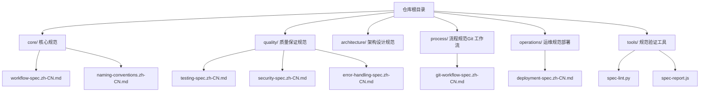
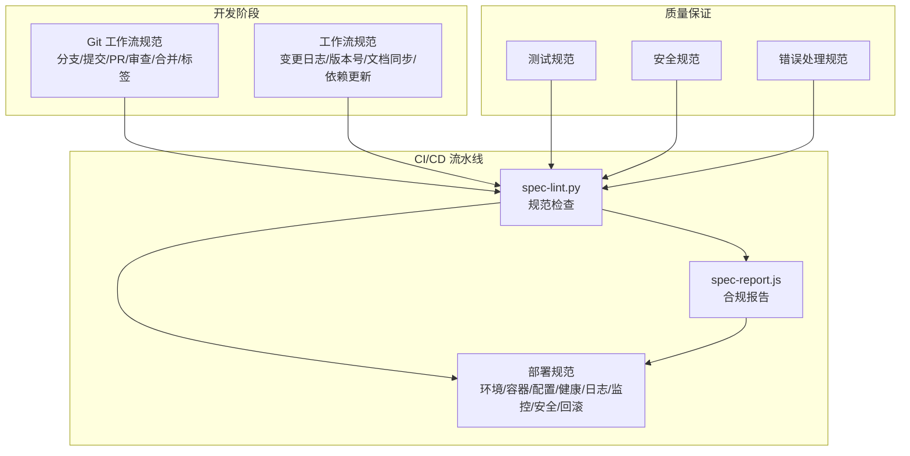
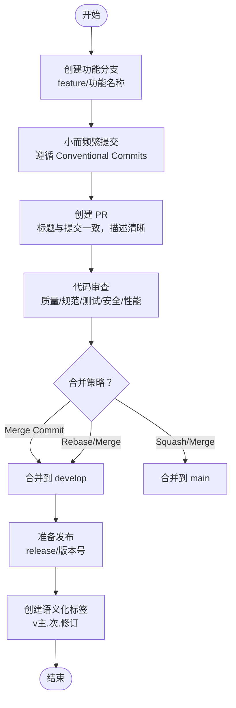
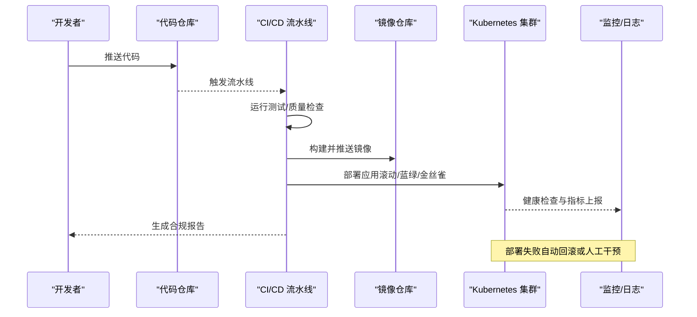
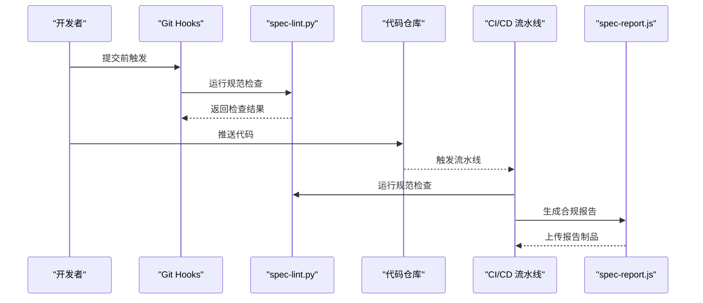
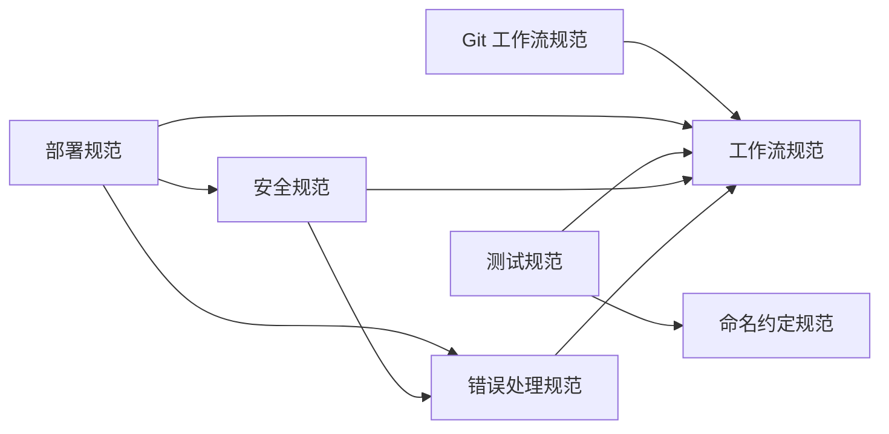

# 流程与运维规范

<cite>
**本文引用的文件**
- [README.md](file://README.md)
- [git-workflow-spec.zh-CN.md](file://process/git-workflow-spec.zh-CN.md)
- [deployment-spec.zh-CN.md](file://operations/deployment-spec.zh-CN.md)
- [workflow-spec.zh-CN.md](file://core/workflow-spec.zh-CN.md)
- [naming-conventions.zh-CN.md](file://core/naming-conventions.zh-CN.md)
- [testing-spec.zh-CN.md](file://quality/testing-spec.zh-CN.md)
- [security-spec.zh-CN.md](file://quality/security-spec.zh-CN.md)
- [error-handling-spec.zh-CN.md](file://quality/error-handling-spec.zh-CN.md)
- [spec-lint.py](file://tools/spec-lint.py)
- [spec-report.js](file://tools/spec-report.js)
</cite>

## 目录
1. [简介](#简介)
2. [项目结构](#项目结构)
3. [核心组件](#核心组件)
4. [架构总览](#架构总览)
5. [详细组件分析](#详细组件分析)
6. [依赖关系分析](#依赖关系分析)
7. [性能考虑](#性能考虑)
8. [故障排查指南](#故障排查指南)
9. [结论](#结论)
10. [附录](#附录)

## 简介
本文件整合“流程与运维规范”，围绕开发流程管理与系统部署两大实践领域，系统阐述 Git 工作流规范、提交信息格式、代码审查流程、合并规则，以及部署规范中的环境配置、发布流程、回滚机制、配置管理、健康检查、日志聚合、监控告警、安全加固与部署前检查清单。文档还解释这些规范如何与 CI/CD 自动化流水线集成，包括通过 Git Hooks 触发规范检查、在部署前自动生成合规报告，以及典型工作流示例（从 feature 分支到 release 发布）与蓝绿部署操作步骤。

## 项目结构
该仓库采用按主题域划分的结构，核心规范位于 core、质量保证 quality、架构 design、流程 process、运维 operations 与工具 tools。整体布局便于在 AI 辅助开发场景下按需引用与启用相应规范。

图表来源
- [README.md](file://README.md#L1-L120)

章节来源
- [README.md](file://README.md#L1-L120)

## 核心组件
- Git 工作流规范：定义分支命名、提交信息、提交频率、PR 规范、分支策略、代码审查、合并策略、禁止操作、标签管理、冲突解决与 .gitignore 管理等。
- 部署规范：定义环境分离、CI/CD 流水线、容器化部署、配置管理、健康检查、日志聚合、蓝绿/金丝雀发布、回滚机制、数据库迁移、监控告警、安全加固与部署前检查清单。
- 工作流规范：变更日志管理、版本号管理、文档同步、破坏性变更协议、依赖更新策略、错误处理标准等。
- 质量保证规范：测试规范（完整性、覆盖率、分层、Mock、命名、数据、边界、隔离、性能）、安全规范（输入验证、认证授权、敏感数据、依赖安全、OWASP 防护、日志安全、API 安全、配置安全、会话安全、文件上传安全、错误处理安全）、错误处理规范（分类、自定义错误类、日志记录、用户友好提示、Try-Catch、恢复策略、全局处理器、前端边界、监控告警、错误码、超时限流、文档化）。
- 工具：spec-lint.py（规范检查）、spec-report.js（合规报告生成）。

章节来源
- [git-workflow-spec.zh-CN.md](file://process/git-workflow-spec.zh-CN.md#L1-L120)
- [deployment-spec.zh-CN.md](file://operations/deployment-spec.zh-CN.md#L1-L120)
- [workflow-spec.zh-CN.md](file://core/workflow-spec.zh-CN.md#L1-L120)
- [testing-spec.zh-CN.md](file://quality/testing-spec.zh-CN.md#L1-L120)
- [security-spec.zh-CN.md](file://quality/security-spec.zh-CN.md#L1-L120)
- [error-handling-spec.zh-CN.md](file://quality/error-handling-spec.zh-CN.md#L1-L120)
- [spec-lint.py](file://tools/spec-lint.py#L1-L80)
- [spec-report.js](file://tools/spec-report.js#L1-L80)

## 架构总览
下图展示 Git 工作流与部署规范在 CI/CD 流水线中的集成关系，以及工具链如何支撑规范检查与合规报告生成。

图表来源
- [git-workflow-spec.zh-CN.md](file://process/git-workflow-spec.zh-CN.md#L1-L120)
- [deployment-spec.zh-CN.md](file://operations/deployment-spec.zh-CN.md#L1-L120)
- [workflow-spec.zh-CN.md](file://core/workflow-spec.zh-CN.md#L1-L120)
- [testing-spec.zh-CN.md](file://quality/testing-spec.zh-CN.md#L1-L120)
- [security-spec.zh-CN.md](file://quality/security-spec.zh-CN.md#L1-L120)
- [error-handling-spec.zh-CN.md](file://quality/error-handling-spec.zh-CN.md#L1-L120)
- [spec-lint.py](file://tools/spec-lint.py#L1-L80)
- [spec-report.js](file://tools/spec-report.js#L1-L80)

## 详细组件分析

### Git 工作流规范
- 分支命名规范：统一 kebab-case，主分支、开发分支、功能分支、修复分支、热修复分支、发布分支。
- 提交信息规范：Conventional Commits 格式，类型、作用域、主题、正文、页脚。
- 提交频率：小而频繁，每个提交独立逻辑单元，避免混杂提交。
- PR 规范：标题与提交消息一致，清晰描述、相关 Issue、标签、CI 通过、审查者批准。
- 分支策略：Git Flow 与 GitHub Flow 两种模式及其工作流示例。
- 代码审查要求：质量、规范、测试、安全、性能检查，及时响应。
- 合并策略：Merge Commit、Squash and Merge、Rebase and Merge 的适用场景。
- 禁止操作：禁止直接推送到主分支、禁止强制推送、禁止修改已推送历史、禁止提交敏感信息与大文件。
- 标签管理：语义化版本标签、带注释标签、推送标签、查看标签。
- 冲突解决：定期同步、冲突解决后测试、保留有意义修改、原作者审查。
- .gitignore 管理：忽略依赖、构建输出、IDE、环境变量、日志、临时文件等。

图表来源
- [git-workflow-spec.zh-CN.md](file://process/git-workflow-spec.zh-CN.md#L166-L277)

章节来源
- [git-workflow-spec.zh-CN.md](file://process/git-workflow-spec.zh-CN.md#L1-L533)

### 部署规范
- 环境分离：开发、测试/QA、预发布、生产四环境，独立配置。
- CI/CD 流水线：自动构建、测试、质量检查、构建镜像、自动部署、部署失败自动回滚。
- 容器化部署：Dockerfile 多阶段构建、.dockerignore、镜像标签、非 root 用户运行。
- 配置管理：环境变量注入、配置外部化、敏感信息加密存储、配置变更无需重建镜像。
- 健康检查：/health 与 /readiness 端点、依赖检查、返回详细状态。
- 日志聚合：结构化日志、标准输出/错误、请求 ID 追踪、日志级别。
- 蓝绿部署/金丝雀发布：零停机策略，流量切换与逐步切流。
- 回滚机制：保留最近 N 个版本、一键回滚、回滚后健康验证、记录回滚原因、数据库迁移回滚。
- 数据库迁移管理：版本化迁移、先迁移后部署、向后兼容、生产迁移备份。
- 监控与告警：关键指标、资源使用、告警阈值、APM 工具集成。
- 安全加固：最小权限、非 root 运行、镜像漏洞扫描、依赖更新、网络策略、定期安全审计。
- 部署前检查清单：测试通过、代码审查、配置正确、迁移测试、回滚计划、监控告警、性能测试、安全扫描、文档更新、团队通知。

图表来源
- [deployment-spec.zh-CN.md](file://operations/deployment-spec.zh-CN.md#L55-L116)
- [deployment-spec.zh-CN.md](file://operations/deployment-spec.zh-CN.md#L362-L441)
- [deployment-spec.zh-CN.md](file://operations/deployment-spec.zh-CN.md#L442-L559)
- [deployment-spec.zh-CN.md](file://operations/deployment-spec.zh-CN.md#L561-L645)
- [deployment-spec.zh-CN.md](file://operations/deployment-spec.zh-CN.md#L647-L751)

章节来源
- [deployment-spec.zh-CN.md](file://operations/deployment-spec.zh-CN.md#L1-L808)

### 工作流规范
- 变更日志管理：在 CHANGELOG.md 记录重要变更，遵循 Keep a Changelog 格式。
- 版本号管理：语义化版本控制，发布时更新版本号。
- 文档同步：修改代码时更新相关文档，突出记录破坏性变更。
- 破坏性变更协议：清晰记录破坏性变更、提供迁移指南、提升 MAJOR 版本号。
- 依赖更新策略：定期审查、固定版本、安全审计、订阅安全公告。
- 错误处理标准：始终处理错误、上下文记录、用户友好消息、自定义错误类。

章节来源
- [workflow-spec.zh-CN.md](file://core/workflow-spec.zh-CN.md#L1-L359)

### 质量保证规范
- 测试规范：测试完整性、覆盖率目标、测试金字塔、Mock 规范、测试命名、测试数据、边界与异常、测试隔离、测试性能。
- 安全规范：输入验证与清理、认证与授权、敏感数据保护、依赖安全管理、OWASP Top 10 防护、日志安全、API 安全、配置安全、会话安全、文件上传安全、错误处理安全。
- 错误处理规范：错误分类、自定义错误类、日志记录、用户友好提示、Try-Catch、恢复策略、全局处理器、前端边界、监控告警、错误码、超时限流、文档化。

章节来源
- [testing-spec.zh-CN.md](file://quality/testing-spec.zh-CN.md#L1-L360)
- [security-spec.zh-CN.md](file://quality/security-spec.zh-CN.md#L1-L421)
- [error-handling-spec.zh-CN.md](file://quality/error-handling-spec.zh-CN.md#L1-L576)

### 工具链与自动化
- 规范检查工具 spec-lint.py：扫描目标目录，检查命名约定、安全问题、错误处理、代码完整性，输出问题列表与退出码。
- 合规报告生成器 spec-report.js：扫描规范文件与代码，统计启用规则、覆盖率、代码统计，生成 JSON 报告并打印控制台摘要。

图表来源
- [README.md](file://README.md#L253-L294)
- [spec-lint.py](file://tools/spec-lint.py#L1-L120)
- [spec-report.js](file://tools/spec-report.js#L1-L120)

章节来源
- [README.md](file://README.md#L148-L179)
- [README.md](file://README.md#L253-L294)
- [spec-lint.py](file://tools/spec-lint.py#L1-L269)
- [spec-report.js](file://tools/spec-report.js#L1-L278)

## 依赖关系分析
- Git 工作流规范与工作流规范的关联：提交消息对齐变更日志管理；标签管理对齐版本号管理。
- 部署规范与工作流规范、安全规范、错误处理规范的关联：CI/CD 流水线集成部署前检查清单；配置管理遵循安全配置规范；日志聚合遵循日志记录规范。
- 质量保证规范之间的依赖：测试规范与命名约定、工作流规范；安全规范与错误处理规范、工作流规范；错误处理规范与安全规范、工作流规范。

图表来源
- [git-workflow-spec.zh-CN.md](file://process/git-workflow-spec.zh-CN.md#L500-L512)
- [deployment-spec.zh-CN.md](file://operations/deployment-spec.zh-CN.md#L773-L786)
- [testing-spec.zh-CN.md](file://quality/testing-spec.zh-CN.md#L330-L341)
- [security-spec.zh-CN.md](file://quality/security-spec.zh-CN.md#L388-L399)
- [error-handling-spec.zh-CN.md](file://quality/error-handling-spec.zh-CN.md#L543-L553)

章节来源
- [git-workflow-spec.zh-CN.md](file://process/git-workflow-spec.zh-CN.md#L500-L512)
- [deployment-spec.zh-CN.md](file://operations/deployment-spec.zh-CN.md#L773-L786)
- [testing-spec.zh-CN.md](file://quality/testing-spec.zh-CN.md#L330-L341)
- [security-spec.zh-CN.md](file://quality/security-spec.zh-CN.md#L388-L399)
- [error-handling-spec.zh-CN.md](file://quality/error-handling-spec.zh-CN.md#L543-L553)

## 性能考虑
- 提交频率与提交粒度：小而频繁的提交有助于更快定位问题、减少合并冲突，提升 CI/CD 通过率与部署效率。
- 测试金字塔：单元测试为主、集成测试为辅、E2E 测试精简，平衡测试速度与覆盖率，缩短反馈周期。
- 容器化与镜像优化：多阶段构建减小镜像体积，非 root 用户运行降低安全风险与资源占用。
- 健康检查与探针：合理设置初始延迟、周期、超时与失败阈值，避免误判导致的频繁重启。
- 监控与告警：设置合理的阈值与采样率，避免噪声告警影响响应效率。

## 故障排查指南
- 规范检查失败：使用 spec-lint.py 检查目标目录，根据输出的问题类型（错误/警告）逐项修复，必要时调整启用的规则集。
- 合规报告异常：使用 spec-report.js 生成报告，核对启用规则数、覆盖率与代码统计，定位覆盖率不足或规则未启用问题。
- 部署失败：检查回滚机制与回滚历史，确认数据库迁移是否可逆，验证健康检查与日志聚合是否正常。
- 安全问题：依据安全规范进行依赖审计、密钥管理与配置加固，避免硬编码密钥与敏感信息泄露。
- 错误处理：遵循错误处理规范，确保错误分类清晰、日志记录完整、用户提示友好、全局处理器有效。

章节来源
- [spec-lint.py](file://tools/spec-lint.py#L180-L269)
- [spec-report.js](file://tools/spec-report.js#L130-L236)
- [deployment-spec.zh-CN.md](file://operations/deployment-spec.zh-CN.md#L442-L559)
- [security-spec.zh-CN.md](file://quality/security-spec.zh-CN.md#L230-L262)
- [error-handling-spec.zh-CN.md](file://quality/error-handling-spec.zh-CN.md#L278-L338)

## 结论
通过 Git 工作流规范与部署规范的协同，结合质量保证规范与工具链自动化，可显著提升协作效率与上线稳定性。Git Hooks 与 CI/CD 流水线将规范检查与合规报告前置，确保每次变更都满足质量与安全要求；部署规范保障环境隔离、容器化、健康检查、日志聚合、监控告警与安全加固，形成闭环的质量与运维保障体系。典型工作流（feature → develop → release → main）与蓝绿/金丝雀发布进一步降低了发布风险，提升了系统的可维护性与可扩展性。

## 附录
- 典型工作流示例（从 feature 分支到 release 发布）
  - 开始新功能：从 develop 创建 feature 分支，开发与提交遵循提交频率与提交信息规范。
  - 完成功能：合并到 develop，准备发布：从 develop 创建 release 分支，进行测试与修复，合并到 main 并打标签。
  - 发布后：回到 develop 合并 release，删除 release 分支，完成发布周期。
- 蓝绿部署操作步骤
  - 维护两套生产环境（蓝色与绿色），通过 Service 标签切换流量至新版本，验证健康后再切换至绿色环境。
  - 若新版本异常，立即切回蓝色环境并回滚。

章节来源
- [git-workflow-spec.zh-CN.md](file://process/git-workflow-spec.zh-CN.md#L166-L211)
- [deployment-spec.zh-CN.md](file://operations/deployment-spec.zh-CN.md#L362-L441)