# 部署规范

<cite>
**本文引用的文件**
- [deployment-spec.zh-CN.md](file://operations/deployment-spec.zh-CN.md)
- [workflow-spec.zh-CN.md](file://core/workflow-spec.zh-CN.md)
- [security-spec.zh-CN.md](file://quality/security-spec.zh-CN.md)
- [error-handling-spec.zh-CN.md](file://quality/error-handling-spec.zh-CN.md)
- [README.md](file://README.md)
- [spec-index.zh-CN.md](file://core/spec-index.zh-CN.md)
</cite>

## 目录
1. [简介](#简介)
2. [项目结构](#项目结构)
3. [核心组件](#核心组件)
4. [架构总览](#架构总览)
5. [详细组件分析](#详细组件分析)
6. [依赖关系分析](#依赖关系分析)
7. [性能考量](#性能考量)
8. [故障排查指南](#故障排查指南)
9. [结论](#结论)
10. [附录](#附录)

## 简介
本规范面向生产级部署生命周期，覆盖从环境配置、CI/CD 自动化、容器化与配置外部化、健康检查、日志聚合、回滚机制、数据库迁移、监控告警、安全加固到上线前验证清单的全流程。通过“[ENABLED]/[DISABLED]”开关控制规则启用状态，并明确与 workflow-spec、security-spec、error-handling-spec 的依赖关系。同时给出 Web 应用、微服务与小型项目的差异化配置建议，并说明如何将部署规范集成到 AI 辅助开发流程中，确保 AI 生成的部署配置符合生产级要求。

## 项目结构
- 规范文件位于仓库 operations/、core/、quality/ 等目录，采用模块化设计，便于按需启用/禁用与组合引用。
- 通过 spec-index.zh-CN.md 提供全局开关与模块依赖、冲突与项目类型配置，支持在不修改各模块文件的前提下进行覆盖。

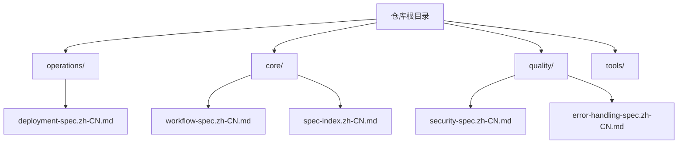

图表来源
- [README.md](file://README.md#L1-L60)
- [spec-index.zh-CN.md](file://core/spec-index.zh-CN.md#L1-L40)

章节来源
- [README.md](file://README.md#L1-L60)
- [spec-index.zh-CN.md](file://core/spec-index.zh-CN.md#L1-L40)

## 核心组件
- 环境分离：开发/测试/预发布/生产四环境独立配置，避免相互污染。
- CI/CD 流水线：自动化构建、测试、安全扫描、镜像构建与推送、部署与回滚。
- 容器化部署：多阶段构建、非 root 用户运行、镜像标签策略。
- 配置管理：环境变量注入、配置外部化（ConfigMap）、敏感信息加密存储。
- 健康检查：/health 与 /readiness 端点，结合 Kubernetes 探针。
- 日志聚合：结构化日志、请求 ID 追踪、日志聚合平台对接。
- 回滚机制：一键回滚与历史版本管理，配合数据库迁移回滚。
- 数据库迁移：版本化迁移脚本，先迁移后部署，生产环境迁移备份。
- 监控告警：关键指标采集与告警规则，APM 工具集成。
- 安全加固：最小权限原则、非 root 运行、镜像漏洞扫描、网络策略与定期安全审计。
- 部署前检查清单：上线前必检项与部署脚本流程。

章节来源
- [deployment-spec.zh-CN.md](file://operations/deployment-spec.zh-CN.md#L20-L120)
- [deployment-spec.zh-CN.md](file://operations/deployment-spec.zh-CN.md#L118-L172)
- [deployment-spec.zh-CN.md](file://operations/deployment-spec.zh-CN.md#L171-L232)
- [deployment-spec.zh-CN.md](file://operations/deployment-spec.zh-CN.md#L233-L314)
- [deployment-spec.zh-CN.md](file://operations/deployment-spec.zh-CN.md#L315-L361)
- [deployment-spec.zh-CN.md](file://operations/deployment-spec.zh-CN.md#L442-L501)
- [deployment-spec.zh-CN.md](file://operations/deployment-spec.zh-CN.md#L490-L560)
- [deployment-spec.zh-CN.md](file://operations/deployment-spec.zh-CN.md#L561-L647)
- [deployment-spec.zh-CN.md](file://operations/deployment-spec.zh-CN.md#L696-L751)

## 架构总览
下图展示部署生命周期的关键节点与依赖关系，包括 CI/CD、容器化、配置外部化、健康检查、日志聚合、回滚、数据库迁移、监控告警与安全加固。

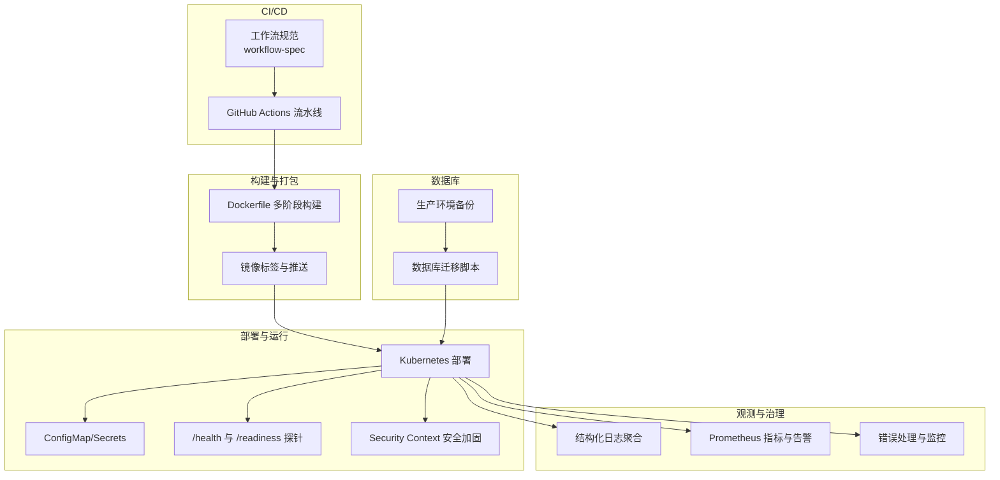

图表来源
- [deployment-spec.zh-CN.md](file://operations/deployment-spec.zh-CN.md#L55-L120)
- [deployment-spec.zh-CN.md](file://operations/deployment-spec.zh-CN.md#L118-L172)
- [deployment-spec.zh-CN.md](file://operations/deployment-spec.zh-CN.md#L171-L232)
- [deployment-spec.zh-CN.md](file://operations/deployment-spec.zh-CN.md#L233-L314)
- [deployment-spec.zh-CN.md](file://operations/deployment-spec.zh-CN.md#L315-L361)
- [deployment-spec.zh-CN.md](file://operations/deployment-spec.zh-CN.md#L490-L560)
- [deployment-spec.zh-CN.md](file://operations/deployment-spec.zh-CN.md#L561-L647)

## 详细组件分析

### 组件A：环境分离与配置外部化
- 环境分离原则：开发、测试、预发布、生产四环境独立配置，互不影响。
- 配置外部化：通过环境变量注入，不硬编码配置；使用 ConfigMap/Secrets 管理；敏感信息加密存储。
- 配置验证：启动时校验必需环境变量，缺失时报错阻止启动。

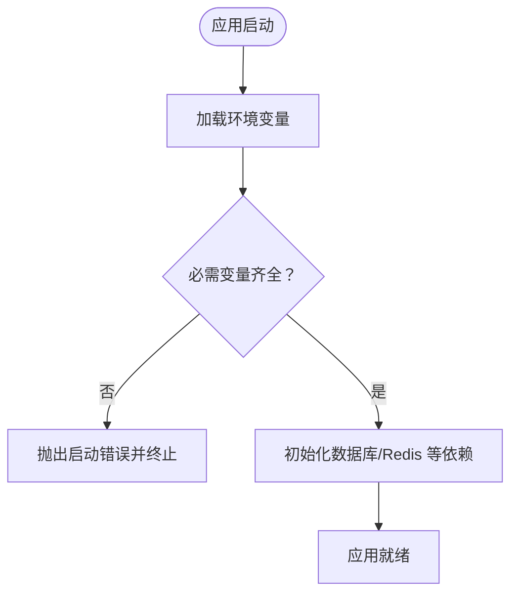

图表来源
- [deployment-spec.zh-CN.md](file://operations/deployment-spec.zh-CN.md#L171-L232)

章节来源
- [deployment-spec.zh-CN.md](file://operations/deployment-spec.zh-CN.md#L20-L53)
- [deployment-spec.zh-CN.md](file://operations/deployment-spec.zh-CN.md#L171-L232)

### 组件B：CI/CD 自动化流水线
- 触发与阶段：推送触发，依次执行测试、构建、安全扫描、镜像构建与推送、部署。
- 失败回滚：部署失败自动回滚至上一稳定版本。
- GitHub Actions 示例：包含 test/build/deploy jobs 串联与镜像标签使用。

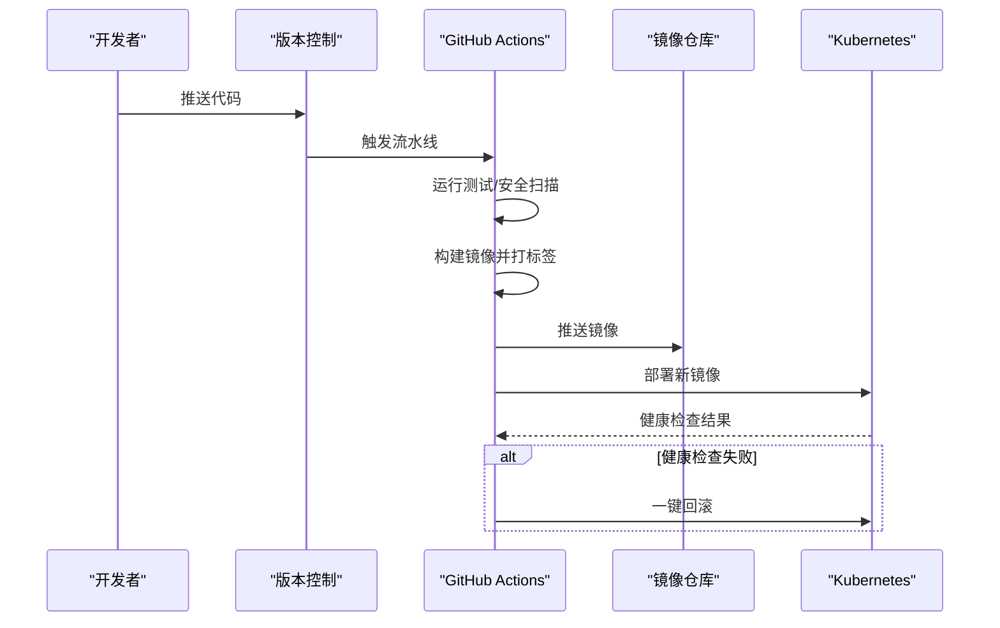

图表来源
- [deployment-spec.zh-CN.md](file://operations/deployment-spec.zh-CN.md#L55-L120)
- [deployment-spec.zh-CN.md](file://operations/deployment-spec.zh-CN.md#L713-L774)

章节来源
- [deployment-spec.zh-CN.md](file://operations/deployment-spec.zh-CN.md#L55-L120)
- [deployment-spec.zh-CN.md](file://operations/deployment-spec.zh-CN.md#L713-L774)

### 组件C：容器化与多阶段构建
- 多阶段构建：分离构建与运行阶段，减小镜像体积。
- 非 root 运行：创建非 root 用户并切换，降低权限风险。
- .dockerignore：排除不必要的文件，提升构建效率与安全性。
- 镜像标签：使用语义化版本或 Git SHA，便于追踪与回滚。

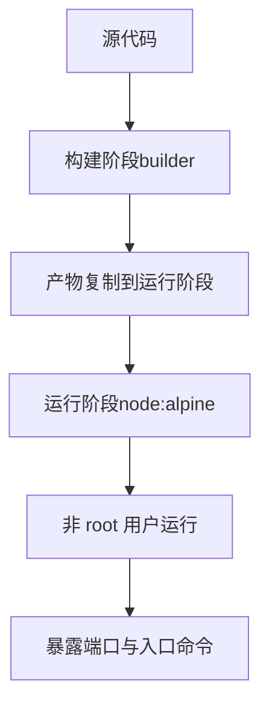

图表来源
- [deployment-spec.zh-CN.md](file://operations/deployment-spec.zh-CN.md#L118-L172)

章节来源
- [deployment-spec.zh-CN.md](file://operations/deployment-spec.zh-CN.md#L118-L172)

### 组件D：健康检查与探针
- /health：检查应用状态、数据库、外部依赖等。
- /readiness：检查应用是否已启动，适合就绪探针。
- Kubernetes 探针：livenessProbe 与 readinessProbe 配置路径、延迟、周期、超时与阈值。

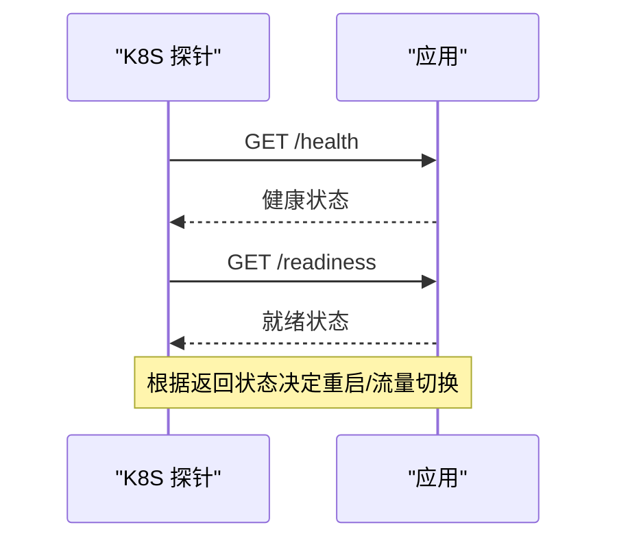

图表来源
- [deployment-spec.zh-CN.md](file://operations/deployment-spec.zh-CN.md#L233-L314)

章节来源
- [deployment-spec.zh-CN.md](file://operations/deployment-spec.zh-CN.md#L233-L314)

### 组件E：结构化日志与请求追踪
- 结构化日志：JSON 格式输出至标准输出/错误，便于日志聚合。
- 请求 ID：中间件注入请求 ID 并透传，支持跨服务链路追踪。
- 日志级别与默认元数据：服务名、环境等。

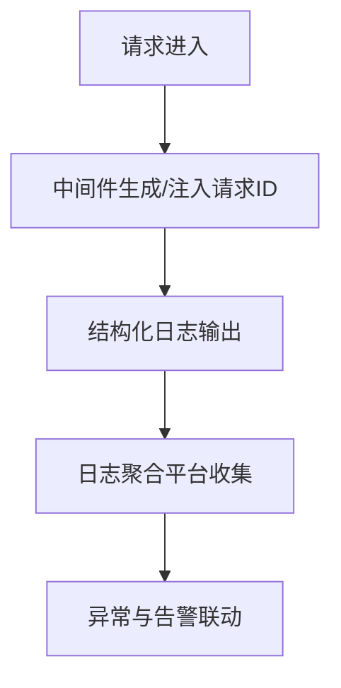

图表来源
- [deployment-spec.zh-CN.md](file://operations/deployment-spec.zh-CN.md#L315-L361)

章节来源
- [deployment-spec.zh-CN.md](file://operations/deployment-spec.zh-CN.md#L315-L361)

### 组件F：一键回滚与历史管理
- kubectl rollout 命令：支持回滚到上一版本或指定修订版本。
- 回滚验证：回滚后等待部署完成并进行健康检查。
- 数据库迁移回滚：Knex/TypeORM 迁移脚本提供 down 方法，支持回滚。

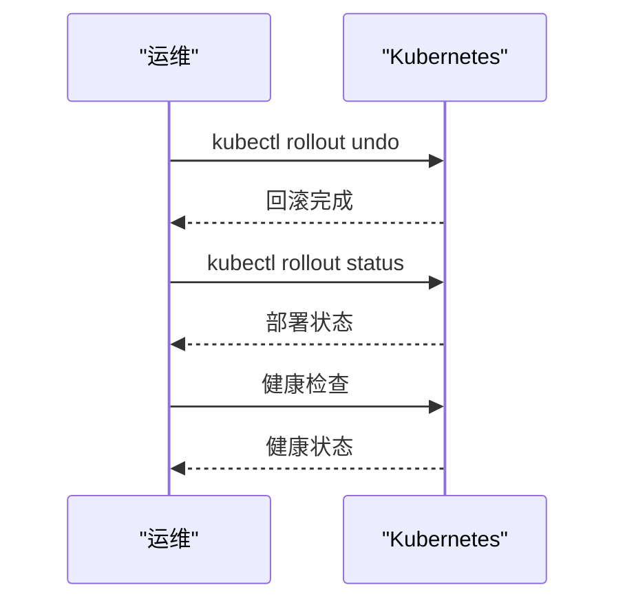

图表来源
- [deployment-spec.zh-CN.md](file://operations/deployment-spec.zh-CN.md#L442-L501)

章节来源
- [deployment-spec.zh-CN.md](file://operations/deployment-spec.zh-CN.md#L442-L501)

### 组件G：数据库迁移与备份
- 迁移策略：先迁移数据库，再部署应用；向后兼容的迁移策略。
- 生产环境：迁移前备份数据库，失败时回滚迁移。
- 迁移工具：Knex/TypeORM 提供 up/down 脚本。

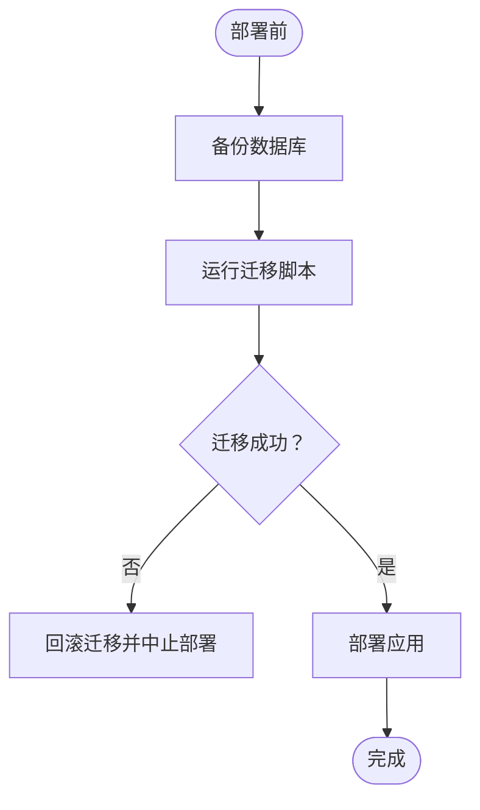

图表来源
- [deployment-spec.zh-CN.md](file://operations/deployment-spec.zh-CN.md#L490-L560)

章节来源
- [deployment-spec.zh-CN.md](file://operations/deployment-spec.zh-CN.md#L490-L560)

### 组件H：监控与告警
- 指标采集：HTTP 请求计数、响应时间直方图等。
- 指标端点：/metrics 暴露指标，供 Prometheus 抓取。
- 告警规则：基于错误率、响应时间等阈值触发告警。

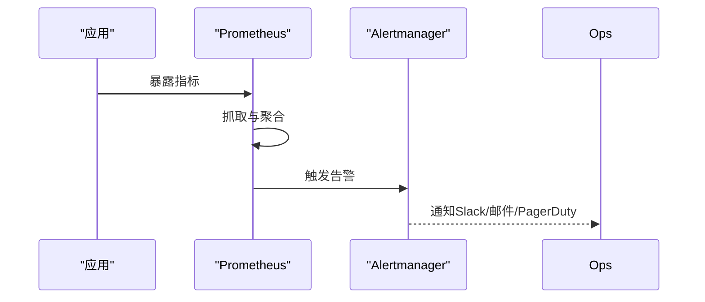

图表来源
- [deployment-spec.zh-CN.md](file://operations/deployment-spec.zh-CN.md#L561-L647)

章节来源
- [deployment-spec.zh-CN.md](file://operations/deployment-spec.zh-CN.md#L561-L647)

### 组件I：安全加固与最小权限
- 最小权限：非 root 用户运行、只读根文件系统、drop 全部能力。
- 安全上下文：runAsNonRoot、runAsUser、fsGroup、allowPrivilegeEscalation、readOnlyRootFilesystem、capabilities。
- 定期安全审计与镜像漏洞扫描。

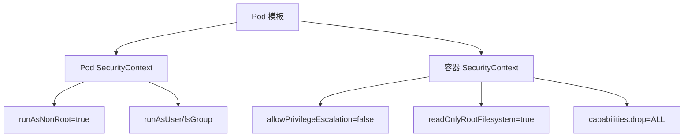

图表来源
- [deployment-spec.zh-CN.md](file://operations/deployment-spec.zh-CN.md#L647-L711)

章节来源
- [deployment-spec.zh-CN.md](file://operations/deployment-spec.zh-CN.md#L647-L711)

### 组件J：部署前验证清单
- 上线前必检项：测试通过、代码审查、配置正确、迁移脚本测试、回滚计划、监控告警、性能测试、安全扫描、文档更新、团队通知。
- 部署脚本流程：测试→构建镜像→漏洞扫描→推送→备份数据库→迁移→部署→等待→健康检查→失败回滚。

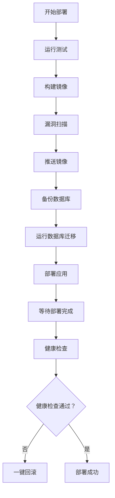

图表来源
- [deployment-spec.zh-CN.md](file://operations/deployment-spec.zh-CN.md#L696-L751)

章节来源
- [deployment-spec.zh-CN.md](file://operations/deployment-spec.zh-CN.md#L696-L751)

## 依赖关系分析
- 与 workflow-spec 的依赖：
  - CI/CD 流水线集成部署前检查清单，确保发布治理与流程合规。
- 与 security-spec 的依赖：
  - 配置管理遵循安全配置规范（不硬编码密钥、加密存储、生产环境关闭调试）。
  - 安全加固与最小权限原则。
- 与 error-handling-spec 的依赖：
  - 日志聚合遵循错误处理规范，不记录敏感信息，统一错误日志级别与上下文。

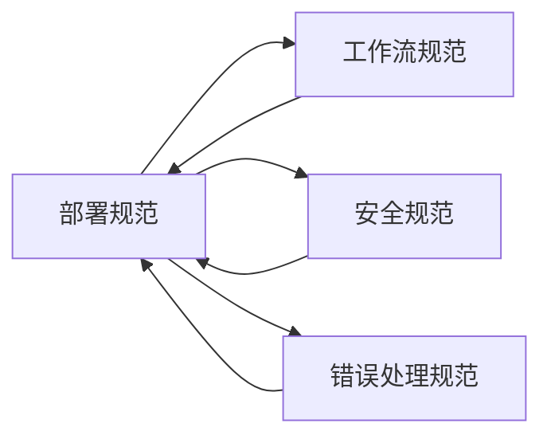

图表来源
- [deployment-spec.zh-CN.md](file://operations/deployment-spec.zh-CN.md#L773-L786)
- [security-spec.zh-CN.md](file://quality/security-spec.zh-CN.md#L230-L262)
- [error-handling-spec.zh-CN.md](file://quality/error-handling-spec.zh-CN.md#L114-L158)

章节来源
- [deployment-spec.zh-CN.md](file://operations/deployment-spec.zh-CN.md#L773-L786)
- [security-spec.zh-CN.md](file://quality/security-spec.zh-CN.md#L230-L262)
- [error-handling-spec.zh-CN.md](file://quality/error-handling-spec.zh-CN.md#L114-L158)

## 性能考量
- 容器镜像体积：多阶段构建减少运行镜像体积，缩短拉取与启动时间。
- 探针配置：合理设置初始延迟、周期、超时与失败阈值，避免频繁重启。
- 指标粒度：选择关键指标（错误率、响应时间、吞吐量），避免过度采集造成资源消耗。
- 资源配额：为容器设置 CPU/内存请求与限制，保障集群稳定性。

## 故障排查指南
- 健康检查失败：
  - 检查 /health 与 /readiness 实现与依赖服务状态。
  - 查看 Kubernetes 探针配置与日志。
- 部署失败：
  - 使用 kubectl rollout history 查看历史版本。
  - 执行 kubectl rollout undo 回滚至上一稳定版本。
- 数据库迁移失败：
  - 检查迁移脚本 up/down 是否幂等与向后兼容。
  - 生产环境迁移前备份数据库，失败时回滚迁移。
- 日志与告警：
  - 确认结构化日志输出与请求 ID 注入。
  - 检查 APM 工具与告警规则配置。

章节来源
- [deployment-spec.zh-CN.md](file://operations/deployment-spec.zh-CN.md#L233-L314)
- [deployment-spec.zh-CN.md](file://operations/deployment-spec.zh-CN.md#L442-L501)
- [deployment-spec.zh-CN.md](file://operations/deployment-spec.zh-CN.md#L490-L560)
- [deployment-spec.zh-CN.md](file://operations/deployment-spec.zh-CN.md#L561-L647)
- [deployment-spec.zh-CN.md](file://operations/deployment-spec.zh-CN.md#L315-L361)

## 结论
本部署规范以“[ENABLED]/[DISABLED]”开关为核心，围绕环境分离、CI/CD 自动化、容器化与配置外部化、健康检查、日志聚合、回滚机制、数据库迁移、监控告警与安全加固构建完整生命周期。通过与 workflow-spec、security-spec、error-handling-spec 的紧密耦合，确保部署过程可审计、可回溯、可监控、可安全。针对 Web 应用、微服务与小型项目提供差异化配置建议，并强调将部署规范集成到 AI 辅助开发流程中，以保证生成的部署配置满足生产级要求。

## 附录
- 项目类型配置建议：
  - Web 应用：启用环境分离、CI/CD、容器化、健康检查、监控告警、配置管理、日志聚合、回滚、数据库迁移、安全加固、部署前检查清单；可选蓝绿/金丝雀发布。
  - 微服务：启用上述全部规则，强调容器化、健康检查、蓝绿/金丝雀发布、监控告警。
  - 小型项目：启用环境分离、CI/CD、健康检查、回滚、部署前检查清单；其余规则按需启用。

章节来源
- [deployment-spec.zh-CN.md](file://operations/deployment-spec.zh-CN.md#L753-L786)