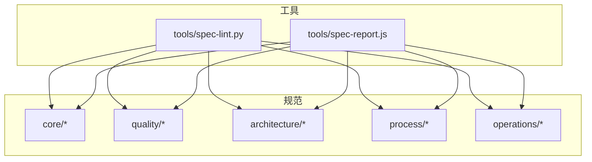
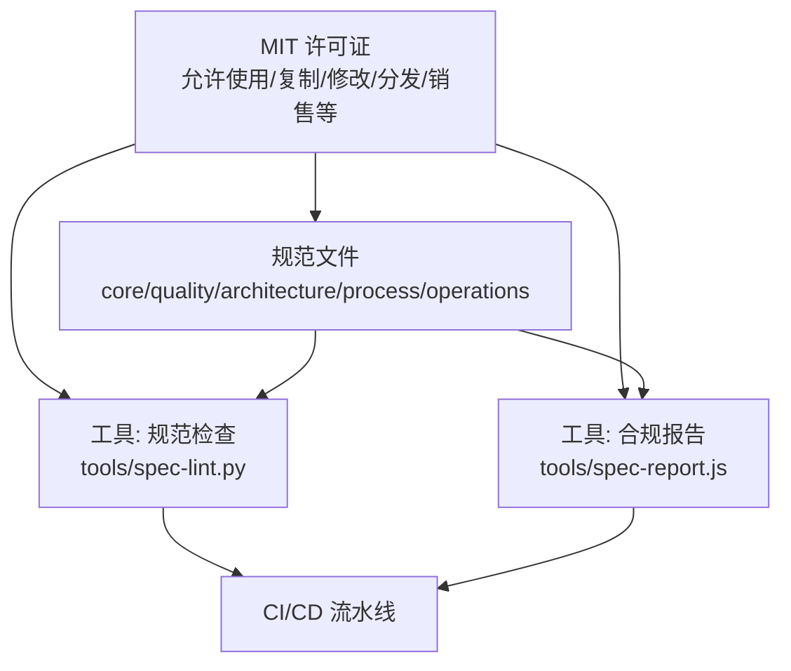
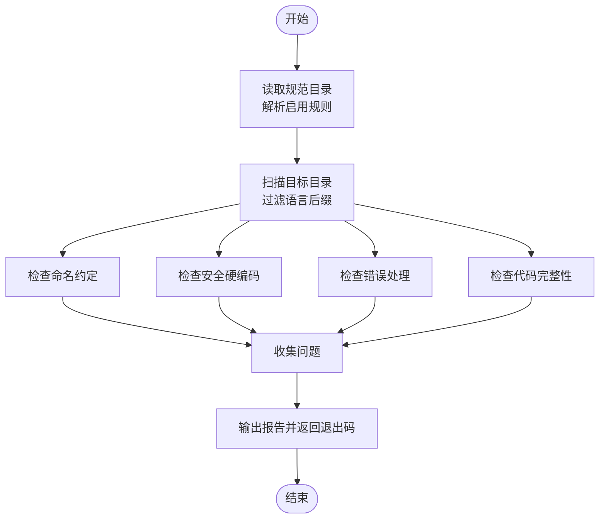
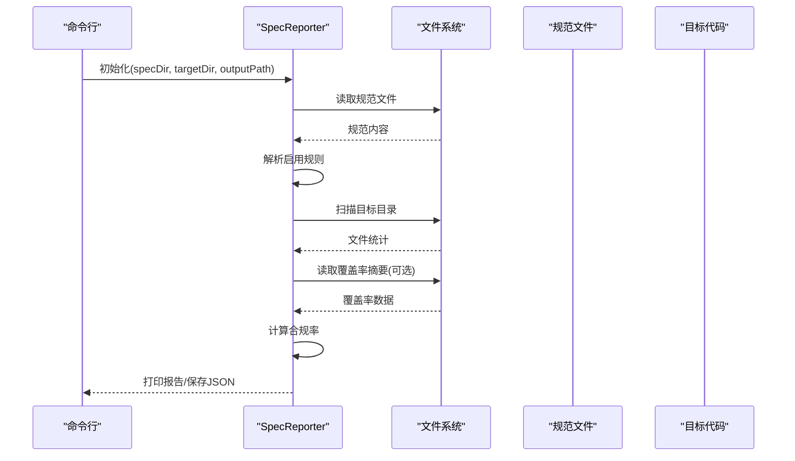

# 许可证

<cite>
**本文引用的文件**
- [README.md](file://README.md)
- [spec-lint.py](file://tools/spec-lint.py)
- [spec-report.js](file://tools/spec-report.js)
</cite>

## 目录
1. [简介](#简介)
2. [项目结构](#项目结构)
3. [核心组件](#核心组件)
4. [架构总览](#架构总览)
5. [详细组件分析](#详细组件分析)
6. [依赖分析](#依赖分析)
7. [性能考虑](#性能考虑)
8. [故障排除指南](#故障排除指南)
9. [结论](#结论)
10. [附录](#附录)

## 简介
本仓库采用 MIT 许可证。MIT 许可证是一种宽松的自由软件许可证，允许在商业项目中使用、复制、修改、合并、发布、分发、再许可和销售软件副本，前提是保留版权和许可声明。该宽松特性有助于规范体系在企业内部与开源社区的广泛采用，既满足企业合规与内控要求，也便于社区协作与二次分发。

## 项目结构
仓库采用“规范 + 工具”的组织方式：
- 规范文件位于 core、quality、architecture、process、operations 等目录，涵盖需求、命名、测试、安全、错误处理、API 设计、工作流、部署等主题。
- 工具位于 tools 目录，提供规范检查与合规报告生成能力，辅助团队在 CI/CD 中落地规范。

图表来源
- [README.md](file://README.md#L1-L120)
- [spec-lint.py](file://tools/spec-lint.py#L1-L120)
- [spec-report.js](file://tools/spec-report.js#L1-L120)

章节来源
- [README.md](file://README.md#L1-L120)

## 核心组件
- MIT 许可证条款与使用权限
  - 允许在商业项目中使用、复制、修改、合并、发布、分发、再许可和销售软件副本。
  - 必须在软件和所有副本中保留版权与许可声明。
  - 不提供任何担保与责任限制。
- 规范与工具的结合
  - 规范文件用于统一团队开发标准，工具用于自动化落地与合规报告生成，二者共同支撑高质量交付。

章节来源
- [README.md](file://README.md#L349-L357)
- [spec-lint.py](file://tools/spec-lint.py#L1-L60)
- [spec-report.js](file://tools/spec-report.js#L1-L60)

## 架构总览
下图展示 MIT 许可证在本项目中的角色定位：作为法律基础，确保规范与工具的自由使用与再分发；同时通过工具链保障规范在实际工程中的落地与可审计性。

图表来源
- [README.md](file://README.md#L349-L357)
- [spec-lint.py](file://tools/spec-lint.py#L1-L120)
- [spec-report.js](file://tools/spec-report.js#L1-L120)

## 详细组件分析

### 组件 A：MIT 许可证与使用权限
- 权利
  - 自由使用：可在个人或商业项目中使用本仓库内容。
  - 自由复制与分发：可复制、传播、再分发本仓库内容。
  - 自由修改与合并：可修改、合并本仓库内容以形成衍生作品。
  - 自由发布与销售：可发布、销售包含本仓库内容的产品或服务。
  - 自由再许可：可基于本仓库内容进行再许可。
- 义务
  - 保留声明：在分发或复制时必须保留版权与许可声明。
- 不提供担保与责任限制
  - 本仓库按“现状”提供，不提供任何明示或暗示的担保；作者不对因使用本仓库内容造成的任何损害承担责任。

章节来源
- [README.md](file://README.md#L349-L357)

### 组件 B：规范检查工具（spec-lint.py）
- 功能概述
  - 读取规范文件，解析启用的规则集合。
  - 针对目标目录中的代码文件执行静态检查，识别命名约定、安全硬编码、错误处理、代码完整性等问题。
  - 输出问题清单，并根据严重程度返回退出码。
- 关键流程
  - 解析启用规则：匹配规范文件中的“[规则 N] 或 [约定 N] [ENABLED]”标记。
  - 文件扫描：遍历目标目录，跳过常见构建/虚拟环境目录，仅检查指定语言后缀。
  - 规则检查：分别检查命名约定、安全硬编码、错误处理、代码完整性等。
  - 报告输出：汇总问题并按文件分组打印，支持退出码指示。

图表来源
- [spec-lint.py](file://tools/spec-lint.py#L1-L220)

章节来源
- [spec-lint.py](file://tools/spec-lint.py#L1-L220)

### 组件 C：合规报告生成器（spec-report.js）
- 功能概述
  - 解析规范文件，统计各规范的总规则数与启用规则数。
  - 扫描目标目录，统计文件数量与行数，按文件类型分组。
  - 读取测试覆盖率摘要（若存在），输出行/语句/函数/分支覆盖率。
  - 计算总体合规率并输出控制台报告，支持导出 JSON 报告。
- 关键流程
  - 解析规范：正则匹配“[规则/约定 N] 标题 [ENABLED/DISABLED]”。
  - 扫描代码：递归遍历目录，统计文件与行数。
  - 覆盖率检查：读取 coverage-summary.json 并提取各项指标。
  - 生成报告：打印汇总信息并可写入 JSON 文件。

图表来源
- [spec-report.js](file://tools/spec-report.js#L1-L220)

章节来源
- [spec-report.js](file://tools/spec-report.js#L1-L220)

### 组件 D：MIT 许可证在工具链中的作用
- 法律保障
  - MIT 许可证确保工具与规范可自由使用、复制、修改、分发与销售，便于在企业内部推广与在开源社区分享。
- 工具链协同
  - 规范文件与工具共同构成“规范 + 自动化”的闭环，降低人工成本，提升一致性与可审计性。

章节来源
- [README.md](file://README.md#L349-L357)
- [spec-lint.py](file://tools/spec-lint.py#L1-L120)
- [spec-report.js](file://tools/spec-report.js#L1-L120)

## 依赖分析
- 组件耦合
  - 规范文件与工具之间为弱耦合：工具通过解析规范文件中的启用状态来决定检查范围，便于灵活启用/禁用规则。
  - 工具与目标代码目录为弱耦合：工具扫描目标目录并输出问题，不依赖具体项目结构。
- 外部依赖
  - 规范检查工具依赖 Python 标准库与正则表达式，无第三方依赖。
  - 合规报告工具依赖 Node.js 标准库与文件系统，无第三方依赖。
- 风险与注意事项
  - MIT 许可证不提供担保与责任限制，使用本仓库内容时应自行评估风险并采取必要防护措施。

章节来源
- [spec-lint.py](file://tools/spec-lint.py#L1-L120)
- [spec-report.js](file://tools/spec-report.js#L1-L120)
- [README.md](file://README.md#L349-L357)

## 性能考虑
- 规范检查工具
  - 文件扫描采用递归遍历，建议在大型项目中排除 node_modules、dist、build 等目录，以减少 IO 开销。
  - 正则匹配与简单文本扫描，整体开销与文件规模线性相关。
- 合规报告工具
  - 读取覆盖率摘要与统计文件，通常开销较小。
  - 建议在 CI 中按需启用覆盖率检查，避免不必要的性能损耗。

章节来源
- [spec-lint.py](file://tools/spec-lint.py#L120-L220)
- [spec-report.js](file://tools/spec-report.js#L120-L220)

## 故障排除指南
- 规范检查工具
  - 规范目录不存在：工具会提示错误并退出。
  - 目标目录不存在：工具会提示错误并退出。
  - 退出码：无问题返回 0；存在错误类问题返回 1。
- 合规报告工具
  - 无法读取覆盖率摘要：工具会跳过覆盖率统计并继续生成报告。
  - 输出路径无效：工具会提示错误并退出。

章节来源
- [spec-lint.py](file://tools/spec-lint.py#L220-L269)
- [spec-report.js](file://tools/spec-report.js#L220-L278)

## 结论
本仓库以 MIT 许可证为基础，提供一套可自由使用、复制、修改、分发与销售的规范与工具。通过规范检查与合规报告工具，能够有效推动规范在工程中的落地与审计，助力企业与开源社区在一致性的基础上高效协作。由于 MIT 许可证不提供担保与责任限制，使用时请结合自身合规与安全要求做好风险管控。

## 附录

### 常见问题解答（FAQ）
- 是否允许在商业项目中使用？
  - 是的。MIT 许可证允许在商业项目中使用、复制、修改、合并、发布、分发、再许可和销售软件副本。
- 是否需要公开源码？
  - 不需要。MIT 许可证未要求公开源码。
- 是否需要保留版权与许可声明？
  - 是的。在分发或复制时必须保留版权与许可声明。
- 是否提供担保与责任限制？
  - 不提供任何担保；作者不对因使用本仓库内容造成的任何损害承担责任。
- 如何在企业内部推广使用？
  - 可将规范文件与工具集成到 CI/CD 流水线，自动检查与生成合规报告，降低人工成本并提升一致性。

章节来源
- [README.md](file://README.md#L349-L357)