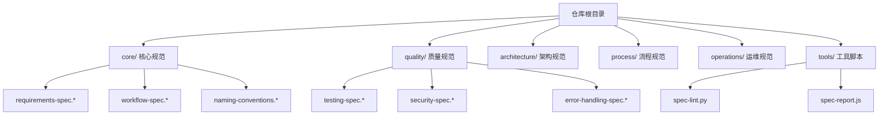
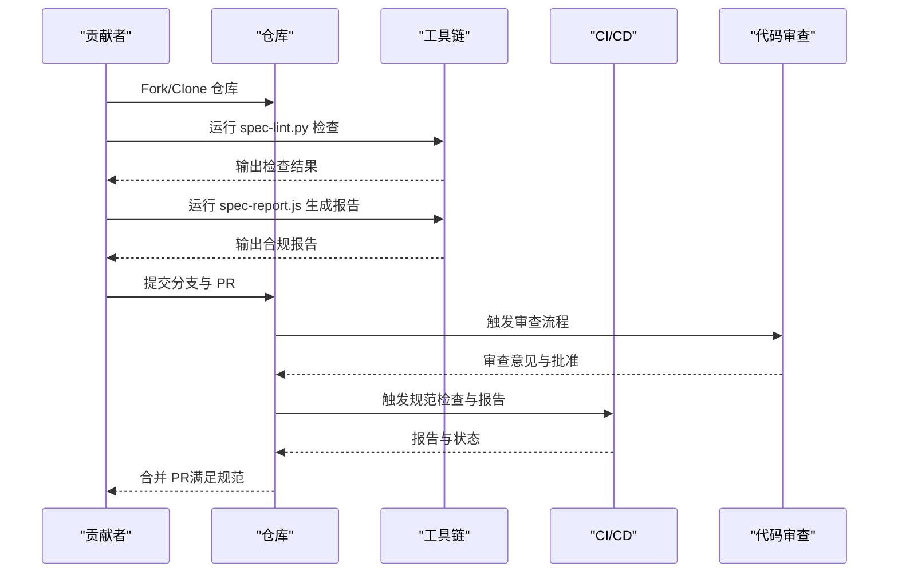
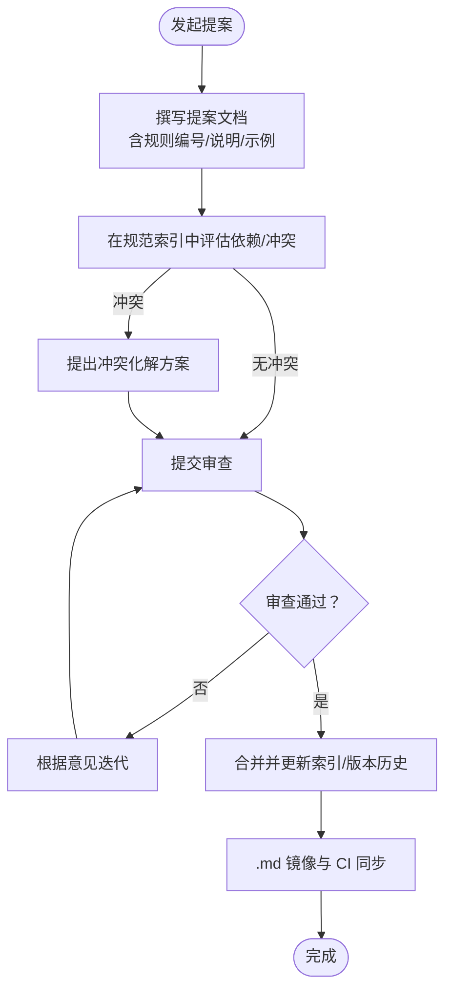
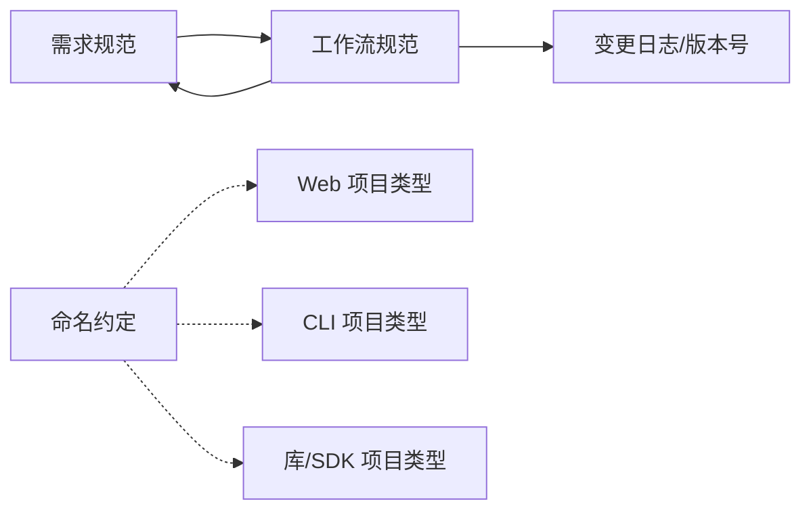

# 贡献指南

<cite>
**本文引用的文件**
- [README.md](file://README.md)
- [git-workflow-spec.zh-CN.md](file://process/git-workflow-spec.zh-CN.md)
- [spec-index.md](file://core/spec-index.md)
- [spec-index.zh-CN.md](file://core/spec-index.zh-CN.md)
- [requirements-spec.md](file://core/requirements-spec.md)
- [workflow-spec.md](file://core/workflow-spec.md)
- [naming-conventions.md](file://core/naming-conventions.md)
- [testing-spec.zh-CN.md](file://quality/testing-spec.zh-CN.md)
- [security-spec.zh-CN.md](file://quality/security-spec.zh-CN.md)
- [error-handling-spec.zh-CN.md](file://quality/error-handling-spec.zh-CN.md)
- [spec-lint.py](file://tools/spec-lint.py)
- [spec-report.js](file://tools/spec-report.js)
</cite>

## 目录
1. [简介](#简介)
2. [项目结构](#项目结构)
3. [核心组件](#核心组件)
4. [架构总览](#架构总览)
5. [详细组件分析](#详细组件分析)
6. [依赖关系分析](#依赖关系分析)
7. [性能考量](#性能考量)
8. [故障排查指南](#故障排查指南)
9. [结论](#结论)
10. [附录](#附录)

## 简介
本贡献指南面向希望参与 qoder-rules-main 项目演进的社区成员，旨在提供清晰、可操作的协作流程与规范。内容涵盖：
- Issue 提交标准格式（问题描述、复现步骤、预期行为）
- Pull Request 提交规范（变更说明、测试验证、相关文件更新）
- 新规范提案评审流程（兼容性评估、与既有体系的集成）
- 文档编写格式要求（Markdown 语法、多语言同步机制、索引更新）
- 工具脚本扩展与修复（Python/JavaScript），以及社区行为准则与代码审查原则

## 项目结构
项目采用“规范 + 工具”的组织方式：
- core：核心规范（需求、工作流、命名约定）
- quality：质量保证规范（测试、安全、错误处理）
- architecture：架构设计规范（可选）
- process：流程规范（可选）
- operations：运维规范（可选）
- tools：规范验证与报告工具

图表来源
- [README.md](file://README.md#L1-L120)

章节来源
- [README.md](file://README.md#L1-L120)

## 核心组件
- 规范索引（central control file）：集中管理模块、全局开关、规则依赖、冲突与项目类型配置，支持 .txt 为主、.md 可选镜像，便于 IDE 展示与 AI 引用。
- 核心规范：需求规范（13条）、工作流规范（12条）、命名约定（12条），构成代码质量与一致性基础。
- 质量规范：测试规范（12条）、安全规范（12条）、错误处理规范（12条），保障交付质量与稳定性。
- 工具链：spec-lint.py（规范检查）、spec-report.js（合规报告），支持本地与 CI 集成。

章节来源
- [spec-index.md](file://core/spec-index.md#L1-L173)
- [spec-index.zh-CN.md](file://core/spec-index.zh-CN.md#L1-L173)
- [requirements-spec.md](file://core/requirements-spec.md#L1-L267)
- [workflow-spec.md](file://core/workflow-spec.md#L1-L359)
- [naming-conventions.md](file://core/naming-conventions.md#L1-L458)
- [testing-spec.zh-CN.md](file://quality/testing-spec.zh-CN.md#L1-L360)
- [security-spec.zh-CN.md](file://quality/security-spec.zh-CN.md#L1-L421)
- [error-handling-spec.zh-CN.md](file://quality/error-handling-spec.zh-CN.md#L1-L576)
- [spec-lint.py](file://tools/spec-lint.py#L1-L269)
- [spec-report.js](file://tools/spec-report.js#L1-L278)

## 架构总览
贡献流程围绕“规范 + 工具 + 流程”协同工作：
- 规范索引决定启用哪些规则与模块，支持项目类型配置与覆盖项。
- 工具链在本地与 CI 中执行规范检查与合规报告，辅助 PR 审查与发布治理。
- Git 工作流规范约束分支命名、提交消息、PR 规范、代码审查、合并策略与标签管理，确保变更可追踪、可审计。

图表来源
- [spec-lint.py](file://tools/spec-lint.py#L231-L269)
- [spec-report.js](file://tools/spec-report.js#L238-L278)
- [git-workflow-spec.zh-CN.md](file://process/git-workflow-spec.zh-CN.md#L117-L164)

章节来源
- [git-workflow-spec.zh-CN.md](file://process/git-workflow-spec.zh-CN.md#L117-L164)
- [README.md](file://README.md#L253-L294)

## 详细组件分析

### Issue 提交流程与标准格式
- 问题描述：清晰说明现象、影响范围与风险等级。
- 复现步骤：最小可复现实例，包含环境信息（语言、框架、版本）。
- 预期行为：明确期望结果与验收标准。
- 附加信息：截图、日志片段、相关链接（如 PR、讨论）。

章节来源
- [git-workflow-spec.zh-CN.md](file://process/git-workflow-spec.zh-CN.md#L117-L164)

### Pull Request 提交规范
- 标题与描述：与提交消息一致的格式，清晰说明变更动机、范围与影响。
- 变更说明：列出具体修改点、涉及模块与规则编号。
- 测试验证：补充或更新测试，确保覆盖率达标；必要时提供手动验证清单。
- 相关文件更新：同步更新规范索引、项目类型配置与文档镜像（若存在）。
- CI 与报告：确保工具链检查通过，并生成合规报告供审查参考。

章节来源
- [git-workflow-spec.zh-CN.md](file://process/git-workflow-spec.zh-CN.md#L117-L164)
- [spec-report.js](file://tools/spec-report.js#L131-L186)

### 新规范提案评审流程
- 前置准备：在规范索引中评估与既有模块的依赖与冲突，明确优先级。
- 提案文档：包含规则编号、标题、说明、后果、示例与项目类型配置建议。
- 依赖与冲突：在规范索引中声明依赖关系与冲突化解方案，确保与核心规范（需求、工作流、命名）兼容。
- 审查与批准：至少一名维护者审查，确认与现有体系一致、无破坏性变更。
- 合并与同步：更新规范索引摘要与版本历史，必要时同步 .md 镜像与 CI 集成。

图表来源
- [spec-index.md](file://core/spec-index.md#L69-L108)
- [spec-index.zh-CN.md](file://core/spec-index.zh-CN.md#L89-L108)

章节来源
- [spec-index.md](file://core/spec-index.md#L69-L108)
- [spec-index.zh-CN.md](file://core/spec-index.zh-CN.md#L89-L108)

### 文档编写格式要求
- Markdown 语法：遵循仓库内现有规范文件的标题层级、列表与代码块风格；使用中文段落与要点。
- 多语言同步机制：规范索引支持 .txt 为主、.md 可选镜像；可通过开关启用自动生成镜像，便于 IDE 展示。
- 索引更新方法：在规范索引中更新模块状态、规则启用情况、项目类型配置与覆盖项；更新摘要与版本历史。

章节来源
- [spec-index.md](file://core/spec-index.md#L1-L31)
- [spec-index.zh-CN.md](file://core/spec-index.zh-CN.md#L1-L31)

### 工具脚本扩展与修复
- Python 规范检查（spec-lint.py）
  - 功能：扫描目标目录，基于启用规则检查命名约定、安全问题、错误处理与代码完整性。
  - 扩展方向：新增语言/规则匹配、跳过规则、输出格式增强。
  - 修复建议：完善正则匹配边界、排除路径与文件类型、改进错误分级与定位。
- JavaScript 合规报告（spec-report.js）
  - 功能：解析规范文件、统计代码文件与行数、读取覆盖率、生成合规率与报告。
  - 扩展方向：支持更多覆盖率格式、导出多种报告格式、增强可视化。
  - 修复建议：健壮性处理缺失文件、路径解析与异常捕获。

章节来源
- [spec-lint.py](file://tools/spec-lint.py#L1-L269)
- [spec-report.js](file://tools/spec-report.js#L1-L278)

### 社区行为准则与代码审查原则
- 行为准则：尊重、包容、建设性沟通；避免人身攻击与情绪化表达。
- 代码审查原则：
  - 关注代码质量、可读性与一致性，遵循启用规则。
  - 覆盖测试、安全与错误处理，确保无明显性能与安全问题。
  - 提供建设性反馈，及时响应审查请求。
  - 保持变更范围合理，避免无关修改。

章节来源
- [git-workflow-spec.zh-CN.md](file://process/git-workflow-spec.zh-CN.md#L213-L241)

## 依赖关系分析
规范索引明确模块间的依赖与冲突，确保新增内容与既有体系兼容：
- 需求规范与工作流规范：API 准确性与版本管理联动。
- 工作流规范：破坏性变更需配合变更日志与版本号管理。
- 命名约定：按项目类型启用（如 Web 前端组件命名）。

图表来源
- [spec-index.md](file://core/spec-index.md#L69-L108)
- [spec-index.zh-CN.md](file://core/spec-index.zh-CN.md#L89-L108)

章节来源
- [spec-index.md](file://core/spec-index.md#L69-L108)
- [spec-index.zh-CN.md](file://core/spec-index.zh-CN.md#L89-L108)

## 性能考量
- 工具链性能：spec-lint.py 与 spec-report.js 在大型仓库中应避免扫描不必要的目录（如 node_modules、dist、build），并合理分批处理。
- CI 集成：将工具链检查与报告作为并行任务，缩短流水线时长；仅在 PR 或 push 时触发，避免重复执行。
- 规范启用率：通过规范索引控制启用规则数量，平衡质量与开发效率。

[本节为通用建议，无需引用具体文件]

## 故障排查指南
- 规范检查失败
  - 确认目标目录与规范目录路径正确。
  - 检查启用规则是否与项目类型匹配。
  - 查看工具输出中的错误与警告分级，逐项修复。
- 合规报告异常
  - 确认覆盖率文件存在且格式正确。
  - 检查目标目录是否包含可识别的代码文件类型。
- Git 工作流问题
  - 提交消息不符合 Conventional Commits 格式。
  - 分支命名不规范或未遵循项目类型配置。
  - PR 描述不完整或缺少审查与 CI 通过状态。

章节来源
- [spec-lint.py](file://tools/spec-lint.py#L231-L269)
- [spec-report.js](file://tools/spec-report.js#L131-L186)
- [git-workflow-spec.zh-CN.md](file://process/git-workflow-spec.zh-CN.md#L53-L95)

## 结论
通过规范索引、核心与质量规范、工具链与 Git 工作流的协同，qoder-rules-main 为社区贡献提供了清晰、可追踪、可审计的协作路径。建议贡献者在提交 Issue 与 PR 前，先对照规范索引与相关规范文件，确保变更与既有体系兼容，并充分利用工具链与 CI 集成，提升交付质量与协作效率。

[本节为总结性内容，无需引用具体文件]

## 附录
- 快速参考
  - 规范索引：集中管理模块、启用规则、项目类型配置与覆盖项。
  - 核心规范：需求、工作流、命名约定。
  - 质量规范：测试、安全、错误处理。
  - 工具链：spec-lint.py、spec-report.js。
  - Git 工作流：分支命名、提交消息、PR 规范、审查与合并策略。

章节来源
- [README.md](file://README.md#L1-L120)
- [spec-index.md](file://core/spec-index.md#L1-L173)
- [requirements-spec.md](file://core/requirements-spec.md#L1-L267)
- [workflow-spec.md](file://core/workflow-spec.md#L1-L359)
- [naming-conventions.md](file://core/naming-conventions.md#L1-L458)
- [testing-spec.zh-CN.md](file://quality/testing-spec.zh-CN.md#L1-L360)
- [security-spec.zh-CN.md](file://quality/security-spec.zh-CN.md#L1-L421)
- [error-handling-spec.zh-CN.md](file://quality/error-handling-spec.zh-CN.md#L1-L576)
- [spec-lint.py](file://tools/spec-lint.py#L1-L269)
- [spec-report.js](file://tools/spec-report.js#L1-L278)