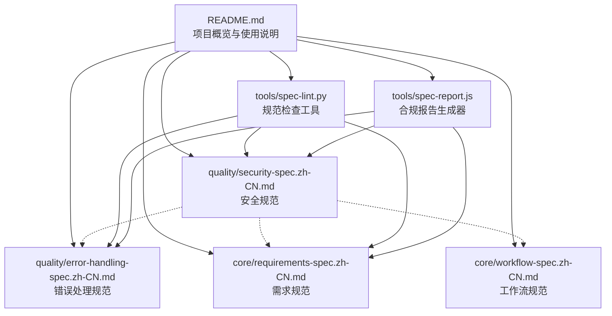
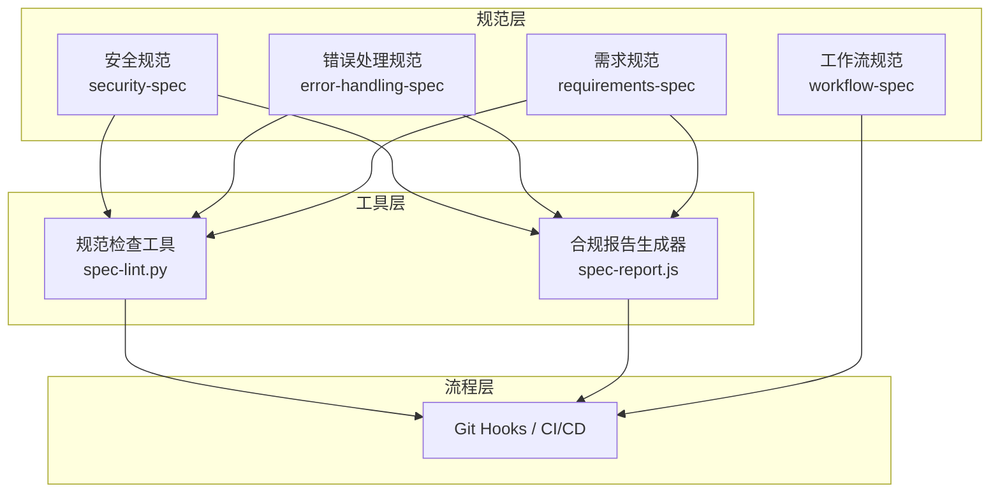
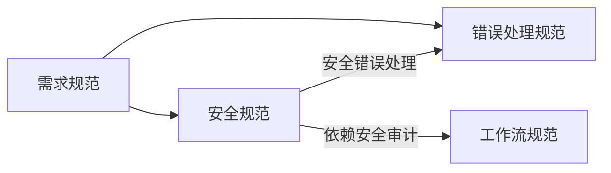
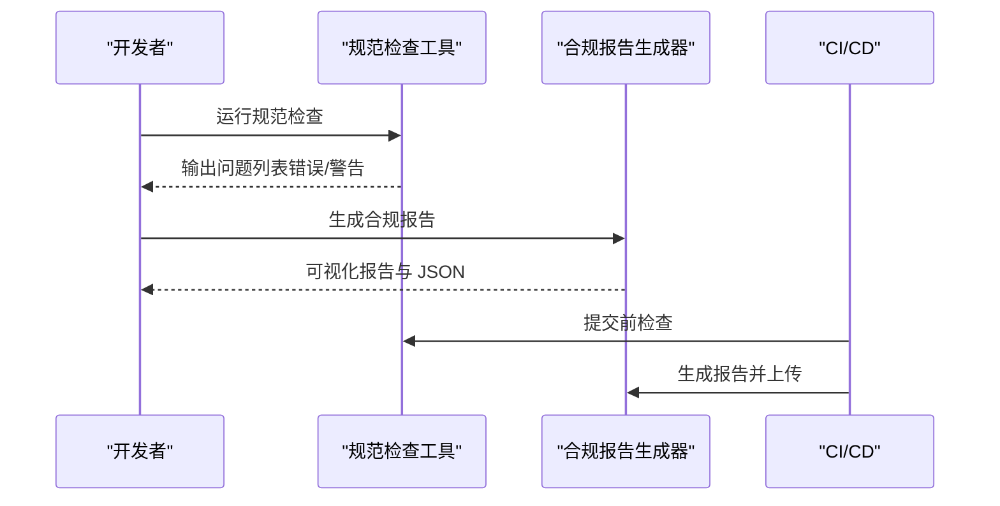

# 安全规范

<cite>
**本文引用的文件**
- [README.md](file://README.md)
- [security-spec.zh-CN.md](file://quality/security-spec.zh-CN.md)
- [error-handling-spec.zh-CN.md](file://quality/error-handling-spec.zh-CN.md)
- [requirements-spec.zh-CN.md](file://core/requirements-spec.zh-CN.md)
- [workflow-spec.zh-CN.md](file://core/workflow-spec.zh-CN.md)
- [spec-lint.py](file://tools/spec-lint.py)
- [spec-report.js](file://tools/spec-report.js)
</cite>

## 目录
1. [简介](#简介)
2. [项目结构](#项目结构)
3. [核心组件](#核心组件)
4. [架构总览](#架构总览)
5. [详细组件分析](#详细组件分析)
6. [依赖关系分析](#依赖关系分析)
7. [性能考虑](#性能考虑)
8. [故障排查指南](#故障排查指南)
9. [结论](#结论)
10. [附录](#附录)

## 简介
本文件系统化阐述“安全规范”的各项要求与实现要点，涵盖输入验证与清理、认证与授权、敏感数据保护、依赖安全管理、OWASP Top 10 防护、日志安全、API 安全、配置管理、会话安全、文件上传安全及错误处理安全等关键领域。文档结合仓库中的规范文件与工具，说明安全规则如何与 AI 生成代码过程集成，并解释安全规范与错误处理、工作流等其他规范的协同关系，以及如何通过自动化工具进行合规检查。

## 项目结构
该仓库将“安全规范”置于质量保证规范目录下，与“错误处理规范”“需求规范”“工作流规范”共同构成 AI 辅助开发的质量与安全基线。工具目录提供“规范检查”和“合规报告”两个自动化脚本，用于在本地与 CI/CD 中执行安全与质量规则的合规性评估。

图表来源
- [README.md](file://README.md#L1-L120)
- [security-spec.zh-CN.md](file://quality/security-spec.zh-CN.md#L1-L60)
- [error-handling-spec.zh-CN.md](file://quality/error-handling-spec.zh-CN.md#L1-L40)
- [requirements-spec.zh-CN.md](file://core/requirements-spec.zh-CN.md#L1-L40)
- [workflow-spec.zh-CN.md](file://core/workflow-spec.zh-CN.md#L1-L40)
- [spec-lint.py](file://tools/spec-lint.py#L1-L40)
- [spec-report.js](file://tools/spec-report.js#L1-L40)

章节来源
- [README.md](file://README.md#L1-L120)

## 核心组件
- 安全规范（quality/security-spec.zh-CN.md）：定义 12 条安全规则，覆盖输入验证、认证授权、敏感数据保护、依赖安全、OWASP Top 10 防护、日志安全、API 安全、配置管理、会话安全、文件上传安全、错误处理安全等。
- 错误处理规范（quality/error-handling-spec.zh-CN.md）：定义 12 条错误处理规则，强调错误分类、自定义错误类、日志记录、用户友好提示、全局错误处理器、前端错误边界、错误监控与告警、错误码标准化、超时与限流处理等。
- 需求规范（core/requirements-spec.zh-CN.md）：强调生成完整可运行代码、复用现有 API、最小化新增依赖、严格遵循示例、只使用真实存在的库等，为安全实现提供基础工程约束。
- 工作流规范（core/workflow-spec.zh-CN.md）：定义变更日志、版本号管理、文档同步、破坏性变更协议、依赖更新策略、错误处理标准等，支撑安全与质量的持续治理。
- 规范检查工具（tools/spec-lint.py）：扫描目标代码，识别命名约定、硬编码密钥、空 catch 块、TODO/FIXME 等问题，输出按严重程度分组的报告。
- 合规报告生成器（tools/spec-report.js）：汇总规范启用情况、代码统计、测试覆盖率等，输出可视化报告并可导出 JSON。

章节来源
- [security-spec.zh-CN.md](file://quality/security-spec.zh-CN.md#L1-L120)
- [error-handling-spec.zh-CN.md](file://quality/error-handling-spec.zh-CN.md#L1-L120)
- [requirements-spec.zh-CN.md](file://core/requirements-spec.zh-CN.md#L1-L120)
- [workflow-spec.zh-CN.md](file://core/workflow-spec.zh-CN.md#L1-L120)
- [spec-lint.py](file://tools/spec-lint.py#L1-L120)
- [spec-report.js](file://tools/spec-report.js#L1-L120)

## 架构总览
安全规范与错误处理、工作流等规范形成“规则-工具-流程”的闭环：安全规则指导编码实践，错误处理规范保障错误不泄露与可追踪，工作流规范确保变更可审计与依赖可控，工具链负责自动化检查与报告生成，CI/CD 将检查纳入流水线。

图表来源
- [security-spec.zh-CN.md](file://quality/security-spec.zh-CN.md#L388-L421)
- [error-handling-spec.zh-CN.md](file://quality/error-handling-spec.zh-CN.md#L543-L576)
- [requirements-spec.zh-CN.md](file://core/requirements-spec.zh-CN.md#L233-L267)
- [workflow-spec.zh-CN.md](file://core/workflow-spec.zh-CN.md#L314-L359)
- [spec-lint.py](file://tools/spec-lint.py#L1-L120)
- [spec-report.js](file://tools/spec-report.js#L1-L120)
- [README.md](file://README.md#L253-L303)

## 详细组件分析

### 输入验证与清理
- 要求：对外部输入（用户输入、API 参数、文件上传）进行验证与清理；使用白名单验证；清理 HTML/SQL/命令注入风险字符；验证数据类型、长度、格式、范围。
- 技术实现要点：参数化查询防 SQL 注入；输出转义或使用安全 API 防 XSS；对文件上传进行类型与大小校验、随机命名与隔离存储。
- 正反示例对比：参数化查询 vs 拼接字符串；转义输出 vs 直接 innerHTML；DOMPurify 清洗 vs 直接渲染不受控输入。
- 与错误处理协同：错误处理规范要求生产环境不暴露堆栈与内部路径，输入异常应返回通用错误消息并记录详细日志。

章节来源
- [security-spec.zh-CN.md](file://quality/security-spec.zh-CN.md#L20-L53)
- [error-handling-spec.zh-CN.md](file://quality/error-handling-spec.zh-CN.md#L279-L338)

### 认证与授权
- 要求：使用成熟认证库；密码强度与复杂度；敏感操作实施 MFA；授权检查在服务端；遵循最小权限原则。
- 技术实现要点：服务端权限校验、拒绝仅依赖前端隐藏；使用 JWT 或 API 密钥；速率限制防暴力破解；CORS 限制跨域访问。
- 正反示例对比：服务端授权 vs 仅前端隐藏；MFA 与最小权限 vs 任意访问。

章节来源
- [security-spec.zh-CN.md](file://quality/security-spec.zh-CN.md#L53-L101)
- [security-spec.zh-CN.md](file://quality/security-spec.zh-CN.md#L205-L228)

### 敏感数据保护
- 要求：密码使用 bcrypt/Argon2 单向哈希加盐；敏感数据加密存储；HTTPS/TLS 传输；不在日志、错误消息、URL 中暴露敏感数据；定期轮换密钥与令牌。
- 技术实现要点：哈希与校验流程；密钥管理与轮换；传输层加密；日志脱敏。
- 正反示例对比：bcrypt 哈希 vs 明文存储；安全日志 vs 泄露密码字段。

章节来源
- [security-spec.zh-CN.md](file://quality/security-spec.zh-CN.md#L91-L126)
- [security-spec.zh-CN.md](file://quality/security-spec.zh-CN.md#L182-L203)

### 依赖安全管理
- 要求：定期运行安全扫描（npm audit、Snyk、pip-audit、safety）；不使用已知漏洞版本；固定依赖版本；最小化依赖数量；订阅安全公告。
- 技术实现要点：固定版本与最小化依赖；供应链攻击防护；安全公告订阅与应急响应。
- 正反示例对比：安全扫描与修复 vs 忽视漏洞；固定版本 vs 自动升级引入风险。

章节来源
- [security-spec.zh-CN.md](file://quality/security-spec.zh-CN.md#L127-L157)
- [workflow-spec.zh-CN.md](file://core/workflow-spec.zh-CN.md#L228-L251)

### OWASP Top 10 防护
- 要求：遵循 OWASP Top 10 最佳实践，包括访问控制失效、加密失败、注入攻击、不安全设计、安全配置错误、易受攻击的组件、认证失败、数据完整性失败、日志记录失败、SSRF 等。
- 技术实现要点：CSP 头、CORS 策略、安全 Cookie 属性（HttpOnly、Secure、SameSite）、防点击劫持（X-Frame-Options）。
- 正反示例对比：CSP 与安全 Cookie vs 无防护。

章节来源
- [security-spec.zh-CN.md](file://quality/security-spec.zh-CN.md#L158-L181)

### 日志安全
- 要求：禁止在日志中记录密码、令牌、密钥、信用卡号、身份证；记录安全事件（登录失败、权限拒绝、异常访问）；日志文件权限受限；定期归档与清理。
- 技术实现要点：日志脱敏；分级记录；最小化敏感信息暴露。
- 正反示例对比：安全日志 vs 泄露密码字段。

章节来源
- [security-spec.zh-CN.md](file://quality/security-spec.zh-CN.md#L182-L203)
- [error-handling-spec.zh-CN.md](file://quality/error-handling-spec.zh-CN.md#L114-L158)

### API 安全
- 要求：实施速率限制防暴力破解；使用 API 密钥或 JWT 令牌认证；验证 Content-Type 防 MIME 混淆；限制请求大小防 DoS；实施 CORS 策略限制跨域访问。
- 技术实现要点：速率限制中间件；CORS 白名单；请求体大小限制；鉴权与授权。
- 正反示例对比：速率限制 vs 无限制；CORS 限制 vs 任意跨域。

章节来源
- [security-spec.zh-CN.md](file://quality/security-spec.zh-CN.md#L205-L231)
- [security-spec.zh-CN.md](file://quality/security-spec.zh-CN.md#L216-L228)

### 安全配置管理
- 要求：不在代码中硬编码密钥、密码、API 令牌；使用环境变量或密钥管理服务；不提交 .env 文件到版本控制；生产环境关闭调试模式与详细错误信息；定期轮换密钥。
- 技术实现要点：环境变量与密钥管理；.gitignore 与 CI/CD 变量管理；生产环境最小暴露面。
- 正反示例对比：环境变量 vs 硬编码密钥；.gitignore 与密钥管理 vs 提交敏感文件。

章节来源
- [security-spec.zh-CN.md](file://quality/security-spec.zh-CN.md#L230-L262)
- [spec-lint.py](file://tools/spec-lint.py#L108-L138)

### 会话安全
- 要求：会话 ID 随机且不可预测；登录后重新生成会话 ID；设置会话超时（空闲与绝对时间）；注销时销毁会话；Cookie 设置 HttpOnly、Secure、SameSite 属性。
- 技术实现要点：会话配置与生命周期管理；安全 Cookie 属性；会话重建与销毁。
- 正反示例对比：安全 Cookie 属性 vs 无属性；会话重建 vs 复用旧会话。

章节来源
- [security-spec.zh-CN.md](file://quality/security-spec.zh-CN.md#L263-L304)
- [security-spec.zh-CN.md](file://quality/security-spec.zh-CN.md#L275-L287)

### 文件上传安全
- 要求：验证文件类型（MIME type 与扩展名双重验证）；限制文件大小；扫描病毒与恶意代码；存储在非 Web 目录或对象存储；随机重命名文件，不使用原始文件名。
- 技术实现要点：文件类型与大小校验；病毒扫描；隔离存储与随机命名。
- 正反示例对比：双重验证与隔离 vs 直接接受任意类型。

章节来源
- [security-spec.zh-CN.md](file://quality/security-spec.zh-CN.md#L290-L331)
- [security-spec.zh-CN.md](file://quality/security-spec.zh-CN.md#L306-L330)

### 错误处理安全
- 要求：生产环境返回通用错误消息；不暴露堆栈跟踪、数据库架构、内部路径；详细错误仅记录到服务端日志；实施全局错误处理器。
- 技术实现要点：全局错误中间件；区分错误类型；错误码标准化；前端错误边界。
- 正反示例对比：通用错误 vs 技术性堆栈；错误码标准化 vs 模糊消息。

章节来源
- [security-spec.zh-CN.md](file://quality/security-spec.zh-CN.md#L333-L356)
- [error-handling-spec.zh-CN.md](file://quality/error-handling-spec.zh-CN.md#L279-L338)
- [error-handling-spec.zh-CN.md](file://quality/error-handling-spec.zh-CN.md#L341-L400)
- [error-handling-spec.zh-CN.md](file://quality/error-handling-spec.zh-CN.md#L437-L479)

### 安全开发生命周期（可选）
- 要求：设计阶段进行威胁建模；代码审查关注安全问题；自动化安全扫描集成到 CI/CD；定期进行渗透测试；建立安全响应流程。
- 技术实现要点：威胁建模与安全扫描；CI/CD 集成；安全响应流程。

章节来源
- [security-spec.zh-CN.md](file://quality/security-spec.zh-CN.md#L356-L367)

## 依赖关系分析
安全规范与错误处理、工作流等规范存在明确的依赖与协同关系：
- 安全规范与错误处理规范：安全错误处理遵循错误处理规范，生产环境不暴露内部信息，错误日志不记录敏感数据。
- 安全规范与工作流规范：依赖安全审计与更新策略对齐工作流中的依赖更新策略，固定版本与安全公告订阅。

图表来源
- [security-spec.zh-CN.md](file://quality/security-spec.zh-CN.md#L392-L397)
- [error-handling-spec.zh-CN.md](file://quality/error-handling-spec.zh-CN.md#L547-L552)
- [workflow-spec.zh-CN.md](file://core/workflow-spec.zh-CN.md#L228-L251)

章节来源
- [security-spec.zh-CN.md](file://quality/security-spec.zh-CN.md#L392-L397)
- [error-handling-spec.zh-CN.md](file://quality/error-handling-spec.zh-CN.md#L547-L552)
- [workflow-spec.zh-CN.md](file://core/workflow-spec.zh-CN.md#L228-L251)

## 性能考虑
- 依赖安全扫描与固定版本：减少漏洞依赖带来的性能与安全风险，避免自动升级引入不稳定版本。
- 速率限制与请求大小限制：防止 DoS 攻击，保障系统稳定性与资源利用率。
- 日志脱敏与最小化记录：降低日志写入开销与敏感信息泄露风险。
- 会话与 Cookie 安全：避免不必要的会话重建与长会话导致的资源占用。

章节来源
- [security-spec.zh-CN.md](file://quality/security-spec.zh-CN.md#L127-L157)
- [security-spec.zh-CN.md](file://quality/security-spec.zh-CN.md#L205-L231)
- [security-spec.zh-CN.md](file://quality/security-spec.zh-CN.md#L182-L203)
- [security-spec.zh-CN.md](file://quality/security-spec.zh-CN.md#L263-L304)

## 故障排查指南
- 规范检查工具（spec-lint.py）：扫描目标目录，识别命名约定、硬编码密钥、空 catch 块、TODO/FIXME 等问题，按严重程度输出报告。
- 合规报告生成器（spec-report.js）：汇总规范启用情况、代码统计、测试覆盖率，输出可视化报告并可导出 JSON。
- CI/CD 集成：在 Git Hooks 与 GitHub Actions/GitLab CI 中集成规范检查与报告生成，确保每次提交与合并前进行合规性评估。

图表来源
- [spec-lint.py](file://tools/spec-lint.py#L188-L229)
- [spec-report.js](file://tools/spec-report.js#L131-L186)
- [README.md](file://README.md#L253-L303)

章节来源
- [spec-lint.py](file://tools/spec-lint.py#L1-L269)
- [spec-report.js](file://tools/spec-report.js#L1-L278)
- [README.md](file://README.md#L149-L180)
- [README.md](file://README.md#L253-L303)

## 结论
安全规范通过系统化的规则与实现要点，为 AI 辅助开发提供了可落地的安全基线。结合错误处理规范与工作流规范，形成“规则-工具-流程”的闭环，配合自动化工具与 CI/CD 集成，能够有效降低注入、越权、泄露等风险，提升系统的整体安全性与可维护性。

## 附录
- 项目类型配置：Web 应用、CLI 工具、库/SDK 的推荐启用规则集合与关键规则，便于按项目类型选择性启用安全与质量规则。
- 使用方法：在 AI 对话中引用规范文件，或在项目中复制规范文件到 .qoder/rules 目录，由 AI 仅遵循 ENABLED 的规则。

章节来源
- [security-spec.zh-CN.md](file://quality/security-spec.zh-CN.md#L368-L421)
- [README.md](file://README.md#L115-L148)