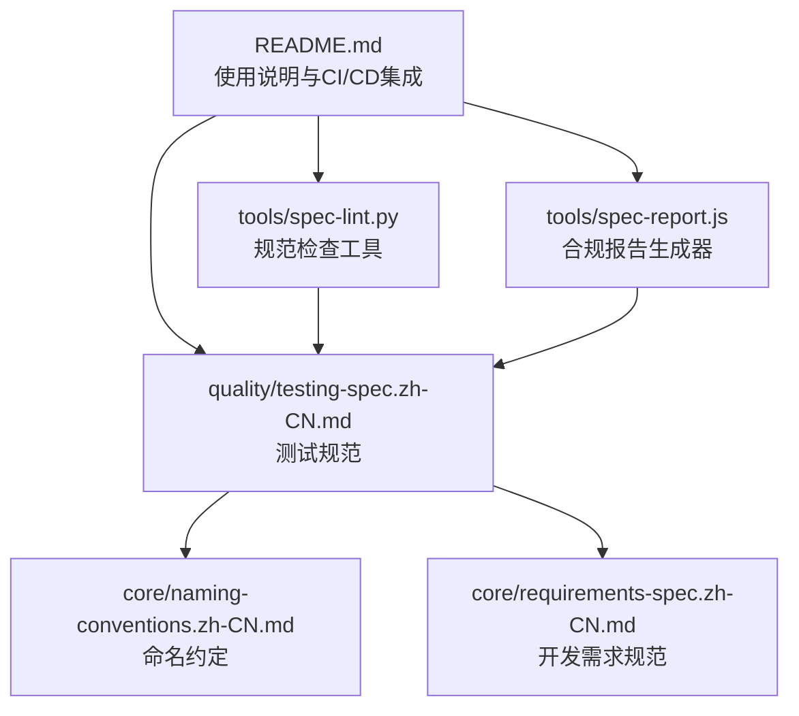
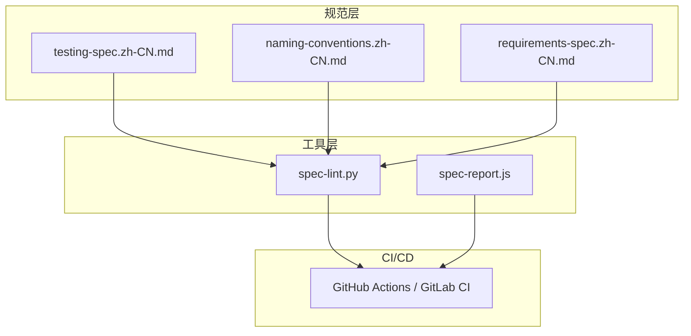
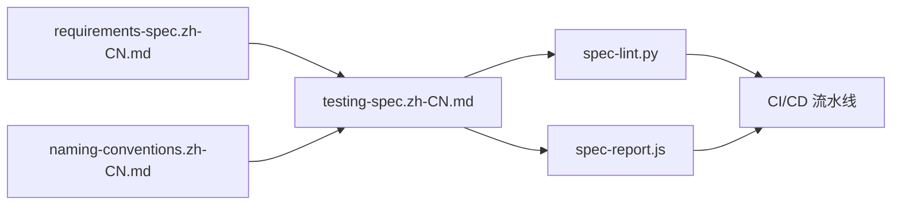

# 测试规范

<cite>
**本文引用的文件**
- [README.md](file://README.md)
- [testing-spec.zh-CN.md](file://quality/testing-spec.zh-CN.md)
- [naming-conventions.zh-CN.md](file://core/naming-conventions.zh-CN.md)
- [requirements-spec.zh-CN.md](file://core/requirements-spec.zh-CN.md)
- [spec-lint.py](file://tools/spec-lint.py)
- [spec-report.js](file://tools/spec-report.js)
</cite>

## 目录
1. [简介](#简介)
2. [项目结构](#项目结构)
3. [核心组件](#核心组件)
4. [架构总览](#架构总览)
5. [详细组件分析](#详细组件分析)
6. [依赖关系分析](#依赖关系分析)
7. [性能考量](#性能考量)
8. [故障排查指南](#故障排查指南)
9. [结论](#结论)
10. [附录](#附录)

## 简介
本文件系统化梳理并解读测试规范的核心要点，围绕测试完整性、覆盖率目标、分层策略、Mock 使用、命名约定、数据管理、边界条件测试、隔离性、性能要求等方面展开，并结合实际代码示例路径说明如何在AI辅助开发中实施单元测试、集成测试与端到端测试（E2E）。同时，阐述测试规范与CI/CD流程的集成方法，以及如何通过spec-lint.py工具进行自动化检查，强调遵循本规范对提升软件可靠性与可维护性的关键作用。

## 项目结构
该仓库采用“规范 + 工具”的组织方式，核心测试规范位于quality目录下的testing-spec.zh-CN.md，配套工具位于tools目录，README提供整体使用说明与CI/CD集成示例。

图表来源
- [README.md](file://README.md#L1-L120)
- [testing-spec.zh-CN.md](file://quality/testing-spec.zh-CN.md#L1-L67)
- [naming-conventions.zh-CN.md](file://core/naming-conventions.zh-CN.md#L1-L60)
- [requirements-spec.zh-CN.md](file://core/requirements-spec.zh-CN.md#L1-L40)
- [spec-lint.py](file://tools/spec-lint.py#L1-L40)
- [spec-report.js](file://tools/spec-report.js#L1-L40)

章节来源
- [README.md](file://README.md#L1-L120)

## 核心组件
- 测试规范（testing-spec.zh-CN.md）：定义测试完整性、覆盖率目标、分层策略、Mock使用、命名约定、数据管理、边界条件测试、隔离性、性能要求等12条规则，并提供按项目类型的覆盖率目标与分层建议。
- 命名约定（naming-conventions.zh-CN.md）：提供变量、函数、类、常量、文件、环境变量等命名规范，其中包含测试命名约定（约定12），并与测试规范（规则5）形成依赖映射。
- 开发需求规范（requirements-spec.zh-CN.md）：强调生成完整可运行代码、API存在性验证、编译通过等关键规则，与测试规范（规则1）在工作流层面相互支撑。
- 规范检查工具（spec-lint.py）：扫描目标代码，基于启用的规范文件检查命名、安全、错误处理、完整性等问题，支持CI/CD集成。
- 合规报告（spec-report.js）：汇总规范启用情况、代码统计与测试覆盖率（若存在），输出控制台报告与JSON文件，便于持续跟踪。

章节来源
- [testing-spec.zh-CN.md](file://quality/testing-spec.zh-CN.md#L1-L131)
- [naming-conventions.zh-CN.md](file://core/naming-conventions.zh-CN.md#L361-L390)
- [requirements-spec.zh-CN.md](file://core/requirements-spec.zh-CN.md#L1-L60)
- [spec-lint.py](file://tools/spec-lint.py#L1-L80)
- [spec-report.js](file://tools/spec-report.js#L1-L60)

## 架构总览
下图展示了测试规范在项目中的角色定位及其与工具链的交互关系。

图表来源
- [testing-spec.zh-CN.md](file://quality/testing-spec.zh-CN.md#L1-L67)
- [naming-conventions.zh-CN.md](file://core/naming-conventions.zh-CN.md#L1-L60)
- [requirements-spec.zh-CN.md](file://core/requirements-spec.zh-CN.md#L1-L40)
- [spec-lint.py](file://tools/spec-lint.py#L1-L40)
- [spec-report.js](file://tools/spec-report.js#L1-L40)
- [README.md](file://README.md#L269-L294)

## 详细组件分析

### 测试完整性（规则1）
- 要点：新功能必须包含单元测试；Bug修复必须包含回归测试；公共API变更必须更新集成测试；禁止未测试代码进入主分支。
- 影响：未测试代码导致生产故障风险高，回归问题频发。
- 示例路径：参见测试规范中“正确/错误”示例的代码片段路径标注。

章节来源
- [testing-spec.zh-CN.md](file://quality/testing-spec.zh-CN.md#L20-L57)

### 测试覆盖率目标（规则2）
- 要点：Web应用最低70%行覆盖率，关键路径90%+；CLI工具80%；库/SDK最低85%，公共API100%；新增代码覆盖率不得低于现有基线。
- 配置示例：提供Jest覆盖率阈值配置示例，便于在项目中落地。

章节来源
- [testing-spec.zh-CN.md](file://quality/testing-spec.zh-CN.md#L59-L87)

### 测试分层策略（规则3）
- 要点：遵循测试金字塔，单元测试70%、集成测试20%、E2E测试10%；避免过度依赖E2E测试（慢、脆弱、维护成本高）。
- 建议：平衡测试速度、覆盖率与维护成本。

章节来源
- [testing-spec.zh-CN.md](file://quality/testing-spec.zh-CN.md#L89-L107)

### Mock与Stub使用规范（规则4）
- 要点：外部依赖（API、数据库、文件系统）必须Mock；不要Mock被测试的核心逻辑；使用真实数据结构；集成测试中尽量减少Mock，使用真实依赖。
- 示例路径：提供Mock外部API的正确示例与错误示例的代码片段路径标注。

章节来源
- [testing-spec.zh-CN.md](file://quality/testing-spec.zh-CN.md#L109-L131)

### 测试命名约定（规则5）
- 要点：测试文件与源文件同名+“.test/.spec”后缀；测试套件describe('被测单元名称')；测试用例it('should + 预期行为')；使用业务语言，避免技术黑话。
- 依赖映射：测试规范（规则5）与命名约定（约定12）形成依赖，确保测试命名与整体命名风格一致。

章节来源
- [testing-spec.zh-CN.md](file://quality/testing-spec.zh-CN.md#L131-L158)
- [naming-conventions.zh-CN.md](file://core/naming-conventions.zh-CN.md#L361-L390)

### 测试数据管理（规则6）
- 要点：使用工厂函数或Fixture生成测试数据；每个测试独立准备数据，避免共享状态；测试后清理数据；使用有意义的测试数据。
- 示例路径：提供工厂函数与测试数据准备的代码片段路径标注。

章节来源
- [testing-spec.zh-CN.md](file://quality/testing-spec.zh-CN.md#L159-L189)

### 边界条件与异常测试（规则7）
- 要点：测试空值、null、undefined；边界值（0、负数、最大/最小值）；异常输入与错误处理路径；并发与竞态条件（如适用）。
- 示例路径：提供边界条件与异常处理的测试片段路径标注。

章节来源
- [testing-spec.zh-CN.md](file://quality/testing-spec.zh-CN.md#L190-L218)

### 测试隔离性（规则8）
- 要点：每个测试独立运行，不依赖执行顺序；使用beforeEach/afterEach清理状态；避免修改全局变量或单例；并行运行测试时不应失败。
- 影响：测试顺序依赖导致间歇性失败，难以调试。

章节来源
- [testing-spec.zh-CN.md](file://quality/testing-spec.zh-CN.md#L220-L232)

### 测试性能要求（规则9）
- 要点：单元测试每个<100ms；集成测试每个<1s；E2E测试每个<10s；整体测试套件<5分钟；慢测试应异步化或并行化。
- 影响：慢测试降低开发效率，开发者可能跳过测试。

章节来源
- [testing-spec.zh-CN.md](file://quality/testing-spec.zh-CN.md#L233-L247)

### TDD/BDD实践指南（规则10，可选）
- 要点：TDD：先写失败测试，再写实现，最后重构；BDD：Given-When-Then结构描述行为；适用于复杂业务逻辑与公共API。
- 示例路径：提供BDD结构的测试片段路径标注。

章节来源
- [testing-spec.zh-CN.md](file://quality/testing-spec.zh-CN.md#L248-L274)

### 集成测试数据库策略（规则11，可选）
- 要点：使用内存数据库或容器化数据库；每个测试使用事务回滚；使用迁移脚本初始化Schema；避免依赖生产数据库。
- 原因：真实数据库测试提供更高置信度。

章节来源
- [testing-spec.zh-CN.md](file://quality/testing-spec.zh-CN.md#L276-L288)

### 快照测试使用规范（规则12，可选）
- 要点：适用于UI组件、配置文件、序列化输出；不适用于随机数据、时间戳；定期审查快照，避免盲目更新；快照应小且易读。

章节来源
- [testing-spec.zh-CN.md](file://quality/testing-spec.zh-CN.md#L289-L308)

### 项目类型配置与覆盖率目标
- Web应用：启用规则1-9，覆盖率目标70%行覆盖率，关键路径90%+。
- CLI工具：启用规则1-9，覆盖率目标80%行覆盖率。
- 库/SDK：启用规则1-10，覆盖率目标85%行覆盖率，公共API100%。

章节来源
- [testing-spec.zh-CN.md](file://quality/testing-spec.zh-CN.md#L313-L327)

### 与其他规范的集成
- 测试规范（规则5）与命名约定（约定12）形成依赖映射。
- 测试规范（规则1）与工作流规范（规则7）在工作流层面相互支撑。

章节来源
- [testing-spec.zh-CN.md](file://quality/testing-spec.zh-CN.md#L333-L341)

## 依赖关系分析
- 测试规范与命名约定：测试命名需遵循命名约定，确保一致性与可读性。
- 测试规范与开发需求规范：测试完整性与API存在性验证、编译通过等规则共同保障交付质量。
- 工具链与规范：spec-lint.py与spec-report.js均基于启用的规范文件进行检查与报告生成，支持CI/CD集成。

图表来源
- [requirements-spec.zh-CN.md](file://core/requirements-spec.zh-CN.md#L1-L40)
- [naming-conventions.zh-CN.md](file://core/naming-conventions.zh-CN.md#L1-L60)
- [testing-spec.zh-CN.md](file://quality/testing-spec.zh-CN.md#L1-L67)
- [spec-lint.py](file://tools/spec-lint.py#L1-L40)
- [spec-report.js](file://tools/spec-report.js#L1-L40)
- [README.md](file://README.md#L269-L294)

章节来源
- [testing-spec.zh-CN.md](file://quality/testing-spec.zh-CN.md#L333-L341)
- [README.md](file://README.md#L269-L294)

## 性能考量
- 单元测试：每个<100ms；集成测试：每个<1s；E2E测试：每个<10s；整体测试套件<5分钟。
- 慢测试应异步化或并行化，避免阻塞开发与CI流水线。
- 通过合理的分层策略（测试金字塔）平衡速度与覆盖率，减少对E2E的过度依赖。

章节来源
- [testing-spec.zh-CN.md](file://quality/testing-spec.zh-CN.md#L233-L247)
- [testing-spec.zh-CN.md](file://quality/testing-spec.zh-CN.md#L89-L107)

## 故障排查指南
- 使用spec-lint.py进行本地与CI检查：
  - 检查目标目录与规范目录参数是否正确。
  - 关注错误与警告级别，逐项修复命名、安全、错误处理与完整性问题。
  - 在CI中集成spec-lint.py与spec-report.js，生成合规报告并上传Artifacts。
- 使用spec-report.js查看覆盖率与规范启用情况：
  - 若coverage-summary.json存在，可读取行/语句/函数/分支覆盖率指标。
  - 通过JSON报告进行持续跟踪与改进。

章节来源
- [spec-lint.py](file://tools/spec-lint.py#L231-L269)
- [spec-report.js](file://tools/spec-report.js#L106-L169)
- [README.md](file://README.md#L269-L294)

## 结论
测试规范通过明确的规则与工具链，为AI辅助开发提供了可执行的质量基线。遵循测试完整性、覆盖率目标、分层策略、Mock使用、命名约定、数据管理、边界条件测试、隔离性与性能要求，能够显著提升代码质量与稳定性。配合CI/CD流水线与spec-lint.py、spec-report.js工具，可实现自动化检查与持续改进，最终提升软件的可靠性与可维护性。

## 附录

### 在AI辅助开发中实施测试的步骤建议
- 单元测试：使用describe/it结构，工厂函数创建测试数据，合理使用Mock隔离外部依赖，覆盖边界条件与异常路径，确保测试独立与快速执行。
- 集成测试：减少Mock，使用真实依赖（如内存数据库），关注模块间交互与事务回滚策略。
- E2E测试：聚焦关键业务流程，控制数量与执行时间，避免脆弱性与维护成本过高。

章节来源
- [testing-spec.zh-CN.md](file://quality/testing-spec.zh-CN.md#L59-L131)
- [testing-spec.zh-CN.md](file://quality/testing-spec.zh-CN.md#L159-L218)
- [testing-spec.zh-CN.md](file://quality/testing-spec.zh-CN.md#L233-L247)

### CI/CD集成要点
- 在pre-commit或CI中运行spec-lint.py进行规范检查。
- 在CI中运行spec-report.js生成合规报告并上传Artifacts。
- 将覆盖率阈值与测试金字塔策略纳入项目配置，确保持续达标。

章节来源
- [README.md](file://README.md#L269-L294)
- [spec-report.js](file://tools/spec-report.js#L106-L169)