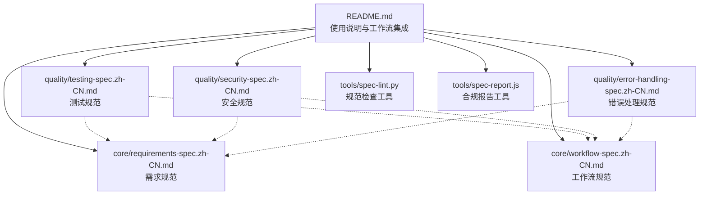
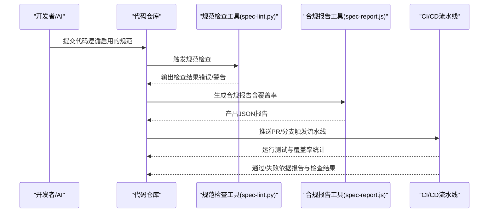
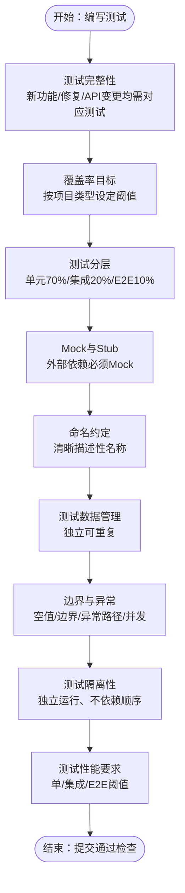
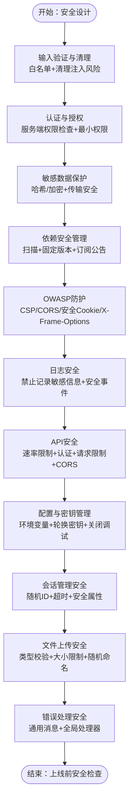
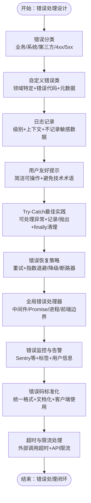
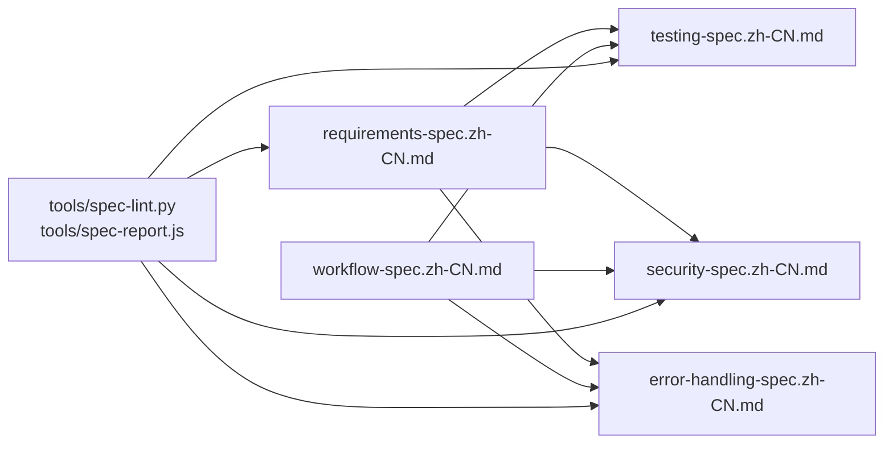

# 质量保证规范

<cite>
**本文引用的文件**
- [README.md](file://README.md)
- [testing-spec.zh-CN.md](file://quality/testing-spec.zh-CN.md)
- [security-spec.zh-CN.md](file://quality/security-spec.zh-CN.md)
- [error-handling-spec.zh-CN.md](file://quality/error-handling-spec.zh-CN.md)
- [requirements-spec.zh-CN.md](file://core/requirements-spec.zh-CN.md)
- [workflow-spec.zh-CN.md](file://core/workflow-spec.zh-CN.md)
- [spec-lint.py](file://tools/spec-lint.py)
- [spec-report.js](file://tools/spec-report.js)
</cite>

## 目录
1. [简介](#简介)
2. [项目结构](#项目结构)
3. [核心组件](#核心组件)
4. [架构总览](#架构总览)
5. [详细组件分析](#详细组件分析)
6. [依赖关系分析](#依赖关系分析)
7. [性能考量](#性能考量)
8. [故障排查指南](#故障排查指南)
9. [结论](#结论)
10. [附录](#附录)

## 简介
本文件系统化整合测试、安全与错误处理三大质量维度，面向AI辅助开发场景，说明如何通过规范约束保障AI生成代码的可靠性、健壮性与安全性。文档从规范内容、技术要点、实施方式、与CI/CD集成及自动化工具检测等方面展开，并结合实际开发场景举例说明如何在AI生成代码中嵌入断言、安全检查与try-catch块，强调遵循这些规范对降低生产环境故障率的重要意义。

## 项目结构
该仓库将质量保证规范置于 quality 目录，配套核心规范（需求、工作流）、工具（lint与报告）与使用说明集中在根目录。质量规范与核心规范相互引用，形成闭环的质量治理。

图表来源
- [README.md](file://README.md#L1-L120)
- [testing-spec.zh-CN.md](file://quality/testing-spec.zh-CN.md#L1-L60)
- [security-spec.zh-CN.md](file://quality/security-spec.zh-CN.md#L1-L60)
- [error-handling-spec.zh-CN.md](file://quality/error-handling-spec.zh-CN.md#L1-L60)
- [requirements-spec.zh-CN.md](file://core/requirements-spec.zh-CN.md#L1-L60)
- [workflow-spec.zh-CN.md](file://core/workflow-spec.zh-CN.md#L1-L60)
- [spec-lint.py](file://tools/spec-lint.py#L1-L40)
- [spec-report.js](file://tools/spec-report.js#L1-L40)

章节来源
- [README.md](file://README.md#L1-L120)

## 核心组件
- 测试规范：覆盖测试完整性、覆盖率目标、测试分层、Mock策略、命名约定、测试数据管理、边界与异常测试、测试隔离性、测试性能等，按项目类型设定目标并强调测试金字塔。
- 安全规范：涵盖输入验证与清理、认证与授权、敏感数据保护、依赖安全管理、OWASP Top 10防护、日志安全、API安全、配置与密钥管理、会话安全、文件上传安全、错误处理安全等，强调“安全左移”与最小权限原则。
- 错误处理规范：定义错误分类体系、自定义错误类、日志记录、用户友好提示、Try-Catch最佳实践、错误恢复策略（重试/降级/断路器）、全局错误处理器、前端错误边界、错误监控与告警、错误码标准化、超时与限流处理、错误文档化等。

章节来源
- [testing-spec.zh-CN.md](file://quality/testing-spec.zh-CN.md#L1-L120)
- [security-spec.zh-CN.md](file://quality/security-spec.zh-CN.md#L1-L120)
- [error-handling-spec.zh-CN.md](file://quality/error-handling-spec.zh-CN.md#L1-L120)

## 架构总览
质量保证规范的实施由“规范约束 + 工具检测 + CI/CD集成”构成闭环。AI在生成代码时仅遵循启用的规则；本地与CI通过工具对代码进行静态检查与覆盖率统计；工作流规范确保变更可审计、依赖可追踪、错误处理一致。

图表来源
- [README.md](file://README.md#L253-L300)
- [spec-lint.py](file://tools/spec-lint.py#L1-L60)
- [spec-report.js](file://tools/spec-report.js#L1-L60)

## 详细组件分析

### 测试规范（Testing）
- 测试完整性：新功能必须包含单元测试；Bug修复必须包含回归测试；公共API变更必须更新集成测试；不允许提交未测试代码到主分支。
- 覆盖率目标：Web应用70%+行覆盖率（关键路径90%+），CLI 80%，库/SDK 85%+（公共API 100%），新增代码覆盖率不得低于现有基线。
- 测试分层：遵循测试金字塔，单元测试70%、集成测试20%、E2E 10%，避免过度依赖E2E。
- Mock与Stub：外部依赖（API、数据库、文件系统）必须Mock；不要Mock被测试的核心逻辑；集成测试中尽量减少Mock。
- 测试命名：测试文件与源文件同名+后缀；describe/it清晰描述预期行为；使用业务语言。
- 测试数据：使用工厂函数或Fixture生成；每个测试独立准备数据，避免共享状态；测试后清理；使用有意义的数据。
- 边界与异常：测试空值、null、undefined；边界值（0、负数、最大/最小）；异常输入与错误路径；并发与竞态条件。
- 测试隔离：每个测试独立运行，不依赖执行顺序；使用beforeEach/afterEach清理；避免修改全局变量或单例；并行运行不应失败。
- 测试性能：单元<100ms、集成<1s、E2E<10s、整体<5分钟；慢测试应异步化或并行化。

图表来源
- [testing-spec.zh-CN.md](file://quality/testing-spec.zh-CN.md#L1-L240)

章节来源
- [testing-spec.zh-CN.md](file://quality/testing-spec.zh-CN.md#L1-L360)

### 安全规范（Security）
- 输入验证与清理：验证所有外部输入、API参数、文件上传；白名单验证；清理HTML/SQL/命令注入风险字符；验证数据类型、长度、格式、范围。
- 认证与授权：使用成熟认证库；密码强度与哈希；多因素认证（MFA）用于敏感操作；授权检查在服务端；最小权限原则。
- 敏感数据保护：密码使用单向哈希+加盐；敏感数据加密存储；HTTPS/TLS传输；不在日志、错误消息、URL中暴露敏感数据；定期轮换密钥与令牌。
- 依赖安全管理：定期安全扫描（npm audit、Snyk）；不使用已知漏洞版本；固定依赖版本；最小化依赖数量；订阅安全公告。
- OWASP Top 10防护：CSP头、CORS策略、安全Cookie属性（HttpOnly/Secure/SameSite）、防点击劫持。
- 日志安全：禁止记录敏感信息；记录安全事件（登录失败、权限拒绝、异常访问）；日志文件权限受限；定期归档与清理。
- API安全：速率限制防止暴力破解；API密钥或JWT认证；验证Content-Type；限制请求大小；CORS策略限制跨域访问。
- 配置与密钥管理：不在代码中硬编码密钥；使用环境变量或密钥管理服务；不提交.env到版本控制；生产关闭调试模式；定期轮换密钥。
- 会话管理安全：随机不可预测的会话ID；登录后重新生成；设置会话超时；注销销毁会话；Cookie设置安全属性。
- 文件上传安全：双重验证（MIME与扩展名）；限制文件大小；扫描病毒与恶意代码；存储在非Web目录或对象存储；随机重命名。
- 错误处理安全：生产环境返回通用错误消息；不暴露堆栈跟踪、数据库架构、内部路径；详细错误仅记录到服务端日志；全局错误处理器。

图表来源
- [security-spec.zh-CN.md](file://quality/security-spec.zh-CN.md#L1-L420)

章节来源
- [security-spec.zh-CN.md](file://quality/security-spec.zh-CN.md#L1-L421)

### 错误处理规范（Error Handling）
- 错误分类体系：业务错误（用户可恢复）、系统错误（需运维）、第三方错误（需降级）、客户端/服务端错误。
- 自定义错误类：为不同领域创建专用错误类，继承标准Error，包含错误代码、元数据、原始错误。
- 错误日志记录：业务错误INFO/WARN、系统错误ERROR、关键错误FATAL；记录上下文（用户ID、请求ID、时间戳、堆栈）；不记录敏感数据。
- 用户友好提示：向用户显示简洁、友好、可操作的消息；向开发者记录详细技术信息；避免技术术语与内部实现细节；提供下一步操作建议。
- Try-Catch最佳实践：只捕获可处理异常；不要静默忽略；在合适层级捕获；捕获后记录日志或重新抛出；finally清理资源。
- 错误恢复策略：外部服务失败重试+指数退避；非关键功能失败降级到默认值；数据库连接失败重连+断路器；设置最大重试次数与超时。
- 全局错误处理器：Web框架全局错误中间件；Promise未处理拒绝；进程未捕获异常；前端React/Vue错误边界。
- 错误监控与告警：集成Sentry/Datadog/New Relic；上报关键错误与异常；设置告警阈值；包含环境、版本、用户信息。
- 错误码标准化：定义错误码常量或枚举；格式DOMAIN_OPERATION_REASON；文档化所有错误码；客户端据错误码采取特定操作。
- 超时与限流处理：对外部调用设置超时；API实施速率限制；长时间操作异步处理；超时后抛出明确错误。
- 错误文档化：API文档包含所有可能的错误响应；错误码文档与示例；故障排查指南。

图表来源
- [error-handling-spec.zh-CN.md](file://quality/error-handling-spec.zh-CN.md#L1-L576)

章节来源
- [error-handling-spec.zh-CN.md](file://quality/error-handling-spec.zh-CN.md#L1-L576)

## 依赖关系分析
- 规范间的耦合与协同：
  - 测试规范与需求规范、工作流规范协同，确保新功能与变更均满足可运行、可审计与可追踪的要求。
  - 安全规范与错误处理规范协同，错误处理需遵循安全原则（不暴露敏感信息、生产环境通用错误消息）。
  - 工作流规范中的错误处理标准与错误处理规范相呼应，形成一致的错误处理方法论。
- 工具链与自动化：
  - 规范检查工具根据启用规则解析并扫描代码，识别命名、安全（硬编码密钥）、错误处理（空catch块）、完整性（TODO/FIXME）等问题。
  - 合规报告工具汇总规范启用情况、代码统计与测试覆盖率，输出JSON报告，便于CI/CD集成与可视化。

图表来源
- [requirements-spec.zh-CN.md](file://core/requirements-spec.zh-CN.md#L1-L120)
- [workflow-spec.zh-CN.md](file://core/workflow-spec.zh-CN.md#L270-L325)
- [testing-spec.zh-CN.md](file://quality/testing-spec.zh-CN.md#L330-L360)
- [security-spec.zh-CN.md](file://quality/security-spec.zh-CN.md#L388-L420)
- [error-handling-spec.zh-CN.md](file://quality/error-handling-spec.zh-CN.md#L540-L576)
- [spec-lint.py](file://tools/spec-lint.py#L1-L80)
- [spec-report.js](file://tools/spec-report.js#L1-L80)

章节来源
- [requirements-spec.zh-CN.md](file://core/requirements-spec.zh-CN.md#L1-L267)
- [workflow-spec.zh-CN.md](file://core/workflow-spec.zh-CN.md#L270-L325)
- [testing-spec.zh-CN.md](file://quality/testing-spec.zh-CN.md#L330-L360)
- [security-spec.zh-CN.md](file://quality/security-spec.zh-CN.md#L388-L420)
- [error-handling-spec.zh-CN.md](file://quality/error-handling-spec.zh-CN.md#L540-L576)
- [spec-lint.py](file://tools/spec-lint.py#L1-L120)
- [spec-report.js](file://tools/spec-report.js#L1-L120)

## 性能考量
- 测试性能：遵循测试金字塔，单元测试快速、集成测试可控、E2E谨慎使用，整体测试套件控制在合理范围内，避免慢测试降低开发效率与跳过测试的风险。
- 错误恢复：对外部服务采用重试与指数退避，避免瞬时故障放大；对非关键功能进行降级，保障核心路径可用；数据库连接失败采用断路器与重连策略。
- 安全扫描：定期运行安全扫描，避免在主干引入已知漏洞；固定依赖版本，减少非确定性构建与生产漂移。
- 日志与监控：合理分级日志，避免过度日志导致存储成本与信噪比下降；接入错误监控服务，设置告警阈值，缩短故障定位时间。

[本节为一般性指导，无需列出具体文件来源]

## 故障排查指南
- 规范检查工具（spec-lint.py）：
  - 检查硬编码密钥（安全规则8）：若检测到API_KEY/SECRET/PASSWORD/TOKEN等疑似硬编码且未使用环境变量，将标记为错误。
  - 检查空catch块（错误处理规则5）：检测到空catch块将标记为错误。
  - 检查命名约定（命名规范）：Python变量命名不符合snake_case将标记为警告。
  - 检查代码完整性（需求规则1）：检测到TODO/FIXME等占位符将标记为警告。
- 合规报告工具（spec-report.js）：
  - 生成JSON报告，包含规范启用情况、代码统计、测试覆盖率（若存在coverage-summary.json），便于CI/CD可视化与持续改进。
- CI/CD集成：
  - 在pre-commit钩子中运行规范检查；在GitHub Actions/GitLab CI中添加规范检查与合规报告任务，将报告作为制品上传，便于审计与回溯。

章节来源
- [spec-lint.py](file://tools/spec-lint.py#L100-L200)
- [spec-report.js](file://tools/spec-report.js#L100-L200)
- [README.md](file://README.md#L253-L300)

## 结论
通过测试、安全与错误处理三大规范的系统化落地，配合工具链与CI/CD的自动化集成，能够有效提升AI生成代码的可靠性、健壮性与安全性。测试规范确保功能正确与回归安全；安全规范从输入、认证、数据、依赖、API、配置、会话、上传、日志与错误处理等多维度构建纵深防御；错误处理规范统一错误分类、日志与用户提示、恢复策略与监控告警，形成闭环。遵循这些规范可显著降低生产环境故障率，提高交付质量与团队协作效率。

[本节为总结性内容，无需列出具体文件来源]

## 附录
- 在AI对话中引用规范文件的方式与示例，详见根目录README的“使用示例”与“工作流集成”部分。
- 项目类型配置（Web应用、CLI工具、库/SDK）推荐启用的规则集合，详见根目录README与各规范文件的“项目类型配置”。

章节来源
- [README.md](file://README.md#L115-L210)
- [testing-spec.zh-CN.md](file://quality/testing-spec.zh-CN.md#L310-L360)
- [security-spec.zh-CN.md](file://quality/security-spec.zh-CN.md#L368-L421)
- [error-handling-spec.zh-CN.md](file://quality/error-handling-spec.zh-CN.md#L524-L576)