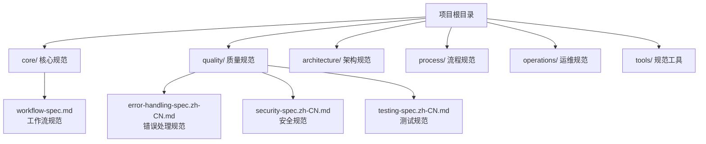
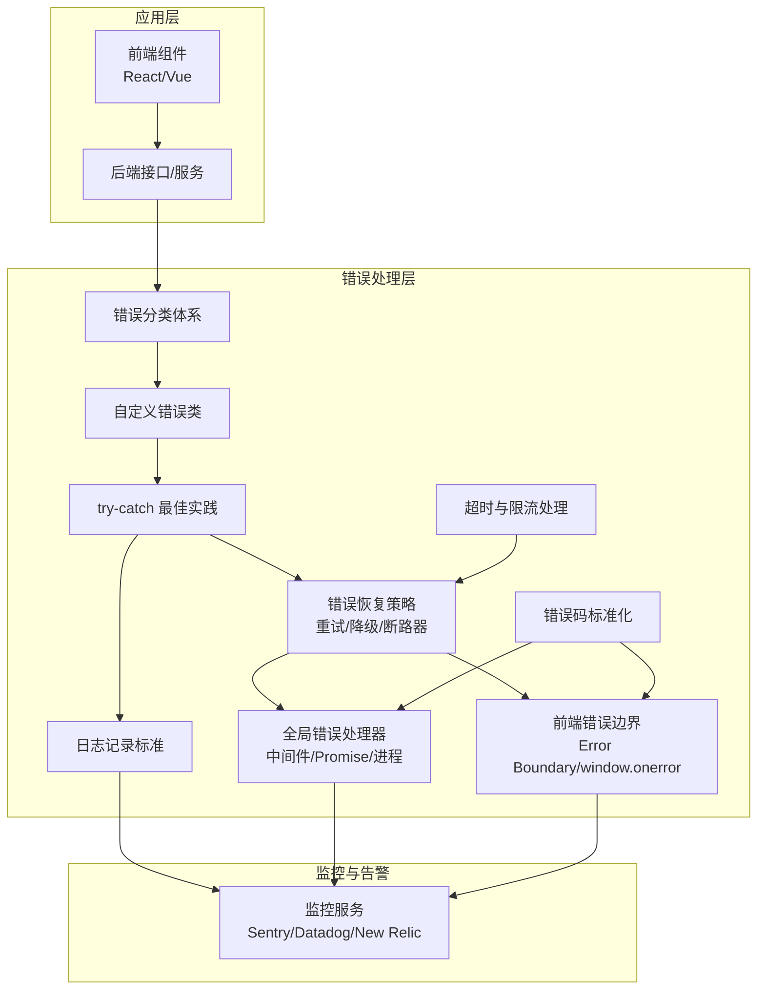
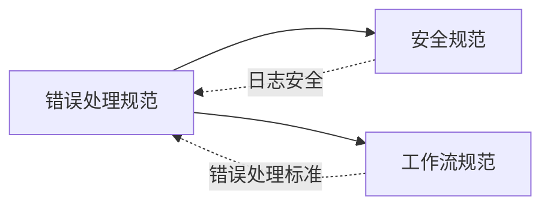

# 错误处理规范

<cite>
**本文引用的文件**
- [质量规范-错误处理规范](file://quality/error-handling-spec.zh-CN.md)
- [项目总览-README](file://README.md)
- [安全规范](file://quality/security-spec.zh-CN.md)
- [工作流规范](file://core/workflow-spec.md)
</cite>

## 目录
1. [简介](#简介)
2. [项目结构](#项目结构)
3. [核心组件](#核心组件)
4. [架构总览](#架构总览)
5. [详细组件分析](#详细组件分析)
6. [依赖分析](#依赖分析)
7. [性能考虑](#性能考虑)
8. [故障排查指南](#故障排查指南)
9. [结论](#结论)
10. [附录](#附录)

## 简介
本规范面向 AI 辅助开发场景，提供一套系统化的错误处理方法论与落地实践，覆盖错误分类、自定义错误类、日志记录、用户友好提示、try-catch 最佳实践、错误恢复策略、全局错误处理器、前端错误边界、监控告警集成、错误码标准化以及超时与限流处理。通过规则化约束与示例路径，帮助在从异常捕获到用户反馈的完整链路上保持一致性和可维护性，并与安全与监控体系协同，确保在生产环境中具备可诊断、可恢复、可告警的能力。

## 项目结构
该仓库采用“规范分层”的组织方式，错误处理规范位于质量规范目录下，同时与安全规范、工作流规范形成跨模块协作关系。整体结构便于在 AI 对话中按需引用与组合使用。

图表来源
- [项目总览-README](file://README.md#L1-L120)

章节来源
- [项目总览-README](file://README.md#L1-L120)

## 核心组件
- 错误分类体系：将错误划分为业务错误、系统错误、第三方错误、客户端错误、服务端错误，指导差异化处理策略。
- 自定义错误类：基于领域抽象，继承标准错误类，提供结构化错误信息与错误码。
- 日志记录标准：按错误类型选择日志级别，记录上下文与敏感信息脱敏。
- 用户友好提示：区分面向用户与面向开发者的错误信息，避免技术术语与内部细节。
- try-catch 最佳实践：在合适层级捕获异常，记录日志或重新抛出，finally 清理资源。
- 错误恢复策略：对外部服务采用重试与指数退避；非关键功能降级；数据库连接失败采用断路器与重连。
- 全局错误处理器：Web 框架全局中间件、Promise 未处理拒绝处理器、进程未捕获异常处理器；前端 React Error Boundary 与 window.onerror。
- 前端错误边界：React/Vue 错误边界，展示友好 UI 并上报监控。
- 监控告警集成：集成 Sentry/Datadog/New Relic 等，设置告警阈值，包含环境、版本、用户信息。
- 错误码标准化：定义错误码常量/枚举，格式化为 DOMAIN_OPERATION_REASON，文档化并可被客户端识别。
- 超时与限流处理：对外部调用设置超时，API 实施速率限制，长时间操作异步化，超时后抛出明确错误。

章节来源
- [质量规范-错误处理规范](file://quality/error-handling-spec.zh-CN.md#L20-L115)
- [质量规范-错误处理规范](file://quality/error-handling-spec.zh-CN.md#L114-L188)
- [质量规范-错误处理规范](file://quality/error-handling-spec.zh-CN.md#L189-L238)
- [质量规范-错误处理规范](file://quality/error-handling-spec.zh-CN.md#L230-L279)
- [质量规范-错误处理规范](file://quality/error-handling-spec.zh-CN.md#L278-L341)
- [质量规范-错误处理规范](file://quality/error-handling-spec.zh-CN.md#L341-L410)
- [质量规范-错误处理规范](file://quality/error-handling-spec.zh-CN.md#L402-L482)
- [质量规范-错误处理规范](file://quality/error-handling-spec.zh-CN.md#L437-L482)
- [质量规范-错误处理规范](file://quality/error-handling-spec.zh-CN.md#L481-L544)

## 架构总览
下图展示了从异常发生到用户反馈与监控告警的完整链路，体现错误分类、恢复策略、全局处理与前端边界的协同。

图表来源
- [质量规范-错误处理规范](file://quality/error-handling-spec.zh-CN.md#L20-L115)
- [质量规范-错误处理规范](file://quality/error-handling-spec.zh-CN.md#L114-L188)
- [质量规范-错误处理规范](file://quality/error-handling-spec.zh-CN.md#L189-L238)
- [质量规范-错误处理规范](file://quality/error-handling-spec.zh-CN.md#L230-L279)
- [质量规范-错误处理规范](file://quality/error-handling-spec.zh-CN.md#L278-L341)
- [质量规范-错误处理规范](file://quality/error-handling-spec.zh-CN.md#L341-L410)
- [质量规范-错误处理规范](file://quality/error-handling-spec.zh-CN.md#L402-L482)
- [质量规范-错误处理规范](file://quality/error-handling-spec.zh-CN.md#L437-L482)
- [质量规范-错误处理规范](file://quality/error-handling-spec.zh-CN.md#L481-L544)

## 详细组件分析

### 错误分类体系
- 目标：建立清晰的错误分类，指导差异化处理策略，避免混淆导致处理失效。
- 分类维度：业务错误（用户可恢复）、系统错误（需运维介入）、第三方错误（需降级处理）、客户端错误（4xx）、服务端错误（5xx）。
- 影响：错误类型不清会导致用户困惑、支持成本上升、处理策略失效。

章节来源
- [质量规范-错误处理规范](file://quality/error-handling-spec.zh-CN.md#L20-L35)

### 自定义错误类设计
- 目标：为不同领域创建专用错误类，继承标准 Error，包含错误码、元数据、原始错误，提供结构化信息。
- 示例路径：自定义业务错误、系统错误、第三方服务错误，以及更细粒度的验证错误、认证错误、未找到错误等。
- 建议：错误类命名与领域一致，错误码统一来源，便于前端识别与国际化。

章节来源
- [质量规范-错误处理规范](file://quality/error-handling-spec.zh-CN.md#L71-L115)

### 日志记录标准
- 目标：标准化日志记录，按错误类型选择日志级别，记录上下文，避免敏感信息泄露。
- 级别建议：业务错误 INFO/WARN，系统错误 ERROR，关键错误 FATAL。
- 上下文：用户 ID、请求 ID、时间戳、堆栈跟踪。
- 安全：不记录密码、令牌、信用卡等敏感数据。

章节来源
- [质量规范-错误处理规范](file://quality/error-handling-spec.zh-CN.md#L114-L159)
- [安全规范](file://quality/security-spec.zh-CN.md#L182-L200)

### 用户友好提示
- 目标：向用户显示简洁、友好、可操作的消息；向开发者记录详细、技术性的信息。
- 建议：避免技术术语与内部实现细节；提供下一步操作建议；在生产环境隐藏堆栈细节。

章节来源
- [质量规范-错误处理规范](file://quality/error-handling-spec.zh-CN.md#L160-L188)

### try-catch 最佳实践
- 目标：只捕获可处理的异常；不在合适层级捕获；捕获后记录日志或重新抛出；使用 finally 清理资源。
- 示例路径：记录并处理失败、资源清理、避免空 catch 块。

章节来源
- [质量规范-错误处理规范](file://quality/error-handling-spec.zh-CN.md#L189-L238)

### 错误恢复策略
- 目标：实施优雅降级与重试机制，提升系统韧性。
- 重试与指数退避：对外部服务失败采用重试与指数退避，设置最大重试次数与超时时间。
- 降级处理：非关键功能失败时降级到默认值，保障主流程可用。
- 断路器：数据库连接失败采用断路器与重连策略。

章节来源
- [质量规范-错误处理规范](file://quality/error-handling-spec.zh-CN.md#L230-L279)

### 全局错误处理器
- 目标：实施统一的错误处理中间件，覆盖 Web 框架、Promise 未处理拒绝、进程未捕获异常。
- 前端：React Error Boundary、window.onerror。
- 示例路径：Express 全局错误中间件、Promise 未处理拒绝处理器、进程未捕获异常处理器。

章节来源
- [质量规范-错误处理规范](file://quality/error-handling-spec.zh-CN.md#L278-L341)
- [质量规范-错误处理规范](file://quality/error-handling-spec.zh-CN.md#L341-L410)

### 前端错误边界
- 目标：在前端层面拦截组件渲染错误，展示友好 UI 并上报监控。
- React：使用 Error Boundary 组件；Vue：使用 errorHandler 钩子。
- 示例路径：React Error Boundary 组件实现与使用。

章节来源
- [质量规范-错误处理规范](file://quality/error-handling-spec.zh-CN.md#L341-L410)

### 监控告警集成
- 目标：集成 Sentry、Datadog、New Relic 等监控服务，上报关键错误与异常，设置告警阈值，包含环境、版本、用户信息。
- 示例路径：Sentry 初始化与异常捕获上报。

章节来源
- [质量规范-错误处理规范](file://quality/error-handling-spec.zh-CN.md#L402-L482)

### 错误码标准化
- 目标：定义错误码常量或枚举，格式化为 DOMAIN_OPERATION_REASON，文档化并可被客户端识别。
- 示例路径：错误码枚举、错误响应格式、使用示例。

章节来源
- [质量规范-错误处理规范](file://quality/error-handling-spec.zh-CN.md#L437-L482)

### 超时与限流处理
- 目标：对外部调用设置超时；API 实施速率限制；长时间操作异步化；超时后抛出明确错误。
- 示例路径：fetchWithTimeout 设置超时并抛出第三方服务错误。

章节来源
- [质量规范-错误处理规范](file://quality/error-handling-spec.zh-CN.md#L481-L544)

## 依赖分析
错误处理规范与安全规范、工作流规范存在交叉依赖关系：
- 日志记录遵循安全规范，避免在日志中记录敏感数据。
- 全局错误处理对齐工作流规范中的错误处理标准，确保流程一致性。

图表来源
- [质量规范-错误处理规范](file://quality/error-handling-spec.zh-CN.md#L547-L552)
- [安全规范](file://quality/security-spec.zh-CN.md#L182-L200)
- [工作流规范](file://core/workflow-spec.md#L1-L60)

章节来源
- [质量规范-错误处理规范](file://quality/error-handling-spec.zh-CN.md#L547-L552)
- [安全规范](file://quality/security-spec.zh-CN.md#L182-L200)
- [工作流规范](file://core/workflow-spec.md#L1-L60)

## 性能考虑
- 重试与指数退避：合理设置最大重试次数与退避间隔，避免放大下游压力；结合断路器防止雪崩。
- 超时控制：对外部调用设置超时，避免阻塞线程或连接池耗尽；超时后快速失败并记录。
- 降级策略：非关键功能降级到默认值，保障主流程吞吐；降级路径应具备可观测性。
- 日志级别与采样：根据错误类型选择合适日志级别；对高频错误进行采样，降低存储与带宽开销。
- 前端错误边界：避免在边界内过度渲染，减少不必要的重渲染；错误上报应异步化，避免影响主线程。

[本节为通用性能建议，无需具体文件引用]

## 故障排查指南
- 快速定位：优先查看日志级别为 ERROR/FATAL 的关键错误，结合请求 ID、用户 ID、时间戳与堆栈跟踪。
- 分类判断：依据错误分类快速判断是否需要运维介入、是否可由客户端自行恢复。
- 恢复验证：对外部服务重试后验证状态；降级路径切换后验证用户体验与数据一致性。
- 监控告警：关注监控平台的告警阈值与趋势，结合错误码与错误分布定位热点问题。
- 前端回溯：通过前端错误边界上报的组件栈与用户行为轨迹，复现并修复渲染错误。

章节来源
- [质量规范-错误处理规范](file://quality/error-handling-spec.zh-CN.md#L114-L159)
- [质量规范-错误处理规范](file://quality/error-handling-spec.zh-CN.md#L230-L279)
- [质量规范-错误处理规范](file://quality/error-handling-spec.zh-CN.md#L402-L482)

## 结论
通过建立清晰的错误分类、自定义错误类、标准化日志与错误码、实施重试与降级、配置全局错误处理器与前端错误边界，并与安全与监控体系协同，可以在 AI 辅助开发场景下构建健壮的错误处理机制。该机制覆盖从异常捕获到用户反馈的完整链条，既保障用户体验，又提升可诊断性与可恢复性，最终降低支持成本并增强系统韧性。

[本节为总结性内容，无需具体文件引用]

## 附录

### 代码示例路径索引（不含代码内容）
- 错误分类与自定义错误类示例：见“自定义错误类设计”章节
- 日志记录示例：见“日志记录标准”章节
- 用户友好提示示例：见“用户友好提示”章节
- try-catch 最佳实践示例：见“try-catch 最佳实践”章节
- 重试与降级示例：见“错误恢复策略”章节
- 全局错误处理器示例（Express 中间件、Promise 未处理拒绝、进程未捕获异常）：见“全局错误处理器”章节
- 前端错误边界示例（React Error Boundary）：见“前端错误边界”章节
- 监控告警集成示例（Sentry）：见“监控告警集成”章节
- 错误码标准化示例：见“错误码标准化”章节
- 超时与限流处理示例：见“超时与限流处理”章节

章节来源
- [质量规范-错误处理规范](file://quality/error-handling-spec.zh-CN.md#L20-L115)
- [质量规范-错误处理规范](file://quality/error-handling-spec.zh-CN.md#L114-L188)
- [质量规范-错误处理规范](file://quality/error-handling-spec.zh-CN.md#L189-L238)
- [质量规范-错误处理规范](file://quality/error-handling-spec.zh-CN.md#L230-L279)
- [质量规范-错误处理规范](file://quality/error-handling-spec.zh-CN.md#L278-L341)
- [质量规范-错误处理规范](file://quality/error-handling-spec.zh-CN.md#L341-L410)
- [质量规范-错误处理规范](file://quality/error-handling-spec.zh-CN.md#L402-L482)
- [质量规范-错误处理规范](file://quality/error-handling-spec.zh-CN.md#L437-L482)
- [质量规范-错误处理规范](file://quality/error-handling-spec.zh-CN.md#L481-L544)