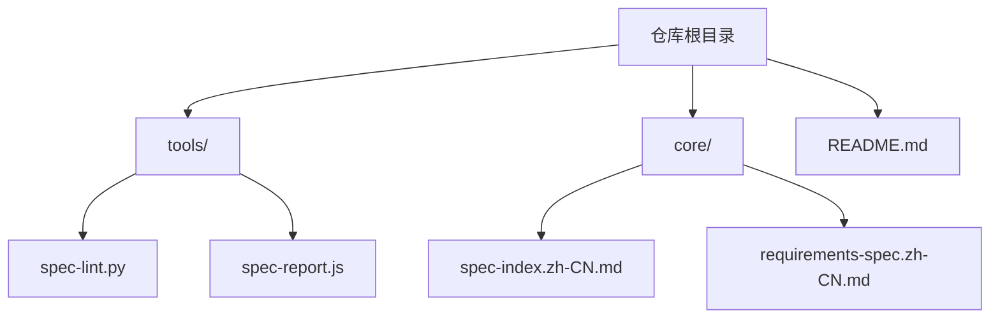
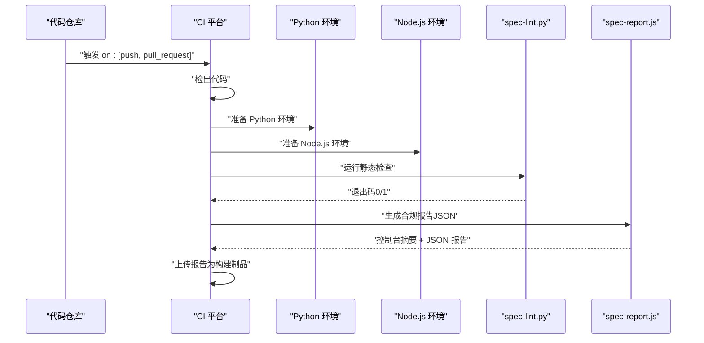
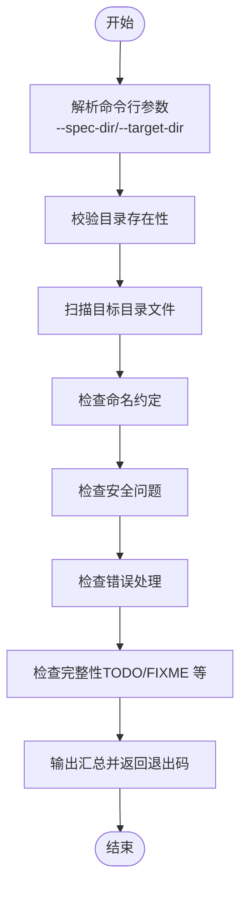
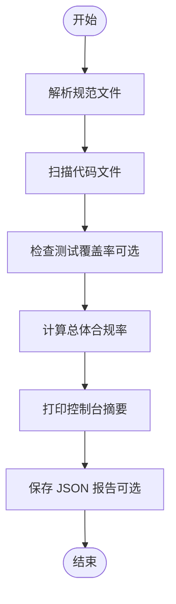
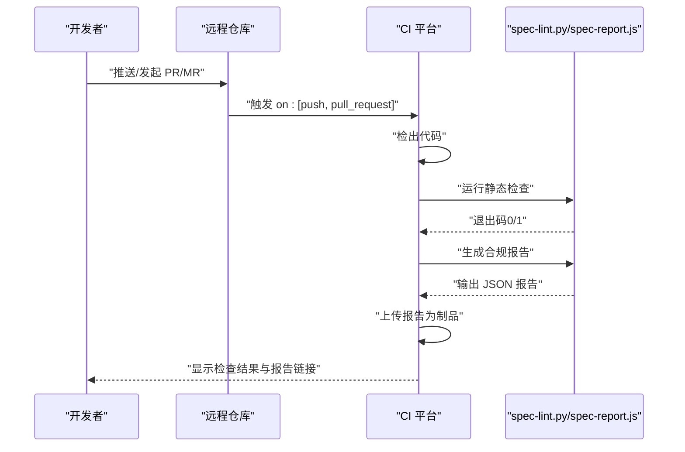
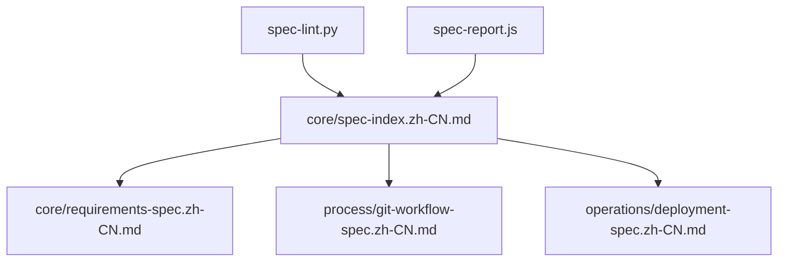

# CI/CD集成

<cite>
**本文引用的文件**
- [README.md](file://README.md)
- [tools/spec-lint.py](file://tools/spec-lint.py)
- [tools/spec-report.js](file://tools/spec-report.js)
- [core/spec-index.zh-CN.md](file://core/spec-index.zh-CN.md)
- [core/requirements-spec.zh-CN.md](file://core/requirements-spec.zh-CN.md)
- [process/git-workflow-spec.zh-CN.md](file://process/git-workflow-spec.zh-CN.md)
- [operations/deployment-spec.zh-CN.md](file://operations/deployment-spec.zh-CN.md)
</cite>

## 目录
1. [简介](#简介)
2. [项目结构](#项目结构)
3. [核心组件](#核心组件)
4. [架构总览](#架构总览)
5. [详细组件分析](#详细组件分析)
6. [依赖关系分析](#依赖关系分析)
7. [性能与稳定性考量](#性能与稳定性考量)
8. [故障排查指南](#故障排查指南)
9. [结论](#结论)
10. [附录](#附录)

## 简介
本指南面向在 GitHub Actions、GitLab CI 等持续集成平台中集成 qoder-rules 的自动化质量门禁流程。目标是通过流水线实现以下能力：
- 代码检出与环境准备（Python 与 Node.js）
- 运行 spec-lint.py 进行静态检查，阻断不符合规范的变更
- 运行 spec-report.js 生成合规报告并保存为构建产物
- 将报告作为制品上传，支撑审计追踪与质量度量
- 通过 on: [push, pull_request] 触发器实现 PR/MR 级别的质量门禁
- 建议在流水线中加入合规率阈值判断，以进一步强化质量门槛

本指南同时提供针对不同 CI 平台的适配建议与常见问题排查指引。

## 项目结构
qoder-rules 仓库包含规范文件与配套工具，其中与 CI/CD 直接相关的关键位置如下：
- tools/：包含规范检查工具 spec-lint.py 与合规报告生成器 spec-report.js
- core/：核心规范索引与各规范文件，用于驱动工具的规则启用状态
- README.md：包含 CI/CD 集成示例与说明

图表来源
- [README.md](file://README.md#L1-L40)
- [tools/spec-lint.py](file://tools/spec-lint.py#L1-L40)
- [tools/spec-report.js](file://tools/spec-report.js#L1-L40)
- [core/spec-index.zh-CN.md](file://core/spec-index.zh-CN.md#L1-L40)
- [core/requirements-spec.zh-CN.md](file://core/requirements-spec.zh-CN.md#L1-L40)

章节来源
- [README.md](file://README.md#L1-L40)

## 核心组件
- 规范检查工具（spec-lint.py）
  - 作用：扫描目标目录中的指定语言文件，依据 core/ 下启用的规范进行静态检查，输出问题并返回退出码
  - 关键特性：支持指定规范目录与目标目录；自动跳过常见构建/缓存目录；按严重程度分组输出
  - 退出码：无问题返回 0，存在错误级别问题返回 1（可用于阻断流水线）
- 合规报告生成器（spec-report.js）
  - 作用：解析规范文件、扫描代码文件、统计覆盖率（若存在）、计算合规率并输出控制台摘要与 JSON 报告
  - 关键特性：支持自定义规范目录、目标目录与输出路径；输出包含时间戳、代码统计、覆盖率与总体合规率
- 规范索引与规则（core/）
  - 作用：通过 spec-index.zh-CN.md 与各规范文件定义启用/禁用规则，驱动工具行为
  - 影响：工具会根据启用规则数量与违规情况计算合规率，作为质量度量基础

章节来源
- [tools/spec-lint.py](file://tools/spec-lint.py#L180-L269)
- [tools/spec-report.js](file://tools/spec-report.js#L130-L190)
- [core/spec-index.zh-CN.md](file://core/spec-index.zh-CN.md#L1-L60)
- [core/requirements-spec.zh-CN.md](file://core/requirements-spec.zh-CN.md#L1-L40)

## 架构总览
下图展示了在 CI 中执行的典型流程：检出代码 → 准备 Python/Node.js 环境 → 运行静态检查 → 生成合规报告 → 上传制品。

图表来源
- [README.md](file://README.md#L269-L294)
- [tools/spec-lint.py](file://tools/spec-lint.py#L231-L269)
- [tools/spec-report.js](file://tools/spec-report.js#L238-L278)

## 详细组件分析

### 组件A：spec-lint.py 的执行流程
- 输入：规范目录（默认 core/）、目标目录（默认当前工作目录）
- 处理：遍历目标目录中支持的语言文件，逐条检查命名、安全、错误处理与完整性等规则
- 输出：控制台汇总（错误/警告数量），并根据是否存在错误返回退出码（0/1）

图表来源
- [tools/spec-lint.py](file://tools/spec-lint.py#L180-L269)

章节来源
- [tools/spec-lint.py](file://tools/spec-lint.py#L180-L269)

### 组件B：spec-report.js 的执行流程
- 输入：规范目录、目标目录、输出路径（可选）
- 处理：解析规范文件、扫描代码文件、统计覆盖率（若存在）、计算总体合规率
- 输出：控制台摘要与 JSON 报告文件

图表来源
- [tools/spec-report.js](file://tools/spec-report.js#L130-L190)
- [tools/spec-report.js](file://tools/spec-report.js#L238-L278)

章节来源
- [tools/spec-report.js](file://tools/spec-report.js#L130-L190)
- [tools/spec-report.js](file://tools/spec-report.js#L238-L278)

### 组件C：在 CI 中的流水线编排
- 触发器：on: [push, pull_request]
- 步骤建议：
  - 代码检出
  - 准备 Python 环境（安装依赖）
  - 准备 Node.js 环境（安装依赖）
  - 运行 spec-lint.py（退出码用于阻断）
  - 运行 spec-report.js --output report.json
  - 上传 report.json 为构建制品
- 合规率阈值建议：在流水线中增加步骤，读取 report.json 中的总体合规率，当低于阈值时失败并阻断合并

图表来源
- [README.md](file://README.md#L269-L294)
- [tools/spec-lint.py](file://tools/spec-lint.py#L231-L269)
- [tools/spec-report.js](file://tools/spec-report.js#L238-L278)

章节来源
- [README.md](file://README.md#L269-L294)

## 依赖关系分析
- 工具与规范的关系
  - spec-lint.py 与 spec-report.js 均会读取 core/ 下的规范文件，依据启用规则数量与违规情况计算合规率
  - 规范索引文件（spec-index.zh-CN.md）定义了模块状态、项目配置与规则优先级，直接影响工具行为
- 规则与质量度量
  - requirements-spec.zh-CN.md 等规范文件定义了关键规则（如“生成完整可运行代码”、“确保代码成功编译”、“只使用真实存在的库”等），这些规则直接影响静态检查与合规率
- 工作流与部署
  - git-workflow-spec.zh-CN.md 与 deployment-spec.zh-CN.md 提供了与 CI/CD 相关的工作流与部署规范，有助于在流水线中建立统一的分支、提交与发布流程

图表来源
- [tools/spec-lint.py](file://tools/spec-lint.py#L40-L80)
- [tools/spec-report.js](file://tools/spec-report.js#L130-L170)
- [core/spec-index.zh-CN.md](file://core/spec-index.zh-CN.md#L1-L60)
- [core/requirements-spec.zh-CN.md](file://core/requirements-spec.zh-CN.md#L1-L40)
- [process/git-workflow-spec.zh-CN.md](file://process/git-workflow-spec.zh-CN.md#L1-L40)
- [operations/deployment-spec.zh-CN.md](file://operations/deployment-spec.zh-CN.md#L1-L40)

章节来源
- [core/spec-index.zh-CN.md](file://core/spec-index.zh-CN.md#L1-L60)
- [core/requirements-spec.zh-CN.md](file://core/requirements-spec.zh-CN.md#L1-L40)
- [process/git-workflow-spec.zh-CN.md](file://process/git-workflow-spec.zh-CN.md#L1-L40)
- [operations/deployment-spec.zh-CN.md](file://operations/deployment-spec.zh-CN.md#L1-L40)

## 性能与稳定性考量
- 目录扫描范围
  - 工具会跳过 node_modules、dist、build、__pycache__、.venv 等常见目录，减少不必要的扫描开销
- 语言支持
  - 工具主要针对 .ts/.tsx/.js/.jsx/.py 文件进行检查，建议在流水线中明确目标目录，避免扫描无关文件
- 报告生成
  - 报告生成包含覆盖率检查（若存在 coverage-summary.json），建议在 CI 中先行运行测试以生成覆盖率数据
- 合规率阈值
  - 建议在流水线中增加合规率阈值判断逻辑，当总体合规率低于阈值时失败，从而形成更强的质量门禁

章节来源
- [tools/spec-lint.py](file://tools/spec-lint.py#L188-L206)
- [tools/spec-report.js](file://tools/spec-report.js#L106-L130)
- [tools/spec-report.js](file://tools/spec-report.js#L164-L185)

## 故障排查指南
- 依赖安装失败
  - 症状：Python/Node.js 环境准备阶段报错
  - 排查要点：确认 CI 镜像包含 Python 与 Node.js；检查依赖安装命令与网络连通性；必要时缓存依赖以提升稳定性
- 脚本路径错误
  - 症状：找不到 tools/spec-lint.py 或 tools/spec-report.js
  - 排查要点：确认流水线工作目录与仓库根目录一致；使用绝对路径或相对路径前缀确保脚本可被正确找到
- 权限问题
  - 症状：脚本无法执行或写入报告文件失败
  - 排查要点：在 Linux runner 上为脚本赋予可执行权限；确保 CI 用户对输出目录具有写权限
- 规范目录不存在
  - 症状：spec-lint.py 报错“规范目录不存在”
  - 排查要点：确认 core/ 目录存在于工作目录；或在流水线中显式传入 --spec-dir 指向正确的规范目录
- 合规率阈值未生效
  - 症状：流水线未因合规率低而失败
  - 排查要点：在流水线中增加步骤读取 report.json 并比较总体合规率；当低于阈值时显式失败

章节来源
- [tools/spec-lint.py](file://tools/spec-lint.py#L248-L265)
- [tools/spec-report.js](file://tools/spec-report.js#L238-L278)
- [README.md](file://README.md#L269-L294)

## 结论
通过在 CI/CD 中集成 qoder-rules 的静态检查与合规报告生成，可以有效提升代码质量与一致性，形成 PR/MR 级别的质量门禁。结合合规率阈值判断与制品上传，能够为审计追踪与质量度量提供坚实支撑。建议在不同 CI 平台中按本指南进行适配，并在团队内推广统一的触发器与质量策略。

## 附录

### A. GitHub Actions YAML 示例（基于仓库示例）
- 触发器：on: [push, pull_request]
- 步骤：检出 → 准备 Python/Node.js → 运行静态检查 → 生成报告 → 上传制品

章节来源
- [README.md](file://README.md#L269-L294)

### B. GitLab CI YAML 示例（适配建议）
- 触发器：rules 中包含 push 与 merge_request
- 步骤：检出 → 准备 Python/Node.js → 运行静态检查 → 生成报告 → 上传制品
- 注意事项：使用 GitLab 的 artifacts 上传报告；在作业失败时可选择阻断合并

[本节为概念性示例，不对应具体源文件，故无图表来源]

### C. 合规率阈值判断（建议做法）
- 在流水线中增加步骤读取 report.json 的总体合规率字段
- 当合规率低于预设阈值（如 80%）时，显式失败并阻断合并
- 可结合 PR/MR 描述与报告链接，便于审查与追溯

章节来源
- [tools/spec-report.js](file://tools/spec-report.js#L164-L185)