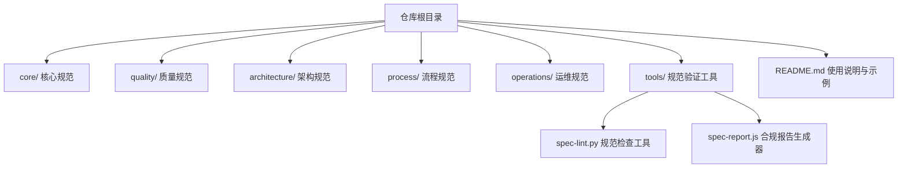
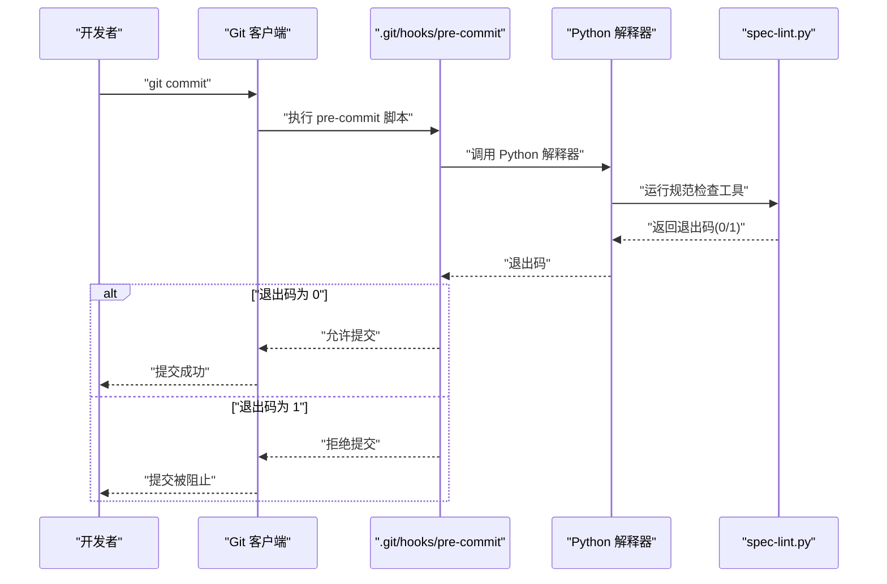
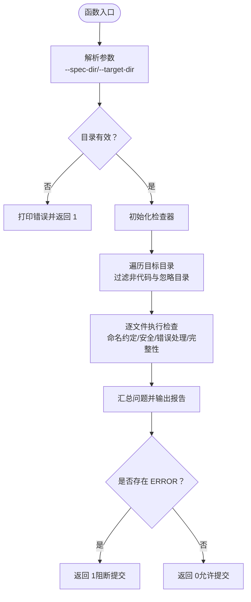
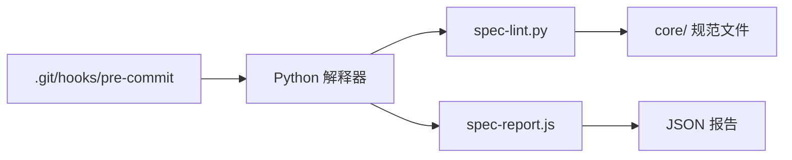

# Git Hooks集成

<cite>
**本文引用的文件**
- [README.md](file://README.md)
- [tools/spec-lint.py](file://tools/spec-lint.py)
- [tools/spec-report.js](file://tools/spec-report.js)
- [process/git-workflow-spec.zh-CN.md](file://process/git-workflow-spec.zh-CN.md)
</cite>

## 目录
1. [简介](#简介)
2. [项目结构](#项目结构)
3. [核心组件](#核心组件)
4. [架构总览](#架构总览)
5. [详细组件分析](#详细组件分析)
6. [依赖关系分析](#依赖关系分析)
7. [性能考虑](#性能考虑)
8. [故障排查指南](#故障排查指南)
9. [结论](#结论)
10. [附录](#附录)

## 简介
本文件面向希望将规范检查自动化嵌入本地开发流程的开发者，重点指导如何在 Git 提交前通过 Hook 自动执行规范合规性检查。文档基于仓库中的工具与规范，提供在 .git/hooks/pre-commit 中配置 spec-lint.py 的完整步骤、脚本示例要点（Python 环境检测、工具执行、错误码捕获与中断提交）、权限授予方法以及常见问题排查建议。同时，建议采用 Husky 等工具管理 Hooks，以提升跨平台与可维护性。

## 项目结构
仓库采用按主题分层的组织方式，核心与质量规范位于 core/quality/architecture/process 等目录；工具位于 tools/，其中包含规范检查工具 spec-lint.py 与合规报告生成器 spec-report.js。README.md 提供了快速开始、工具使用与 Git Hooks 集成示例。

图表来源
- [README.md](file://README.md#L1-L60)
- [tools/spec-lint.py](file://tools/spec-lint.py#L1-L40)
- [tools/spec-report.js](file://tools/spec-report.js#L1-L40)

章节来源
- [README.md](file://README.md#L1-L60)

## 核心组件
- 规范检查工具 spec-lint.py：扫描目标目录，依据启用的规范文件进行检查，输出问题并返回退出码，支持指定规范目录与目标目录。
- 合规报告生成器 spec-report.js：汇总规范启用情况、代码统计与测试覆盖率，生成控制台报告与 JSON 报告文件。
- Git Hooks 集成：在 .git/hooks/pre-commit 中执行 spec-lint.py，若返回非零退出码则中断提交。

章节来源
- [tools/spec-lint.py](file://tools/spec-lint.py#L231-L269)
- [tools/spec-report.js](file://tools/spec-report.js#L238-L278)
- [README.md](file://README.md#L255-L268)

## 架构总览
下图展示了本地提交前的 Hook 流程：Git 触发 pre-commit，执行 Python 规范检查工具，根据返回码决定是否允许提交。

图表来源
- [README.md](file://README.md#L255-L268)
- [tools/spec-lint.py](file://tools/spec-lint.py#L200-L229)

## 详细组件分析

### 规范检查工具 spec-lint.py
- 功能概述
  - 读取启用的规范文件，解析启用规则集合。
  - 遍历目标目录中的指定语言文件，执行命名约定、安全、错误处理与完整性检查。
  - 输出问题统计与按文件分组的问题列表，返回退出码：存在 ERROR 时返回 1，否则返回 0。
- 关键行为
  - 参数解析：支持 --spec-dir 与 --target-dir，默认分别指向 core 目录与当前工作目录。
  - 目录扫描：跳过 node_modules、dist、build、__pycache__、.venv 等目录。
  - 退出码：report() 返回 1 若存在 ERROR，否则返回 0。
- 适用场景
  - 本地 pre-commit 钩子、CI/CD 流水线、手动检查。

图表来源
- [tools/spec-lint.py](file://tools/spec-lint.py#L231-L269)
- [tools/spec-lint.py](file://tools/spec-lint.py#L188-L229)

章节来源
- [tools/spec-lint.py](file://tools/spec-lint.py#L1-L269)

### 合规报告生成器 spec-report.js
- 功能概述
  - 解析规范文件，统计启用规则数量与总数，计算总体合规率。
  - 扫描目标目录的代码文件，统计文件数与行数，按类型分组。
  - 读取测试覆盖率摘要（若存在），输出综合报告。
  - 可选输出 JSON 报告文件。
- 适用场景
  - CI/CD 报告生成、质量门禁可视化、审计与回顾。

章节来源
- [tools/spec-report.js](file://tools/spec-report.js#L1-L278)

### Git Hooks 集成（pre-commit）
- 集成位置
  - .git/hooks/pre-commit
- 执行流程
  - 调用 Python 解释器执行 tools/spec-lint.py。
  - 捕获上一条命令的退出码，若非 0 则打印提示并退出 1，阻止提交。
- 示例要点
  - 脚本需具备可执行权限（chmod +x）。
  - 建议在脚本中加入 Python 环境检测与错误处理，避免因环境差异导致 Hook 失效。
  - 可结合 Husky 等工具统一管理 Hooks，提升跨平台与可维护性。

章节来源
- [README.md](file://README.md#L255-L268)

## 依赖关系分析
- 工具依赖
  - spec-lint.py 依赖 Python 运行时与标准库（正则、路径、类型提示等）。
  - spec-report.js 依赖 Node.js 运行时与文件系统模块。
- 规范依赖
  - 规范检查基于 core/ 目录下的规范文件，spec-lint.py 会读取启用规则并据此检查目标代码。
- Git Hooks 依赖
  - pre-commit 脚本依赖 Python 解释器与 spec-lint.py 脚本路径正确。

图表来源
- [README.md](file://README.md#L255-L268)
- [tools/spec-lint.py](file://tools/spec-lint.py#L231-L269)
- [tools/spec-report.js](file://tools/spec-report.js#L238-L278)

## 性能考虑
- 目录扫描范围
  - 默认跳过 node_modules、dist、build、__pycache__、.venv 等目录，减少无关文件扫描开销。
- 语言过滤
  - 仅检查 .ts/.tsx/.js/.jsx/.py 文件，缩小检查范围。
- 退出码策略
  - 存在 ERROR 即返回 1，避免在本地快速发现并修复问题，减少后续 CI 成本。

章节来源
- [tools/spec-lint.py](file://tools/spec-lint.py#L188-L229)

## 故障排查指南
- Hook 未触发
  - 确认 .git/hooks/pre-commit 是否存在且具备可执行权限（chmod +x）。
  - 确认 Git 版本与操作系统支持该 Hook。
  - 如使用 Windows，建议通过 Git Bash 或 WSL 执行，或改用 Husky 管理 Hooks。
- Python 依赖缺失
  - 确认系统已安装 Python 3 并可通过命令行访问。
  - 确认 spec-lint.py 路径正确，必要时使用绝对路径或相对路径修正。
- 路径错误
  - 在 pre-commit 中使用绝对路径或确保工作目录正确。
  - 若项目结构变化，需同步更新 pre-commit 中的路径。
- 权限问题
  - 使用 chmod +x 为 pre-commit 脚本赋予可执行权限。
- Husky 管理建议
  - 使用 Husky 管理 Hooks，可在 package.json 中集中配置 pre-commit、commit-msg、pre-push 等钩子，便于团队统一与跨平台兼容。
  - 可结合 lint-staged 对 staged 文件进行针对性检查，减少检查范围与等待时间。

章节来源
- [README.md](file://README.md#L255-L268)
- [process/git-workflow-spec.zh-CN.md](file://process/git-workflow-spec.zh-CN.md#L450-L512)

## 结论
通过在 .git/hooks/pre-commit 中集成 spec-lint.py，可以在本地提交前自动执行规范合规性检查，及时发现并修复问题，降低后续 CI 成本。建议配合 Husky 等工具统一管理 Hooks，提升可维护性与跨平台兼容性。同时，利用 spec-report.js 生成合规报告，有助于质量门禁与团队回顾。

## 附录
- 快速开始
  - 在项目根目录执行规范检查：参见 README.md 中的工具使用说明。
- 预留的 Hook 示例
  - README.md 提供了在 .git/hooks/pre-commit 中添加规范检查的示例脚本与 CI/CD 集成示例。

章节来源
- [README.md](file://README.md#L148-L179)
- [README.md](file://README.md#L255-L293)