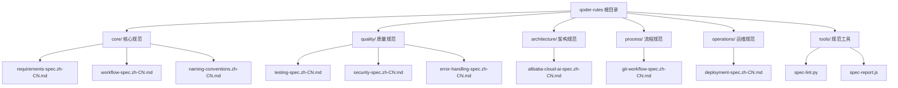
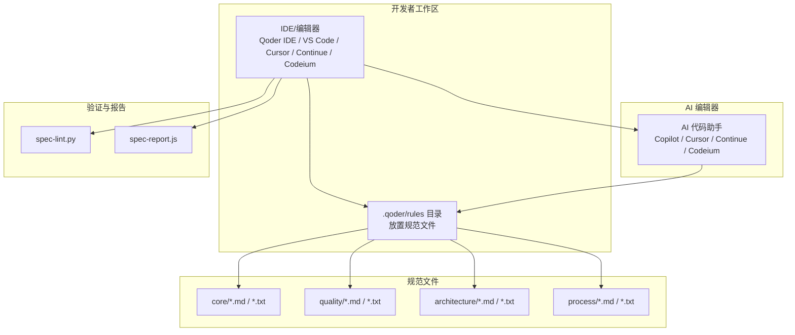
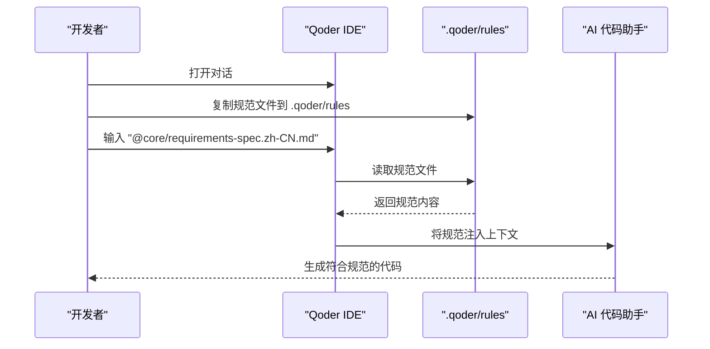
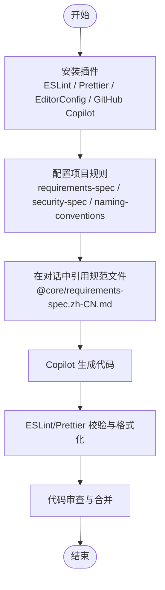
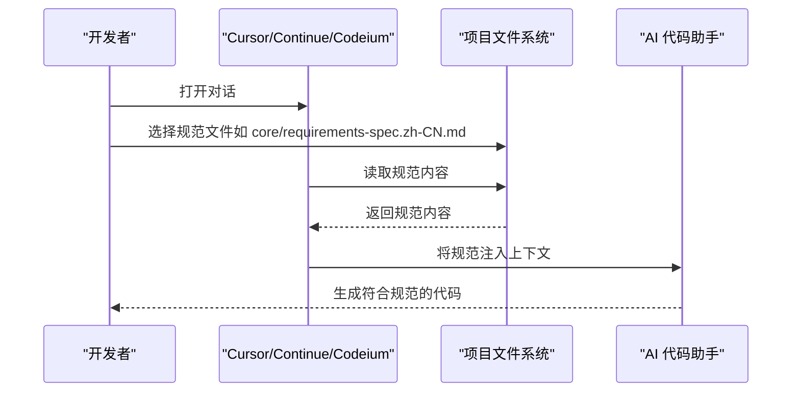
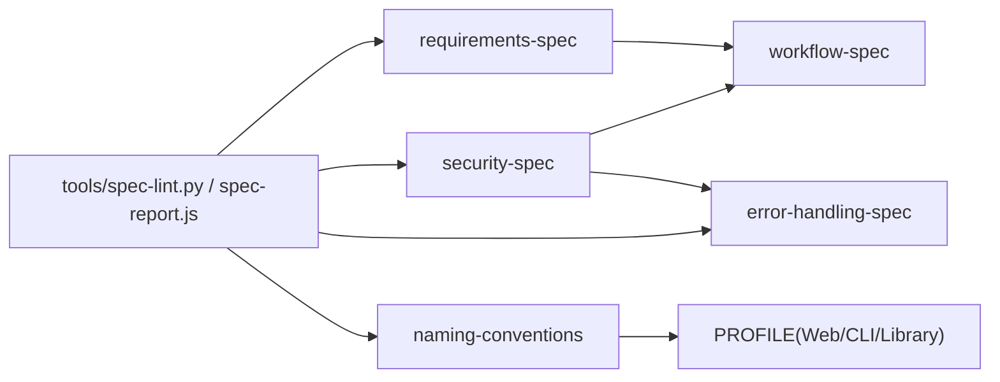

# IDE集成

<cite>
**本文引用的文件**
- [README.md](file://README.md)
- [spec-lint.py](file://tools/spec-lint.py)
- [spec-report.js](file://tools/spec-report.js)
- [spec-index.zh-CN.md](file://core/spec-index.zh-CN.md)
- [requirements-spec.zh-CN.md](file://core/requirements-spec.zh-CN.md)
- [testing-spec.zh-CN.md](file://quality/testing-spec.zh-CN.md)
- [security-spec.zh-CN.md](file://quality/security-spec.zh-CN.md)
- [naming-conventions.zh-CN.md](file://core/naming-conventions.zh-CN.md)
- [alibaba-cloud-ai-spec.zh-CN.md](file://architecture/alibaba-cloud-ai-spec.zh-CN.md)
- [git-workflow-spec.zh-CN.md](file://process/git-workflow-spec.zh-CN.md)
</cite>

## 目录
1. [简介](#简介)
2. [项目结构](#项目结构)
3. [核心组件](#核心组件)
4. [架构总览](#架构总览)
5. [详细组件分析](#详细组件分析)
6. [依赖关系分析](#依赖关系分析)
7. [性能考虑](#性能考虑)
8. [故障排查指南](#故障排查指南)
9. [结论](#结论)
10. [附录](#附录)

## 简介
本指南面向在主流开发环境中集成 qoder-rules-main 的开发者，围绕以下目标展开：
- 在 Qoder IDE 中将规范文件放置于 .qoder/rules 并通过 @ 语法引用，实现 AI 生成代码时的实时约束。
- 在 VS Code 中通过安装 ESLint、Prettier、EditorConfig、GitHub Copilot 等插件，结合规范协作模式，提升代码质量与一致性。
- 在 Cursor、Continue、Codeium 等 AI 编辑器中，利用其支持文件上下文引用的能力，将核心、质量或架构类规范直接加载到对话中，指导 AI 生成符合规范的代码。
- 提供常见问题的解决方案，包括规则未生效、路径解析错误、frontmatter 元数据冲突等，并给出验证集成是否成功的检查清单。

## 项目结构
qoder-rules-main 采用按主题分层的目录组织，便于在不同 IDE 中按需引用与协作：
- core：核心规范（必需），包含需求规范、工作流规范、命名约定等。
- quality：质量保证规范（推荐），包含测试、安全、错误处理等。
- architecture：架构设计规范（可选），包含阿里云 AI 架构等。
- process：流程规范，包含 Git 工作流等。
- operations：运维规范（可选）。
- tools：规范验证工具（spec-lint.py、spec-report.js）。

图表来源
- [README.md](file://README.md#L1-L60)

章节来源
- [README.md](file://README.md#L1-L60)

## 核心组件
- 核心规范（core）：提供通用编码规则、工作流与命名约定，是 AI 生成代码的基础约束。
- 质量规范（quality）：测试、安全、错误处理等，保障代码质量与安全性。
- 架构规范（architecture）：面向 AI 应用的架构最佳实践，如阿里云 AI 架构。
- 流程规范（process）：Git 工作流，确保团队协作与发布治理的一致性。
- 工具（tools）：spec-lint.py 与 spec-report.js，用于检查与生成合规报告。

章节来源
- [README.md](file://README.md#L1-L60)
- [spec-lint.py](file://tools/spec-lint.py#L1-L120)
- [spec-report.js](file://tools/spec-report.js#L1-L120)

## 架构总览
下图展示了在 IDE 中如何将规范文件与 AI 编辑器集成，形成“规范驱动”的代码生成闭环。

图表来源
- [README.md](file://README.md#L181-L211)
- [spec-lint.py](file://tools/spec-lint.py#L231-L269)
- [spec-report.js](file://tools/spec-report.js#L239-L278)

## 详细组件分析

### Qoder IDE 集成
- 目录与放置
  - 将核心规范、质量规范、架构规范复制到项目的 .qoder/rules 目录，以便在对话中直接引用。
- 引用语法
  - 在对话中使用 @ 前缀引用规范文件，例如 @core/requirements-spec.zh-CN.md、@quality/testing-spec.zh-CN.md、@architecture/alibaba-cloud-ai-spec.zh-CN.md。
- Frontmatter 元数据
  - 规范文件包含 trigger: manual frontmatter，可在 Qoder IDE 中作为 Rules 直接使用。

图表来源
- [README.md](file://README.md#L51-L74)
- [README.md](file://README.md#L181-L211)

章节来源
- [README.md](file://README.md#L51-L74)
- [README.md](file://README.md#L181-L211)

### VS Code 集成
- 插件推荐
  - ESLint：代码检查，与 requirements-spec、security-spec 等规则联动。
  - Prettier：代码格式化，与 naming-conventions 规范联动。
  - EditorConfig：统一编辑器配置，保证团队一致性。
  - GitHub Copilot：AI 代码助手，结合规范文件进行约束生成。
- 协作模式
  - 在对话中引用规范文件，Copilot 将根据启用的规则生成代码。
  - 使用 .editorconfig、ESLint 规则与 Prettier 格式化，确保本地与 AI 生成代码风格一致。

图表来源
- [README.md](file://README.md#L195-L211)

章节来源
- [README.md](file://README.md#L195-L211)

### Cursor、Continue、Codeium 集成
- 通用集成方式
  - 这些 AI 编辑器均支持文件上下文引用，开发者可直接在对话中加载核心、质量或架构类规范，从而在生成代码时获得实时约束。
- 建议做法
  - 将规范文件放置在项目根目录或 .qoder/rules，使用 @ 语法引用，确保 AI 能够正确解析并应用规则。

图表来源
- [README.md](file://README.md#L204-L211)

章节来源
- [README.md](file://README.md#L204-L211)

### 规范文件与规则要点
- 核心规范（requirements-spec）
  - 关键规则：生成完整可运行代码、复用现有 API、最小化新增依赖、验证 API 存在、确保代码可编译、只使用真实存在的库等。
  - 项目类型配置：Web、CLI、库/SDK 的推荐启用规则集合。
- 测试规范（testing-spec）
  - 测试完整性、覆盖率目标、测试分层、Mock 规范、命名约定、数据管理、边界条件与异常测试、隔离性、性能要求等。
- 安全规范（security-spec）
  - 输入验证与清理、认证与授权、敏感数据保护、依赖安全管理、OWASP Top 10 防护、日志安全、API 安全、配置管理、会话管理、文件上传安全、错误处理安全等。
- 命名约定（naming-conventions）
  - 变量、函数、类、常量、文件、环境变量等命名规范，以及前端组件、数据库表/列、API 端点、类型/接口、事件、测试命名等约定。
- 阿里云 AI 架构（alibaba-cloud-ai-spec）
  - 模型服务化架构、向量检索与存储、大模型调用与管理、数据湖与特征工程、模型训练与优化、实时推理服务、监控与可观测性、数据安全与合规等。
- Git 工作流（git-workflow-spec）
  - 分支命名、提交消息、提交频率、Pull Request 规范、分支策略、代码审查、合并策略、禁止操作、标签管理、冲突解决、.gitignore 管理、Commit Hooks 等。

章节来源
- [requirements-spec.zh-CN.md](file://core/requirements-spec.zh-CN.md#L1-L267)
- [testing-spec.zh-CN.md](file://quality/testing-spec.zh-CN.md#L1-L360)
- [security-spec.zh-CN.md](file://quality/security-spec.zh-CN.md#L1-L421)
- [naming-conventions.zh-CN.md](file://core/naming-conventions.zh-CN.md#L1-L458)
- [alibaba-cloud-ai-spec.zh-CN.md](file://architecture/alibaba-cloud-ai-spec.zh-CN.md#L1-L200)
- [git-workflow-spec.zh-CN.md](file://process/git-workflow-spec.zh-CN.md#L1-L200)

## 依赖关系分析
- 规范之间的依赖与冲突
  - requirements-spec 与 workflow-spec：API 准确性与版本管理、编译正确性与发布治理存在依赖关系。
  - naming-conventions 与项目类型（PROFILE）：不同项目类型的命名约定启用策略不同。
  - security-spec 与 error-handling-spec、workflow-spec：安全错误处理与依赖安全审计与工作流规范相互关联。
- 工具与规范的联动
  - spec-lint.py 会解析启用的规则（基于 txt 文件中的 ENABLED 标记），并在目标代码目录中进行静态检查。
  - spec-report.js 会扫描代码文件、统计覆盖率并生成合规报告。

图表来源
- [spec-index.zh-CN.md](file://core/spec-index.zh-CN.md#L69-L110)
- [security-spec.zh-CN.md](file://quality/security-spec.zh-CN.md#L388-L400)
- [spec-lint.py](file://tools/spec-lint.py#L46-L81)
- [spec-report.js](file://tools/spec-report.js#L138-L170)

章节来源
- [spec-index.zh-CN.md](file://core/spec-index.zh-CN.md#L69-L110)
- [security-spec.zh-CN.md](file://quality/security-spec.zh-CN.md#L388-L400)
- [spec-lint.py](file://tools/spec-lint.py#L46-L81)
- [spec-report.js](file://tools/spec-report.js#L138-L170)

## 性能考虑
- 规范检查工具
  - spec-lint.py 与 spec-report.js 仅扫描目标目录中特定扩展名的文件，并跳过常见的构建与虚拟环境目录，避免不必要的性能开销。
  - 建议在大型项目中限定目标目录，减少扫描范围。
- AI 生成效率
  - 在 AI 编辑器中引用精简后的规范文件，有助于减少上下文噪声，提升生成效率与准确性。
- 格式化与校验
  - 在本地使用 Prettier 与 ESLint，可减少 AI 生成后的人工调整成本，提高整体开发效率。

章节来源
- [spec-lint.py](file://tools/spec-lint.py#L188-L200)
- [spec-report.js](file://tools/spec-report.js#L59-L104)

## 故障排查指南
- 规则未生效
  - 检查规范文件是否放置在 .qoder/rules 或项目根目录，并确保使用 @ 语法正确引用。
  - 确认规范文件中的 ENABLED/DISABLED 标记是否正确，以及 frontmatter 中 trigger: manual 是否存在。
- 路径解析错误
  - 在 VS Code 中，确保 ESLint、Prettier、EditorConfig 插件已正确配置，且规则文件路径与项目结构一致。
  - 在 Cursor/Continue/Codeium 中，确认对话中引用的规范路径与项目文件系统一致。
- frontmatter 元数据冲突
  - 确保规范文件顶部的 frontmatter（如 trigger: manual）未被意外修改或删除。
- 常见问题定位
  - 使用 spec-lint.py 检查目标目录，查看输出的问题列表与严重程度，逐项修复。
  - 使用 spec-report.js 生成合规报告，核对启用规则数量与覆盖率指标。

章节来源
- [README.md](file://README.md#L181-L211)
- [spec-lint.py](file://tools/spec-lint.py#L231-L269)
- [spec-report.js](file://tools/spec-report.js#L239-L278)

## 结论
通过在 Qoder IDE、VS Code、Cursor、Continue、Codeium 等主流开发环境中集成 qoder-rules-main，开发者可以将核心、质量与架构类规范作为“实时约束”，在 AI 生成代码的过程中自动遵循最佳实践。配合工具链（ESLint、Prettier、EditorConfig、GitHub Copilot、spec-lint.py、spec-report.js），能够显著提升代码质量、安全性与一致性，并降低协作成本。

## 附录

### 验证集成成功的检查清单
- Qoder IDE
  - .qoder/rules 目录存在并包含所需规范文件。
  - 在对话中使用 @ 语法引用规范文件，AI 能够正确加载并应用规则。
  - 规范文件包含 frontmatter trigger: manual。
- VS Code
  - 已安装 ESLint、Prettier、EditorConfig、GitHub Copilot 插件。
  - 项目根目录存在规范文件或 .qoder/rules 目录。
  - 在 Copilot 对话中引用规范文件，生成的代码符合规则。
  - 本地 ESLint 与 Prettier 校验通过。
- Cursor/Continue/Codeium
  - 在对话中引用规范文件，AI 能够正确解析并应用规则。
  - 规范文件路径与项目结构一致，无路径解析错误。
- 工具链
  - spec-lint.py 能够扫描目标目录并输出问题报告。
  - spec-report.js 能够生成合规报告并显示启用规则数量与覆盖率。

章节来源
- [README.md](file://README.md#L51-L74)
- [README.md](file://README.md#L181-L211)
- [spec-lint.py](file://tools/spec-lint.py#L231-L269)
- [spec-report.js](file://tools/spec-report.js#L239-L278)