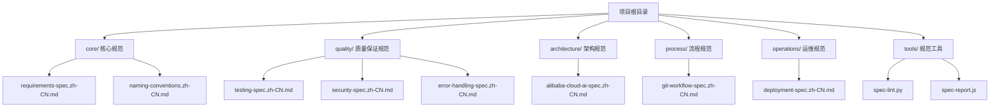
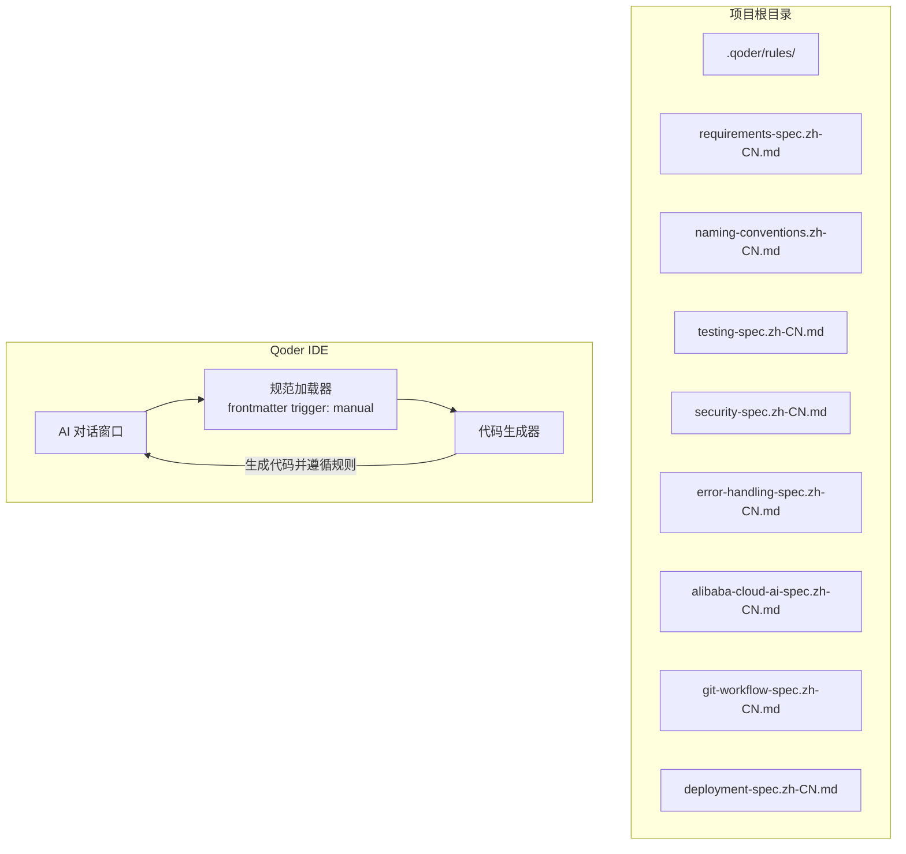
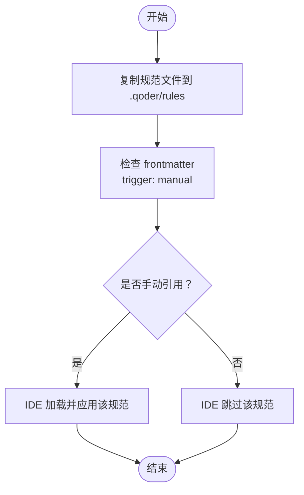
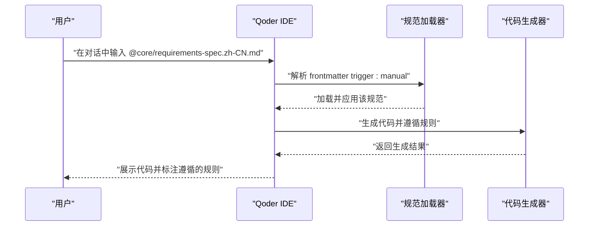
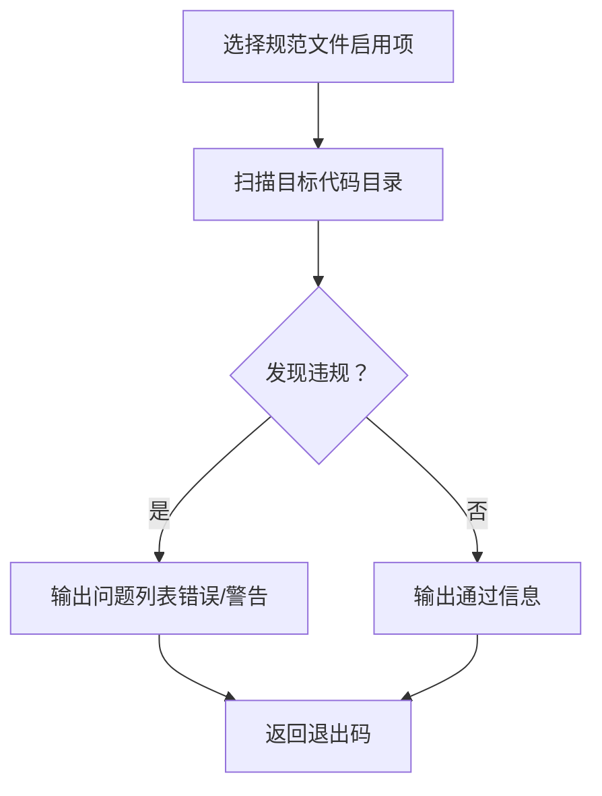
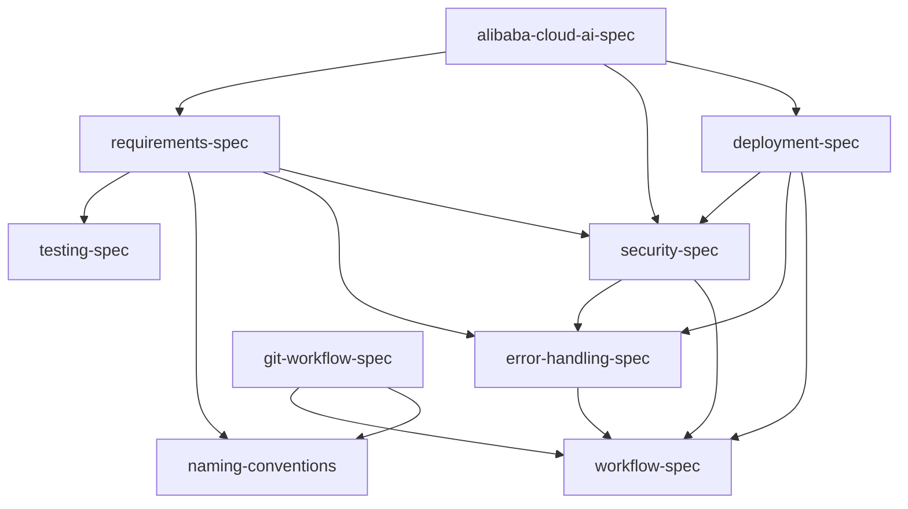

# Qoder IDE 集成

<cite>
**本文引用的文件**
- [README.md](file://README.md)
- [requirements-spec.zh-CN.md](file://core/requirements-spec.zh-CN.md)
- [naming-conventions.zh-CN.md](file://core/naming-conventions.zh-CN.md)
- [testing-spec.zh-CN.md](file://quality/testing-spec.zh-CN.md)
- [security-spec.zh-CN.md](file://quality/security-spec.zh-CN.md)
- [error-handling-spec.zh-CN.md](file://quality/error-handling-spec.zh-CN.md)
- [alibaba-cloud-ai-spec.zh-CN.md](file://architecture/alibaba-cloud-ai-spec.zh-CN.md)
- [git-workflow-spec.zh-CN.md](file://process/git-workflow-spec.zh-CN.md)
- [deployment-spec.zh-CN.md](file://operations/deployment-spec.zh-CN.md)
- [spec-lint.py](file://tools/spec-lint.py)
- [spec-report.js](file://tools/spec-report.js)
</cite>

## 目录
1. [简介](#简介)
2. [项目结构](#项目结构)
3. [核心组件](#核心组件)
4. [架构总览](#架构总览)
5. [详细组件分析](#详细组件分析)
6. [依赖关系分析](#依赖关系分析)
7. [性能考虑](#性能考虑)
8. [故障排查指南](#故障排查指南)
9. [结论](#结论)
10. [附录](#附录)

## 简介
本指南面向希望在 Qoder IDE 中集成并使用 qoder-rules-main 规范体系的团队与个人开发者。目标是帮助你在项目中正确放置规范文件、理解 frontmatter 中 trigger: manual 的作用、掌握在 AI 对话中通过“@路径”语法引用规范文件的方法，并提供配置验证与常见问题排查清单，确保 AI 生成代码时能正确加载并遵循所引用的规范。

## 项目结构
qoder-rules-main 采用按领域划分的目录结构，核心规范位于 core/，质量保证规范位于 quality/，架构规范位于 architecture/，流程规范位于 process/，运维规范位于 operations/，tools/ 提供规范检查与报告工具。

图表来源
- [README.md](file://README.md#L1-L39)

章节来源
- [README.md](file://README.md#L1-L39)

## 核心组件
- 核心规范（core/requirements-spec.zh-CN.md）：定义生成完整、可运行代码、API 验证、编译通过、依赖真实性等关键规则，是 AI 生成代码时的首要约束。
- 命名约定（core/naming-conventions.zh-CN.md）：提供变量、函数、类、常量、文件、环境变量等命名规范，支持按项目类型启用/禁用。
- 质量保证（quality/）：测试规范（testing-spec.zh-CN.md）、安全规范（security-spec.zh-CN.md）、错误处理规范（error-handling-spec.zh-CN.md），分别覆盖测试完整性、安全防护与错误处理策略。
- 架构规范（architecture/alibaba-cloud-ai-spec.zh-CN.md）：面向基于阿里云 AI 的应用，涵盖模型服务化、向量检索、大模型调用、数据湖与特征工程、实时推理、监控与可观测性、数据安全与合规等。
- 流程规范（process/git-workflow-spec.zh-CN.md）：Git 分支命名、提交消息、PR 规范、合并策略、标签管理等，支撑规范在团队协作中的落地。
- 运维规范（operations/deployment-spec.zh-CN.md）：环境分离、CI/CD、容器化、配置管理、健康检查、日志聚合、回滚机制、数据库迁移、监控告警、安全加固与上线检查清单。
- 工具（tools/）：spec-lint.py 与 spec-report.js，用于检查代码是否符合启用的规范并生成合规报告。

章节来源
- [README.md](file://README.md#L1-L39)
- [requirements-spec.zh-CN.md](file://core/requirements-spec.zh-CN.md#L1-L40)
- [naming-conventions.zh-CN.md](file://core/naming-conventions.zh-CN.md#L1-L40)
- [testing-spec.zh-CN.md](file://quality/testing-spec.zh-CN.md#L1-L25)
- [security-spec.zh-CN.md](file://quality/security-spec.zh-CN.md#L1-L25)
- [error-handling-spec.zh-CN.md](file://quality/error-handling-spec.zh-CN.md#L1-L25)
- [alibaba-cloud-ai-spec.zh-CN.md](file://architecture/alibaba-cloud-ai-spec.zh-CN.md#L1-L25)
- [git-workflow-spec.zh-CN.md](file://process/git-workflow-spec.zh-CN.md#L1-L25)
- [deployment-spec.zh-CN.md](file://operations/deployment-spec.zh-CN.md#L1-L25)
- [spec-lint.py](file://tools/spec-lint.py#L1-L25)
- [spec-report.js](file://tools/spec-report.js#L1-L25)

## 架构总览
下图展示 Qoder IDE 集成的关键流程：将规范文件放置于项目根目录的 .qoder/rules，AI 在对话中通过“@路径”语法引用规范文件，IDE 根据规范生成代码并遵循规则。

图表来源
- [README.md](file://README.md#L51-L74)
- [README.md](file://README.md#L181-L211)
- [requirements-spec.zh-CN.md](file://core/requirements-spec.zh-CN.md#L1-L10)
- [naming-conventions.zh-CN.md](file://core/naming-conventions.zh-CN.md#L1-L10)
- [testing-spec.zh-CN.md](file://quality/testing-spec.zh-CN.md#L1-L10)
- [security-spec.zh-CN.md](file://quality/security-spec.zh-CN.md#L1-L10)
- [error-handling-spec.zh-CN.md](file://quality/error-handling-spec.zh-CN.md#L1-L10)
- [alibaba-cloud-ai-spec.zh-CN.md](file://architecture/alibaba-cloud-ai-spec.zh-CN.md#L1-L10)
- [git-workflow-spec.zh-CN.md](file://process/git-workflow-spec.zh-CN.md#L1-L10)
- [deployment-spec.zh-CN.md](file://operations/deployment-spec.zh-CN.md#L1-L10)

## 详细组件分析

### 规范文件放置与 frontmatter trigger: manual
- 放置位置：将规范文件复制到项目根目录的 .qoder/rules 目录中，确保 IDE 能够在对话中通过“@路径”语法引用。
- frontmatter 中 trigger: manual 的作用：该字段标识该规范文件为手动触发模式，IDE 在对话中显式引用时才会生效，避免无意加载过多规则。

图表来源
- [README.md](file://README.md#L51-L74)
- [README.md](file://README.md#L181-L211)
- [requirements-spec.zh-CN.md](file://core/requirements-spec.zh-CN.md#L1-L10)
- [naming-conventions.zh-CN.md](file://core/naming-conventions.zh-CN.md#L1-L10)

章节来源
- [README.md](file://README.md#L51-L74)
- [README.md](file://README.md#L181-L211)
- [requirements-spec.zh-CN.md](file://core/requirements-spec.zh-CN.md#L1-L10)
- [naming-conventions.zh-CN.md](file://core/naming-conventions.zh-CN.md#L1-L10)

### 在 AI 对话中引用规范文件的完整流程
- 在对话中使用“@路径”语法引用规范文件，例如 @core/requirements-spec.zh-CN.md、@quality/testing-spec.zh-CN.md、@architecture/alibaba-cloud-ai-spec.zh-CN.md 等。
- IDE 会根据 frontmatter trigger: manual 仅加载被显式引用的规范，并将其作为生成代码的约束条件。
- 你可以组合多个规范文件，以覆盖需求、测试、安全、错误处理、架构等多个方面。

图表来源
- [README.md](file://README.md#L63-L74)
- [README.md](file://README.md#L181-L211)
- [requirements-spec.zh-CN.md](file://core/requirements-spec.zh-CN.md#L1-L10)

章节来源
- [README.md](file://README.md#L63-L74)
- [README.md](file://README.md#L181-L211)

### 核心规范（requirements-spec.zh-CN.md）
- 关键规则要点：生成完整可运行代码、复用现有 API、最小化新增依赖、仅修改请求内容、验证所有 API 存在、确保代码成功编译、从错误中学习、只使用真实存在的库、严格遵循示例、保持注释与实现一致等。
- 适用范围：所有编程语言与框架，作为 AI 生成代码的首要约束。

章节来源
- [requirements-spec.zh-CN.md](file://core/requirements-spec.zh-CN.md#L1-L40)
- [requirements-spec.zh-CN.md](file://core/requirements-spec.zh-CN.md#L117-L136)
- [requirements-spec.zh-CN.md](file://core/requirements-spec.zh-CN.md#L170-L181)
- [requirements-spec.zh-CN.md](file://core/requirements-spec.zh-CN.md#L198-L209)

### 命名约定（naming-conventions.zh-CN.md）
- 约定内容：变量命名、函数/方法命名、类命名、常量命名、文件命名、环境变量命名等；支持按语言/项目类型启用/禁用。
- 与项目类型的适配：Web 应用、CLI 工具、库/SDK 推荐启用的约定不同。

章节来源
- [naming-conventions.zh-CN.md](file://core/naming-conventions.zh-CN.md#L1-L40)
- [naming-conventions.zh-CN.md](file://core/naming-conventions.zh-CN.md#L1-L120)
- [naming-conventions.zh-CN.md](file://core/naming-conventions.zh-CN.md#L438-L458)

### 测试规范（testing-spec.zh-CN.md）
- 规则要点：测试完整性、覆盖率目标（Web/CLI/库）、测试分层（单元/集成/E2E）、Mock 与 Stub 使用、测试命名约定、测试数据管理、边界条件与异常测试、测试隔离性、测试性能要求等。
- 与其他规范的集成：与命名约定、工作流规范存在依赖关系。

章节来源
- [testing-spec.zh-CN.md](file://quality/testing-spec.zh-CN.md#L1-L25)
- [testing-spec.zh-CN.md](file://quality/testing-spec.zh-CN.md#L1-L60)
- [testing-spec.zh-CN.md](file://quality/testing-spec.zh-CN.md#L330-L360)

### 安全规范（security-spec.zh-CN.md）
- 规则要点：输入验证与清理、认证与授权、敏感数据保护、依赖安全管理、OWASP Top 10 防护、日志安全、API 安全、安全配置管理、会话管理安全、文件上传安全、错误处理安全、安全开发生命周期等。
- 与其他规范的集成：与需求规范、错误处理规范、工作流规范存在依赖关系。

章节来源
- [security-spec.zh-CN.md](file://quality/security-spec.zh-CN.md#L1-L25)
- [security-spec.zh-CN.md](file://quality/security-spec.zh-CN.md#L1-L60)
- [security-spec.zh-CN.md](file://quality/security-spec.zh-CN.md#L368-L421)

### 错误处理规范（error-handling-spec.zh-CN.md）
- 规则要点：错误分类体系、自定义错误类、错误日志记录、用户友好提示、Try-Catch 最佳实践、错误恢复策略（重试/降级）、全局错误处理器、前端错误边界、错误监控与告警、错误码标准化、超时与限流处理、错误文档化等。
- 与其他规范的集成：与安全规范、工作流规范存在依赖关系。

章节来源
- [error-handling-spec.zh-CN.md](file://quality/error-handling-spec.zh-CN.md#L1-L25)
- [error-handling-spec.zh-CN.md](file://quality/error-handling-spec.zh-CN.md#L1-L60)
- [error-handling-spec.zh-CN.md](file://quality/error-handling-spec.zh-CN.md#L524-L576)

### 架构规范（alibaba-cloud-ai-spec.zh-CN.md）
- 规则要点：模型服务化架构、向量检索与存储、大模型调用与管理、数据湖与特征工程、模型训练与优化、实时推理服务、监控与可观测性、数据安全与合规等。
- 依赖规范：与需求规范、安全规范、部署规范存在依赖关系。

章节来源
- [alibaba-cloud-ai-spec.zh-CN.md](file://architecture/alibaba-cloud-ai-spec.zh-CN.md#L1-L25)
- [alibaba-cloud-ai-spec.zh-CN.md](file://architecture/alibaba-cloud-ai-spec.zh-CN.md#L1-L60)
- [alibaba-cloud-ai-spec.zh-CN.md](file://architecture/alibaba-cloud-ai-spec.zh-CN.md#L1-L120)

### 流程规范（git-workflow-spec.zh-CN.md）
- 规则要点：分支命名规范、提交消息规范（Conventional Commits）、提交频率、Pull Request 规范、分支策略（Git Flow/GitHub Flow）、代码审查要求、合并策略、禁止操作、标签管理、冲突解决、.gitignore 管理、Commit Hooks 等。
- 与其他规范的集成：与工作流规范、命名约定存在依赖关系。

章节来源
- [git-workflow-spec.zh-CN.md](file://process/git-workflow-spec.zh-CN.md#L1-L25)
- [git-workflow-spec.zh-CN.md](file://process/git-workflow-spec.zh-CN.md#L1-L60)
- [git-workflow-spec.zh-CN.md](file://process/git-workflow-spec.zh-CN.md#L480-L533)

### 运维规范（deployment-spec.zh-CN.md）
- 规则要点：环境分离、CI/CD 流水线、容器化部署、配置管理、健康检查、日志聚合、回滚机制、数据库迁移管理、监控与告警、安全加固、部署前检查清单等。
- 与其他规范的集成：与工作流规范、安全规范、错误处理规范存在依赖关系。

章节来源
- [deployment-spec.zh-CN.md](file://operations/deployment-spec.zh-CN.md#L1-L25)
- [deployment-spec.zh-CN.md](file://operations/deployment-spec.zh-CN.md#L1-L60)
- [deployment-spec.zh-CN.md](file://operations/deployment-spec.zh-CN.md#L753-L808)

### 工具：规范检查与报告
- 规范检查（spec-lint.py）：扫描目标目录，检查命名约定、安全问题、错误处理、代码完整性等，输出问题列表与退出码。
- 合规报告（spec-report.js）：统计启用规则数量、覆盖率、代码统计、测试覆盖率（若存在），并可输出 JSON 报告。

图表来源
- [spec-lint.py](file://tools/spec-lint.py#L1-L40)
- [spec-lint.py](file://tools/spec-lint.py#L181-L209)
- [spec-report.js](file://tools/spec-report.js#L1-L40)
- [spec-report.js](file://tools/spec-report.js#L131-L186)

章节来源
- [spec-lint.py](file://tools/spec-lint.py#L1-L40)
- [spec-lint.py](file://tools/spec-lint.py#L181-L209)
- [spec-report.js](file://tools/spec-report.js#L1-L40)
- [spec-report.js](file://tools/spec-report.js#L131-L186)

## 依赖关系分析
- 规范之间的依赖与冲突：各规范文件内提供了依赖关系与冲突化解方案，例如测试规范与命名约定、安全规范与错误处理规范、工作流规范与版本管理等。
- 项目类型配置：不同项目类型（Web、CLI、库/SDK）推荐启用的规则集合不同，可在规范文件中查看。

图表来源
- [testing-spec.zh-CN.md](file://quality/testing-spec.zh-CN.md#L330-L340)
- [security-spec.zh-CN.md](file://quality/security-spec.zh-CN.md#L388-L400)
- [error-handling-spec.zh-CN.md](file://quality/error-handling-spec.zh-CN.md#L543-L555)
- [deployment-spec.zh-CN.md](file://operations/deployment-spec.zh-CN.md#L773-L785)
- [alibaba-cloud-ai-spec.zh-CN.md](file://architecture/alibaba-cloud-ai-spec.zh-CN.md#L1-L25)
- [git-workflow-spec.zh-CN.md](file://process/git-workflow-spec.zh-CN.md#L500-L510)

章节来源
- [testing-spec.zh-CN.md](file://quality/testing-spec.zh-CN.md#L330-L340)
- [security-spec.zh-CN.md](file://quality/security-spec.zh-CN.md#L388-L400)
- [error-handling-spec.zh-CN.md](file://quality/error-handling-spec.zh-CN.md#L543-L555)
- [deployment-spec.zh-CN.md](file://operations/deployment-spec.zh-CN.md#L773-L785)
- [alibaba-cloud-ai-spec.zh-CN.md](file://architecture/alibaba-cloud-ai-spec.zh-CN.md#L1-L25)
- [git-workflow-spec.zh-CN.md](file://process/git-workflow-spec.zh-CN.md#L500-L510)

## 性能考虑
- 在 AI 对话中引用规范文件时，建议仅引用当前需要的规范，避免一次性加载过多规则导致生成过程变慢。
- 使用工具进行离线检查与报告生成，有助于在提交前快速定位问题，减少反复生成与修改的成本。
- 对于大型项目，建议将规范文件与代码分离，仅在需要时加载相关规范，以提升 IDE 的响应速度。

## 故障排查指南
- 规则未触发
  - 检查规范文件 frontmatter 是否包含 trigger: manual，IDE 仅在对话中显式引用时才加载。
  - 确认对话中使用的路径语法是否正确，路径应与 .qoder/rules 下的实际文件一致。
  - 章节来源
    - [README.md](file://README.md#L181-L211)
    - [requirements-spec.zh-CN.md](file://core/requirements-spec.zh-CN.md#L1-L10)

- 路径错误
  - 确认 .qoder/rules 目录结构与规范文件名一致，路径大小写与扩展名需匹配。
  - 若使用中文路径，确保 IDE 支持中文文件名与路径。
  - 章节来源
    - [README.md](file://README.md#L51-L74)

- frontmatter 格式问题
  - frontmatter 必须以“---”包裹，trigger 字段需为 manual，且前后无多余空格或特殊字符。
  - 章节来源
    - [requirements-spec.zh-CN.md](file://core/requirements-spec.zh-CN.md#L1-L10)
    - [naming-conventions.zh-CN.md](file://core/naming-conventions.zh-CN.md#L1-L10)
    - [testing-spec.zh-CN.md](file://quality/testing-spec.zh-CN.md#L1-L10)
    - [security-spec.zh-CN.md](file://quality/security-spec.zh-CN.md#L1-L10)
    - [error-handling-spec.zh-CN.md](file://quality/error-handling-spec.zh-CN.md#L1-L10)
    - [alibaba-cloud-ai-spec.zh-CN.md](file://architecture/alibaba-cloud-ai-spec.zh-CN.md#L1-L10)
    - [git-workflow-spec.zh-CN.md](file://process/git-workflow-spec.zh-CN.md#L1-L10)
    - [deployment-spec.zh-CN.md](file://operations/deployment-spec.zh-CN.md#L1-L10)

- AI 未遵循规范
  - 确认对话中明确引用了相关规范文件；若规范文件启用了较多规则，建议分批次引用，以便观察效果。
  - 使用工具进行离线检查，定位具体违规项并修正。
  - 章节来源
    - [README.md](file://README.md#L63-L74)
    - [spec-lint.py](file://tools/spec-lint.py#L181-L209)

- 配置验证方法
  - 使用工具生成合规报告，核对启用规则数量与覆盖率，确保与预期一致。
  - 章节来源
    - [spec-report.js](file://tools/spec-report.js#L131-L186)

- 常见问题排查清单
  - 是否将规范文件放置于 .qoder/rules？
  - frontmatter 是否包含 trigger: manual？
  - 对话中引用的路径是否与文件名一致？
  - 是否仅引用当前需要的规范文件？
  - 是否使用工具进行离线检查与报告生成？

章节来源
- [README.md](file://README.md#L51-L74)
- [README.md](file://README.md#L63-L74)
- [README.md](file://README.md#L181-L211)
- [spec-lint.py](file://tools/spec-lint.py#L181-L209)
- [spec-report.js](file://tools/spec-report.js#L131-L186)

## 结论
通过将 qoder-rules-main 规范文件放置于项目根目录的 .qoder/rules，并在 Qoder IDE 中使用“@路径”语法显式引用，结合 frontmatter trigger: manual 的机制，可以确保 AI 在生成代码时遵循你所选择的规范。配合工具进行离线检查与报告生成，能够有效验证配置并及时发现潜在问题，从而提升代码质量与一致性。

## 附录
- 快速开始步骤
  1) 将规范文件复制到 .qoder/rules 目录
  2) 在对话中使用 @路径 引用所需规范
  3) 使用工具进行离线检查与报告生成
- 参考示例
  - 在对话中引用多个规范文件，以覆盖需求、测试、安全、错误处理、架构等方面
  - 使用工具生成合规报告，核对启用规则数量与覆盖率

章节来源
- [README.md](file://README.md#L51-L74)
- [README.md](file://README.md#L63-L74)
- [README.md](file://README.md#L181-L211)
- [spec-lint.py](file://tools/spec-lint.py#L181-L209)
- [spec-report.js](file://tools/spec-report.js#L131-L186)