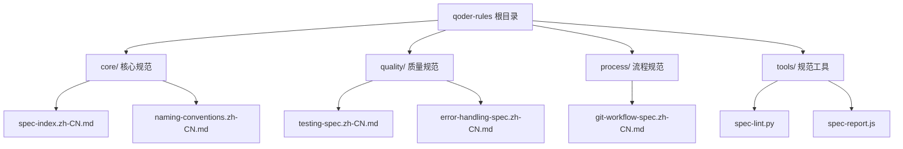
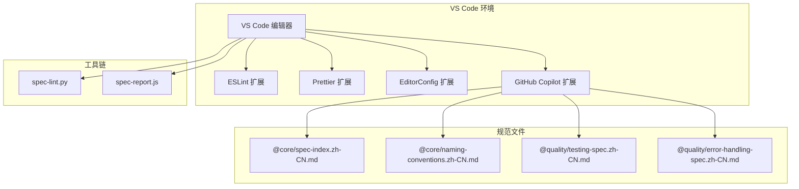
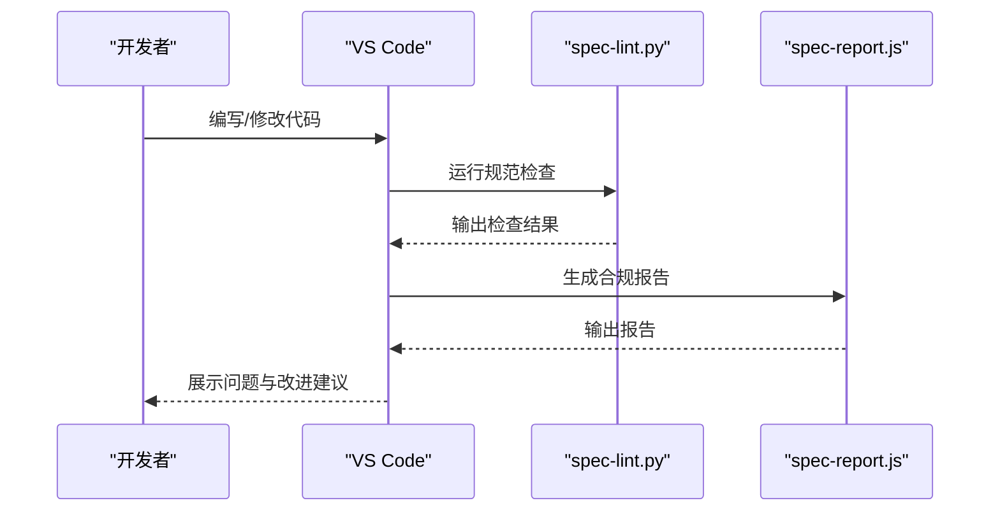
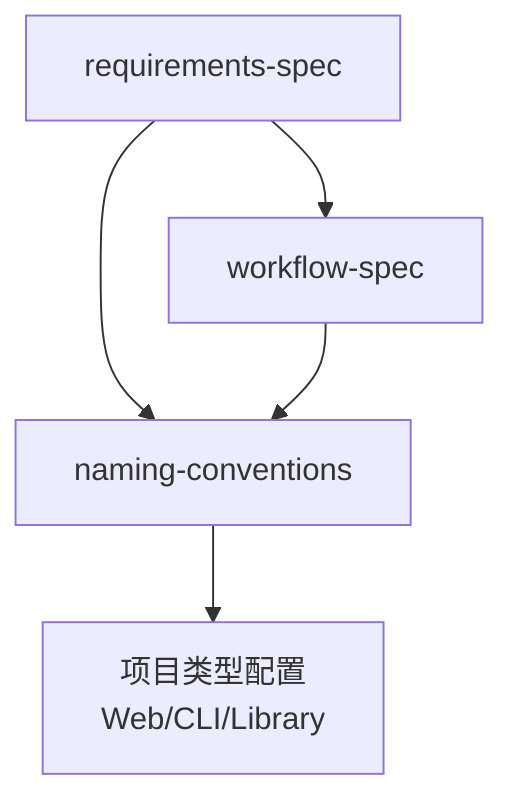

# VS Code 集成

<cite>
**本文引用的文件**
- [README.md](file://README.md)
- [core/spec-index.zh-CN.md](file://core/spec-index.zh-CN.md)
- [core/naming-conventions.zh-CN.md](file://core/naming-conventions.zh-CN.md)
- [quality/testing-spec.zh-CN.md](file://quality/testing-spec.zh-CN.md)
- [quality/error-handling-spec.zh-CN.md](file://quality/error-handling-spec.zh-CN.md)
- [process/git-workflow-spec.zh-CN.md](file://process/git-workflow-spec.zh-CN.md)
- [tools/spec-lint.py](file://tools/spec-lint.py)
- [tools/spec-report.js](file://tools/spec-report.js)
</cite>

## 目录
1. [简介](#简介)
2. [项目结构](#项目结构)
3. [核心组件](#核心组件)
4. [架构总览](#架构总览)
5. [详细组件分析](#详细组件分析)
6. [依赖关系分析](#依赖关系分析)
7. [性能考虑](#性能考虑)
8. [故障排除指南](#故障排除指南)
9. [结论](#结论)
10. [附录](#附录)

## 简介
本指南面向在 VS Code 中使用 qoder-rules-main 规范进行 AI 辅助开发的团队，目标是帮助你在本地开发环境中：
- 安装并配置 ESLint、Prettier、EditorConfig、GitHub Copilot 等关键扩展
- 通过这些工具实现对规范的静态约束与格式化
- 在 Copilot 对话中通过文件上下文或直接引用方式加载核心、质量或架构类规范文件，确保生成代码的合规性
- 提供配置示例与验证方法，并解决扩展冲突、规则未生效等常见问题

## 项目结构
qoder-rules-main 仓库提供了多类规范文件，其中与 VS Code 集成最相关的包括：
- 核心规范：需求、工作流、命名约定
- 质量规范：测试、安全、错误处理
- 工具：规范检查与合规报告
- Git 工作流：.gitignore 等

图表来源
- [README.md](file://README.md#L1-L60)
- [core/spec-index.zh-CN.md](file://core/spec-index.zh-CN.md#L1-L40)
- [core/naming-conventions.zh-CN.md](file://core/naming-conventions.zh-CN.md#L1-L40)
- [quality/testing-spec.zh-CN.md](file://quality/testing-spec.zh-CN.md#L1-L40)
- [quality/error-handling-spec.zh-CN.md](file://quality/error-handling-spec.zh-CN.md#L1-L40)
- [process/git-workflow-spec.zh-CN.md](file://process/git-workflow-spec.zh-CN.md#L361-L448)
- [tools/spec-lint.py](file://tools/spec-lint.py#L1-L40)
- [tools/spec-report.js](file://tools/spec-report.js#L1-L40)

章节来源
- [README.md](file://README.md#L1-L60)

## 核心组件
- 规范索引与模块控制：通过 spec-index.zh-CN.md 管理全局开关、模块启用状态、规则依赖与冲突、项目类型配置，便于在 VS Code 中按需启用/禁用规则。
- 命名约定：naming-conventions.zh-CN.md 定义变量、函数、类、常量、文件、环境变量等命名规范，支持在 AI 对话中作为上下文引用。
- 测试规范：testing-spec.zh-CN.md 定义测试完整性、覆盖率目标、分层策略、Mock 使用、命名约定、数据管理、边界条件、隔离性、性能要求等，可作为生成测试代码的约束。
- 错误处理规范：error-handling-spec.zh-CN.md 定义错误分类、自定义错误类、日志记录、用户友好提示、Try-Catch 最佳实践、恢复策略、全局错误处理器、前端错误边界、监控告警、错误码标准化、超时与限流、文档化等。
- Git 工作流：git-workflow-spec.zh-CN.md 提供 .gitignore 管理、提交流程、分支合并等，有助于在 VS Code 中保持一致的协作规范。
- 规范工具：spec-lint.py 与 spec-report.js 提供命令行检查与合规报告生成，可在 CI/本地钩子中使用。

章节来源
- [core/spec-index.zh-CN.md](file://core/spec-index.zh-CN.md#L1-L120)
- [core/naming-conventions.zh-CN.md](file://core/naming-conventions.zh-CN.md#L1-L120)
- [quality/testing-spec.zh-CN.md](file://quality/testing-spec.zh-CN.md#L1-L120)
- [quality/error-handling-spec.zh-CN.md](file://quality/error-handling-spec.zh-CN.md#L1-L120)
- [process/git-workflow-spec.zh-CN.md](file://process/git-workflow-spec.zh-CN.md#L361-L448)
- [tools/spec-lint.py](file://tools/spec-lint.py#L1-L60)
- [tools/spec-report.js](file://tools/spec-report.js#L1-L60)

## 架构总览
VS Code 集成的整体流程如下：
- 在 VS Code 中安装并配置 ESLint、Prettier、EditorConfig、GitHub Copilot
- 将规范文件放置在项目根目录或 .qoder/rules（若使用 Qoder IDE），并在 Copilot 对话中通过 @ 前缀引用
- 使用 EditorConfig 与 Prettier 保障格式一致性；使用 ESLint 与规则扫描工具实现静态约束
- 在提交前或 CI 中运行工具链，确保生成代码符合规范

图表来源
- [README.md](file://README.md#L181-L210)
- [core/spec-index.zh-CN.md](file://core/spec-index.zh-CN.md#L1-L40)
- [core/naming-conventions.zh-CN.md](file://core/naming-conventions.zh-CN.md#L1-L40)
- [quality/testing-spec.zh-CN.md](file://quality/testing-spec.zh-CN.md#L1-L40)
- [quality/error-handling-spec.zh-CN.md](file://quality/error-handling-spec.zh-CN.md#L1-L40)
- [tools/spec-lint.py](file://tools/spec-lint.py#L1-L40)
- [tools/spec-report.js](file://tools/spec-report.js#L1-L40)

## 详细组件分析

### VS Code 扩展安装与配置
- ESLint：用于在编辑器中实时检查代码风格与潜在问题，可结合规则扫描工具实现静态约束。
- Prettier：统一代码格式，减少团队风格分歧。
- EditorConfig：跨编辑器的统一配置（缩进、换行、字符集等）。
- GitHub Copilot：在对话中通过 @ 前缀引用规范文件，指导生成符合规范的代码。

章节来源
- [README.md](file://README.md#L195-L210)

### Copilot 对话中的规范引用
- 在 Copilot 对话中使用 @ 前缀引用规范文件，例如：
  - @core/requirements-spec.zh-CN.md
  - @quality/testing-spec.zh-CN.md
  - @quality/error-handling-spec.zh-CN.md
- 你也可以在对话中同时引用多个规范文件，以确保生成代码满足多维度的质量与架构要求。

章节来源
- [README.md](file://README.md#L63-L74)
- [README.md](file://README.md#L212-L252)

### EditorConfig 配置要点
- 通过 .editorconfig 文件统一缩进、换行符、字符集等基础格式，确保不同编辑器的一致性。
- 建议在项目根目录创建 .editorconfig，并与 Prettier 配合使用，避免冲突。

章节来源
- [README.md](file://README.md#L195-L210)
- [process/git-workflow-spec.zh-CN.md](file://process/git-workflow-spec.zh-CN.md#L417-L448)

### Prettier 配置要点
- 使用 Prettier 统一代码风格，减少手动格式化的工作量。
- 建议与 ESLint 的格式化规则保持一致，避免两者互相冲突。

章节来源
- [README.md](file://README.md#L195-L210)

### ESLint 配置要点
- 使用 ESLint 对代码进行静态检查，结合规范扫描工具实现更全面的规则覆盖。
- 建议将 ESLint 与 Prettier 配置为“只检查不格式化”，以避免冲突。

章节来源
- [README.md](file://README.md#L195-L210)
- [tools/spec-lint.py](file://tools/spec-lint.py#L1-L40)

### 规范索引与模块控制
- 通过 spec-index.zh-CN.md 管理全局开关、模块启用状态、规则依赖与冲突、项目类型配置。
- 在 VS Code 中可将该文件放置在项目根目录，配合 AI 对话使用，实现按项目类型启用不同规则集。

章节来源
- [core/spec-index.zh-CN.md](file://core/spec-index.zh-CN.md#L1-L120)

### 命名约定在 VS Code 中的应用
- 在 AI 对话中引用 naming-conventions.zh-CN.md，可指导变量、函数、类、常量、文件、环境变量等命名规范。
- VS Code 中可结合 ESLint 规则与 Prettier，确保命名风格在编辑阶段即得到约束。

章节来源
- [core/naming-conventions.zh-CN.md](file://core/naming-conventions.zh-CN.md#L1-L120)

### 测试规范在 VS Code 中的应用
- 在 AI 对话中引用 testing-spec.zh-CN.md，可指导测试完整性、覆盖率目标、分层策略、Mock 使用、命名约定、数据管理、边界条件、隔离性、性能要求等。
- VS Code 中可结合测试框架与覆盖率工具，在本地验证测试质量。

章节来源
- [quality/testing-spec.zh-CN.md](file://quality/testing-spec.zh-CN.md#L1-L120)

### 错误处理规范在 VS Code 中的应用
- 在 AI 对话中引用 error-handling-spec.zh-CN.md，可指导错误分类、自定义错误类、日志记录、用户友好提示、Try-Catch 最佳实践、恢复策略、全局错误处理器、前端错误边界、监控告警、错误码标准化、超时与限流、文档化等。
- VS Code 中可结合日志与监控工具，确保错误处理在开发阶段即得到落实。

章节来源
- [quality/error-handling-spec.zh-CN.md](file://quality/error-handling-spec.zh-CN.md#L1-L120)

### 规范工具链（本地与 CI）
- spec-lint.py：扫描目标目录，基于启用的规则检查命名、安全、错误处理与完整性等问题。
- spec-report.js：生成合规报告，统计启用规则数量、覆盖率等指标。
- 建议在提交前或 CI 中运行工具链，确保生成代码符合规范。

图表来源
- [tools/spec-lint.py](file://tools/spec-lint.py#L1-L60)
- [tools/spec-report.js](file://tools/spec-report.js#L1-L60)

章节来源
- [tools/spec-lint.py](file://tools/spec-lint.py#L1-L120)
- [tools/spec-report.js](file://tools/spec-report.js#L1-L120)

## 依赖关系分析
- 规范之间的依赖与冲突：
  - requirements-spec 与 workflow-spec 存在依赖关系，例如 API 准确性与版本管理、编译成功与变更日志等。
  - naming-conventions 会根据项目类型（Web/CLI/Library）启用不同约定。
  - 在 VS Code 中，可通过 spec-index.zh-CN.md 的全局开关与覆盖项，灵活调整模块启用状态。

图表来源
- [core/spec-index.zh-CN.md](file://core/spec-index.zh-CN.md#L69-L120)

章节来源
- [core/spec-index.zh-CN.md](file://core/spec-index.zh-CN.md#L69-L120)

## 性能考虑
- 在 VS Code 中启用 ESLint 与 Prettier 时，建议：
  - 将格式化交给 Prettier，ESLint 专注检查，避免双重格式化带来的性能损耗。
  - 合理配置忽略目录（如 node_modules、dist、build），减少不必要的扫描。
  - 在大型项目中，优先启用与项目类型相关的规则，降低检查开销。

章节来源
- [tools/spec-lint.py](file://tools/spec-lint.py#L188-L205)
- [process/git-workflow-spec.zh-CN.md](file://process/git-workflow-spec.zh-CN.md#L417-L448)

## 故障排除指南
- 扩展冲突
  - 现象：ESLint 与 Prettier 在格式化上相互冲突。
  - 处理：确保 ESLint 配置为“只检查不格式化”，并将格式化交给 Prettier；必要时在 VS Code 设置中调整扩展顺序与优先级。
- 规则未生效
  - 现象：Copilot 未按照规范生成代码。
  - 处理：确认已在对话中通过 @ 前缀正确引用规范文件；检查规范文件是否位于项目根目录或 .qoder/rules；在 VS Code 中查看 ESLint/Prettier 的配置是否与规范一致。
- 规范扫描未发现问题
  - 现象：spec-lint.py 未检测到问题。
  - 处理：确认目标目录与规范目录路径正确；检查启用的规则是否与项目类型匹配；在 VS Code 中运行工具链，查看输出并逐条修正。
- .gitignore 忽略 IDE 配置
  - 现象：.vscode 目录被提交。
  - 处理：在 .gitignore 中添加 .vscode/；确保团队成员均遵守该规则。

章节来源
- [README.md](file://README.md#L195-L210)
- [tools/spec-lint.py](file://tools/spec-lint.py#L231-L269)
- [process/git-workflow-spec.zh-CN.md](file://process/git-workflow-spec.zh-CN.md#L417-L448)

## 结论
通过在 VS Code 中安装并合理配置 ESLint、Prettier、EditorConfig、GitHub Copilot，并在 Copilot 对话中引用 qoder-rules-main 的核心与质量规范，可以在开发早期就将规范融入代码生成与审查流程。结合本地与 CI 的工具链（spec-lint.py 与 spec-report.js），可有效提升代码质量、一致性和合规性。

## 附录
- 在 Copilot 对话中引用规范文件的示例路径：
  - @core/spec-index.zh-CN.md
  - @core/naming-conventions.zh-CN.md
  - @quality/testing-spec.zh-CN.md
  - @quality/error-handling-spec.zh-CN.md
- 在 VS Code 中验证工具链：
  - 运行 spec-lint.py 检查代码是否符合启用的规则
  - 运行 spec-report.js 生成合规报告，评估整体规则启用率与覆盖率

章节来源
- [README.md](file://README.md#L63-L74)
- [README.md](file://README.md#L148-L179)
- [tools/spec-lint.py](file://tools/spec-lint.py#L231-L269)
- [tools/spec-report.js](file://tools/spec-report.js#L239-L276)