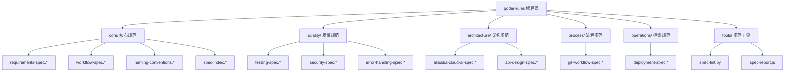
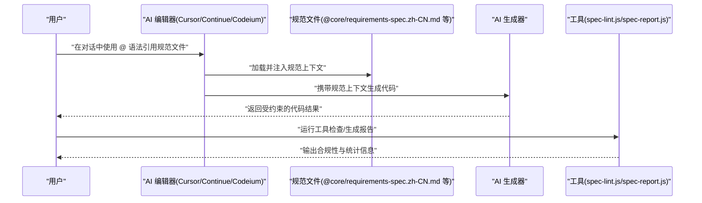
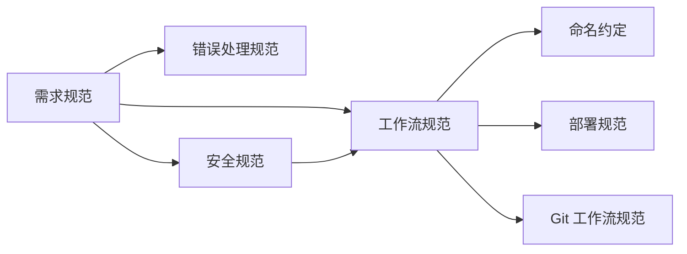

# 其他AI编辑器集成

<cite>
**本文引用的文件**
- [README.md](file://README.md)
- [architecture/alibaba-cloud-ai-spec.zh-CN.md](file://architecture/alibaba-cloud-ai-spec.zh-CN.md)
- [core/requirements-spec.zh-CN.md](file://core/requirements-spec.zh-CN.md)
- [core/naming-conventions.md](file://core/naming-conventions.md)
- [core/spec-index.md](file://core/spec-index.md)
- [core/spec-index.zh-CN.md](file://core/spec-index.zh-CN.md)
- [quality/security-spec.zh-CN.md](file://quality/security-spec.zh-CN.md)
- [quality/error-handling-spec.zh-CN.md](file://quality/error-handling-spec.zh-CN.md)
- [quality/testing-spec.zh-CN.md](file://quality/testing-spec.zh-CN.md)
- [process/git-workflow-spec.zh-CN.md](file://process/git-workflow-spec.zh-CN.md)
- [operations/deployment-spec.zh-CN.md](file://operations/deployment-spec.zh-CN.md)
- [tools/spec-lint.py](file://tools/spec-lint.py)
- [tools/spec-report.js](file://tools/spec-report.js)
</cite>

## 目录
1. [简介](#简介)
2. [项目结构](#项目结构)
3. [核心组件](#核心组件)
4. [架构总览](#架构总览)
5. [详细组件分析](#详细组件分析)
6. [依赖关系分析](#依赖关系分析)
7. [性能考量](#性能考量)
8. [故障排查指南](#故障排查指南)
9. [结论](#结论)
10. [附录](#附录)

## 简介
本指南面向 Cursor、Continue、Codeium 等支持文件上下文引用的 AI 开发工具，提供将 qoder-rules 规范文件集成到项目中的最佳实践。重点说明如何在 AI 对话中通过“@”语法引用特定规范文件（如 @architecture/alibaba-cloud-ai-spec.zh-CN.md），以及在不同编辑器中加载规范文件的路径处理、上下文长度管理、多规范组合引用等技巧。同时列举常见兼容性问题与解决方案，确保跨平台集成的一致性与可靠性。

## 项目结构
qoder-rules 采用按领域分层的组织方式，核心规范（必需）、质量保证规范（推荐）、架构设计规范（可选）、流程规范、运维规范与工具脚本清晰分离。README 中提供了目录结构概览与快速开始指引，便于在各类 AI 编辑器中进行规范引用与工作流集成。

图表来源
- [README.md](file://README.md#L5-L39)

章节来源
- [README.md](file://README.md#L5-L39)

## 核心组件
- 核心规范（必需）：包含需求规范、工作流规范、命名约定与中心索引，是生成代码的基础约束。
- 质量规范（推荐）：测试、安全、错误处理规范，保障代码质量与安全性。
- 架构规范（可选）：阿里云 AI 架构规范与 API 设计规范，指导云原生与大模型应用落地。
- 流程规范：Git 工作流规范，统一版本与变更管理。
- 运维规范：部署规范，确保生产环境一致性。
- 工具脚本：规范检查与合规报告生成，辅助持续集成与审计。

章节来源
- [README.md](file://README.md#L5-L39)
- [core/spec-index.md](file://core/spec-index.md#L1-L173)
- [core/spec-index.zh-CN.md](file://core/spec-index.zh-CN.md#L1-L173)

## 架构总览
下图展示在 AI 编辑器中通过“@”语法引用规范文件的典型交互流程：用户在对话中引用多个规范文件，AI 将这些规范作为上下文约束生成代码；随后可通过工具脚本对生成结果进行合规性检查与报告生成。

图表来源
- [README.md](file://README.md#L63-L74)
- [tools/spec-lint.py](file://tools/spec-lint.py#L1-L269)
- [tools/spec-report.js](file://tools/spec-report.js#L1-L278)

## 详细组件分析

### 在 AI 对话中引用规范文件
- 引用语法：在 AI 对话中使用“@”前缀引用规范文件，例如 @architecture/alibaba-cloud-ai-spec.zh-CN.md。
- 多规范组合：可在同一轮对话中叠加多个规范文件，以实现更全面的约束与协同。
- 作用范围：规范文件中的规则与约定将作为上下文约束，指导 AI 生成满足要求的代码。

章节来源
- [README.md](file://README.md#L63-L74)
- [README.md](file://README.md#L212-L252)

### Cursor 集成最佳实践
- 文件路径处理
  - 使用相对路径引用规范文件，确保在不同工作区中均能正确加载。
  - 若项目根目录包含规范文件，建议直接使用“@规范文件名”进行引用。
- 上下文长度管理
  - 优先引用关键规范（如 @core/requirements-spec.zh-CN.md），再按需叠加质量与架构规范。
  - 当上下文较长时，可先引用核心规则，再在后续对话中补充细节。
- 多规范组合引用
  - 建议按“核心规则 → 质量规范 → 架构规范”的顺序叠加，避免相互冲突的规则被覆盖。
- 兼容性注意事项
  - 确认 Cursor 支持 Markdown 文件作为上下文引用；若仅支持纯文本，可使用对应 .txt 文件。
  - 若遇到路径解析问题，尝试将规范文件复制到项目根目录或 .qoder/rules 目录下，再进行引用。

章节来源
- [README.md](file://README.md#L51-L74)
- [README.md](file://README.md#L181-L211)

### Continue 集成最佳实践
- 文件路径处理
  - 使用“@”语法直接引用仓库内的规范文件；若本地路径与远程仓库路径不一致，可在本地维护镜像文件并指向本地路径。
- 上下文长度管理
  - 将常用的核心规范固定在对话开头，减少每次对话的上下文拼接开销。
- 多规范组合引用
  - 通过“@core/requirements-spec.zh-CN.md @quality/security-spec.zh-CN.md @architecture/alibaba-cloud-ai-spec.zh-CN.md”组合引用，确保生成代码在完整性、安全性与架构层面均受约束。
- 兼容性注意事项
  - 若 Continue 对某些文件类型不支持，可将规范文件转换为纯文本或调整文件名后缀以适配。

章节来源
- [README.md](file://README.md#L204-L211)

### Codeium 集成最佳实践
- 文件路径处理
  - 使用“@”语法引用规范文件；若 Codeium 仅识别本地文件，建议将规范文件放置在项目根目录或与源代码同级目录。
- 上下文长度管理
  - 控制每轮对话中引用的规范数量，优先引用与当前任务最相关的规范。
- 多规范组合引用
  - 将“核心规则 + 安全规范 + 架构规范”组合引用，形成闭环约束。
- 兼容性注意事项
  - 若 Codeium 对中文路径或特殊符号敏感，建议将规范文件重命名为英文并移除特殊字符。

章节来源
- [README.md](file://README.md#L204-L211)

### 规范文件与规则优先级
- 核心规则优先：需求规范中的关键规则（如生成完整可运行代码、验证 API 存在、确保代码成功编译、仅使用真实存在的库）在生成输出时具有最高优先级。
- 工作流与命名约定：工作流规范与命名约定在发布治理与一致性方面发挥重要作用，必要时可作为补充约束。
- 依赖与冲突：规范索引文件明确了模块间的依赖关系与冲突解决策略，有助于在多规范组合时避免矛盾。

章节来源
- [core/spec-index.md](file://core/spec-index.md#L104-L108)
- [core/spec-index.zh-CN.md](file://core/spec-index.zh-CN.md#L104-L108)
- [core/requirements-spec.zh-CN.md](file://core/requirements-spec.zh-CN.md#L1-L200)

### 典型使用场景
- 生成符合规范的登录页面：引用需求规范、安全规范与错误处理规范，确保表单验证、错误处理与安全的密码处理。
- 基于阿里云 AI 架构的应用：结合阿里云 AI 架构规范与需求规范，参考通义千问等服务的集成方式。
- 添加单元测试：引用测试规范与命名约定，确保覆盖率与测试分层符合要求。

章节来源
- [README.md](file://README.md#L212-L252)
- [architecture/alibaba-cloud-ai-spec.zh-CN.md](file://architecture/alibaba-cloud-ai-spec.zh-CN.md#L1-L120)

### 工具链集成（可选）
- 规范检查工具：通过 Python 脚本扫描目标目录，基于启用的规则进行静态检查，输出问题列表与退出码。
- 合规报告生成器：统计规范启用情况、代码文件与行数、测试覆盖率等，生成可视化报告并可导出 JSON。

章节来源
- [tools/spec-lint.py](file://tools/spec-lint.py#L1-L269)
- [tools/spec-report.js](file://tools/spec-report.js#L1-L278)

## 依赖关系分析
- 模块依赖：需求规范与工作流规范之间存在依赖关系，例如“API 验证”依赖“版本管理”，“破坏性变更”依赖“变更日志与版本号管理”。
- 冲突与解决：工作流规范中的“文档同步”与需求规范中的“仅请求内容”可能存在冲突，应根据影响范围与优先级进行权衡。
- 项目类型配置：Web、CLI、Library 三类项目类型的推荐启用规则不同，可根据项目类型选择合适的规范组合。

图表来源
- [core/spec-index.md](file://core/spec-index.md#L71-L108)
- [core/spec-index.zh-CN.md](file://core/spec-index.zh-CN.md#L71-L108)
- [operations/deployment-spec.zh-CN.md](file://operations/deployment-spec.zh-CN.md#L1-L40)
- [process/git-workflow-spec.zh-CN.md](file://process/git-workflow-spec.zh-CN.md#L1-L40)

章节来源
- [core/spec-index.md](file://core/spec-index.md#L71-L108)
- [core/spec-index.zh-CN.md](file://core/spec-index.zh-CN.md#L71-L108)

## 性能考量
- 上下文长度控制：在 AI 对话中引用过多规范文件可能导致上下文过长，建议按“核心规则 → 质量规范 → 架构规范”的顺序逐步叠加。
- 文件加载效率：优先使用本地路径引用规范文件，避免网络延迟；对于大型规范文件，可拆分为更细粒度的子规范以减少一次性加载的数据量。
- 工具链执行：规范检查与报告生成建议在本地或 CI 环节执行，避免在交互式对话中频繁触发，影响响应速度。

## 故障排查指南
- 编辑器不识别“@”语法
  - 尝试使用纯文本文件（.txt）并调整文件名后缀；或在编辑器设置中启用对 Markdown 文件的上下文引用支持。
- 路径解析失败
  - 将规范文件复制到项目根目录或与源代码同级目录，使用相对路径进行引用；确保路径大小写与文件名一致。
- 上下文过长导致截断
  - 优先引用核心规则，再在后续对话中补充细节；或将规范文件拆分为更小的片段分别引用。
- 多规范冲突
  - 使用规范索引文件明确启用状态与覆盖项，避免相互矛盾的规则在同一轮对话中同时生效。
- 工具链报错
  - 确认 Python 与 Node 环境已正确安装；检查目标目录与规范目录是否存在；根据工具输出的错误信息逐项修复。

章节来源
- [README.md](file://README.md#L181-L211)
- [tools/spec-lint.py](file://tools/spec-lint.py#L231-L269)
- [tools/spec-report.js](file://tools/spec-report.js#L239-L278)

## 结论
通过在 Cursor、Continue、Codeium 等 AI 编辑器中使用“@”语法引用 qoder-rules 规范文件，可以有效约束 AI 生成代码的质量、安全性与一致性。建议优先引用核心规则，按需叠加质量与架构规范，并结合工具链进行持续检查与报告生成，以确保跨平台集成的一致性与可靠性。

## 附录
- 常用规范引用示例
  - 核心规则：@core/requirements-spec.zh-CN.md
  - 安全规范：@quality/security-spec.zh-CN.md
  - 错误处理规范：@quality/error-handling-spec.zh-CN.md
  - 测试规范：@quality/testing-spec.zh-CN.md
  - 命名约定：@core/naming-conventions.md
  - 阿里云 AI 架构规范：@architecture/alibaba-cloud-ai-spec.zh-CN.md
  - Git 工作流规范：@process/git-workflow-spec.zh-CN.md
  - 部署规范：@operations/deployment-spec.zh-CN.md

章节来源
- [README.md](file://README.md#L212-L252)
- [README.md](file://README.md#L63-L74)