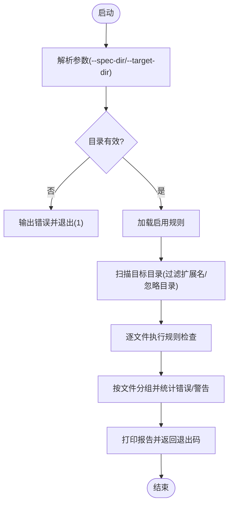

# 集成指南

<cite>
**本文引用的文件列表**
- [README.md](file://README.md)
- [spec-lint.py](file://tools/spec-lint.py)
- [spec-report.js](file://tools/spec-report.js)
- [spec-index.md](file://core/spec-index.md)
- [requirements-spec.md](file://core/requirements-spec.md)
- [workflow-spec.md](file://core/workflow-spec.md)
- [deployment-spec.zh-CN.md](file://operations/deployment-spec.zh-CN.md)
- [git-workflow-spec.zh-CN.md](file://process/git-workflow-spec.zh-CN.md)
</cite>

## 目录
1. [简介](#简介)
2. [项目结构](#项目结构)
3. [核心组件](#核心组件)
4. [架构总览](#架构总览)
5. [详细组件分析](#详细组件分析)
6. [依赖关系分析](#依赖关系分析)
7. [性能与可维护性建议](#性能与可维护性建议)
8. [故障排除指南](#故障排除指南)
9. [结论](#结论)
10. [附录](#附录)

## 简介
本指南面向希望将 qoder-rules-main 与主流开发环境与平台无缝集成的团队，涵盖以下方面：
- 在 Qoder IDE、VS Code 以及 Cursor、Continue、Codeium 等 AI 编辑器中的使用与提示配置
- 与 Git Hooks 的集成，实现提交前自动规范检查
- 与 GitHub Actions、GitLab CI 等 CI/CD 系统的集成，构建阶段运行规范检查并阻断不合规代码合并
- 如何通过“规范即代码”的自动化治理模式，减少人工审查负担
- 常见问题排查，如权限问题或路径配置错误的处理

## 项目结构
qoder-rules-main 以“规范即代码”为核心理念，提供一套可被 AI 编辑器直接引用的规范文件，并配套 Python/Node 工具链用于本地与 CI 场景下的规范检查与合规报告生成。

图表来源
- [README.md](file://README.md#L1-L357)
- [spec-lint.py](file://tools/spec-lint.py#L1-L269)
- [spec-report.js](file://tools/spec-report.js#L1-L278)
- [spec-index.md](file://core/spec-index.md#L1-L173)
- [requirements-spec.md](file://core/requirements-spec.md#L1-L267)
- [workflow-spec.md](file://core/workflow-spec.md#L1-L359)

章节来源
- [README.md](file://README.md#L1-L357)

## 核心组件
- 规范文件：以 Markdown/文本形式提供规则与启用开关，支持中英双语，便于 AI 直接引用与执行。
- 规范检查工具（Python）：扫描目标代码目录，基于启用的规则进行静态检查，输出错误/警告并返回退出码。
- 合规报告工具（Node）：汇总规范启用情况、代码统计与测试覆盖率，输出人类可读报告与 JSON 报告。
- Git Hooks 与 CI 集成：在本地 pre-commit 与 CI jobs 中运行上述工具，形成“提交前检查 + 构建阶段阻断”的闭环。

章节来源
- [README.md](file://README.md#L148-L303)
- [spec-lint.py](file://tools/spec-lint.py#L1-L269)
- [spec-report.js](file://tools/spec-report.js#L1-L278)

## 架构总览
下图展示了从 IDE 到本地与 CI 的端到端集成路径，体现“规范即代码”的自动化治理闭环。

图表来源
- [README.md](file://README.md#L253-L303)
- [spec-lint.py](file://tools/spec-lint.py#L231-L269)
- [spec-report.js](file://tools/spec-report.js#L238-L278)

## 详细组件分析

### Qoder IDE 集成
- 将规范文件复制到项目的 .qoder/rules 目录，即可在 Qoder IDE 中直接引用。
- 在对话中使用 @ 前缀引用规范文件，AI 将依据启用规则生成代码。
- 支持 frontmatter trigger: manual，便于手动触发规则生效。

章节来源
- [README.md](file://README.md#L51-L74)
- [README.md](file://README.md#L181-L211)
- [spec-index.md](file://core/spec-index.md#L1-L33)

### VS Code 集成
- 推荐安装 ESLint、Prettier、EditorConfig、GitHub Copilot 等扩展，配合规范文件进行代码质量与风格约束。
- 可将规范文件放入项目根目录或 .qoder/rules，以便 AI 编辑器引用。

章节来源
- [README.md](file://README.md#L195-L211)

### Cursor/Continue/Codeium 集成
- 所有支持文件引用的 AI 编辑器均可使用 @ 前缀引用规范文件，从而在生成代码时遵循启用规则。
- 建议在项目根目录放置规范文件，或在编辑器中配置规则引用路径。

章节来源
- [README.md](file://README.md#L204-L211)

### Git Hooks 集成（本地提交前检查）
- 在 .git/hooks/pre-commit 中添加调用 spec-lint.py 的步骤，若检查失败则阻止提交。
- 可结合 husky/lint-staged 等工具在提交前做格式化与静态检查。

章节来源
- [README.md](file://README.md#L255-L267)
- [git-workflow-spec.zh-CN.md](file://process/git-workflow-spec.zh-CN.md#L450-L512)

### CI/CD 集成（GitHub Actions/GitLab CI）
- 在 CI 中添加作业，执行 spec-lint.py 并生成合规报告 JSON，上传为工件以便审计与可视化。
- 可将作业配置为在 push/pull_request 触发，确保每次变更均受规范约束。

章节来源
- [README.md](file://README.md#L269-L294)
- [deployment-spec.zh-CN.md](file://operations/deployment-spec.zh-CN.md#L70-L117)

### 规范检查工具（spec-lint.py）
- 功能要点
  - 解析启用规则：从 core 目录的 txt/md 文件中提取启用规则集合。
  - 文件扫描：遍历目标目录，跳过 node_modules、dist、build 等目录，按扩展名过滤。
  - 规则检查：针对命名约定、安全硬编码、空 catch 块、代码完整性等规则进行检查。
  - 报告输出：按严重程度分组输出，返回退出码（0 表示通过，1 表示存在错误）。
- 参数与行为
  - 支持指定 --spec-dir 与 --target-dir，默认分别指向 core 与当前目录。
  - 若目录不存在，会输出错误并返回非零退出码。

图表来源
- [spec-lint.py](file://tools/spec-lint.py#L231-L269)

章节来源
- [spec-lint.py](file://tools/spec-lint.py#L1-L269)

### 合规报告工具（spec-report.js）
- 功能要点
  - 解析规范文件，统计启用规则数量与总数，计算总体合规率。
  - 扫描目标代码目录，统计文件数、总行数与按扩展名的分布。
  - 尝试读取测试覆盖率 JSON，输出行/语句/函数/分支覆盖率。
  - 生成控制台报告与 JSON 工件，便于 CI 展示与归档。
- 参数与行为
  - 支持 --spec-dir、--target-dir、--output 等参数。
  - 若覆盖率文件缺失，会跳过覆盖率统计。

图表来源
- [spec-report.js](file://tools/spec-report.js#L131-L236)

章节来源
- [spec-report.js](file://tools/spec-report.js#L1-L278)

### 规范文件与项目类型配置
- 中央索引（spec-index.md）集中管理模块、全局开关、规则依赖、冲突与项目类型配置，支持按 Web/CLI/Library 推荐启用规则集。
- 核心规范（requirements-spec.md）强调“完整可运行代码、复用现有接口、最小化新增依赖、API 存在性验证、编译通过、真实库使用”等关键规则。
- 工作流规范（workflow-spec.md）提供变更日志、版本管理、文档同步、破坏性变更协议、依赖更新策略与错误处理标准等规则。

章节来源
- [spec-index.md](file://core/spec-index.md#L1-L173)
- [requirements-spec.md](file://core/requirements-spec.md#L1-L267)
- [workflow-spec.md](file://core/workflow-spec.md#L1-L359)

## 依赖关系分析
- 工具与规范的耦合
  - spec-lint.py 依赖 core 目录下的规范文件，通过解析启用规则来决定检查范围。
  - spec-report.js 也依赖 core 目录，用于统计启用规则与生成合规率。
- IDE 与编辑器
  - Qoder IDE、VS Code、Cursor、Continue、Codeium 等通过 @ 前缀引用规范文件，AI 依据启用规则生成代码。
- Git Hooks 与 CI
  - 本地 pre-commit 与 CI jobs 通过调用工具实现“提交前检查 + 构建阶段阻断”，形成闭环治理。

图表来源
- [spec-index.md](file://core/spec-index.md#L1-L173)
- [requirements-spec.md](file://core/requirements-spec.md#L1-L267)
- [workflow-spec.md](file://core/workflow-spec.md#L1-L359)
- [spec-lint.py](file://tools/spec-lint.py#L1-L269)
- [spec-report.js](file://tools/spec-report.js#L1-L278)
- [README.md](file://README.md#L255-L294)

章节来源
- [README.md](file://README.md#L253-L303)

## 性能与可维护性建议
- 本地检查优化
  - 在 pre-commit 中仅检查 staged 文件，或使用 lint-staged 以减少耗时。
  - 将目标目录限制在 src、lib 等必要范围，避免扫描 node_modules、dist、build 等目录。
- CI 优化
  - 将规范检查与测试、安全扫描并行执行，缩短流水线时长。
  - 对覆盖率 JSON 的读取失败进行容错处理，避免中断流水线。
- 规范演进
  - 通过 spec-index.md 的 OVERRIDES 与 PROFILE，按项目类型灵活启用/禁用规则，降低维护成本。
  - 使用 Git Hooks 与 CI 的组合，确保新增规则能快速落地。

[本节为通用建议，不直接分析具体文件]

## 故障排除指南
- 权限问题
  - pre-commit 脚本需要可执行权限。在 Linux/macOS 上可通过 chmod +x 添加执行权限；Windows 上注意脚本解释器路径与 Python/Node 可用性。
- 路径配置错误
  - 确认 --spec-dir 与 --target-dir 指向正确目录；若目录不存在，工具会输出错误并返回非零退出码。
  - 在 CI 中使用相对路径或固定工作目录，避免因工作区差异导致找不到工具或规范文件。
- 规则匹配失败
  - 确认规范文件中的 ENABLED/DISABLED 标记正确；spec-lint.py 仅对启用规则进行检查。
  - 若覆盖率统计缺失，spec-report.js 会跳过覆盖率输出，属预期行为。
- Git 钩子未触发
  - 确认 .git/hooks/pre-commit 存在且可执行；若使用 husky，请确认 package.json 中的 husky 配置与 lint-staged 正常工作。
- CI 阻断策略
  - 在 CI 中将规范检查作为必经步骤，若返回非零退出码则中断后续部署步骤，确保不合规代码不进入生产。

章节来源
- [spec-lint.py](file://tools/spec-lint.py#L231-L269)
- [spec-report.js](file://tools/spec-report.js#L238-L278)
- [README.md](file://README.md#L255-L294)
- [git-workflow-spec.zh-CN.md](file://process/git-workflow-spec.zh-CN.md#L450-L512)

## 结论
通过将 qoder-rules-main 与 Qoder IDE、VS Code、Cursor、Continue、Codeium 等 AI 编辑器集成，并结合 Git Hooks 与 CI/CD 流水线，可以实现“规范即代码”的自动化治理模式。该模式在本地与云端均对代码质量进行约束，显著减少人工审查负担，提升交付效率与稳定性。

[本节为总结性内容，不直接分析具体文件]

## 附录

### 快速开始（本地）
- 将规范文件复制到 .qoder/rules 目录，并在 AI 对话中使用 @ 前缀引用。
- 在本地 pre-commit 中添加调用 spec-lint.py 的步骤，失败即阻止提交。
- 在 CI 中添加作业运行 spec-lint.py 与 spec-report.js，并上传报告工件。

章节来源
- [README.md](file://README.md#L51-L74)
- [README.md](file://README.md#L255-L294)

### 项目类型配置参考
- Web 应用、CLI 工具、库/SDK 的推荐启用规则集可在 spec-index.md 中查看，便于按项目类型快速启用相应规范。

章节来源
- [spec-index.md](file://core/spec-index.md#L110-L173)