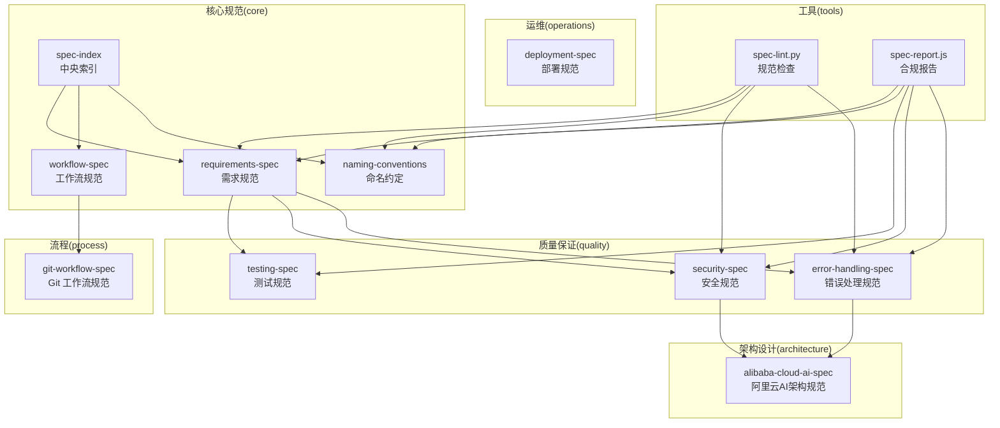
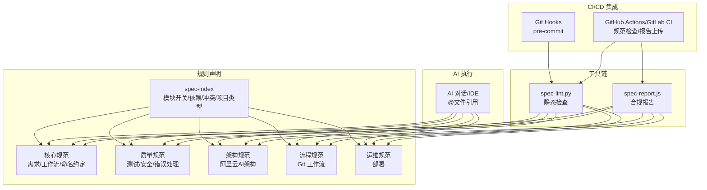
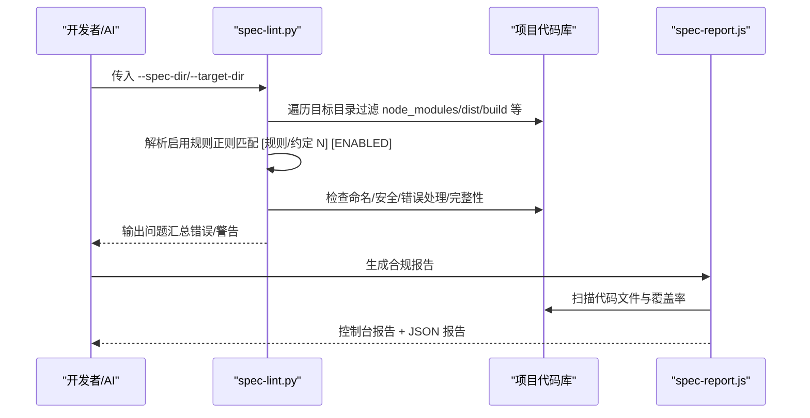
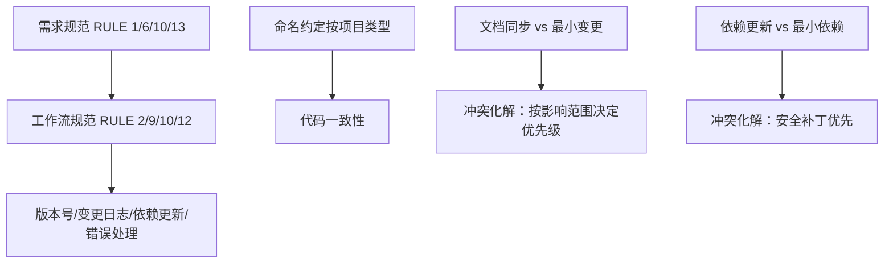

# 项目概述

<cite>
**本文引用的文件**
- [README.md](file://README.md)
- [spec-index.md](file://core/spec-index.md)
- [spec-index.zh-CN.md](file://core/spec-index.zh-CN.md)
- [naming-conventions.md](file://core/naming-conventions.md)
- [workflow-spec.md](file://core/workflow-spec.md)
- [testing-spec.zh-CN.md](file://quality/testing-spec.zh-CN.md)
- [security-spec.zh-CN.md](file://quality/security-spec.zh-CN.md)
- [error-handling-spec.zh-CN.md](file://quality/error-handling-spec.zh-CN.md)
- [alibaba-cloud-ai-spec.zh-CN.md](file://architecture/alibaba-cloud-ai-spec.zh-CN.md)
- [git-workflow-spec.zh-CN.md](file://process/git-workflow-spec.zh-CN.md)
- [spec-lint.py](file://tools/spec-lint.py)
- [spec-report.js](file://tools/spec-report.js)
</cite>

## 目录
1. [简介](#简介)
2. [项目结构](#项目结构)
3. [核心组件](#核心组件)
4. [架构总览](#架构总览)
5. [详细组件分析](#详细组件分析)
6. [依赖分析](#依赖分析)
7. [性能考虑](#性能考虑)
8. [故障排查指南](#故障排查指南)
9. [结论](#结论)
10. [附录](#附录)

## 简介
Qoder Rules 是一套面向 AI 辅助开发的“规范即代码”体系，旨在通过标准化的开发流程与质量保障规范，提升代码的可运行性、一致性、安全性与可维护性。项目以“可组合、可声明、可执行”的方式组织规范，支持在 AI 对话中以“@文件”语法直接引用，从而让生成的代码严格遵循既定规则。项目覆盖核心规范、质量保证、架构设计、流程与运维、自动化工具等多个模块，形成从“需求—实现—测试—发布—运维”的闭环。

项目价值主张：
- 为开发者提供“可复用、可落地”的编码与交付规范，降低沟通成本与返工风险。
- 为 AI 代码生成工具提供“规则引擎”，确保生成结果满足企业级质量与安全要求。
- 为工程团队提供“可审计、可度量”的合规基线，支撑规模化协作与持续交付。

## 项目结构
项目采用“模块化 + 中央索引”的组织方式，核心目录如下：
- core：核心规范（需求、工作流、命名约定、索引）
- quality：质量保证（测试、安全、错误处理）
- architecture：架构设计（云原生与 AI 应用架构）
- process：流程规范（Git 工作流）
- operations：运维规范（部署）
- tools：规范验证与报告工具（Python Lint、Node 报告）

图表来源
- [spec-index.md](file://core/spec-index.md#L1-L173)
- [naming-conventions.md](file://core/naming-conventions.md#L1-L458)
- [workflow-spec.md](file://core/workflow-spec.md#L1-L359)
- [testing-spec.zh-CN.md](file://quality/testing-spec.zh-CN.md#L1-L360)
- [security-spec.zh-CN.md](file://quality/security-spec.zh-CN.md#L1-L421)
- [error-handling-spec.zh-CN.md](file://quality/error-handling-spec.zh-CN.md#L1-L576)
- [alibaba-cloud-ai-spec.zh-CN.md](file://architecture/alibaba-cloud-ai-spec.zh-CN.md#L1-L800)
- [git-workflow-spec.zh-CN.md](file://process/git-workflow-spec.zh-CN.md#L1-L533)
- [spec-lint.py](file://tools/spec-lint.py#L1-L269)
- [spec-report.js](file://tools/spec-report.js#L1-L278)

章节来源
- [README.md](file://README.md#L1-L357)

## 核心组件
- 中央索引（spec-index）：集中管理模块开关、规则依赖、冲突化解、项目类型配置与覆盖项，是“规则编排”的中枢。
- 核心规范：
  - 需求规范：确保生成代码完整、可运行、依赖可控、API 可用、编译通过、库真实存在。
  - 工作流规范：变更日志、版本管理、文档同步、破坏性变更协议、依赖更新策略、错误处理标准等。
  - 命名约定：变量、函数、类、常量、文件、环境变量、组件、数据库、API、类型、事件、测试等命名规范。
- 质量保证：
  - 测试规范：测试完整性、覆盖率目标、测试分层、Mock 规范、命名约定、数据管理、边界与异常、隔离性、性能要求等。
  - 安全规范：输入验证与清理、认证与授权、敏感数据保护、依赖安全管理、OWASP Top 10 防护、日志安全、API 安全、配置安全、会话管理、文件上传安全、错误处理安全、安全开发生命周期。
  - 错误处理规范：错误分类、自定义错误类、日志记录、用户友好提示、Try-Catch 最佳实践、错误恢复策略、全局错误处理器、前端错误边界、错误监控与告警、错误码标准化、超时与限流、错误文档化。
- 架构设计：阿里云 AI 卓越架构规范，覆盖模型服务化、向量检索与存储、大模型调用与管理、数据湖与特征工程、模型训练与优化、实时推理服务、监控与可观测性、数据安全与合规。
- 流程与运维：Git 工作流规范、部署规范。
- 工具：spec-lint.py（基于启用规则的静态检查）、spec-report.js（合规报告与覆盖率统计）。

章节来源
- [spec-index.md](file://core/spec-index.md#L1-L173)
- [spec-index.zh-CN.md](file://core/spec-index.zh-CN.md#L1-L173)
- [naming-conventions.md](file://core/naming-conventions.md#L1-L458)
- [workflow-spec.md](file://core/workflow-spec.md#L1-L359)
- [testing-spec.zh-CN.md](file://quality/testing-spec.zh-CN.md#L1-L360)
- [security-spec.zh-CN.md](file://quality/security-spec.zh-CN.md#L1-L421)
- [error-handling-spec.zh-CN.md](file://quality/error-handling-spec.zh-CN.md#L1-L576)
- [alibaba-cloud-ai-spec.zh-CN.md](file://architecture/alibaba-cloud-ai-spec.zh-CN.md#L1-L800)
- [git-workflow-spec.zh-CN.md](file://process/git-workflow-spec.zh-CN.md#L1-L533)
- [spec-lint.py](file://tools/spec-lint.py#L1-L269)
- [spec-report.js](file://tools/spec-report.js#L1-L278)

## 架构总览
Qoder Rules 的架构以“中央索引 + 模块化规范 + 工具链”为核心，形成“规则声明—AI 执行—工具验证—CI/CD 集成”的闭环。

图表来源
- [spec-index.md](file://core/spec-index.md#L1-L173)
- [spec-lint.py](file://tools/spec-lint.py#L1-L269)
- [spec-report.js](file://tools/spec-report.js#L1-L278)
- [README.md](file://README.md#L253-L294)

## 详细组件分析

### 中央索引（spec-index）
- 作用：单一事实来源，集中管理模块启用状态、版本、摘要、优先规则、规则依赖、冲突化解、项目类型配置与覆盖项。
- 关键特性：
  - 全局开关：默认项目类型、启用模块、镜像开关、语言对。
  - 依赖关系：自动启用被依赖规则，避免“先有鸡还是先有蛋”的矛盾。
  - 冲突化解：明确文档同步与最小变更之间的权衡，以及依赖更新与最小依赖之间的取舍。
  - 项目类型配置：Web、CLI、Library 三类推荐启用规则集，兼顾不同项目形态的质量重点。
  - 覆盖项：允许在不修改模块文件的前提下，按项目需要临时覆盖某些规则。
- 价值：将“规则编排”从“散落的文件”上升为“可审计的配置”，便于 AI 与工具链统一消费。

章节来源
- [spec-index.md](file://core/spec-index.md#L1-L173)
- [spec-index.zh-CN.md](file://core/spec-index.zh-CN.md#L1-L173)

### 核心规范：需求规范（requirements-spec）
- 目标：确保生成代码“完整、可运行、可编译、可测试、可发布”，避免 TODO、占位符、缺失 API、不可用库等问题。
- 关键规则要点（摘自 README）：
  - 生成完整可运行代码（无 TODO、无占位符）
  - 复用现有代码和 API
  - 最小化新增依赖
  - 验证所有 API 是否存在
  - 确保代码成功编译
  - 只使用真实存在的库
- 影响：直接影响 AI 生成代码的“正确性优先级”，在生成输出层面具有最高优先级。

章节来源
- [README.md](file://README.md#L76-L115)
- [workflow-spec.md](file://core/workflow-spec.md#L1-L359)

### 核心规范：工作流规范（workflow-spec）
- 目标：规范化变更日志、版本管理、文档同步、破坏性变更、依赖更新、错误处理等流程。
- 关键规则要点（摘自 README）：
  - 变更日志管理、版本号管理、文档同步、破坏性变更协议、依赖更新策略、错误处理标准等。
- 价值：在发布治理层面确保“可审计、可追溯、可回滚”。

章节来源
- [README.md](file://README.md#L116-L147)
- [workflow-spec.md](file://core/workflow-spec.md#L1-L359)

### 核心规范：命名约定（naming-conventions）
- 目标：统一变量、函数、类、常量、文件、环境变量、组件、数据库、API、类型、事件、测试等命名风格。
- 关键约定要点（摘自 README）：
  - 变量命名、函数/方法命名、类命名、常量命名、文件命名、环境变量命名等。
- 价值：提升代码可读性与一致性，降低认知负担。

章节来源
- [README.md](file://README.md#L1-L357)
- [naming-conventions.md](file://core/naming-conventions.md#L1-L458)

### 质量保证：测试规范（testing-spec）
- 目标：通过测试完整性、覆盖率目标、测试分层、Mock 规范、命名约定、数据管理、边界与异常、隔离性、性能要求等，确保质量。
- 价值：为 AI 生成代码提供“可测试性”基线，避免“只写不测”。

章节来源
- [testing-spec.zh-CN.md](file://quality/testing-spec.zh-CN.md#L1-L360)

### 质量保证：安全规范（security-spec）
- 目标：通过输入验证与清理、认证与授权、敏感数据保护、依赖安全管理、OWASP Top 10 防护、日志安全、API 安全、配置安全、会话管理、文件上传安全、错误处理安全、安全开发生命周期等，构建安全防线。
- 价值：在 AI 生成过程中嵌入“安全优先”思维，避免常见漏洞。

章节来源
- [security-spec.zh-CN.md](file://quality/security-spec.zh-CN.md#L1-L421)

### 质量保证：错误处理规范（error-handling-spec）
- 目标：通过错误分类、自定义错误类、日志记录、用户友好提示、Try-Catch 最佳实践、错误恢复策略、全局错误处理器、前端错误边界、错误监控与告警、错误码标准化、超时与限流、错误文档化等，提升系统韧性。
- 价值：让 AI 生成的代码具备“可诊断、可恢复、可监控”的错误处理能力。

章节来源
- [error-handling-spec.zh-CN.md](file://quality/error-handling-spec.zh-CN.md#L1-L576)

### 架构设计：阿里云 AI 架构规范（alibaba-cloud-ai-spec）
- 目标：在云原生与 AI 应用场景下，提供模型服务化、向量检索与存储、大模型调用与管理、数据湖与特征工程、模型训练与优化、实时推理服务、监控与可观测性、数据安全与合规的架构最佳实践。
- 价值：为 AI 应用提供“可扩展、可观测、可治理”的架构蓝图。

章节来源
- [alibaba-cloud-ai-spec.zh-CN.md](file://architecture/alibaba-cloud-ai-spec.zh-CN.md#L1-L800)

### 流程规范：Git 工作流规范（git-workflow-spec）
- 目标：统一分支命名、提交消息、PR 规范、分支策略、代码审查、合并策略、禁止操作、标签管理、冲突解决、.gitignore、Commit Hooks 等。
- 价值：在团队协作与开源场景下，确保“可追溯、可审查、可合并”。

章节来源
- [git-workflow-spec.zh-CN.md](file://process/git-workflow-spec.zh-CN.md#L1-L533)

### 工具：规范检查与合规报告
- spec-lint.py：基于启用规则进行静态检查，覆盖命名约定、安全硬编码、错误处理空 catch、代码完整性等。
- spec-report.js：扫描规范与代码，统计覆盖率、输出合规报告，支持导出 JSON。

图表来源
- [spec-lint.py](file://tools/spec-lint.py#L1-L269)
- [spec-report.js](file://tools/spec-report.js#L1-L278)

章节来源
- [spec-lint.py](file://tools/spec-lint.py#L1-L269)
- [spec-report.js](file://tools/spec-report.js#L1-L278)

## 依赖分析
- 规则依赖：
  - 需求规范 → 工作流规范：API 准确性需要版本对齐；代码完整性依赖编译成功。
  - 工作流规范：破坏性变更需要版本号与变更日志联动。
  - 命名约定：按项目类型生效（如 Web 前端组件命名）。
- 冲突化解：
  - 文档同步与最小变更：若影响公共 API 或用户可见行为，文档同步为强制；否则优先最小变更。
  - 依赖更新与最小依赖：安全补丁与关键修复优先于最小依赖。
- 优先级：
  - 代码正确性与可运行性（需求规范）在生成输出时优先；
  - 流程合规（工作流规范）在发布治理中优先；
  - 命名（命名约定）在不影响代码正确性时适用。

图表来源
- [spec-index.md](file://core/spec-index.md#L69-L108)
- [workflow-spec.md](file://core/workflow-spec.md#L1-L359)

章节来源
- [spec-index.md](file://core/spec-index.md#L69-L108)
- [workflow-spec.md](file://core/workflow-spec.md#L1-L359)

## 性能考虑
- 规则解析与扫描：
  - 使用正则匹配启用规则，时间复杂度与文件行数线性相关；建议在 CI 中缓存报告结果，减少重复扫描。
- 静态检查：
  - spec-lint.py 仅检查常见模式（硬编码密钥、空 catch、TODO 等），复杂度低；建议在本地 pre-commit 中启用，避免大文件扫描。
- 报告生成：
  - spec-report.js 会读取覆盖率 JSON，若覆盖率未生成则跳过；建议在 CI 中先行运行测试，再生成报告。
- 工具链集成：
  - Git Hooks 与 CI 中的检查应尽量并行化，避免阻塞主流程。

[本节为通用建议，无需具体文件引用]

## 故障排查指南
- 常见问题与定位：
  - 硬编码密钥：检查安全规范 RULE 8，确认未在代码中直接写死密钥。
  - 空 catch 块：检查错误处理规范 RULE 5，确保捕获后记录日志或重新抛出。
  - TODO/FIXME：检查需求规范 RULE 1，确保提交前完成。
  - 命名不一致：检查命名约定各条目，确保遵循语言与项目类型约定。
- 工具使用：
  - 规范检查：使用 spec-lint.py 指定 --spec-dir 与 --target-dir，查看错误/警告列表。
  - 合规报告：使用 spec-report.js 生成 JSON 报告，便于 CI 产物归档与可视化。
- CI/CD 集成：
  - 在 pre-commit 中调用 spec-lint.py，失败则阻止提交；
  - 在 CI 中运行 spec-lint.py 与 spec-report.js，上传报告制品。

章节来源
- [spec-lint.py](file://tools/spec-lint.py#L1-L269)
- [spec-report.js](file://tools/spec-report.js#L1-L278)
- [README.md](file://README.md#L253-L294)

## 结论
Qoder Rules 通过“中央索引 + 模块化规范 + 工具链”的架构，将“规则即代码”的理念落地到 AI 辅助开发与工程实践中。它不仅为开发者提供可复用、可落地的质量与安全基线，也为 AI 代码生成工具提供了“可执行”的规则引擎，最终在云原生与 AI 应用场景下，形成“可审计、可度量、可持续”的工程能力闭环。

[本节为总结性内容，无需具体文件引用]

## 附录

### 使用场景与受众
- 初级开发者：通过命名约定与测试规范快速上手，减少常见错误。
- 资深工程师：借助工作流与安全规范，建立发布治理与安全基线。
- 技术负责人：通过中央索引与合规报告，统一团队规则与度量口径。

### 实际应用示例
- 在 AI 对话中引用规范文件（@语法）：
  - 示例 1：生成登录页面，同时引用需求、安全与错误处理规范。
  - 示例 2：基于阿里云 AI 架构，引用阿里云 AI 规范与需求规范，实施大模型调用、成本优化与监控日志。
  - 示例 3：为 UserService 生成单元测试，引用测试规范与命名约定，确保覆盖率与可维护性。
- CI/CD 集成：
  - Git Hooks：pre-commit 调用 spec-lint.py。
  - GitHub Actions：运行 spec-lint.py 与 spec-report.js，上传报告制品。

章节来源
- [README.md](file://README.md#L63-L115)
- [README.md](file://README.md#L212-L252)
- [README.md](file://README.md#L253-L294)