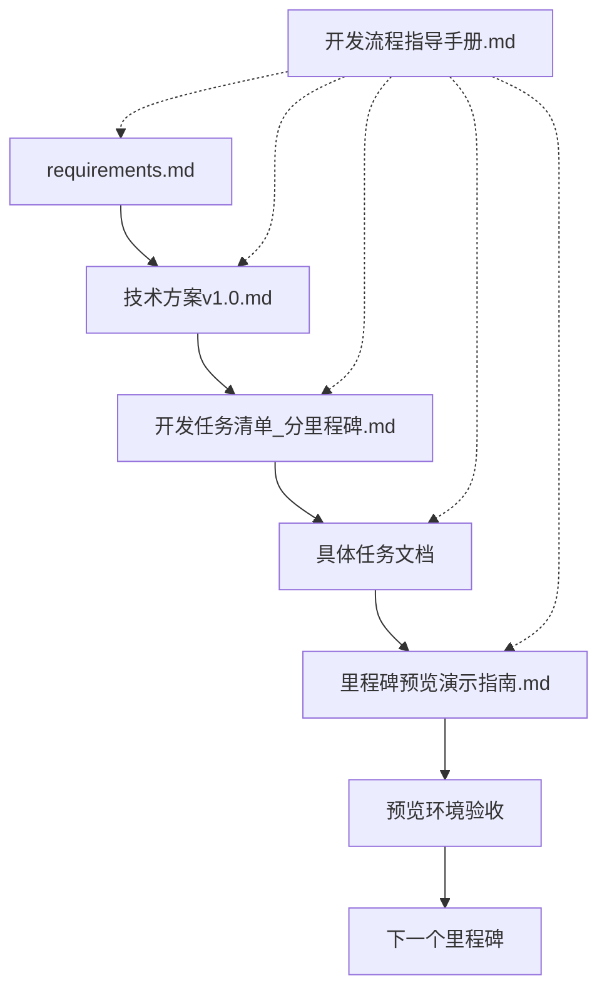

# 天气鸭项目 - 开发流程指导手册

## 📋 目录
1. [项目概述和文档体系](#项目概述和文档体系)
2. [开发环境准备](#开发环境准备)
3. [开发流程详解](#开发流程详解)
4. [文档使用指南](#文档使用指南)
5. [团队协作规范](#团队协作规范)
6. [质量保证流程](#质量保证流程)
7. [预览环境使用指南](#预览环境使用指南)
8. [常见问题解答](#常见问题解答)

---

## 📚 项目概述和文档体系

### 项目简介
天气鸭（WeatherDuck）是一个现代化的双平台天气应用，支持桌面版（Electron）和Web版（PWA），采用敏捷开发模式，分4个里程碑交付。

### 文档体系架构

```
WeatherDuck项目文档体系
├── 📋 需求层
│   ├── requirements.md                    # 用户需求和功能规格
│   └── 天气鸭-原型.html                   # 交互原型
├── 🏗️ 架构层
│   ├── 技术方案v1.0.md                   # 技术架构和实现方案
│   └── API_KEY_配置指南.md               # 外部服务配置
├── 📅 规划层
│   ├── 开发任务清单_分里程碑.md           # 里程碑规划和任务分解
│   └── 里程碑预览演示指南.md             # 预览环境使用指南
├── 🔧 执行层
│   ├── tasks/                           # 具体任务文档目录
│   │   ├── 任务文档模板.md               # 任务文档标准模板
│   │   ├── M1.x_xxx.md                  # M1里程碑任务
│   │   ├── M2.x_xxx.md                  # M2里程碑任务
│   │   ├── M3.x_xxx.md                  # M3里程碑任务
│   │   └── M4.x_xxx.md                  # M4里程碑任务
└── 📖 指导层
    ├── 开发流程指导手册.md               # 本文档
    ├── AI智慧体团队敏捷开发工作手册.md    # 敏捷开发指南
    └── GitHub操作详细指南.md             # Git工作流指南
```

### 文档关系图



---

## 🛠️ 开发环境准备

### 第一步：环境检查清单

在开始开发前，请确保以下环境已准备就绪：

- [ ] **Node.js** (v18+) 和 **npm** 已安装
- [ ] **Git** 已安装并配置
- [ ] **VS Code** 或其他代码编辑器已安装
- [ ] **Docker** 已安装（用于容器化部署）
- [ ] **和风天气API Key** 已获取（参考 `API_KEY_配置指南.md`）

### 第二步：项目克隆和初始化

```bash
# 1. 克隆项目
git clone <项目地址>
cd WeatherDuck

# 2. 安装依赖
npm install

# 3. 配置环境变量
cp .env.example .env
# 编辑 .env 文件，填入和风天气API Key

# 4. 验证环境
npm run verify-setup
```

### 第三步：熟悉项目结构

请花时间阅读以下关键文件：
1. `README.md` - 项目基本信息
2. `requirements.md` - 了解用户需求
3. `技术方案v1.0.md` - 理解技术架构
4. `开发任务清单_分里程碑.md` - 掌握开发计划

---

## 🔄 开发流程详解

### 阶段1：项目启动与理解（第1天）

#### 1.1 需求理解
- **必读文档**: `requirements.md`
- **操作步骤**:
  1. 仔细阅读用户故事和功能需求
  2. 查看交互原型 `天气鸭-原型.html`
  3. 理解目标用户和使用场景
- **输出**: 对项目需求的清晰理解

#### 1.2 技术方案学习
- **必读文档**: `技术方案v1.0.md`
- **操作步骤**:
  1. 理解双平台架构设计
  2. 熟悉技术栈选择理由
  3. 掌握关键技术决策
- **输出**: 对技术实现路径的清晰认知

#### 1.3 开发计划掌握
- **必读文档**: `开发任务清单_分里程碑.md`
- **操作步骤**:
  1. 理解4个里程碑的目标和价值
  2. 熟悉任务分解和依赖关系
  3. 了解预览环境的重要性
- **输出**: 对整体开发节奏的把握

### 阶段2：环境搭建与CI/CD（第1-2天）

#### 2.1 执行M1.1任务
- **任务文档**: `tasks/M1.1_DevOps初始化_CI_CD流水线搭建.md`
- **操作步骤**:
  1. 按任务文档的实施步骤执行
  2. 搭建GitHub Actions CI/CD流水线
  3. 配置自动化测试和部署
- **验收标准**: CI/CD流水线正常工作

#### 2.2 建立预览环境
- **任务文档**: `tasks/M1.2_预览环境部署配置.md`
- **操作步骤**:
  1. 配置Vercel部署
  2. 设置预览环境自动更新
  3. 验证预览地址可访问
- **验收标准**: 预览环境自动部署成功

### 阶段3：迭代开发（第2-8周）

#### 3.1 里程碑开发循环

每个里程碑都遵循相同的开发循环：

```
开始里程碑 → 执行任务 → 预览验证 → 里程碑验收 → 下一里程碑
```

#### 3.2 单个任务执行流程

对于每个具体任务（如 `M1.9_和风天气API集成服务.md`）：

**步骤1：任务准备**
- 阅读任务文档的"任务概述"和"目标"
- 检查"技术依赖"是否满足
- 理解"预览效果与演示价值"

**步骤2：开发实施**
- 按照"实施步骤"逐步执行
- 遵循代码规范和最佳实践
- 及时提交代码到Git

**步骤3：功能验证**
- 执行"验收标准"中的功能测试
- 检查"预览演示验收标准"
- 在预览环境中验证效果

**步骤4：任务完成**
- 更新任务状态
- 记录遇到的问题和解决方案
- 准备演示材料

#### 3.3 里程碑验收流程

每个里程碑完成后：

**步骤1：集成测试**
- 执行对应的集成测试任务（如 `M1.13_里程碑M1集成测试与验收.md`）
- 确保所有功能正常工作
- 修复发现的问题

**步骤2：预览环境验收**
- 参考 `里程碑预览演示指南.md`
- 按照演示场景进行完整验收
- 填写验收清单

**步骤3：里程碑演示**
- 准备演示材料
- 向利益相关者展示成果
- 收集反馈并记录

---

## 📖 文档使用指南

### 需求文档使用

**何时使用**: 
- 项目启动时
- 功能设计时
- 验收测试时

**如何使用**:
1. 理解用户故事和使用场景
2. 确认功能边界和优先级
3. 设计用户体验流程

### 技术文档使用

**何时使用**:
- 架构设计时
- 技术选型时
- 问题排查时

**如何使用**:
1. 理解整体架构设计
2. 遵循技术规范和约定
3. 参考最佳实践建议

### 任务文档使用

**何时使用**:
- 开始新任务时
- 遇到技术问题时
- 验收测试时

**如何使用**:
1. 按照实施步骤执行
2. 参考技术依赖和要求
3. 使用验收标准进行自测

### 预览演示指南使用

**何时使用**:
- 里程碑验收时
- 功能演示时
- 问题复现时

**如何使用**:
1. 按照演示场景操作
2. 检查预期效果是否达成
3. 记录问题和改进建议

---

## 👥 团队协作规范

### 角色分工

**产品经理**:
- 维护需求文档
- 参与里程碑验收
- 收集用户反馈

**技术负责人**:
- 维护技术方案文档
- 审查代码质量
- 解决技术难题

**开发工程师**:
- 执行具体任务
- 更新任务状态
- 参与代码评审

**测试工程师**:
- 执行验收测试
- 维护测试用例
- 报告质量问题

### 协作流程

#### 日常开发协作

1. **每日站会**（15分钟）
   - 汇报昨日完成的任务
   - 说明今日计划
   - 提出遇到的阻碍

2. **任务认领**
   - 在任务文档中标记负责人
   - 更新任务状态（进行中/已完成）
   - 记录实际耗时

3. **代码评审**
   - 每个PR必须经过评审
   - 检查代码质量和规范
   - 验证功能完整性

#### 里程碑协作

1. **里程碑启动会**
   - 回顾里程碑目标
   - 确认任务分工
   - 讨论技术方案

2. **里程碑验收会**
   - 演示完成的功能
   - 收集反馈意见
   - 规划下一里程碑

### 沟通规范

**文档更新**:
- 重要变更必须更新相关文档
- 使用Git提交信息说明变更原因
- 及时同步团队成员

**问题反馈**:
- 技术问题：在任务文档中记录
- 需求问题：更新需求文档
- 流程问题：在团队会议中讨论

---

## ✅ 质量保证流程

### 代码质量保证

#### 自动化检查
- **ESLint**: 代码风格检查
- **TypeScript**: 类型安全检查
- **Prettier**: 代码格式化
- **Husky**: Git钩子检查

#### 代码评审清单
- [ ] 代码符合项目规范
- [ ] 功能实现完整
- [ ] 错误处理完善
- [ ] 性能表现良好
- [ ] 安全性考虑充分

### 功能质量保证

#### 单元测试
- 每个核心功能都有对应测试
- 测试覆盖率不低于80%
- 测试用例包含边界情况

#### 集成测试
- 按照里程碑集成测试任务执行
- 验证模块间协作正常
- 确保端到端流程完整

#### 用户验收测试
- 按照任务文档的验收标准执行
- 在预览环境中进行真实场景测试
- 收集用户反馈并改进

### 质量问题处理

#### 问题分类
- **P0**: 阻塞性问题，立即修复
- **P1**: 重要问题，当日修复
- **P2**: 一般问题，本周修复
- **P3**: 优化建议，下个里程碑考虑

#### 问题跟踪
1. 在对应任务文档中记录问题
2. 标记问题优先级和负责人
3. 跟踪修复进度
4. 验证修复效果

---

## 🌐 预览环境使用指南

### 预览环境概述

我们的项目有两个预览环境：

**Web版预览**:
- 地址：https://weather-duck.vercel.app
- 自动部署：每次代码提交后自动更新
- 用途：功能演示、用户体验测试

**桌面版预览**:
- 下载：从GitHub Releases下载最新版本
- 更新：每个里程碑完成后发布新版本
- 用途：完整功能测试、性能验证

### 预览环境使用场景

#### 开发阶段使用
- **功能验证**: 每完成一个功能，在预览环境中验证
- **问题复现**: 遇到问题时，在预览环境中复现
- **效果展示**: 向团队成员展示开发进度

#### 里程碑验收使用
- **完整演示**: 按照演示指南进行完整功能演示
- **用户体验测试**: 模拟真实用户使用场景
- **性能测试**: 验证应用性能表现

#### 利益相关者沟通使用
- **进度汇报**: 向管理层展示开发进度
- **用户反馈收集**: 让潜在用户体验并收集反馈
- **投资人演示**: 向投资人展示产品价值

### 预览环境最佳实践

#### 使用前准备
1. 确认预览环境是最新版本
2. 准备演示场景和数据
3. 了解当前里程碑的重点功能

#### 演示技巧
1. **结构化演示**: 按照用户使用流程演示
2. **突出亮点**: 重点展示新功能和改进
3. **互动体验**: 让观众亲自操作体验
4. **收集反馈**: 记录观众的意见和建议

#### 问题处理
1. **预案准备**: 准备常见问题的解决方案
2. **快速响应**: 遇到问题时快速切换到备用方案
3. **问题记录**: 记录演示中发现的问题
4. **及时修复**: 优先修复影响演示效果的问题

---

## ❓ 常见问题解答

### 开发环境问题

**Q: npm install 失败怎么办？**
A: 
1. 检查Node.js版本是否符合要求（v18+）
2. 清除npm缓存：`npm cache clean --force`
3. 删除node_modules和package-lock.json，重新安装
4. 检查网络连接，考虑使用国内镜像

**Q: 预览环境部署失败怎么办？**
A:
1. 检查Vercel配置是否正确
2. 查看构建日志，定位错误原因
3. 确认环境变量配置完整
4. 检查代码是否有语法错误

### 任务执行问题

**Q: 任务文档中的技术依赖不满足怎么办？**
A:
1. 检查依赖任务是否已完成
2. 与负责依赖任务的同事沟通
3. 考虑调整任务执行顺序
4. 必要时更新任务依赖关系

**Q: 验收标准不明确怎么办？**
A:
1. 参考类似任务的验收标准
2. 与产品经理或技术负责人讨论
3. 在任务文档中补充明确的标准
4. 记录讨论结果供后续参考

### 协作沟通问题

**Q: 团队成员对需求理解不一致怎么办？**
A:
1. 组织需求澄清会议
2. 更新需求文档，消除歧义
3. 在原型中标注关键交互
4. 建立需求变更流程

**Q: 代码冲突频繁怎么办？**
A:
1. 建立清晰的分支管理策略
2. 增加代码评审频次
3. 细化任务分工，减少重叠
4. 使用工具自动检测冲突

### 质量保证问题

**Q: 测试覆盖率不足怎么办？**
A:
1. 识别核心功能，优先编写测试
2. 在任务文档中明确测试要求
3. 建立测试编写规范
4. 定期review测试覆盖率报告

**Q: 性能问题如何排查？**
A:
1. 使用浏览器开发者工具分析
2. 添加性能监控代码
3. 在预览环境中进行压力测试
4. 参考技术方案中的性能优化建议

---

## 🎯 总结

这份开发流程指导手册为天气鸭项目提供了完整的开发指导，从项目启动到最终交付的每个环节都有明确的操作指南。

### 关键成功要素

1. **文档驱动**: 所有开发活动都有对应的文档指导
2. **预览验证**: 每个功能都在预览环境中验证效果
3. **持续集成**: 自动化流水线保证代码质量
4. **团队协作**: 清晰的角色分工和沟通机制
5. **质量保证**: 多层次的质量检查和验收流程

### 下一步行动

1. **立即开始**: 按照环境准备清单搭建开发环境
2. **熟悉文档**: 仔细阅读需求和技术方案文档
3. **执行M1.1**: 开始第一个任务的执行
4. **建立节奏**: 养成使用预览环境验证的习惯

记住：**好的开始是成功的一半，严格按照流程执行是项目成功的关键！**

---

*本文档会随着项目进展持续更新，请关注最新版本。*